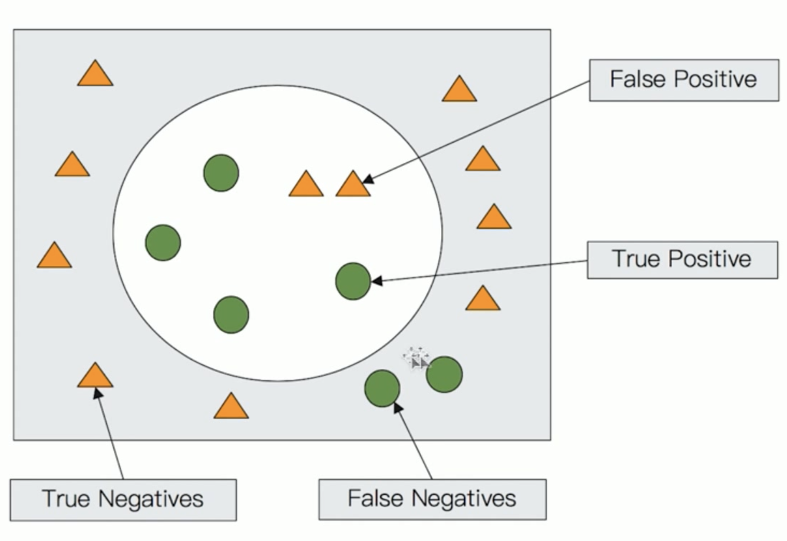

### Search API

-   URI Search
    -   在 URL 中使用查询参数
-   Request Body Search
    -   使用 Elasticsearch 提供的，基于 JSON 格式的更加完备的 Query Domain Specific Language (DSL)

#### 指定查询的索引

|          语法          |        范围         |
| :--------------------: | :-----------------: |
|        /_search        |  集群上所有的索引   |
|    /index1/_search     |       index1        |
| /index1,index2/_search |  index1 和 index2   |
|    /index*/_search     | 以 index 开头的索引 |

#### URI 查询

-   使用 "q"，指定查询字符串

-   "query string syntax"，KV键值对

-   搜索叫做 Eddie 的客户

    curl -XGET

    "http://elasticsearch:9200/kibana_sample_data_ecommerce/_search?q=customer_first_naem:Eddie"

#### Request Body

-   支持 POST 和 GET

-   查询所有文档

    curl -XGET

    "http://elasticsearch:9200/kibana_sample_data_ecommerce/_search" -H

    ''Content-Type: application/json" -d

    '{

    ​	"query": {

    ​		"match_all": {}

    ​	}

    }'

#### 搜索 Response


#### 搜索的相关性 Relevance

-   搜索是用户和搜索殷勤的对话
-   用户关心的是搜索结果的相关性
    -   是否可以找到所有相关的内容
    -   有多少不相关的内容被返回了
    -   文档的打分是否合理
    -   结合业务需求，平衡结果排名

#### 衡量相关性

-   Information Retrieval
    -   Precision （查准率），尽可能返回较少的无关文档
    -   Recall （查全率），尽量返回较多的相关文档
    -   Ranking ，是否能够按照相关度进行排序

#### Precision & Recall

-   Precision, True Positive / (True and False Positives)
-   Recall, True Positive / (True positives + False Negtives)



 ### URI Search

``` json
GET /movies/_search?q=2012&df=title&sort=year:desc&from=0&size=10&timeout=1s 
{
    "profile": true
}
```

-   q 指定查询语句，使用 Query String Syntax
-   df 默认字段，不指定时，会对所有字段进行查询
-   Sort 排序 / from 和 size 用于分页
-   Profile 可以查看查询是如何被执行的

#### Query String Syntax

-   指定字段 v.s 泛查询
    -   q=title:2012 / q=2012
-   Term v.s Phrase
    -   Term: Beautiful Mind 等效于 Beautiful OR Mind
    -   Phrase: "Beautiful Mind" 等效于 Beautiful AND Mind，并且需要保持前后顺序
-   分组与引号
    -   title: (Beautiful AND Mind)
    -   titile="Beautiful Mind"
-   布尔操作
    -   AND / OR / NOT 或者 && / || / !
        -   必须大写
        -   title:(matrix NOT reloaded)
-   分组
    -   `+` 表示 must
    -   `-` 表示 must_not
    -   title:(+matrix -reloaded)
-   范围查询
    -   区间表示：[] 闭区间， {} 开区间
        -   year:{2019 TO 2018}
        -   year:{* TO 2018}
-   算数符号
    -   year:>2010
    -   year:>(2010 && <= 2018)
    -   year:>(+2010 +<=2018)
-   通配符查询（效率低，占用内存大，不建议使用）
    -   ? 代表 1 个字符，* 代表 0 或多个字符
        -   title:mi?d
        -   title:be*
-   正则表达
    -   title:[bt]oy
-   模糊匹配与近似查询
    -   title:befutifl~1
    -   title:"lord rings"~2

#### Example

```json
GET /movies/_search?q=2012&df=title&sort=year:desc&from=0&size=10&timeout=1s

// 带 profile
GET /movies/_search?q=2012&df=title
{
    "profile": true
}

// 泛查询，针对 _all ，所有字段
GET /movies/_search?q=2012
{
	"profile": true
}

// 指定字段
GET /movies/_search?q=title:2012
{
    "profile": true
}

// 使用引号， Phrase 查询
GET /movies/_search?q=title:"Beautiful Mind"
{
    "profile": true
}

// 查找美丽心灵， Mind 为泛查询
GET /movies/_search?q=title:Beautiful Mind
{
    "profile": true
}

// 分组，查找美丽心灵
GET /movies/_search?q=title:(Beautiful Mind)
{
    "profile": true
}

// 分组，查找美丽心灵
GET /movies/_search?q=title:(Beautiful NOT Mind)
{
    "profile": true
}

// 分组，查找美丽心灵
GET /movies/_search?q=title:(Beautiful %2BMind)
{
    "profile": true
}

// 范围查询，区间写法 / 数学写法
GET /movies/_search?q=year:>=1980
{
    "profile": true
}

// 通配符查询
GET /movies/_search?q=title:b*
{
    "profile": true
}

// 模糊匹配
GET /movies/_search?q=title:beautifl~1
{
    "profile": true
}

// 近似度匹配
GET /movies/_search?q=title:"Lord Rings"~2
{
    "profile": true
}

```


#### Request Body Search

-   将查询语句通过 HTTP Request Body 发送给 Elasticsearch

-   Query DSL

``` json
POST /movies,404_idx/_search?ignore_unavaliable=true
{
    "profile": true,
    "query": {
        "match_all": {}
    }
}

// 分页
POST /kibana_sample_data_ecommerce/_search
{
    "from": 10,
    "size": 20,
    "profile": true,
    "query": {
        "match_all": {}
    }
}

// 排序
GET /kibana_sample_data_ecommerce/_search
{
    "sort": [{"order_date": "desc"}],
    "from": 10,
    "size": 5,
    "query": {
        "match_all": {}
    }
}

// _source_filtering
GET /kibana_sample_data_ecommerce/_search
{
    "_source": ["order_date", "category.keyword"],
    "from": 10,
    "size": 5,
    "query": {
        "match_all": {}
    }
}

// 脚本字段
GET /kibana_sample_data_ecommerce/_search
{
    "script_fields": {
        "new_fields": {
            "script": {
                "lang": "painless",
                "source": "doc['order_date'].value+'hello'"
            }
        }
    },
    "from": 10,
    "size": 5,
    "query": {
        "match_all": {}
    }
}

// 使用查询表达式 Match
GET /comments/_doc/_search
{
    "query": {
        "match": {
            "comment": "Last Christmas"
        }
    }
}

GET /comments/_doc/_search
{
    "query": {
        "match": {
            "comment": "Last Christmas",
            "opeartor": "AND"
        }
    }
}

// 短语搜索 Match Phrase
GET /comments/_doc/_search
{
    "query": {
        "match": {
            "comment": "Last Christmas",
            "slop": 1
        }
    }
}
```

