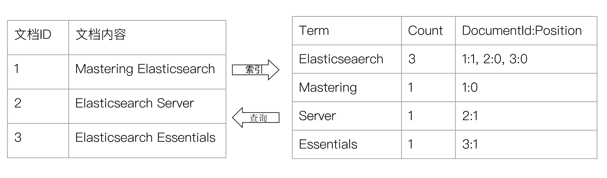
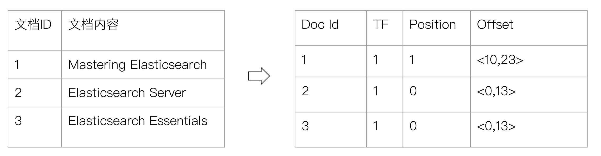
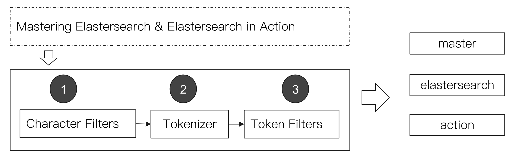

### 正排索引和倒排索引



### 倒排索引的核心组成

#### 倒排索引包含两个部分

-   单词词典，记录所有文档的单词，记录单词到倒排列表的关联关系
    -   单词词典一般比较大，可以通过 `B+` 树或哈希拉链法实现，以满足高性能的插入与查询
-   倒排列表，记录了单词对应的文档集合，由倒排索引项组成
    -   倒排索引项
        -   文档ID
        -   词频 TF，该单词在文档中出现的次数，用于相关性评分
        -   位置，单词在文档中分词的位置，用于语句搜索
        -   偏移量，记录单词的开始结束位置，实现高亮显示

#### 一个例子 —— "Elasticsearch"



### Elasticsearch 的倒排索引

-   Elasticsearch 的 JSON 文档中的每个字段，都有自己的倒排索引
-   可以制定对某些字段不做索引
    -   优点：节省存储空间
    -   缺点：字段无法被搜索

### 通过 Analyzer 进行分词

#### Analysis 与 Analyzer

-   Analysis，文本分析是把全文本转换为一系列单词的过程，也叫分词
-   Analysis 是通过 Analyzer 来实现的
    -   可使用 Elasticsearch 内置的分析器或者按需求定制化分析器
-   除了在数据写入时转换词条，匹配 Query 语句时候也需要用相同的分析器对查询语句进行分析

#### Analyzer 的组成

-   分词器是专门处理分词的组件，Analyzer 由三部分组成
    -   Character Filters （针对原始文本处理，例如取出 html ) / Tokenizer （按照规则切分为单词） / Token Filter （将切分的单词进行加工，小写，删除 stopwords，增加同义词）



#### 使用 _analyer API

``` json
// 直接指定 Analyzer 进行测试
GET /_analyze
{
    "analyzer": "standard",
    "text": "Mastering Elasticsearch, elasticsearch in Action"
}

// 指定索引的字段进行测试
POST books/_analyze
{
    "field": "title",
    "text": "Mastering Elasticsearch"
}

// 自定义分词器进行测试
POST /_analyze
{
    "tokenizer": "standard",
    "filter": ["lowercase"],
    "text": "Mastering Elasticsearch"
}
```

