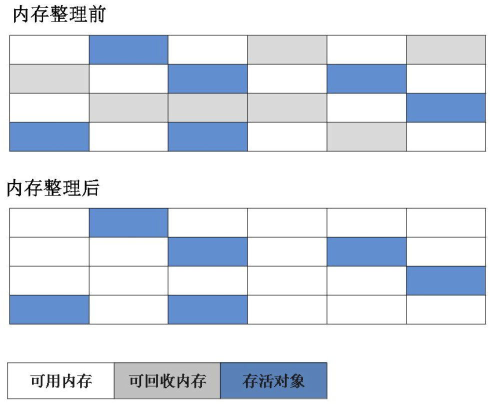
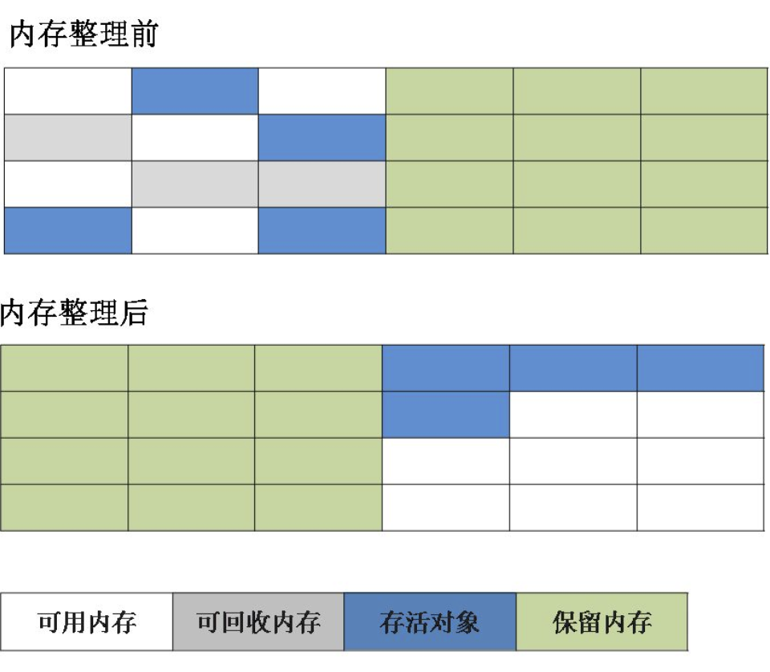
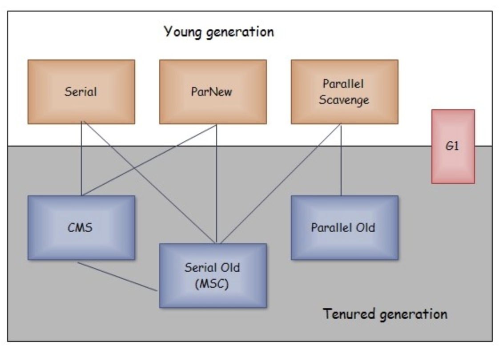

垃圾收集器所关注的是主要是堆和方法区这部分内存。

## 判断对象是否存活

### 引用计数法

引用计数法的实现很简单，就是给对象一个引用计数器，每当有一个地方引用它时，计数器就加1；当引用失效是，计数器就减1；任何时刻计数器为0的对象就是可回收对象。

引用计数法的判定效率很高，在大部分情况下都是一个不错的算法。但是它很难解决对象之间循环引用的问题。

举个例子：

>   对象o1和o2都有一个instance字段，且o1.instance = o2，o2.instance = o1，除此之外再无任何引用。

实际上这两个对象已经不能再被访问，但是因为它们之间相互引用，引用计数器的值都不为0，因此无法被回收。

### 可达性分析法

Java的主流实现中，使用的是可达性分析算法来判定对象是否存活。这个算法的基本思路就是通过`GC Roots`对象作为起始点开始向下搜索，搜索所走过的路径成为引用链，当从`GC Roots`到一个对象不可达时，这个对象就是可回收对象。


**GC Roots对象包括以下几种：**

-   虚拟机栈（栈帧中的局部变量表）中引用的对象。
-   方法区中的静态属性引用的对象。
-   方法区中常量引用的对象。
-   本地方法栈中引用的对象。

即使在可达性算法中不可达的对象，也并非是“非死不可”的，一个对象的死亡，至少需要经过两次标记过程：

-   可达性分析法中不可达的对象被第一次标记并且进行一次筛选，筛选的条件是此对象是否有必要执行 finalize 方法。当对象没有覆盖 finalize 方法，或 finalize 方法已经被虚拟机调用过时，虚拟机将这两种情况视为没有必要执行。

-   被判定为需要执行的对象将会被放在一个队列中进行第二次标记，除非这个对象与引用链上的任何一个对象建立关联，否则就会被真的回收。

### 回收方法区

方法区主要是对常量池的回收和对类的卸载。

**判断废弃常量：**

### Java中的四种引用类型

**强引用**

代码中普遍存在的引用，类似`Object obj = new Object()`的引用，只要强引用还在，垃圾收集器永远不会回收被引用的对象。

**软引用（SoftReference）** 

用来描述一些有用但非必须的对象，被软引用关联的对象只有在内存不够的情况下才会被回收。软引用可用来实现内存敏感的高速缓存。

``` java
Object obj = new Object();
SoftReference<Object> sf = new SoftReference<Object>(obj);
obj = null;  // 使对象只被软引用关联
```

**弱引用（WeakReference）**

被弱引用关联的对象一定会被回收，也就是说它只能存活到下一次垃圾回收发生之前。由于垃圾回收器是一个优先级很低的线程， 因此不一定会很快发现那些只具有弱引用的对象。

``` java
Object obj = new Object();
WeakReference<Object> wf = new WeakReference<Object>(obj);
obj = null;  // 使对象只被弱引用关联
```

**虚引用（PhantomReference）**

又称为幽灵引用或者幻影引用，如果一个对象仅持有虚引用，那么它就和没有任何引用一样，在任何时候都可能被垃圾回收。为一个对象设置虚引用唯一的目的就是能够在这个对象被回收时收到一个系统通知。

```java
Object obj = new Object();
PhantomReference<Object> pf = new PhantomReference<Object>(obj, null);
obj = null;  // 使对象只被虚引用关联
```

## 垃圾收集算法

### 标记-清除算法

`标记-清除`最基础的收集算法，分为`标记`和`清除`两个阶段：首先标记处所有需要回收的对象，在标记完成后统一回收所有被标记的对象。

它主要有两个不足：

1.  `标记`和`清除`两个过程效率都不高。
2.  `标记清除`后会产生大量不连续的内存碎片，空间碎片太多会导致之后为大对象分配内存时因无法找到足够的连续内存而触发另一次gc。



### 复制算法

复制收集算法解决了效率问题和内存碎片问题，但是会浪费一部分内存。它可以将内存分为大小相同的两块，每次使用其中的一块。当这一块的内存使用完后，就将还存活的对象复制到另一块去，然后再把使用的空间一次清理掉。这样就使每次的内存回收都是对内存区间的一半进行回收。



现代商业虚拟机都采用这种收集算法来回收新生代，`HotSpot`将新生代划分为一块较大的`Eden`空间和两块较小的`Survivor`空间，默认比例是8：1：1，每次使用`Eden`和其中一块`Survivor`空间。当回收时，将`Eden`和`Survivor`中还存活着的对象一次性复制到另一块`Survivor`空间，随后清理掉之前使用的`Eden`和`Survivor`空间，所以只有10%的内存会被浪费。当另一块`Survivor`不足以保存存活对象时，需要老年代进行分配担保，将剩余对象直接通过分配担保机制进入老年代。

### 标记-整理算法

复制收集算法在对象存活率较高时需要多次复制操作，效率不高，会浪费部分内存，并且需要额外空间进行担保，所以老年代不能采用这种算法。

老年代采用的是`标记-整理`算法，与`标记-清除`不同的是，标记完成后不是直接对可回收对象进行清除，而是让所有存活对象都向一端移动，最后直接清理掉端边界以外的内存。


### 分代收集算法

当前虚拟机的垃圾收集都采用分代收集算法，根据对象存活周期的不同将内存分为几块。一般将 java 堆分为新生代和老年代，这样我们就可以根据各个年代的特点选择合适的垃圾收集算法。

比如在新生代中，每次收集都会有大量对象死去，所以可以选择复制算法，只需要付出少量对象的复制成本就可以完成每次垃圾收集。而老年代的对象存活几率是比较高的，而且没有额外的空间对它进行分配担保，所以我们必须选择“标记-清除”或“标记-整理”算法进行垃圾收集。

### HptSpot的算法实现

**枚举根节点**

可达性分析算法中需要从`GC Roots`节点寻找可到达对象，现在很多应用仅仅方法区就有数百兆，如果要逐个检查这里面的引用，必然会消耗很多时间。因为可达性分析必须在一个能确保一致性的快照中进行，这会导致GC进行时必须停顿所有线程（STW）。

HopSpot中使用了`OopMap`数据结构来存放`哪些地方存放着对象引用`。在类加载完成后，HotSpot会把对象内相应偏移量上的数据类型计算出来，在JIT编译过程中，也会在特定的位置记录下栈和寄存器中哪些位置是引用，这样GC在扫描的时候就可以直接得知这些信息。

**安全点**

如果每条指令都生成对应的`OopMap`，将会需要大量的额外空间。HotSpot并没有为每条指令都生成`OopMap`，而是在到达安全点（Safepoint）时才能停顿下来开始GC。安全点的选定是以**是否具有让程序长时间执行的特性**为标准进行选定的，每条指令的执行时间都是非常短的，“长时间执行”的最明显特征是指令序列复用，例如`方法调用`、`循环跳转`、`异常跳转`等，所以具有这些功能的指令才会产生安全点。

`HotSpot`中采用了主动式中断，使得所有的线程都“跑”到安全点上再停顿下来。不直接对线程操作，仅仅简单的设置一个标志，各个线程执行时主动去轮询这个标志，发现终端标志时就自己中断挂起，轮询标志的地方和安全点是重合的。

**安全区域**

在发生GC时，有些线程可能处于Sleep或者Block状态，而无法响应JVM的中断请求。对于这种情况，就需要安全区域来解决。

安全区域就是在一段代码中，引用关系不会发生变化，在执行这段代码期间，GC都是安全的。在线程执行到安全区域中的代码时，首先标识自己进入安全区域，离开安全区域时，先检查GC是否完成，只有GC完成了才能离开安全区域。

## 垃圾收集器

如果说收集算法是内存回收的方法论，那么垃圾收集器就是内存回收的具体实现。

**JDK1.8中HotSpot的垃圾收集器：**



### Serial收集器

