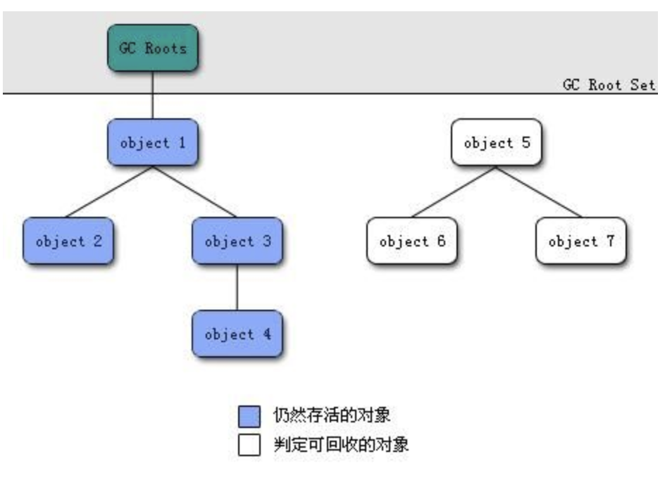

垃圾收集器所关注的是主要是堆和方法区这部分内存。

## 判断对象是否存活

### 引用计数法

引用计数法的实现很简单，就是给对象一个引用计数器，每当有一个地方引用它时，计数器就加1；当引用失效是，计数器就减1；任何时刻计数器为0的对象就是可回收对象。

引用计数法的判定效率很高，在大部分情况下都是一个不错的算法。但是它很难解决对象之间循环引用的问题。

举个例子：

>   对象o1和o2都有一个instance字段，且o1.instance = o2，o2.instance = o1，除此之外再无任何引用。

实际上这两个对象已经不能再被访问，但是因为它们之间相互引用，引用计数器的值都不为0，因此无法被回收。

### 可达性分析法

Java的主流实现中，使用的是可达性分析算法来判定对象是否存活。这个算法的基本思路就是通过`GC Roots`对象作为起始点开始向下搜索，搜索所走过的路径成为引用链，当从`GC Roots`到一个对象不可达时，这个对象就是可回收对象。



**GC Roots对象包括以下几种：**

-   虚拟机栈（栈帧中的局部变量表）中引用的对象。
-   方法区中的静态属性引用的对象。
-   方法区中常量引用的对象。
-   本地方法栈中引用的对象。

即使在可达性算法中不可达的对象，也并非是“非死不可”的，一个对象的死亡，至少需要经过两次标记过程：

-   可达性分析法中不可达的对象被第一次标记并且进行一次筛选，筛选的条件是此对象是否有必要执行 finalize 方法。当对象没有覆盖 finalize 方法，或 finalize 方法已经被虚拟机调用过时，虚拟机将这两种情况视为没有必要执行。

-   被判定为需要执行的对象将会被放在一个队列中进行第二次标记，除非这个对象与引用链上的任何一个对象建立关联，否则就会被真的回收。

### 回收方法区

方法区主要是对常量池的回收和对类的卸载。

**判断废弃常量：**

### Java中的四种引用类型

**强引用**

代码中普遍存在的引用，类似`Object obj = new Object()`的引用，只要强引用还在，垃圾收集器永远不会回收被引用的对象。

**软引用（SoftReference）** 

用来描述一些有用但非必须的对象，被软引用关联的对象只有在内存不够的情况下才会被回收。软引用可用来实现内存敏感的高速缓存。

``` java
Object obj = new Object();
SoftReference<Object> sf = new SoftReference<Object>(obj);
obj = null;  // 使对象只被软引用关联
```

**弱引用（WeakReference）**

被弱引用关联的对象一定会被回收，也就是说它只能存活到下一次垃圾回收发生之前。由于垃圾回收器是一个优先级很低的线程， 因此不一定会很快发现那些只具有弱引用的对象。

``` java
Object obj = new Object();
WeakReference<Object> wf = new WeakReference<Object>(obj);
obj = null;  // 使对象只被弱引用关联
```

**虚引用（PhantomReference）**

又称为幽灵引用或者幻影引用，如果一个对象仅持有虚引用，那么它就和没有任何引用一样，在任何时候都可能被垃圾回收。为一个对象设置虚引用唯一的目的就是能够在这个对象被回收时收到一个系统通知。

```java
Object obj = new Object();
PhantomReference<Object> pf = new PhantomReference<Object>(obj, null);
obj = null;  // 使对象只被虚引用关联
```