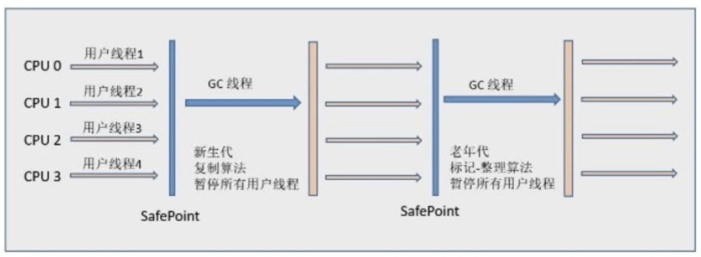
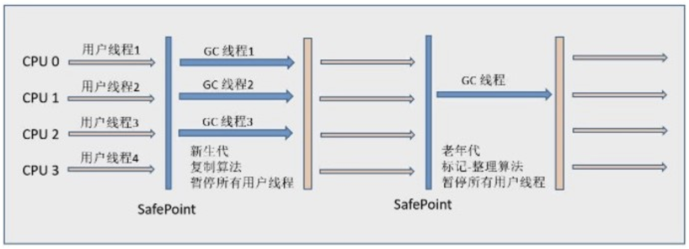
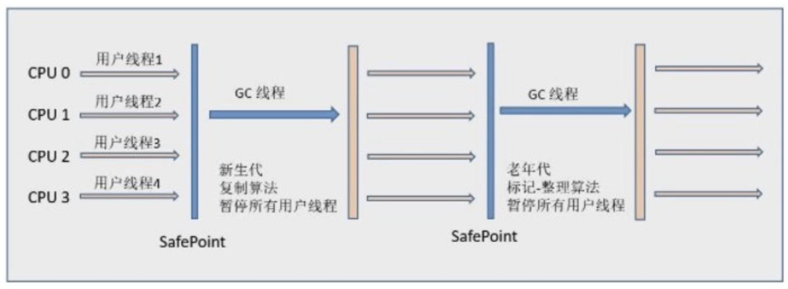
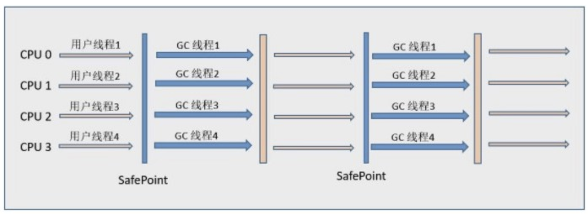
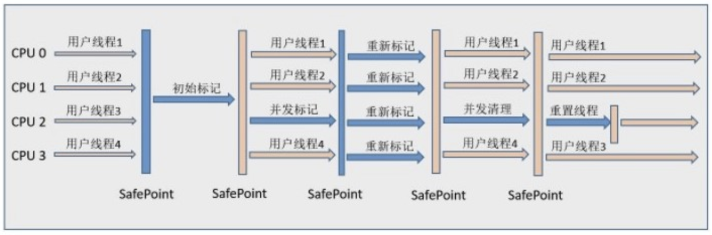
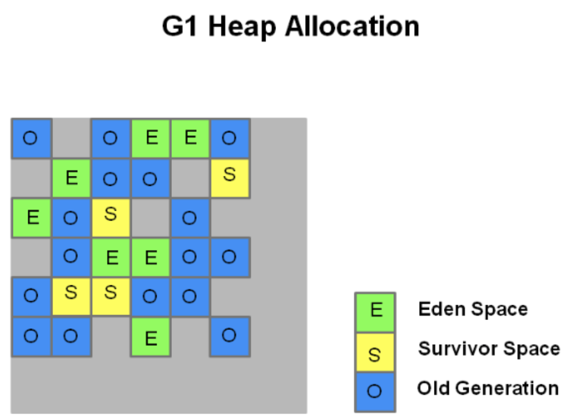
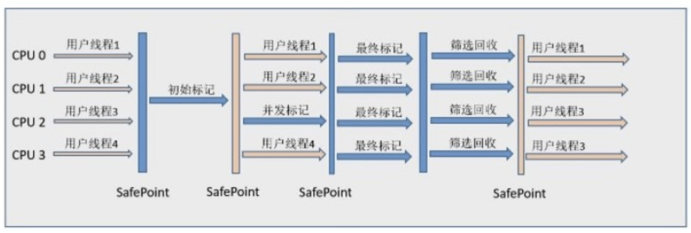

垃圾收集器所关注的是主要是堆和方法区这部分内存。

## 判断对象是否存活

### 引用计数法

引用计数法的实现很简单，就是给对象一个引用计数器，每当有一个地方引用它时，计数器就加1；当引用失效是，计数器就减1；任何时刻计数器为0的对象就是可回收对象。

引用计数法的判定效率很高，在大部分情况下都是一个不错的算法。但是它很难解决对象之间循环引用的问题。

举个例子：

>   对象o1和o2都有一个instance字段，且o1.instance = o2，o2.instance = o1，除此之外再无任何引用。

实际上这两个对象已经不能再被访问，但是因为它们之间相互引用，引用计数器的值都不为0，因此无法被回收。

### 可达性分析法

Java的主流实现中，使用的是可达性分析算法来判定对象是否存活。这个算法的基本思路就是通过`GC Roots`对象作为起始点开始向下搜索，搜索所走过的路径成为引用链，当从`GC Roots`到一个对象不可达时，这个对象就是可回收对象。


**GC Roots对象包括以下几种：**

-   虚拟机栈（栈帧中的局部变量表）中引用的对象。
-   方法区中的静态属性引用的对象。
-   方法区中常量引用的对象。
-   本地方法栈中引用的对象。

即使在可达性算法中不可达的对象，也并非是“非死不可”的，一个对象的死亡，至少需要经过两次标记过程：

-   可达性分析法中不可达的对象被第一次标记并且进行一次筛选，筛选的条件是此对象是否有必要执行 finalize 方法。当对象没有覆盖 finalize 方法，或 finalize 方法已经被虚拟机调用过时，虚拟机将这两种情况视为没有必要执行。

-   被判定为需要执行的对象将会被放在一个队列中进行第二次标记，除非这个对象与引用链上的任何一个对象建立关联，否则就会被真的回收。

### 回收方法区

方法区主要是对常量池的回收和对类的卸载。

**判断废弃常量：**

### Java中的四种引用类型

**强引用**

代码中普遍存在的引用，类似`Object obj = new Object()`的引用，只要强引用还在，垃圾收集器永远不会回收被引用的对象。

**软引用（SoftReference）** 

用来描述一些有用但非必须的对象，被软引用关联的对象只有在内存不够的情况下才会被回收。软引用可用来实现内存敏感的高速缓存。

``` java
Object obj = new Object();
SoftReference<Object> sf = new SoftReference<Object>(obj);
obj = null;  // 使对象只被软引用关联
```

**弱引用（WeakReference）**

被弱引用关联的对象一定会被回收，也就是说它只能存活到下一次垃圾回收发生之前。由于垃圾回收器是一个优先级很低的线程， 因此不一定会很快发现那些只具有弱引用的对象。

``` java
Object obj = new Object();
WeakReference<Object> wf = new WeakReference<Object>(obj);
obj = null;  // 使对象只被弱引用关联
```

**虚引用（PhantomReference）**

又称为幽灵引用或者幻影引用，如果一个对象仅持有虚引用，那么它就和没有任何引用一样，在任何时候都可能被垃圾回收。为一个对象设置虚引用唯一的目的就是能够在这个对象被回收时收到一个系统通知。

```java
Object obj = new Object();
PhantomReference<Object> pf = new PhantomReference<Object>(obj, null);
obj = null;  // 使对象只被虚引用关联
```

## 垃圾收集算法

### 标记-清除算法

`标记-清除`最基础的收集算法，分为`标记`和`清除`两个阶段：首先标记处所有需要回收的对象，在标记完成后统一回收所有被标记的对象。

它主要有两个不足：

1.  `标记`和`清除`两个过程效率都不高。
2.  `标记清除`后会产生大量不连续的内存碎片，空间碎片太多会导致之后为大对象分配内存时因无法找到足够的连续内存而触发另一次gc。


### 复制算法

复制收集算法解决了效率问题和内存碎片问题，但是会浪费一部分内存。它可以将内存分为大小相同的两块，每次使用其中的一块。当这一块的内存使用完后，就将还存活的对象复制到另一块去，然后再把使用的空间一次清理掉。这样就使每次的内存回收都是对内存区间的一半进行回收。


现代商业虚拟机都采用这种收集算法来回收新生代，`HotSpot`将新生代划分为一块较大的`Eden`空间和两块较小的`Survivor`空间，默认比例是8：1：1，每次使用`Eden`和其中一块`Survivor`空间。当回收时，将`Eden`和`Survivor`中还存活着的对象一次性复制到另一块`Survivor`空间，随后清理掉之前使用的`Eden`和`Survivor`空间，所以只有10%的内存会被浪费。当另一块`Survivor`不足以保存存活对象时，需要老年代进行分配担保，将剩余对象直接通过分配担保机制进入老年代。

### 标记-整理算法

复制收集算法在对象存活率较高时需要多次复制操作，效率不高，会浪费部分内存，并且需要额外空间进行担保，所以老年代不能采用这种算法。

老年代采用的是`标记-整理`算法，与`标记-清除`不同的是，标记完成后不是直接对可回收对象进行清除，而是让所有存活对象都向一端移动，最后直接清理掉端边界以外的内存。


### 分代收集算法

当前虚拟机的垃圾收集都采用分代收集算法，根据对象存活周期的不同将内存分为几块。一般将 java 堆分为新生代和老年代，这样我们就可以根据各个年代的特点选择合适的垃圾收集算法。

比如在新生代中，每次收集都会有大量对象死去，所以可以选择复制算法，只需要付出少量对象的复制成本就可以完成每次垃圾收集。而老年代的对象存活几率是比较高的，而且没有额外的空间对它进行分配担保，所以我们必须选择“标记-清除”或“标记-整理”算法进行垃圾收集。

### HptSpot的算法实现

**枚举根节点**

可达性分析算法中需要从`GC Roots`节点寻找可到达对象，现在很多应用仅仅方法区就有数百兆，如果要逐个检查这里面的引用，必然会消耗很多时间。因为可达性分析必须在一个能确保一致性的快照中进行，这会导致GC进行时必须停顿所有线程（STW）。

HopSpot中使用了`OopMap`数据结构来存放`哪些地方存放着对象引用`。在类加载完成后，HotSpot会把对象内相应偏移量上的数据类型计算出来，在JIT编译过程中，也会在特定的位置记录下栈和寄存器中哪些位置是引用，这样GC在扫描的时候就可以直接得知这些信息。

**安全点**

如果每条指令都生成对应的`OopMap`，将会需要大量的额外空间。HotSpot并没有为每条指令都生成`OopMap`，而是在到达安全点（Safepoint）时才能停顿下来开始GC。安全点的选定是以**是否具有让程序长时间执行的特性**为标准进行选定的，每条指令的执行时间都是非常短的，“长时间执行”的最明显特征是指令序列复用，例如`方法调用`、`循环跳转`、`异常跳转`等，所以具有这些功能的指令才会产生安全点。

`HotSpot`中采用了主动式中断，使得所有的线程都“跑”到安全点上再停顿下来。不直接对线程操作，仅仅简单的设置一个标志，各个线程执行时主动去轮询这个标志，发现终端标志时就自己中断挂起，轮询标志的地方和安全点是重合的。

**安全区域**

在发生GC时，有些线程可能处于Sleep或者Block状态，而无法响应JVM的中断请求。对于这种情况，就需要安全区域来解决。

安全区域就是在一段代码中，引用关系不会发生变化，在执行这段代码期间，GC都是安全的。在线程执行到安全区域中的代码时，首先标识自己进入安全区域，离开安全区域时，先检查GC是否完成，只有GC完成了才能离开安全区域。

## 垃圾收集器

如果说收集算法是内存回收的方法论，那么垃圾收集器就是内存回收的具体实现。

**JDK1.8中HotSpot的垃圾收集器：**


### Serial收集器

Serial（串行）收集器是最基本的垃圾收集器，它是一个单线程收集器。单线程不仅意味着它只会使用一条垃圾收集线程去完成垃圾收集工作，更重要的是它在进行垃圾收集工作的时候必须暂停其他所有的工作线程（STW），直到它收集结束。

**新生代（Serial）采用复制算法，老年代（Serial Old）采用标记-整理算法**



虽然 Serial 收集器会造成STW，但是它与其他收集器的单线程相比简单而高效。Serial 收集器由于没有线程交互的开销，自然可以获得很高的单线程收集效率。Serial 收集器对于运行在 Client 模式下的虚拟机来说是个不错的选择。

### ParNew收集器

即`Serial`收集器的多线程版本。

**新生代（ParNew）采用复制算法**



它是许多运行在 Server 模式下的虚拟机的首要选择，除了 Serial 收集器外，只有它能与 CMS 收集器（真正意义上的并发收集器，后面会介绍到）配合工作。

**并行和并发概念补充：**

-   **并行（Parallel）** ：指多条垃圾收集线程并行工作，但此时用户线程仍然处于等待状态。
-   **并发（Concurrent）**：指用户线程与垃圾收集线程同时执行（但不一定是并行，可能会交替执行），用户程序在继续运行，而垃圾收集器运行在另一个 CPU 上。

### Parallel Scavenge 收集器

Parallel Scavenge 收集器是一个新生代收集器，也是使用复制算法的多线程收集器，它的关注点和其他收集器不同，主要目标是达到一个可控制的吞吐量。**所谓吞吐量就是 CPU 中用于运行用户代码的时间与 CPU 总消耗时间的比值。**

### Serial Old收集器

Serial收集器的老年代版本，它同样是一个单线程收集器，使用`标记-整理`算法，主要是在Client模式下使用。

在Server模式下，它主要有两大用途：

-   在 JDK1.5 以及以前的版本中（Parallel Old 诞生以前）与 Parallel Scavenge 收集器搭配使用
-   作为 CMS 收集器的后备方案，在并发收集发生 Concurrent Mode Failure 时使用。



### Parallel Old收集器



Parallel Scavenge收集器的老年代版本。使用多线程和`标记-整理`算法。

在注重吞吐量以及 CPU 资源敏感的场合，都可以优先考虑 Parallel Scavenge 加 Parallel Old 收集器。

### CMS收集器

CMS(Concurrent Mark Sweep)收集器是一种基于`标记-清除`算法实现的，以获取最短回收停顿时间为目标的老年代收集器，整个垃圾回收过程分为4个步骤：

1.  初始标记：仅仅只是标记一下`GC Roots`能直接关联到的对象，速度很快，需要停顿。
2.  并发标记：进行`GC Roots Tracing`的过程，它在整个回收过程中耗时最长，不需要停顿。
3.  重新标记：为了修正并发标记期间因用户程序继续运作而导致标记产生变动的那一部分对象的标记记录，需要停顿，比初始标记时间稍长，但远短于并发标记时间。
4.  并发清除：不需要停顿。

在整个过程中耗时最长的并发标记和并发清除过程中，收集器线程都可以与用户线程一起工作，不需要进行停顿。



CMS是一款优秀的收集器，它具有并发收集、低停顿的优点，但是还远达不到完美的程度。

**CMS具有三个缺点：**

1.  **CMS收集器对CPU资源非常敏感：** 在并发阶段，虽然不会导致用户线程停顿，但是会占用一部分CPU资源，导致应用程序变慢，降低总吞吐量。
2.  **无法处理浮动垃圾：** 可能会出现“Concurrent Mode Failure”失败而导致一次Full GC。**浮动垃圾**是指并发清除阶段由于用户线程继续运行而产生的垃圾，这部分垃圾只能到下一次 GC 时才能进行回收。由于浮动垃圾的存在，因此需要预留出一部分内存，意味着 CMS 收集不能像其它收集器那样等待老年代快满的时候再回收。如果预留的内存不够存放浮动垃圾，就会出现 Concurrent Mode Failure，这时虚拟机将临时启用 Serial Old 来替代 CMS。
3.  **可能会有内存碎片：** 由于采用`标记-清除`算法，可能导致空间碎片，当无法找到足够大连续空间来分配当前对象，不得不提前触发一次 Full GC。

### G1收集器

G1（Garbage-First），主要针对配备多颗处理器及大容量内存的机器. 以极高概率满足 GC 停顿时间要求的同时,还具备高吞吐量性能特征。HotSpot 开发团队赋予它的使命是未来可以替换掉 CMS 收集器。

**G1可以直接对新生代和老年代一起回收。** 把堆划分成多个大小相等的独立区域（Region），新生代和老年代不再物理隔离。通过引入Region的概念，从而将原来的一整块内存空间划分成多个的小空间，使得每个小空间可以单独进行垃圾回收。这种划分方法带来了很大的灵活性，使得可预测的停顿时间模型成为可能。通过记录每个 Region 垃圾回收时间以及回收所获得的空间（这两个值是通过过去回收的经验获得），并维护一个优先列表，每次根据允许的收集时间，优先回收价值最大的 Region。

每个Region都有一个 Remembered Set，用来记录该`Region`中的对象引用的对象所在的Region。通过使用 Remembered Set，在做可达性分析的时候就可以避免全堆扫描。



**G1具备以下特点：**

-   **并行与并发**：充分利用 CPU、多核环境下的硬件优势，使用多个 CPU来缩短 Stop-The-World 停顿时间。
-   **分代收集**：虽然G1可以不需要其他收集器配合就能独立管理整个GC堆，但是还是保留了分代的概念。
-   **空间整合**：与 CMS 的`标记--清理`算法不同，G1 从整体来看是基于`标记整理`算法实现的；从局部（两个Regin之间）上来看是基于`复制`算法实现的。
-   **可预测的停顿**：G1除了追求低停顿外，还能建立可预测的停顿时间模型，能让使用者明确指定在一个长度为 M 毫秒的时间片段内。

整个垃圾回收过程分为4个步骤：

1.  初始标记：仅仅只是标记一下`GC Roots`能直接关联到的对象，速度很快，需要停顿。
2.  并发标记：进行`GC Roots Tracing`的过程，它在整个回收过程中耗时最长，不需要停顿。虚拟机将这段时间内的对象变化记录在线程`Remembered Set Logs`中。
3.  最终标记：为了修正并发标记期间因用户程序继续运作而导致标记产生变动的那一部分对象的标记记录，把`Remembered Set Logs`中的数据合并到`Remembered Set`中，需要停顿，比初始标记时间稍长，但远短于并发标记时间。
4.  筛选回收：对各个Regin的回收价值和成本进行排序，根据用户所期望的GC停顿时间制定回收计划。此阶段其实可以做到与用户程序一起并发执行，但是因为只回收一部分 Region，时间是用户可控制的，而且停顿用户线程将大幅度提高收集效率。



## 内存分配与回收策略

**Minor GC 和 Full GC**

-   Minor GC：回收新生代，因为新生代对象存活时间很短，因此 Minor GC 会频繁执行，执行的速度一般也会比较快。
-   Full GC：回收老年代和新生代，老年代对象其存活时间长，因此 Full GC 很少执行，执行速度会比 Minor GC 慢很多。

### 对象优先在Eden分配

大多数情况下，对象在新生代 Eden 上分配，当 Eden 空间不够时，发起 Minor GC。

### 大对象直接进入老年代

大对象是指需要连续内存空间的对象，最典型的大对象是那种很长的字符串以及数组。

经常出现大对象会提前触发垃圾收集以获取足够的连续空间分配给大对象。

`-XX:PretenureSizeThreshold`，大于此值的对象直接在老年代分配，避免在 Eden 和 Survivor 之间的大量内存复制。

### 长期存活的对象进入老年代

为对象定义年龄计数器，对象在 Eden 出生并经过 Minor GC 依然存活，将移动到 Survivor 中，年龄就增加 1 岁，增加到一定年龄（默认15岁）则移动到老年代中。

`-XX:MaxTenuringThreshold`用来定义年龄的阈值。

### 动态对象年龄判定

如果在Survivor中相同年龄所有对象大小的总和大于Survivor空间的一半，则年龄大于或等于该年龄的对象可以直接进入老年代。

### 空间分配担保

在发生 Minor GC 之前，虚拟机先检查老年代最大可用的连续空间是否大于新生代所有对象总空间，如果条件成立的话，那么 Minor GC 可以确认是安全的。

如果不成立的话虚拟机会查看`HandlePromotionFailure`的值是否允许担保失败，如果允许那么就会继续检查老年代最大可用的连续空间是否大于历次晋升到老年代对象的平均大小，如果大于，将尝试着进行一次 Minor GC；如果小于，或者`HandlePromotionFailure`的值不允许冒险，那么就要进行一次 Full GC。

### Full GC 的触发条件

对于 Minor GC，其触发条件非常简单，当 Eden 空间满时，就将触发一次 Minor GC。而 Full GC 则相对复杂，有以下条件：

1.  **调用 System.gc()：** 只是建议虚拟机执行 Full GC，但是虚拟机不一定真正去执行。

2.  **老年代空间不足**

3.  **空间分配担保失败**

4.  **JDK 1.7 及以前的永久代空间不足**

5.  **Concurrent Mode Failure**

