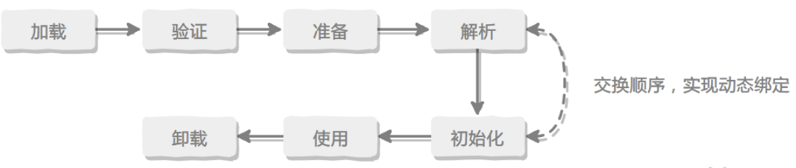
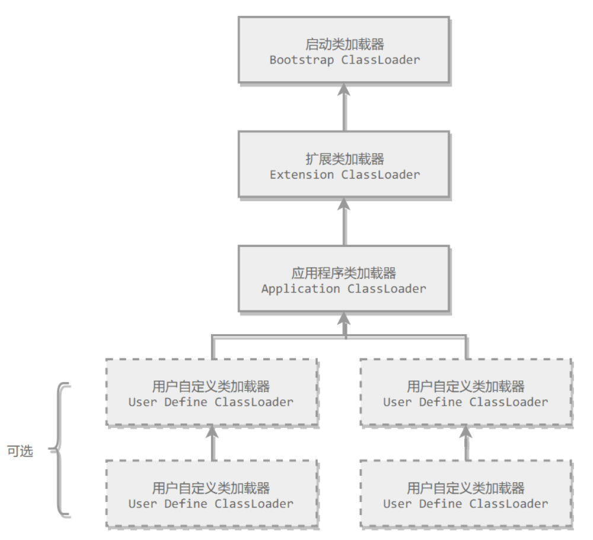

在Class文件中描述的各种信息，最终都需要加载到虚拟机中之后才能运行和使用。

**类的加载机制：** 虚拟机会把类的数据从Class文件加载到内存，并对数据进行校验、转换解析和初始化，最终形成可以被虚拟机直接使用的Java类型。

### 类的生命周期



### 类的加载过程

类加载全过程分为五个步骤：**加载、验证、准备、解析、初始化**

**加载**

加载是类加载的第一个阶段，主要完成三件事：

1.  通过一个类的权限定名来获取定义此类的二进制字节流。
2.  将这个字节流所代表的静态存储结构转化为方法区的运行时数据结构。（JDK1.8 Class对象位于堆中。）
3.  在内存中生成一个代表这个类的`java.lang.Class`对象，作为方法区这个类的各种数据结构的访问入口。

其中二进制字节流可以从以下方式中获取：

-   从 ZIP 包读取，JAR、EAR、WAR 等。
-   从网络中获取。
-   运行时计算生成，例如动态代理技术。
-   由其他文件生成，例如由 JSP 文件生成对应的 Class 类。

一个非数组类的加载阶段是可控性最强的阶段，这一步我们可以去完成还可以自定义类加载器去控制字节流的获取方式。数组类型不通过类加载器创建，它由JVM直接创建。

加载阶段与连接阶段的部分内容是交叉进行的。

**验证**

验证是连接阶段的第一步，是为了确保Class文件的字节流中包含的信息是符合当前虚拟机的要求，并且不会危害虚拟机自身的安全。如果验证到输入的字符流不符合Class文件格式的约束，就会抛出`java.lang.VerifyError`错误或者其子类错误。

整体上验证阶段分为4步：

**文件格式验证**

验证字节流是否符合Class文件格式的规范，并且能被当前虚拟机处理，主要包含以下验证点：

-   是否以魔数`0xCAFEBABE`开头。
-   主、次版本号是否在当前虚拟机处理范围之内。
-   常量池中的常量是否有不被支持的常量类型。
-   指向常量的各种索引值中是否有指向不存在的常量或不符合类型的常量。
-   `CONSTANT_Utf8_info`型的常量中是否有不符合`UTF8`编码的数据。
-   Class文件中各个部分及文件本身是否有被删除的或附加的其他信息。

**元数据验证**

对类的元数据信息进行语义分析，以保证其描述的信息符合Java语言规范的要求，主要包含以下验证点：

-   这个类是否有父类，除了`java.lang.Object`以外都应该有父类。
-   这个类的父类是否继承了final修饰的类。
-   非抽象类是否实现了其父类或接口之中要求实现的所有方法。
-   类中的字段、方法是否与父类产生矛盾

**字节码验证**

通过数据流和控制流分析，确定程序语义是否合法、是否符合逻辑。对方法体进行校验分析，保证类的方法不会危害虚拟机安全，例如：

-   保证任意时刻操作数栈的数据类型与指令代码序列都能配合工作，例如不会出现这样的情况：在操作数栈放置了一个int类型的数据，使用时却按照long类型来加载局部变量表。
-   保证跳转指令不会跳转到方法体以外的字节码指令上。
-   保证方法体中的类型转换是有效的。

**符号引用验证**

这个阶段发生在虚拟机将符号引用转化为直接引用的时候，这个转化动作将在解析阶段发生。符号引用验证是对常量池中的各种符号引用信息进行匹配性校验，主要包含以下验证点：

-   符号引用中通过字符串描述的全限定名能否找到对应的类。
-   在指定类中是否存在符合方法的字段描述符以及简单名称所描述的方法和字段。
-   符号引用中的类、字段、方法的访问性是否可被当前类访问。

### 准备

为静态变量分配内存并设置初始值，使用的是方法区（JDK1.8是堆区）的内存。

### 解析

将常量池内的符号引用替换为直接引用的过程。

**符号引用**

符号引用与虚拟机的内存布局无关，以一组符号来描述所引用的目标，符号可以是任何形式的字面量，只要使用时能无歧义地定位到目标即可。

**直接引用**

直接引用与内存布局相关，直接指向目标的指针、相对偏移量或者是一个能间接定位到目标的句柄。

### 初始化

初始化阶段才真正开始执行类中定义的 Java 程序代码。初始化阶段是虚拟机执行类构造器`<clinit>`方法的过程。在准备阶段，类变量已经赋过一次系统要求的初始值，而在初始化阶段，根据程序员通过程序制定的主观计划去初始化类变量和其它资源。

`<clinit>`是由编译器自动收集类中所有**类变量的赋值动作和静态语句块中的语句**合并产生的，**编译器收集的顺序由语句在源文件中出现的顺序决定**。特别注意的是，**静态语句块只能访问到定义在它之前的类变量，定义在它之后的类变量只能赋值，不能访问。**

由于父类的`<clinit>`方法先执行，也就意味着父类中定义的静态语句块的执行要优先于子类。

接口中不可以使用静态语句块，但仍然有类变量初始化的赋值操作，因此接口与类一样都会生成`<clinit>`方法。但接口与类不同的是，执行接口的`<clinit>`方法不需要先执行父接口的`<clinit>`方法。只有当父接口中定义的变量使用时，父接口才会初始化。另外，接口的实现类在初始化时也一样不会执行接口的`<clinit>`方法。

虚拟机会保证一个类的`<clinit>`方法在多线程环境下被正确的加锁和同步，如果多个线程同时初始化一个类，只会有一个线程执行这个类的`<clinit>`方法，其它线程都会阻塞等待，直到活动线程执行`<clinit>`方法完毕。如果在一个类的`<clinit>`方法中有耗时的操作，就可能造成多个线程阻塞，在实际过程中此种阻塞很隐蔽。

### 主动引用

虚拟机规范中并没有强制约束何时进行加载，但是规范严格规定了有且只有下列五种情况必须对类进行初始化（加载、验证、准备都会随之发生）：

-   遇到`new`、`getstatic`、`putstatic`、`invokestatic`这四条字节码指令时，如果类没有进行过初始化，则必须先触发其初始化。

    最常见的生成这 4 条指令的场景是：

    -   使用new关键字实例化对象的时候。
    -   读取或设置一个类的静态字段（被 final 修饰、已在编译期把结果放入常量池的静态字段除外）的时候。
    -   调用一个类的静态方法的时候。

-   使用java.lang.reflect包的方法对类进行反射调用的时候，如果类没有进行初始化，则需要先触发其初始化。

-   当初始化一个类的时候，如果发现其父类还没有进行过初始化，则需要先触发其父类的初始化。

-   当虚拟机启动时，用户需要指定一个要执行的主类，虚拟机会先初始化这个主类；

-   当使用 JDK 1.7 的动态语言支持时，如果一个`java.lang.invoke.MethodHandle`实例最后的解析结果为 REF_getStatic, REF_putStatic, REF_invokeStatic 的方法句柄，并且这个方法句柄所对应的类没有进行过初始化，则需要先触发其初始化；

### 被动引用

以上 5 种场景中的行为称为对一个类进行主动引用。除此之外，所有引用类的方式都不会触发初始化，称为被动引用。被动引用的常见例子包括：

-   通过子类引用父类的静态字段，不会导致子类初始化。

```java
System.out.println(SubClass.value);  // value 字段在 SuperClass 中定义
```

-   通过数组定义来引用类，不会触发此类的初始化。该过程会对数组类进行初始化，数组类是一个由虚拟机自动生成的、直接继承自 Object 的子类，其中包含了数组的属性和方法。

```java
SuperClass[] sca = new SuperClass[10];
```

-   常量在编译阶段会存入调用类的常量池中，本质上并没有直接引用到定义常量的类，因此不会触发定义常量的类的初始化。

``` java
System.out.println(ConstClass.HELLOWORLD);
```

### 类与类加载器

两个类只有来源于同一个Class文件，并且使用同一个类加载器进行加载时才相等。这是因为每一个类加载器都拥有一个独立的类名称空间。

这里的相等，包括类的 Class 对象的`equals()`方法、`isAssignableFrom()`方法、`isInstance`方法的返回结果为 true，也包括使用`instanceof`关键字做对象所属关系判定结果为 true。

### 类加载器分类

从 Java 虚拟机的角度来讲，只存在以下两种不同的类加载器：

-   启动类加载器（Bootstrap ClassLoader）：使用 C++ 实现，是虚拟机自身的一部分；
-   所有其它类的加载器，使用 Java 实现，独立于虚拟机，继承自抽象类 java.lang.ClassLoader。

从 Java 开发人员的角度看，类加载器可以划分得更细致一些：

-   启动类加载器（Bootstrap ClassLoader）：负责将存放在`<JRE_HOME>\lib`目录中的，或者被`-Xbootclasspath`参数所指定的路径中的，并且是虚拟机识别的（仅按照文件名识别，如 rt.jar，名字不符合的类库即使放在 lib 目录中也不会被加载）类库加载到虚拟机内存中。启动类加载器无法被 Java 程序直接引用，用户在编写自定义类加载器时，如果需要把加载请求委派给启动类加载器，直接使用 null 代替即可。
-   扩展类加载器（Extension ClassLoader）这个类加载器是由 `ExtClassLoader（sun.misc.Launcher$ExtClassLoader）`实现的。它负责将`<JAVA_HOME>/lib/ext`或者被 `java.ext.dir`系统变量所指定路径中的所有类库加载到内存中，开发者可以直接使用扩展类加载器。
-   应用程序类加载器（Application ClassLoader）这个类加载器是由`AppClassLoader（sun.misc.Launcher$AppClassLoader）`实现的。由于这个类加载器是`ClassLoader`中的`getSystemClassLoader()`方法的返回值，因此一般称为系统类加载器。它负责加载用户类路径上所指定的类库，开发者可以直接使用这个类加载器，如果应用程序中没有自定义过自己的类加载器，一般情况下这个就是程序中默认的类加载器。

## 双亲委派模型

应用程序是由三种类加载器互相配合从而实现类加载，除此之外还可以加入自己定义的类加载器。

下图展示了类加载器之间的层次关系，称为双亲委派模型。该模型要求除了顶层的启动类加载器外，其它的类加载器都要有自己的父类加载器。这里的父子关系一般通过组合关系来实现，而不是继承关系。



一个类加载器首先将类加载请求转发到父类加载器，只有当父类加载器无法完成时才尝试自己加载。**这使得 Java 类随着它的类加载器一起具有一种带有优先级的层次关系，从而使得基础类得到统一。**

**抽象类 java.lang.ClassLoader 的代码片段**

其中的 loadClass() 方法运行过程如下：先检查类是否已经加载过，如果没有则让父类加载器去加载。当父类加载器加载失败时抛出 ClassNotFoundException，此时尝试自己去加载。

``` java
public abstract class ClassLoader {
    // The parent class loader for delegation
    private final ClassLoader parent;

    public Class<?> loadClass(String name) throws ClassNotFoundException {
        return loadClass(name, false);
    }

    protected Class<?> loadClass(String name, boolean resolve) throws ClassNotFoundException {
        synchronized (getClassLoadingLock(name)) {
            // First, check if the class has already been loaded
            Class<?> c = findLoadedClass(name);
            if (c == null) {
                try {
                    if (parent != null) {
                        c = parent.loadClass(name, false);
                    } else {
                        c = findBootstrapClassOrNull(name);
                    }
                } catch (ClassNotFoundException e) {
                    // ClassNotFoundException thrown if class not found
                    // from the non-null parent class loader
                }

                if (c == null) {
                    // If still not found, then invoke findClass in order
                    // to find the class.
                    c = findClass(name);
                }
            }
            if (resolve) {
                resolveClass(c);
            }
            return c;
        }
    }

    protected Class<?> findClass(String name) throws ClassNotFoundException {
        throw new ClassNotFoundException(name);
    }
}
```

## 自定义类加载器实现

首先根据类的全名在文件系统上查找类的字节码文件，然后读取该文件内容，最后通过 defineClass() 方法来把这些字节代码转换成 java.lang.Class 类的实例。

java.lang.ClassLoader 的loadClass()实现了双亲委派模型的逻辑，自定义类加载器一般不去重写它，但是需要重写 findClass() 方法。

``` java
public class FileSystemClassLoader extends ClassLoader {

    private String rootDir;

    public FileSystemClassLoader(String rootDir) {
        this.rootDir = rootDir;
    }

    protected Class<?> findClass(String name) throws ClassNotFoundException {
        byte[] classData = getClassData(name);
        if (classData == null) {
            throw new ClassNotFoundException();
        } else {
            return defineClass(name, classData, 0, classData.length);
        }
    }

    private byte[] getClassData(String className) {
        String path = classNameToPath(className);
        try {
            InputStream ins = new FileInputStream(path);
            ByteArrayOutputStream baos = new ByteArrayOutputStream();
            int bufferSize = 4096;
            byte[] buffer = new byte[bufferSize];
            int bytesNumRead;
            while ((bytesNumRead = ins.read(buffer)) != -1) {
                baos.write(buffer, 0, bytesNumRead);
            }
            return baos.toByteArray();
        } catch (IOException e) {
            e.printStackTrace();
        }
        return null;
    }

    private String classNameToPath(String className) {
        return rootDir + File.separatorChar
                + className.replace('.', File.separatorChar) + ".class";
    }
}
```

