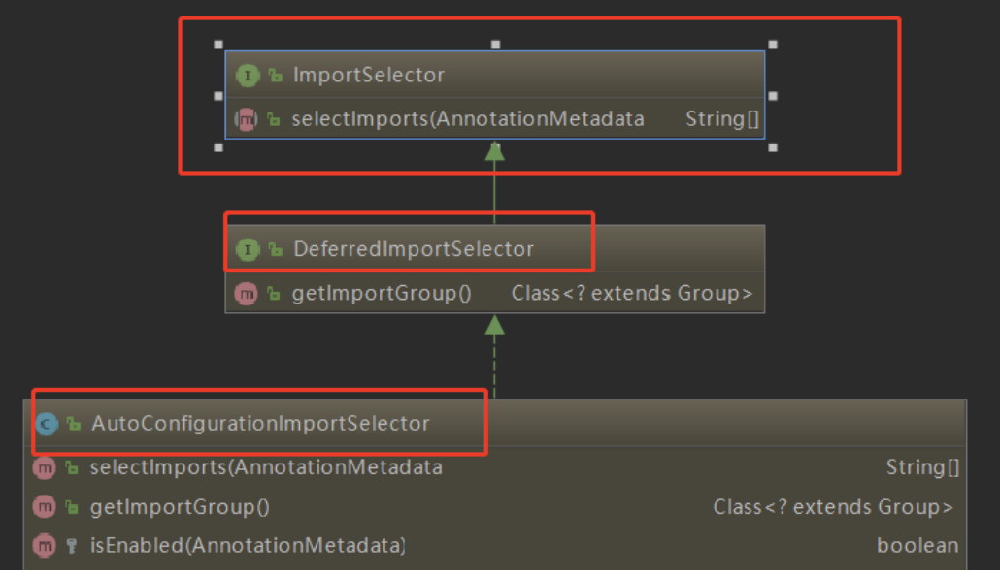
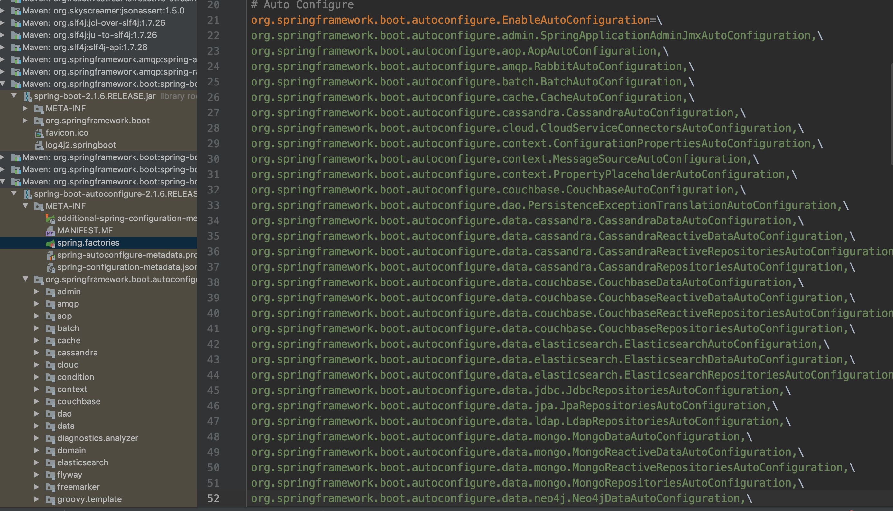

### 什么是Spring？

Spring 是一种轻量级开发框架，旨在提高开发人员的开发效率以及系统的可维护性。

**Spring框架的优点**

- **轻量：** Spring 是轻量的，基本的版本大约2MB。
- **控制反转：** Spring通过控制反转实现了松散耦合，获得依赖对象的过程被反转了。由自身管理变为了由IOC容器主动注入。
- **面向切面的编程(AOP)：** Spring支持面向切面的编程，并且把应用业务逻辑和系统服务分开。
- **容器：** Spring 包含并管理应用中对象的生命周期和配置。
- **MVC框架：** Spring的WEB框架是个精心设计的框架，是Web框架的一个很好的替代品。
- **事务管理：** Spring 提供一个持续的事务管理接口，可以扩展到上至本地事务下至全局事务（JTA）。
- **异常处理：** Spring 提供方便的API把具体技术相关的异常转化为一致的unchecked 异常。

### IOC

IOC（控制反转）是一种**设计思想**，就是 **将原本在程序中手动创建对象的控制权，交由Spring框架来管理。** IOC 容器是 Spring 用来实现 IOC 的载体， IOC 容器实际上就是个Map，存放的是各种对象。将对象之间的相互依赖关系交给 IoC 容器来管理，并由 IoC 容器完成对象的注入。这样可以很大程度上简化应用的开发，把应用从复杂的依赖关系中解放出来。 **IoC 容器就像是一个工厂一样，当我们需要创建一个对象的时候，只需要配置好配置文件/注解即可，完全不用考虑对象是如何被创建出来的。** 

Spring 时代我们一般通过 XML 文件来配置 Bean，后来开发人员觉得 XML 文件来配置不太好，于是 SpringBoot 注解配置就慢慢开始流行起来。

**IOC容器初始化流程**


### AOP

AOP（面向切面编程）能够将那些与业务无关，**却为业务模块所共同调用的逻辑或责任（例如事务处理、日志管理、权限控制等）封装起来**，便于**减少系统的重复代码**，**降低模块间的耦合度**，并**有利于未来的可拓展性和可维护性**。

**Spring AOP就是基于动态代理的**，如果要代理的对象，实现了某个接口，那么Spring AOP会使用**JDK Proxy**，去创建代理对象，而对于没有实现接口的对象，这时候Spring AOP会使用**Cglib**生成一个被代理对象的子类来作为代理。

使用 AOP 之后我们可以把一些通用功能抽象出来，在需要用到的地方直接使用即可，这样大大简化了代码量。我们需要增加新功能时也方便，这样也提高了系统扩展性。日志功能、事务管理等等场景都用到了 AOP 。

### Spring Bean的作用域

默认是单例。

|  作用域   | 说明                       |
| :-------: | -------------------------- |
| Signleton | 整个应用中只创建一个实例   |
| prototype | 每次注入时都会新建一个实例 |
|  session  | 为每个会话创建一个实例     |
|  request  | 为每个请求创建一个实例     |

### Spring Bean 生命周期
1. 实例化一个 Bean。
2. 按照 Spring 上下文对实例化的 Bean 进行配置（IOC 注入）。
3. 如果 Bean 实现了 BeanNameAware 接口，会调用它实现的 setBeanName(String name)方法，此处传递的就是 Spring 配置文件中 Bean 的 id 值。
4. 如果 Bean 实现了 BeanFactoryAware 接口，会调用它实现的 setBeanFactory(setBeanFactory(BeanFactory)传递的是 Spring 工厂自身，可以用来获取其他Bean。
5. 如果 Bean 实现了 ApplicationContextAware 接口，会调用 setApplicationContext(ApplicationContext)方法，传入 Spring 上下文（因为ApplicationContext为BeanFactory子接口，所以功能更丰富）。
6. 如果 Bean 关联了 BeanPostProcessor 接口，将会调用 postProcessBeforeInitialization(Object obj, String s)方法，BeanPostProcessor 经常被用作是 Bean
   内容的更改，并且由于这个是在 Bean 初始化结束时调用那个的方法，也可以被应用于内存
   或缓存技术。
7. 如果 Bean 在 Spring 配置文件中配置了 init-method 属性会自动调用其配置的初始化方法。
8. 如果 Bean 关联了 BeanPostProcessor 接口，将会调用 postProcessAfterInitialization(Object obj, String s)方法。
9. 当 Bean 不再需要时，会经过清理阶段，如果 Bean 实现了 DisposableBean 这个接口，会调用那个其实现的 destroy()方法。
10. 如果 Bean 的 Spring 配置中配置了 destroy-method 属性，会自动调用其配置的销毁方法。 

### Spring 框架中用到了哪些设计模式？

- **工厂设计模式** : Spring使用工厂模式通过 `BeanFactory`、`ApplicationContext` 创建 bean 对象。
- **代理设计模式** : Spring AOP 功能的实现。
- **单例设计模式** : Spring 中的 Bean 默认都是单例的。
- **模板方法模式** : Spring 中 `jdbcTemplate`、`hibernateTemplate` 等以 Template 结尾的对数据库操作的类，它们就使用到了模板模式。
- **包装器设计模式** : 我们的项目需要连接多个数据库，而且不同的客户在每次访问中根据需要会去访问不同的数据库。这种模式让我们可以根据客户的需求能够动态切换不同的数据源。
- **观察者模式:** Spring 事件驱动模型就是观察者模式很经典的一个应用。
- **适配器模式** :Spring AOP 的增强或通知(Advice)使用到了适配器模式、spring MVC 中也是用到了适配器模式适配`Controller`。

### Spring 事务中的隔离级别有哪几种?

**TransactionDefinition 接口中定义了五个表示隔离级别的常量：**

- **TransactionDefinition.ISOLATION_DEFAULT:** 使用后端数据库默认的隔离级别，Mysql 默认采用的 REPEATABLE_READ隔离级别 Oracle 默认采用的 READ_COMMITTED隔离级别.
- **TransactionDefinition.ISOLATION_READ_UNCOMMITTED:** 最低的隔离级别，允许读取尚未提交的数据变更，**可能会导致脏读、幻读或不可重复读**
- **TransactionDefinition.ISOLATION_READ_COMMITTED:** 允许读取并发事务已经提交的数据，**可以阻止脏读，但是幻读或不可重复读仍有可能发生**
- **TransactionDefinition.ISOLATION_REPEATABLE_READ:** 对同一字段的多次读取结果都是一致的，除非数据是被本身事务自己所修改，**可以阻止脏读和不可重复读，但幻读仍有可能发生。**
- **TransactionDefinition.ISOLATION_SERIALIZABLE:** 最高的隔离级别，完全服从ACID的隔离级别。所有的事务依次逐个执行，这样事务之间就完全不可能产生干扰，也就是说，**该级别可以防止脏读、不可重复读以及幻读**。但是这将严重影响程序的性能。通常情况下也不会用到该级别。

### Spring 事务中哪几种事务传播行为?

**支持当前事务的情况：**

- **TransactionDefinition.PROPAGATION_REQUIRED：** 如果当前存在事务，则加入该事务；如果当前没有事务，则创建一个新的事务。
- **TransactionDefinition.PROPAGATION_SUPPORTS：** 如果当前存在事务，则加入该事务；如果当前没有事务，则以非事务的方式继续运行。
- **TransactionDefinition.PROPAGATION_MANDATORY：** 如果当前存在事务，则加入该事务；如果当前没有事务，则抛出异常。（mandatory：强制性）

**不支持当前事务的情况：**

- **TransactionDefinition.PROPAGATION_REQUIRES_NEW：** 创建一个新的事务，如果当前存在事务，则把当前事务挂起。
- **TransactionDefinition.PROPAGATION_NOT_SUPPORTED：** 以非事务方式运行，如果当前存在事务，则把当前事务挂起。
- **TransactionDefinition.PROPAGATION_NEVER：** 以非事务方式运行，如果当前存在事务，则抛出异常。

**其他情况：**

- **TransactionDefinition.PROPAGATION_NESTED：** 如果当前存在事务，则创建一个事务作为当前事务的嵌套事务来运行；如果当前没有事务，则该取值等价于TransactionDefinition.PROPAGATION_REQUIRED。

### SpringBoot与Spring的区别

在集成spring等框架需要作出大量的配置，开发效率低，繁琐。所以官方提出 spring boot的核心思想：约定优于配置。可以快速创建开发基于spring框架的项目，不用或使用很少的spring配置即可。

### SpringBoot的优点:

- springboot项目为独立运行的spring项目，java -jar xx.jar即可运行。
- 内嵌servlet容器。
- 与主流框架集成无需配置集成，提供了starter的pom 配置，简化了 maven的配置。
- 自动配置spring容器中的bean。
- springboot无需做出xml配置，也不是通过代码生成来实现(通过条件注解)。

- 快速搭建项目。

### SpringBoot 自动配置原理

#### SpringBoot应用从主方法里面进行启动

```java
@SpringBootApplication
public class SpringBootApplication {

    public static void main(String[] args) {
        SpringApplication.run(SpringBoot02ConfigAutoconfigApplication.class, args);
    }
}
```

#### `@SpringBootApplication`注解

``` java
@Target(ElementType.TYPE)
@Retention(RetentionPolicy.RUNTIME)
@Documented
@Inherited
@SpringBootConfiguration
@EnableAutoConfiguration
@ComponentScan(excludeFilters = { @Filter(type = FilterType.CUSTOM, classes = TypeExcludeFilter.class),
		@Filter(type = FilterType.CUSTOM, classes = AutoConfigurationExcludeFilter.class) })
public @interface SpringBootApplication
```

**三个比较重要的注解：**

- `@SpringBootConfiguration`：SpringBoot的配置类，标注在某个类上，表示这是一个SpringBoot的配置类
- `@EnableAutoConfiguration`：开启自动配置类，SpringBoot的精华所在。
- `@ComponentScan`包扫描

　　现在Spring Boot帮我们自动配置了以前需要自己配置的东西；`@EnableAutoConfiguration`告诉SpringBoot开启自动配置功能，这样自动配置才能生效；

#### `@EnableAutoConfiguration`注解

``` java
@Target(ElementType.TYPE)
@Retention(RetentionPolicy.RUNTIME)
@Documented
@Inherited
@AutoConfigurationPackage
@Import(AutoConfigurationImportSelector.class)
public @interface EnableAutoConfiguration
```

**两个比较重要的注解：**

- `@AutoConfigurationPackage`：自动配置包
- `@Import`：导入自动配置的组件

#### `@Import(AutoConfigurationImportSelector.class)`注解



可以从图中看出  `AutoConfigurationImportSelector` 继承了 继承了 `ImportSelector`的 `DeferredImportSelector` 。

ImportSelector有一个方法：**selectImports()**

``` java
@Override
	public String[] selectImports(AnnotationMetadata annotationMetadata) {
		if (!isEnabled(annotationMetadata)) {
			return NO_IMPORTS;
		}
		AutoConfigurationMetadata autoConfigurationMetadata = AutoConfigurationMetadataLoader
				.loadMetadata(this.beanClassLoader);
		AutoConfigurationEntry autoConfigurationEntry = getAutoConfigurationEntry(autoConfigurationMetadata,
				annotationMetadata);
		return StringUtils.toStringArray(autoConfigurationEntry.getConfigurations());
	}
```

在`getAutoConfigurationEntry(autoConfigurationMetadata, annotationMetadata)`中实际调用了`SpringFactoriesLoader.loadSpringFactories()`方法，它其实是去加载  **"META-INF/spring.factories"**这个外部文件。这个外部文件里面有很多自动配置的类：



然后找到配置所有`EnableAutoConfiguration`的值加入到Spring容器中。

加入到容器中之后的作用就是用它们来做自动配置，这就是Springboot自动配置之源，也就是自动配置的开始，只有这些自动配置类进入到容器中以后，接下来这个自动配置类才开始进行启动。

以`HttpEncodingAutoConfiguration`为例解释SpringBoot的自动配置之原理：

```java
// 启用ConfigurationProperties功能：
// 这个ConfigurationProperties里面引入了一个类，这个类就是启用指定类的ConfigurationProperties功能
// 有了这个@EnableConfigurationPropertie注解以后相当于把配置文件中对应值就和这个HttpEncodingProperties.class类绑定起来了。
@EnableConfigurationProperties(HttpEncodingProperties.class) 
// 判断当前是不是web应用，@Conditional是spring底层，意思就是根据不同的条件，来进行自己不同的条件判断，如果满足指定的条件，那么整个配置类里边的配置才会生效。
@ConditionalOnWebApplication(type = ConditionalOnWebApplication.Type.SERVLET)
// 看这个类里边有没有这个过滤器，就是判断当前项目里边有没有CharacterEncodingFilter这个类，这个CharacterEncodingFilter类是Springmvc中乱码解决的过滤器。
@ConditionalOnClass(CharacterEncodingFilter.class)
// 判断配置文件中是否存在某个配置，就是是否存在spring.http.encoding.enabled这个配置，matchIfMissing的意思就是如果不存在也认为这个判断是正确的，即使配置文件中不配置spring.http.encoding.enabled=true这个属性，也是默认生效的
@ConditionalOnProperty(prefix = "spring.http.encoding", value = "enabled", matchIfMissing = true)
public class HttpEncodingAutoConfiguration 
```


### 参考资料

[JavaGuide](https://github.com/Snailclimb/JavaGuide/blob/master/docs/system-design/framework/spring/SpringMVC-Principle.md)

[Spring Boot自动配置原理实战](https://mp.weixin.qq.com/s/gs2zLSH6m9ijO0-pP2sr9Q)

