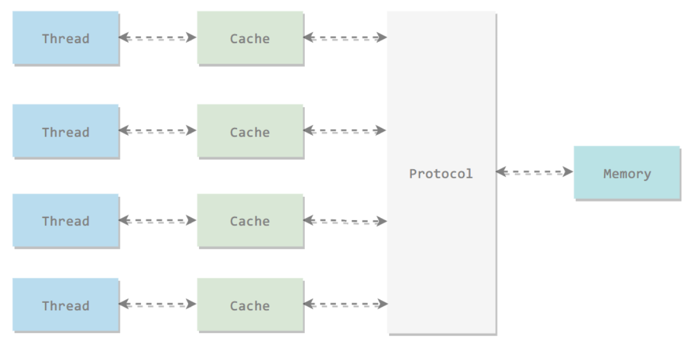
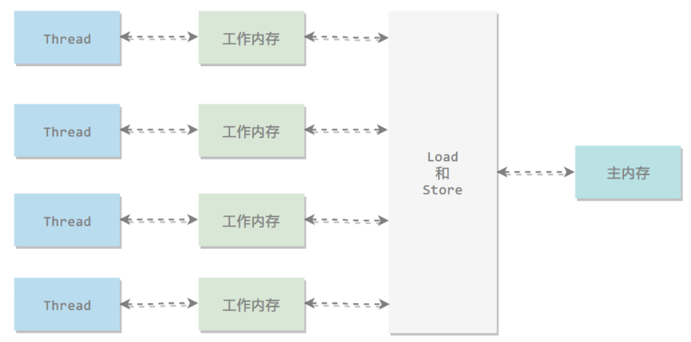
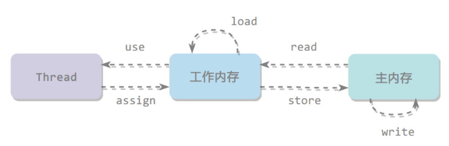

### 硬件效率与一致性

基于高速缓存的存储交互很好地解决了处理器与内存的速度矛盾，但是也**引入了一个新问题：缓存一致性**。在多处理器系统中，每个处理器都有自己的高速缓存，而它们又共享同一主内存。所以当多个处理器的运算任务都涉及同一块主内存区域时，可能会导致各自的缓存数据不一致。因此各个处理器在访问内存时都需要遵循一些协议。

**内存模型** 就是对特定的内存或者高速缓存进行读写访问的过程的抽象，不同的物理机器可以拥有不同的内存模型。类似的Java虚拟机也有自己的**内存模型**。

处理器可能会对输入代码进行乱序执行优化，计算之后再进行结果重组，使得与顺序执行的结果一致，因此各个语句计算的先后顺序与代码中的顺序可能不一致。类似的，Java虚拟机中也有类似的**指令重排序**优化。

### Java内存模型

Java内存模型是一种抽象模型，用来屏蔽掉各种硬件和操作系统的内存访问差异，让Java程序可以在各种平台下都达到一致的内存访问效果。Java内存模型的主要目标是定义程序中个变量（实例字段、静态字段、构成数组对象的元素）的访问规则，为了获得较好的执行效能，java内存模型并没有限制执行引擎使用处理器的特定寄存器或者缓存来和主内存进行交互也，没有限制即时编译器进行代码执行顺序这类优化措施。

所有的变量都存储在主内存中，每个线程还有自己的工作内存，工作内存存储在高速缓存或者寄存器中，保存了该线程使用的变量的主内存副本拷贝。线程只能直接操作工作内存中的变量，不同线程之间的变量值传递需要通过主内存来完成。

### 内存间交互操作

Java内存模型定义了 8 个操作来完成主内存和工作内存的交互操作。

-   lock：作用于主内存的变量，把一个变量标识为一条线程独占状态。
-   unlock：作用于主内存的变量，释放一个变量的锁定状态。

-   read：作用于主内存的变量，把一个变量的值从主内存传输到工作内存中。
-   load：作用于工作内存的变量，在read之后执行，把read得到的值放入工作内存的变量副本中。
-   use：作用于工作内存的变量，把工作内存中一个变量的值传递给执行引擎。
-   assign：作用于工作内存的变量，把一个从执行引擎接收到的值赋给工作内存的变量。
-   store：作用于工作内存的变量，把工作内存的一个变量的值传送到主内存中。
-   write：作用于主内存的变量，在 store 之后执行，把 store 得到的值放入主内存的变量中。

### 原子性

Java 内存模型保证了 read、load、use、assign、store、write、lock 和 unlock 操作具有原子性，例如对一个 int 类型的变量执行 assign 赋值操作，这个操作就是原子性的。

如果应用场景需要一个更大范围的原子性保证，可以通过 lock 和 unlock 操作来满足，即使用 monitorenter 和 monitorexit 来隐式地使用这两个操作，对应到java代码中就是 synchronized 关键字。

### 可见性

当一个线程修改了共享变量的值，其他线程能够立刻得知这个修改。Java 内存模型是通过在变量修改后将新值同步回主内存，在变量读取前从主内存刷新变量值来实现可见性的。

Java中有三种方式保证可见性：

-   volatile
-   synchronized：对一个变量执行 unlock 操作之前，必须把变量值同步回主内存。
-   final：被 final 关键字修饰的字段在构造器中一旦初始化完成，并且没有发生 this 逃逸（其它线程通过 this 引用访问到初始化了一半的对象），那么其它线程就能看见 final 字段的值。

### 有序性

在本线程内观察，所有操作都是有序的；在一个线程观察另一个线程，所有操作都是无序的，无序是因为发生了指令重排序。

volatile 关键字通过添加内存屏障的方式来禁止指令重排，即重排序时不能把后面的指令放到内存屏障之前。

也可以通过 synchronized 来保证有序性，它保证每个时刻只有一个线程执行同步代码，相当于是让线程顺序执行同步代码。

### 先行发生原则

Java中有一个先行发生原则（happens-before），他是判断数据是否存在竞争、线程是否安全的主要依据。先行发生关系无需任何同步操作就可以直接编码使用：

**程序次序规则**

在一个线程内，书写在前面的操作先行发生于后面的操作。

**管程锁定规则**

一个 unlock 操作先行发生于后面对同一个锁的 lock 操作。

**volatile变量规则**

对一个 volatile 变量的写操作先行发生于后面对这个变量的读操作。

**线程启动规则**

Thread 对象的 start() 方法调用先行发生于此线程的每一个动作。

**线程终止规则**

线程中的所有操作都先行发生于对此线程的终止检测。

**线程中断规则**

对线程 interrupt() 方法的调用先行发生于被中断线程的代码检测到中断事件的发生，可以通过 interrupted() 方法检测到是否有中断发生。

**传递性**

如果操作 A 先行发生于操作 B，操作 B 先行发生于操作 C，那么操作 A 先行发生于操作 C。

