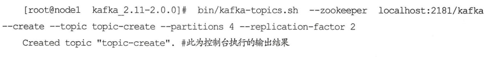
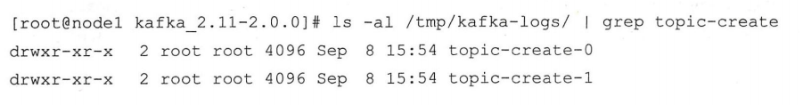
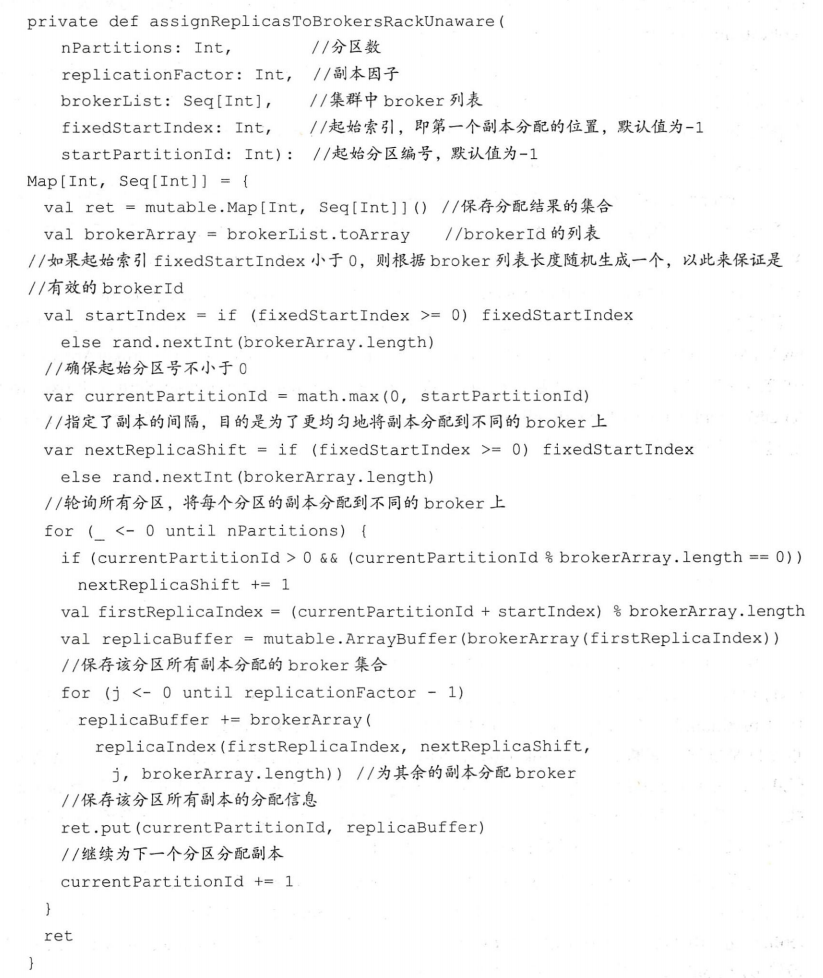
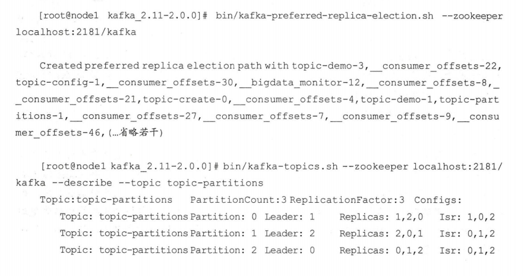
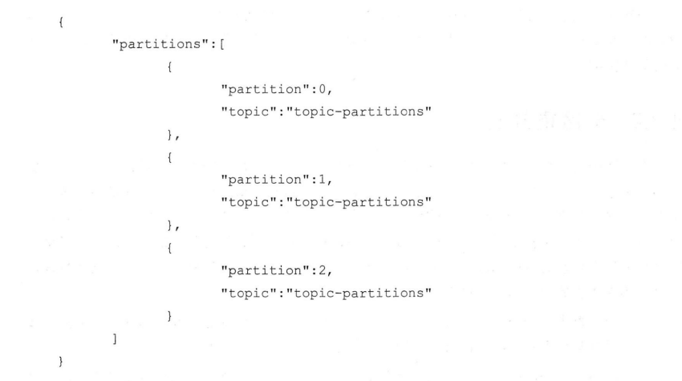
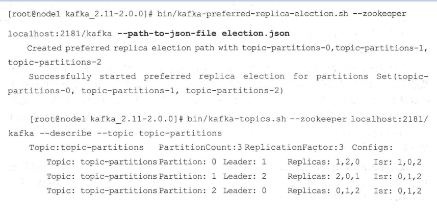
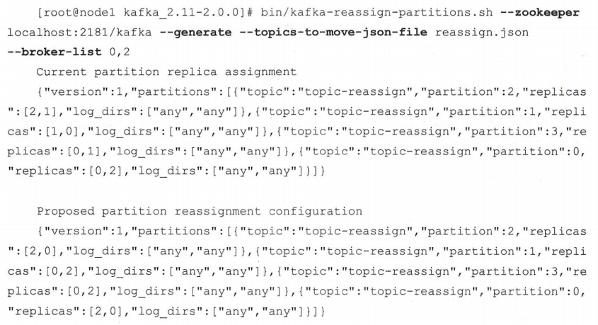
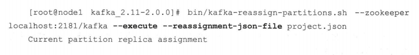

主题作为消息的归类，可以再细分为一个或多个分区，分区也可以看作对消息的二次归类。分区的划分不仅为 `Kafka` 提供了可伸缩性、水平扩展的功能，还通过多副本机制来为 `Kafka` 提供数据冗余以提高数据可靠性。从 `Kafka` 的底层实现来说，主题和分区都是逻辑上的概念，分区可以有一至多个副本，每个副本对应一个日志文件，每个日志文件对应一至多个日志分段（`LogSegment`），每个日志分段还可以细分为索引文件、日志存储文件和快照文件等。

### 创建主题

如果 `broker` 端配置参数 `auto.create.topics.enable` 设置为 `true`（默认值就是 `true` ），那么当生产者向一个尚未创建的主题发送消息时，会自动创建一个分区数为 `num.partitions` （默认值为 `1` ）、副本因子为 `default.replication.factor` （默认值为 `1` ）的主题。除此之外，当一个消费者开始从未知主题中读取消息时，或者当任意一个客户端向未知主题发送元数据请求时，都会按照配置参数值来创建一个相应的主题。很多时候，这种自动创建主题的行为都是非预期的，一般不建议将 `auto.create.topics.enable` 参数设置为 `true` ，这个参数会增加主题的管理与维护的难度。更加推荐也更加通用的方式是通过 `kafka-topics.sh` 脚本来创建主题。

上面的示例中创建了一个分区数为 `4` 、副本因子为 `2` 的主题。示例中的环境是一个包含 `3` 个 `broker` 节点的集群，每个节点的名称和 `brokerId` 的对照关系如下：

在执行完脚本之后， `Kafka` 会在 `log.dir` 或 `log.dirs` 参数所配置的目录下创建相应的主题分区，默认情况下这个目录为 `/tmp/kafka-logs/`。

以 `node1` 为例：

可以看到 `node1` 节点中创建了 `2` 个文件夹 `topic-create-0` 和 `topic-create-1`，对应主题 `topic-create` 的 `2` 个分区编号为 `0` 和 `1` 的分区，命名方式可以概括为 `＜topic＞-＜partition＞` 。默认情况下 `kafka` 为各 `broker` 分配的分区都是最优选择。

主题、分区、副本和 `Log`（日志）的关系如下图所示，主题和分区都是提供给上层用户的抽象，而在副本层面或更加确切地说是 `Log` 层面才有实际物理上的存在。同一个分区中的多个副本必须分布在不同的 `broker` 中，这样才能提供有效的数据冗余。

### 分区副本的分配

在创建主题时，如果使用了 `replica-assignment` 参数，那么就按照指定的方案来进行分区副本的创建；如果没有使用 `replica-assignment` 参数，那么就需要按照内部的逻辑来计算分配方案了。使用 `kafka-topics.sh` 脚本创建主题时的内部分配逻辑按照机架信息划分成两种策略：未指定机架信息和指定机架信息。如果集群中所有的 `broker` 节点都没有配置 `broker.rack` 参数，或者使用 `disable-rack-aware` 参数来创建主题，那么采用的就是未指定机架信息的分配策略。这里通过源码来分析未指定机架信息的分配策略，所对应的具体实现为 `kafka.admin.AdminUtils.scala` 文件中的 `assignReplicasToBrokersRackUnaware（）` 方法，该方法的内容如下：

### 分区管理

分区管理包括优先副本的选举、分区重分配、复制限流、修改副本因子等内容。

#### 优先副本选举

分区使用多副本机制来提升可靠性，但只有 `leader` 副本对外提供读写服务，而 `follower` 副本只负责在内部进行消息的同步。如果一个分区的 `leader` 副本不可用，那么就意味着整个分区变得不可用，此时就需要 `Kafka` 从剩余的 `follower` 副本中挑选一个新的 `leader` 副本来继续对外提供服务。在创建主题的时候，该主题的分区及副本会尽可能均匀地分布到 `Kafka` 集群的各个 `broker` 节点上，对应的 `leader` 副本的分配也比较均匀。针对同一个分区而言，同一个 `broker` 节点中不可能出现它的多个副本，即 `Kafka` 集群的一个 `broker` 中最多只能有它的一个副本。

随着时间的更替，`Kafka` 集群的 `broker` 节点不可避免地会遇到宕机或崩溃的问题，当分区的 `leader` 节点发生故障时，其中一个 `follower` 节点就会成为新的 `leader` 节点，这样就会导致集群的负载不均衡，从而影响整体的健壮性和稳定性。当原来的 `leader` 节点恢复之后重新加入集群时，它只能成为一个新的`follower` 节点而不再对外提供服务。

为了能够有效地治理负载失衡的情况，`Kafka` 引入了优先副本（`preferredreplica`）的概念。所谓的优先副本是指在 `AR` 集合列表中的第一个副本。理想情况下，优先副本就是该分区的 `leader` 副本，所以也可以称之为 `preferred leader` 。`Kafka` 要确保所有主题的优先副本在 `Kafka` 集群中均匀分布，这样就保证了所有分区的 `leader` 均衡分布。如果 `leader` 分布过于集中，就会造成集群负载不均衡。所谓的优先副本的选举是指通过一定的方式促使优先副本选举为 `leader` 副本，以此来促进集群的负载均衡，这一行为也可以称为 `分区平衡` 。

在 `Kafka` 中可以提供分区自动平衡的功能，与此对应的 `broker` 端参数是 `auto.leader.rebalance.enable` ，此参数的默认值为 `true` ，即默认情况下此功能是开启的。如果开启分区自动平衡的功能，则 `Kafka` 的控制器会启动一个定时任务，这个定时任务会轮询所有的 `broker` 节点，计算每个 `broker` 节点的分区不平衡率（`broker` 中的不平衡率 = 非优先副本的 `leader` 个数 / 分区总数）是否超过 `leader.imbalance.per.broker.percentage` 参数配置的比值，默认值为 `10%` ，如果超过设定的比值则会自动执行优先副本的选举动作以求分区平衡。执行周期由参数 `leader.imbalance.check.interval.seconds `控制，默认值为 `300` 秒，即 `5` 分钟。不过在生产环境中不建议将 `auto.leader.rebalance.enable` 设置为默认的 `true` ，因为这可能引起负面的性能问题，执行的时间无法自主掌控，在执行关键任务的关卡上执行优先副本的自动选举操作，势必会有业务阻塞、频繁超时之类的风险。

`Kafka` 中 `kafka-perferred-replica-election.sh` 脚本提供了对分区 `leader` 副本进行重新平衡的功能。优先副本的选举过程是一个安全的过程，`Kafka` 客户端可以自动感知分区 `leader` 副本的变更。

这种使用方式会将集群上所有的分区都执行一遍优先副本的选举操作，分区数越多打印出来的信息也就越多。`leader` 副本的转移也是一项高成本的工作，如果要执行的分区数很多，那么必然会对客户端造成一定的影响。如果集群中包含大量的分区，那么上面的这种使用方式有可能会失效。在优先副本的选举过程中，具体的元数据信息会被存入 `ZooKeeper` 的 `/admin/preferred_replica_election` 节点，如果这些数据超过了 `ZooKeeper` 节点所允许的大小，那么选举就会失败。默认情况下 `ZooKeeper` 所允许的节点数据大小为 `1MB`。

`kafka-perferred-replica-election.sh` 脚本中还提供了 `path-to-json-file` 参数来小批量地对部分分区执行优先副本的选举操作。通过 `path-to-json-file` 参数来指定一个 `JSON` 文件，这个 `JSON` 文件里保存需要执行优先副本选举的分区清单。举个例子，我们将集群中 `brokerId` 为 `2` 的节点重启，不过我们现在只想对主题 `topic-partitions` 执行优先副本的选举操作，那么先创建一个 `JSON` 文件，文件名假定为 `election.json` ，文件的内容如下：

然后通过 `kafka-perferred-replica-election.sh` 脚本配合 `path-to-json-file` 参数来对主题 `topic-partitions` 执行优先副本的选举操作：

在实际生产环境中，一般使用 `path-to-json-file` 参数来分批、手动地执行优先副本的选举操作。尤其是在应对大规模的 `Kafka` 集群时，理应杜绝采用非 `path-to-json-file` 参数的选举操作方式。同时，优先副本的选举操作也要注意避开业务高峰期，以免带来性能方面的负面影响。

#### 分区重分配

当集群中的一个节点突然宕机下线时，如果节点上的分区是多副本的，那么位于这个节点上的 `leader` 副本的角色会转交到集群的其他 `follower` 副本中。总而言之，这个节点上的分区副本都已经处于功能失效的状态，`Kafka` 并不会将这些失效的分区副本自动地迁移到集群中剩余的可用 `broker` 节点上，如果放任不管，则不仅会影响整个集群的均衡负载，还会影响整体服务的可用性和可靠性。

当要对集群中的一个节点进行有计划的下线操作时，我们希望通过某种方式能够将该节点上的分区副本迁移到其他的可用节点上。当集群中新增 `broker` 节点时，只有新创建的主题分区才有可能被分配到这个节点上，而之前的主题分区并不会自动分配到新加入的节点中，因为在它们被创建时还没有这个新节点，这样新节点的负载和原先节点的负载之间严重不均衡。为了解决上述问题，需要让分区副本再次进行合理的分配，也就是所谓的分区重分配。`Kafka` 提供了 `kafka-reassign-partitions.sh` 脚本来执行分区重分配的工作，它可以在集群扩容、`broker` 节点失效的场景下对分区进行迁移。

首先在一个由 `3` 个节点（`broker 0`、`broker 1`、`broker 2`）组成的集群中创建一个主题 `topic-reassign`。由于某种原因，我们想要下线 `brokerId` 为 `1` 的`broker` 节点，在此之前，我们要做的就是将其上的分区副本迁移出去。使用 `kafka-reassign-partitions.sh` 脚本的第一步就是要创建一个 `JSON` 文件（假定为`reassign.json`），文件内容为要进行分区重分配的主题清单。对主题 `topic-reassign` 而言，示例如下：

第二步就是根据这个 `JSON` 文件和指定所要分配的 `broker` 节点列表来生成一份候选的重分配方案，具体内容参考如下：

上面示例中打印出了两个 `JSON` 格式的内容。第一个 `Current partition replicaassignment` 所对应的 `JSON` 内容为当前的分区副本分配情况，在执行分区重分配的时候最好将这个内容保存起来，以备后续的回滚操作。第二个 `Proposedpartition reassignment configuration` 所对应的 `JSON` 内容为重分配的候选方案，注意这里只是生成一份可行性的方案，并没有真正执行重分配的动作。

第三步执行具体的重分配动作：

分区重分配的基本原理是先通过控制器为每个分区添加新副本，新的副本将从分区的 `leader` 副本那里复制所有的数据。根据分区的大小不同，复制过程可能需要花一些时间，因为数据是通过网络复制到新副本上的。在复制完成之后，控制器将旧副本从副本清单里移除。注意在重分配的过程中要确保有足够的空间。分区重分配对集群的性能有很大的影响，需要占用额外的资源，比如网络和磁盘。在实际操作中，我们将降低重分配的粒度，分成多个小批次来执行，以此来将负面的影响降到最低，这一点和优先副本的选举有异曲同工之妙。还需要注意的是，如果要将某个 `broker` 下线，那么在执行分区重分配动作之前最好先关闭或重启`broker` 。这样这个 `broker` 就不再是任何分区的 `leader` 节点了，它的分区就可以被分配给集群中的其他 `broker` 。这样可以减少 `broker` 间的流量复制，以此提升重分配的性能，以及减少对集群的影响。