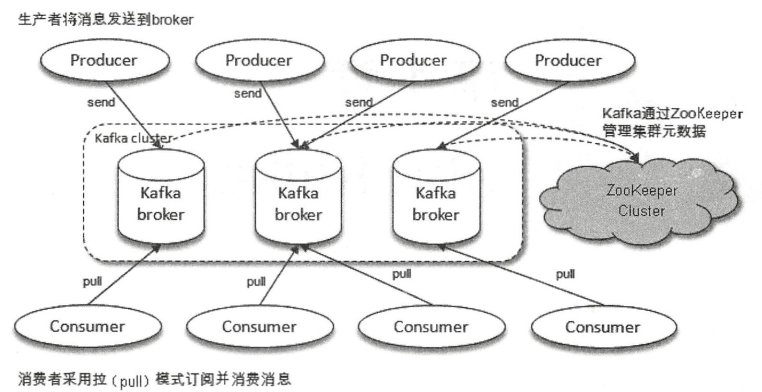
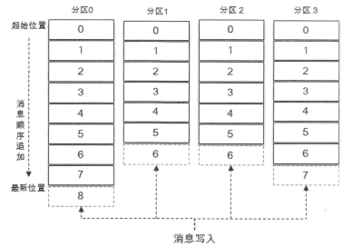

`Kafka` 一共扮演了三种角色：

1. **消息系统：** `Kafka` 具备系统解耦、冗余存储、流量削峰、缓冲、异步通信、扩展性、可恢复性等功能，并且提供了大多数消息系统难以实现的 **消息顺序性保障** 及 **回溯消费** 的功能。
2. **存储系统：** `Kafka` 把消息持久化到磁盘，可以作为长期的数据存储系统来使用。
3. **流式处理平台。**

#### `Kafka` 体系架构

一个典型的 `Kafka` 体系架构包括若干 `Producer`、 `Broker`、 `Consumer` 以及一个 `Zookeeper` 集群。`Zookeeper` 负责管理 `Kafka` 的集群元数据、控制器的选举等操作。`Producer` 将消息发送到 `Broker`， `Broker` 负责将收到的消息存储到磁盘中， `Consumer` 负责从 `Broker` 订阅并消费消息。

`kafka` 中有两个特别重要的概念——主题（`Topic`）和分区（`Partition`），生产者将消息发送到特定的主题，消费者订阅主题进行消费。主题是一个逻辑上的概念，它还可以细分为多个分区，一个分区只属于一个主题。同一主题下的每个分区所包含的消息是不一样的，分区在存储层面可以看做是一个可追加的日志文件，消息在被追加到分区日志文件的时候都会分配一个特定的偏移量（`offset`）。`offset` 是消息在分区中的唯一标识，`kafka` 用 `offset` 来保证消息在分区内的顺序性。由于 `offset` 并不是跨分区的，所以 `kafka` 不能保证消息在主题内的顺序性。

每一条消息被发送到 `broker` 之前，会根据分区规则选择存储到哪个具体的分区。如果分区规则设定的合理，所有的消息都可以均匀的分配到不同的分区中。如果一个主题只对应一个文件，那么这个文件所在的机器 `I/O` 将会成为这个主题的性能瓶颈，而分区解决了这个问题，可以实现水平扩展。

`Kafka` 为分区引入了副本机制，同一分区的不同副本中保存的是相同的消息，副本之间是 “一主多从” 的关系， `Leader` 副本负责处理读写请求， `follow` 副本只负责与 `leader` 副本的消息同步。副本处于不同的 `Broker` 中，当 `leader` 副本出现故障时，从 `follower` 副本中重新选举新的 `leader`  副本对外提供服务。

`Kafka` 消费端也具有一定的容灾能力。 `Consumer` 使用拉(`Pull`) 模式从服务端拉取消息，并且保存消费的具体位置，当消费者宕机恢复上线时，可以根据之前保存的消费位置重新拉取需要的消息进行消费，这样就不会造成消息的丢失。

分区中的所有副本统称为 `AR`, 所有与 `leader` 副本保持一定程度同步的副本（包括 `leader`）组成 `ISR`（`In-Sync Replicas`）。与 `leader` 副本同步滞后过多的副本组成 `OSR` （`Out-of-Sync Replicas`）。默认情况下当 `leader`  副本发生故障时，只有在 `ISR` 集合中的副本才有资格被选举为新的 `leader`。`ISR` 与 `HW` 和 `LEO` 也有紧密的关系。 `HW` 是 `High Watermark` 的缩写，俗称高水位，它标识了一个特定的消息偏移量（`offset`），消费者只能拉取到这个 `offset` 之前的消息。`LEO` 是 `Log End Offset` 的缩写，它标识了当前日志文件中下一条待写入消息的偏移量，`LEO` 的大小相当于当前日志分区中最后一条消息的偏移量加 `1` 。分区中每个副本都会维护自身的 `LEO` ，`ISR` 中最小的 `LEO` 即为 `HW`，所以对于消费者来说，最多只能消费到 `HW` 之前的消息。