### 文件目录结构

`Kafka` 中的消息是以主题为基本单位进行归类的，各个主题在逻辑上相互独立。每个主题又可以分为一个或多个分区，分区的数量可以在主题创建的时候指定，也可以在之后修改。每条消息在发送的时候会根据分区规则被追加到指定的分区中，分区中的每条消息都会被分配一个唯一的序列号，也就是通常所说的偏移量。如果分区规则设置得合理，那么所有的消息可以均匀地分布到不同的分区中，这样就可以实现水平扩展。不考虑多副本的情况，一个分区对应一个日志。为了防止 `Log` 过大，`Kafka` 又引入了日志分段（`LogSegment`）的概念，将 `Log` 切分为多个 `LogSegment` ，相当于一个巨型文件被平均分配为多个相对较小的文件，这样也便于消息的维护和清理。事实上，`Log` 和 `LogSegment` 也不是纯粹物理意义上的概念，`Log` 在物理上只以文件夹的形式存储，而每个 `LogSegment` 对应于磁盘上的一个日志文件和两个索引文件，以及可能的其他文件（比如以 `.txnindex` 为后缀的事务索引文件）。

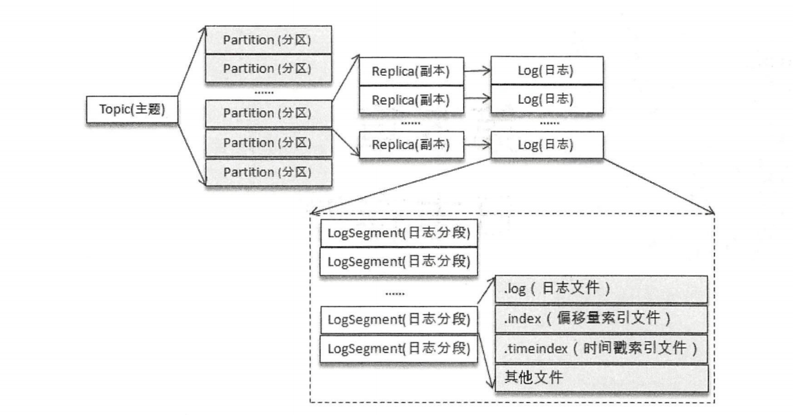

`Log` 对应了一个命名形式为 `＜topic＞-＜partition＞` 的文件夹。举个例子，假设有一个名为 `topic-log` 的主题，此主题中具有 `4` 个分区，那么在实际物理存储上表现为 `topic-log-0` `topic-log-1` `topic-log-2` `topic-log-3` 这 `4` 个文件夹。

向 `Log` 中追加消息时是顺序写入的，只有最后一个 `LogSegment` 才能执行写入操作，在此之前所有的 `LogSegment` 都不能写入数据。为了方便描述，我们将最后一个 `LogSegment` 称为 `activeSegment` ，即表示当前活跃的日志分段。随着消息的不断写入，当 `activeSegment` 满足一定的条件时，就需要创建新的`activeSegment` ，之后追加的消息将写入新的 `activeSegment` 。

为了便于消息的检索，每个 `LogSegment` 中的日志文件（以 `.log` 为文件后缀）都有对应的两个索引文件：偏移量索引文件（以 `.index` 为文件后缀）和时间戳索引文件（以 `.timeindex` 为文件后缀）。每个 `LogSegment` 都有一个基准偏移量 `baseOffset`，用来表示当前 `LogSegment` 中第一条消息的 `offset` 。偏移量是一个 `64` 位的长整型数，日志文件和两个索引文件都是根据 `baseOffset ` 命名的，名称固定为 `20` 位数字，没有达到的位数则用 `0` 填充。比如第一个 `LogSegment` 的基准偏移量为 `0` ，对应的日志文件为 `00000000000000000000.log` 。

注意每个 `LogSegment` 中不只包含 `.log` `.index` `.timeindex` 这 `3` 种文件，还可能包含 `.deleted` `.cleaned` `.swap` 等临时文件，以及可能的 `.snapshot` `.txnindex` `leader-epoch-checkpoint` 等文件。从更加宏观的视角上看，`Kafka` 中的文件不只上面提及的这些文件，比如还有一些检查点文件，当一个 `Kafka` 服务第一次启动的时候，默认的根目录下就会创建以下 `5` 个文件：

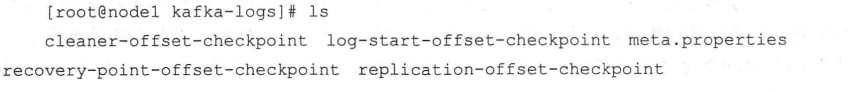

消费者提交的位移是保存在 `Kafka` 内部的主题 `__consumer_offsets` 中的，初始情况下这个主题并不存在，当第一次有消费者消费消息时会自动创建这个主题。

在某一时刻，`Kafka` 中的文件目录布局如下图所示。每一个根目录都会包含最基本的 `4` 个检查点文件（ `xxx-checkpoint` ）和 `meta.properties` 文件。在创建主题的时候，如果当前 `broker` 中不止配置了一个根目录，那么会挑选分区数最少的那个根目录来完成本次创建任务。

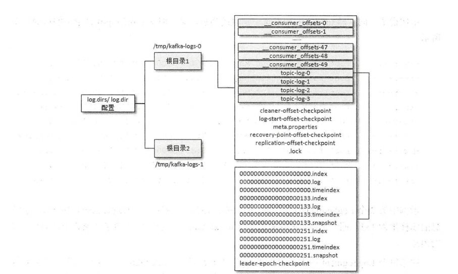

### 文件格式演变

对于一个成熟的消息中间件而言，日志格式不仅关系功能维度的扩展，还牵涉性能维度的优化。随着 `Kafka` 的迅猛发展，其消息格式也在不断升级改进，每个分区由内部的每一条消息组成，如果消息格式设计得不够精炼，那么其功能和性能都会大打折扣。比如有冗余字段，势必会不必要地增加分区的占用空间，进而不仅使存储的开销变大、网络传输的开销变大，也会使Kafka的性能下降。反观如果缺少字段，比如在最初的 `Kafka` 消息版本中没有 `timestamp` 字段，对内部而言，其影响了日志保存、切分策略，对外部而言，其影响了消息审计、端到端延迟、大数据应用等功能的扩展。虽然可以在消息体内部添加一个时间戳，但解析变长的消息体会带来额外的开销，而存储在消息体前面可以通过指针偏移量获取其值而容易解析，进而减少了开销，虽然相比于没有 `timestamp` 字段的开销会大一点。

#### `v0` 版本

`kafka` 消息格式的第一个版本通常称为 `v0` 版本，在 `Kafka` `0.8.x` 之后 `0.10.0` 之前都采用的这个消息格式。

下图左边的 `RECORD` 部分就是 `v0` 版本的消息格式，大多数人会把左边的整体都看作消息，因为每个 `RECORD（v0和v1版）` 必定对应一个 `offset` 和 `message size` 。每条消息都有一个 `offset` 用来标志它在分区中的偏移量，这个 `offset` 是逻辑值，而非实际物理偏移值，`message size` 表示消息的大小，这两者在一起被称为日志头部（`LOG_OVERHEAD`），固定为 `12B` 。`LOG_OVERHEAD` 和 `RECORD` 一起用来描述一条消息，在讲述具体消息格式时会偏向于将单纯的 `RECORD` 看作消息，而在其他地方则偏向于将 `LOG_OVERHEAD` 和 `RECORD` 的整体看作消息。与消息对应的还有消息集的概念，消息集中包含一条或多条消息，消息集不仅是存储于磁盘及在网络上传输（ `Produce ＆ Fetch`）的基本形式，而且是 `Kafka` 中压缩的基本单元。

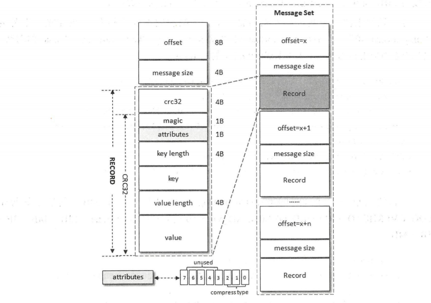

消息格式中的各个字段，从 `crc32` 开始算起，各个字段的解释如下：

1.  `crc32（4B）` ：`crc32` 校验值。校验范围为 `magic` 至 `value` 之间。
2.  `magic（1B）` ：消息格式版本号，此版本的 `magic` 值为 `0` 。
3.  `attributes（1B）` ：消息的属性。总共占 `1` 个字节，低 `3` 位表示压缩类型： `0` 表示 `NONE` 、 `1` 表示 `GZIP` 、 `2` 表示` SNAPPY` 、 `3` 表示 `LZ4` （ `LZ4` 自 `Kafka 0.9.x` 引入），其余位保留。
4.  `key length（4B）` ：表示消息的 `key` 的长度。如果为 `-1` ，则表示没有设置 `key` ，即 `key = null` 。
5.  `key` ：可选，如果没有 `key` 则无此字段。
6.  `value length（4B）` ：实际消息体的长度。如果为 `-1` ，则表示消息为空。
7.  `value` ：消息体。可以为空，比如墓碑（ `tombstone` ）消息。

 `v0` 版本中一个消息的最小长度（ `RECORD_OVERHEAD_V0` ）为 `crc32 + magic + attributes + key length  + value length = 4B + 1B + 1B + 4B + 4B = 14B` 。也就是说，`v0` 版本中一条消息的最小长度为 `14B` ，如果小于这个值，那么这就是一条破损的消息而不被接收。

#### `v1` 版本

 `Kafka` 从 `0.10.0` 版本开始到 `0.11.0` 版本之前所使用的消息格式版本为 `v1` ，比 `v0` 版本就多了一个 `timestamp` 字段，表示消息的时间戳。 `v1` 版本的 `magic` 字段的值为 `1` 。 `v1` 版本的 `attributes` 字段中的低 `3` 位和 `v0` 版本的一样，还是表示压缩类型，而第 `4` 个位（ `bit` ）也被利用了起来： `0` 表示 `timestamp` 类型为 `CreateTime` ，而 `1` 表示 `timestamp` 类型为 `LogAppendTime` ，其他位保留。 `timestamp` 类型由` broker` 端参数 `log.message.timestamp.type` 来配置，默认值为 `CreateTime` ，即采用生产者创建消息时的时间戳。如果在创建 `ProducerRecord` 时没有显式指定消息的时间戳，那么 `KafkaProducer` 也会在发送这条消息前自动添加上。

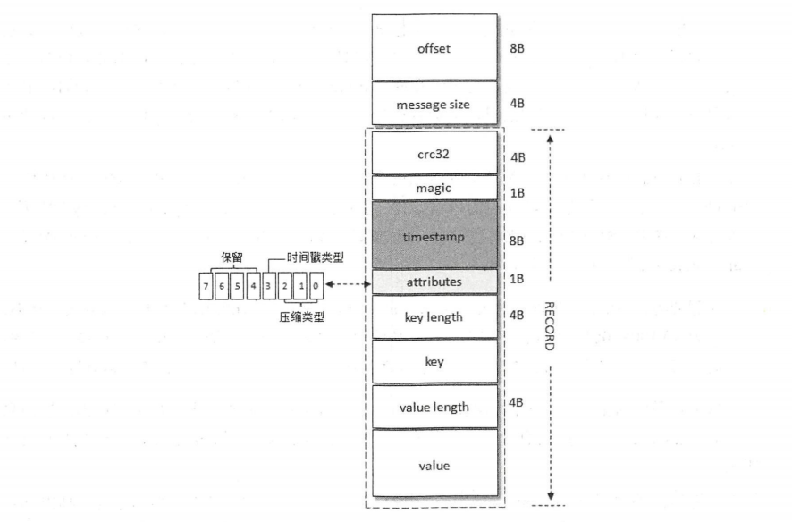

常见的压缩算法是数据量越大压缩效果越好，一条消息通常不会太大，这就导致压缩效果并不是太好。而 `Kafka` 实现的压缩方式是将多条消息一起进行压缩，这样可以保证较好的压缩效果。在一般情况下，生产者发送的压缩数据在 `broker` 中也是保持压缩状态进行存储的，消费者从服务端获取的也是压缩的消息，消费者在处理消息之前才会解压消息，这样保持了端到端的压缩。 `Kafka` 日志中使用哪种压缩方式是通过参数 `compression.type` 来配置的，默认值为 `producer` ，表示保留生产者使用的压缩方式。这个参数还可以配置为 `gzip` `snappy` `lz4`，分别对应 `GZIP`、`SNAPPY`、`LZ4` 这 `3` 种压缩算法。如果参数 `compression.type` 配置为 `uncompressed`，则表示不压缩。

当消息压缩时是将整个消息集进行压缩作为内层消息（ `inner message` ），内层消息整体作为外层（ `wrapper message` ）的 `value` ，其结构如下图所示。

压缩后的外层消息（ `wrapper message` ）中的 `key` 为 `null` ，所以上图左半部分没有画出 `key` 字段， `value` 字段中保存的是多条压缩消息（ `inner message` ，内层消息），其中 `Record` 表示的是从 `crc32` 到 `value` 的消息格式。当生产者创建压缩消息的时候，对内部压缩消息设置的 `offset` 从 `0` 开始为每个内部消息分配 `offset` ，详细可以参考下图右半部分。

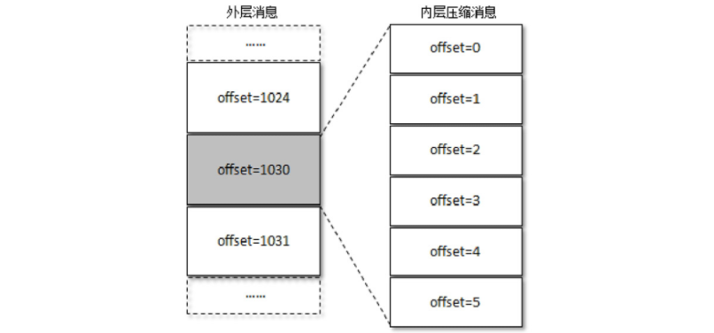

其实每个从生产者发出的消息集中的消息 `offset` 都是从 `0` 开始的，当然这个 `offset` 不能直接存储在日志文件中，对 `offset` 的转换是在服务端进行的，客户端不需要做这个工作。外层消息保存了内层消息中最后一条消息的绝对位移（`absoluteoffset`），绝对位移是相对于整个分区而言的。对于未压缩的情形，上图右内层消息中最后一条的 `offset` 理应是 `1030` ，但被压缩之后就变成了 `5` ，而这个 `1030` 被赋予给了外层的 `offset` 。当消费者消费这个消息集的时候，首先解压缩整个消息集，然后找到内层消息中最后一条消息的 `inner offset` ，计算出内层消息中最后一条消息前面的消息的 `absolute offset` 。

**注意要点：** 压缩消息，英文是 `compress message` ， `Kafka` 中还有一个 `compactmessage` ，常常被人们直译成压缩消息，需要注意两者的区别。 `compactmessage` 是针对日志清理策略而言的，是指日志压缩后的消息。

#### 变长字段

`Kafka` 从 `0.11.0` 版本开始所使用的消息格式版本为 `v2` ，这个版本的消息相比 `v0` 和 `v1` 的版本而言改动很大，同时还参考了 `Protocol Buffer` 而引入了变长整型（ `Varints` ）和 `ZigZag` 编码。 `Varints` 是使用一个或多个字节来序列化整数的一种方法。数值越小，其占用的字节数就越少。 `Varints` 中的每个字节都有一个位于最高位的 `msb` 位（ `most significantbit` ），除最后一个字节外，其余 `msb` 位都设置为 `1` ，最后一个字节的 `msb` 位为 `0` 。这个 `msb` 位表示其后的字节是否和当前字节一起来表示同一个整数。除 `msb` 位外，剩余的 `7` 位用于存储数据本身，这种表示类型又称为 `Base 128` 。通常而言，一个字节 `8` 位可以表示 `256` 个值，所以称为 `Base 256` ，而这里只能用 `7` 位表示， `2` 的 `7` 次方即 `128` 。

`Varints` 可以用来表示 `int32` 、`int64` 、`uint32` 、`uint64` 、`sint32` 、`sint64` 、`bool` 、`enum` 等类型。在实际使用过程中，如果当前字段可以表示为负数，那么对 `int32/int64` 和 `sint32/sint64` 而言，它们在进行编码时存在较大的区别。比如使用 `int64` 表示一个负数，那么哪怕是 `-1` ，其编码后的长度始终为 `10` 个字节，就如同对待一个很大的无符号长整型数一样。为了使编码更加高效，`Varints` 使用了 `ZigZag` 的编码方式。

#### `v2` 版本

`v2` 版本中消息集称为 `Record Batch` ，而不是先前的 `Message Set` ，其内部也包含了一条或多条消息。在消息压缩的情形下，`Record Batch Header` 部分（从 `first offset` 到 `records count` 字段）是不被压缩的，而被压缩的是 `records` 字段中的所有内容。生产者客户端中的 `ProducerBatch` 对应这里的 `RecordBatch` ，而 `ProducerRecord` 对应这里的 `Record` 。

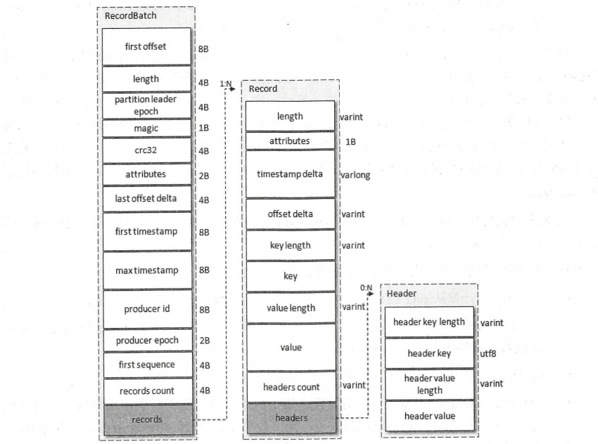

`Record` 内部字段大量采用了 `Varints` ，这样 `Kafka` 可以根据具体的值来确定需要几个字节来保存。 `v2` 版本的消息格式去掉了 `crc` 字段，另外增加了 `length` 、 `timestamp delta` 、 `offset delta` 和 `headers` 信息，并且 `attributes` 字段被弃用了。

1.  `length` ：消息总长度。
2.  `attributes` ：弃用，但还是在消息格式中占据1B的大小，以备未来的格式扩展。
3.  `timestamp delta` ：时间戳增量。
4.  `offset delta` ：位移增量
5.  `headers` ：用来支持应用级别的扩展，一个 `Record` 里面可以包含 `0` 至多个 `Header` 。

`RecordBatch` ：

1. `first offset` ：表示当前 `RecordBatch` 的起始位移。
2. `length` ：计算从 `partition leader epoch` 字段开始到末尾的长度。
3.  `partition leader epoch` ：分区 `leader` 纪元。
4.   `magic` ：消息格式的版本号。
5.  `attributes` ：消息属性，占用了两个字节。低 `3` 位表示压缩格式，第 `4` 位表示时间戳类型，第 `5` 位表示此 `RecordBatch` 是否处于事务中，第 `6` 位表示是否是控制消息（ `ControlBatch` ），控制消息用来支持事务功能。
6.  `last offset delta` ： `RecordBatch` 中最后一个 `Record` 的 `offset` 与 `first offset` 的差值。主要被 `broker` 用来确保 `RecordBatch` 中 `Record` 组装的正确性。
7.  `first timestamp` ： `RecordBatch` 中第一条 `Record` 的时间戳。
8.  `max timestamp` ： `RecordBatch` 中最大的时间戳，一般情况下是指最后一个 `Record` 的时间戳，和 `last offset delta` 的作用一样，用来确保消息组装的正确性。
9.  `producer id` ： `PID` ，用来支持幂等和事务。
10.  `producer epoch` ：和 `producer id` 一样，用来支持幂等和事务
11.  `first sequence` ：和 `producer id` 、`producer epoch` 一样，用来支持幂等和事务
12.  `records count` ： `RecordBatch` 中 `Record` 的个数。

### 日志索引

每个日志分段文件对应了两个索引文件，主要用来提高查找消息的效率。偏移量索引文件用来建立消息偏移量到物理地址之间的映射关系，方便快速定位消息所在的物理文件位置；时间戳索引文件则根据指定的时间戳来查找对应的偏移量信息。

`Kafka` 中的索引文件以稀疏索引的方式构造消息的索引，它并不保证每个消息在索引文件中都有对应的索引项。每当写入一定量的消息时，偏移量索引文件和时间戳索引文件分别增加一个偏移量索引项和时间戳索引项，增大或减小 `log.index.interval.bytes` 的值，对应地可以增加或缩小索引项的密度。稀疏索引通过 `MappedByteBuffer` 将索引文件映射到内存中，以加快索引的查询速度。偏移量索引文件中的偏移量是单调递增的，查询指定偏移量时，使用二分查找法来快速定位偏移量的位置，如果指定的偏移量不在索引文件中，则会返回小于指定偏移量的最大偏移量。时间戳索引文件中的时间戳也保持严格的单调递增，查询指定时间戳时，也根据二分查找法来查找不大于该时间戳的最大偏移量，至于要找到对应的物理文件位置还需要根据偏移量索引文件来进行再次定位。稀疏索引的方式是在磁盘空间、内存空间、查找时间等多方面之间的一个折中。

日志分段文件达到一定的条件时需要进行切分，其对应的索引文件也需要进行切分。日志分段文件切分包含以下几个条件，满足其一即可：

1. 当前日志分段文件的大小超过了 `broker` 端参数 `log.segment.bytes` 配置的值。
2. 当前日志分段中消息的最大时间戳与当前系统的时间戳的差值大于 `log.roll.ms` 或 `log.roll.hours` 参数配置的值。
3. 偏移量索引文件或时间戳索引文件的大小达到 `broker` 端参数 `log.index.size.max.bytes` 配置的值。
4. 追加的消息的偏移量与当前日志分段的偏移量之间的差值大于 `Integer.MAX_VALUE` ，即要追加的消息的偏移量不能转变为相对偏移量。

对非当前活跃的日志分段而言，其对应的索引文件内容已经固定而不需要再写入索引项，所以会被设定为只读。而对当前活跃的日志分段（ `activeSegment` ）而言，索引文件还会追加更多的索引项，所以被设定为可读写。在索引文件切分的时候， `Kafka` 会关闭当前正在写入的索引文件并置为只读模式，同时以可读写的模式创建新的索引文件。 `Kafka`  在创建索引文件的时候会为其预分配l `og.index.size.max.bytes` 大小的空间，注意这一点与日志分段文件不同，只有当索引文件进行切分的时候， `Kafka`  才会把该索引文件裁剪到实际的数据大小。也就是说，与当前活跃的日志分段对应的索引文件的大小固定为 `log.index.size.max.bytes` ，而其余日志分段对应的索引文件的大小为实际的占用空间。

#### 偏移量索引

偏移量索引项的格式如下图所示。每个索引项占用 `8` 个字节，分为两个部分：

1.  `relativeOffset` ：相对偏移量，表示消息相对于 `baseOffset` 的偏移量，占用 `4` 个字节，当前索引文件的文件名即为 `baseOffset` 的值。
2.  `position` ：物理地址，也就是消息在日志分段文件中对应的物理位置，占用 `4` 个字节。

消息的偏移量占用 `8` 个字节，也可以称为绝对偏移量。索引项中没有直接使用绝对偏移量而改为只占用 `4` 个字节的相对偏移量（ `relativeOffset = offset - baseOffset` ），这样可以减小索引文件占用的空间。

参考下图，如果要查找偏移量为 `268` 的消息，首先肯定是定位到 `baseOffset` 为 `251` 的日志分段，然后计算相对偏移量 `relativeOffset = 268 - 251 = 17` ，之后再在对应的索引文件中找到不大于 `17` 的索引项，最后根据索引项中的 `position` 定位到具体的日志分段文件位置开始查找目标消息。`Kafka` 的每个日志对象中使用了 `ConcurrentSkipListMap` 来保存各个日志分段，每个日志分段的 `baseOffset` 作为 `key` ，这样可以根据指定偏移量来快速定位到消息所在的日志分段。

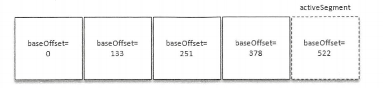

#### 时间戳索引

时间戳索引项的格式如下图：

每个索引项占用 `12` 个字节，分为两个部分。

1.  `timestamp` ：当前日志分段最大的时间戳。
2.  `relativeOffset` ：时间戳所对应的消息的相对偏移量。时间戳索引文件中包含若干时间戳索引项，每个追加的时间戳索引项中的timestamp 必须大于之前追加的索引项的 timestamp，否则不予追加。

如果要查找指定时间戳 `targetTimeStamp = 1526384718288` 开始的消息，首先是找到不小于指定时间戳的日志分段。这里无法使用跳跃表来快速定位到相应的日志分段了，需要分以下几个步骤来完成。

1. 将 `targetTimeStamp` 和每个日志分段中的最大时间戳 `largestTimeStamp` 逐一对比，直到找到不小于 `targetTimeStamp` 的 `largestTimeStamp` 所对应的日志分段。日志分段中的 `largestTimeStamp` 的计算是先查询该日志分段所对应的时间戳索引文件，找到最后一条索引项，若最后一条索引项的时间戳字段值大于 `0` ，则取其值，否则取该日志分段的最近修改时间。
2. 找到相应的日志分段之后，在时间戳索引文件中使用二分查找算法查找到不大于 `targetTimeStamp` 的最大索引项，比如 `[1526384718283，28]`
3. 在偏移量索引文件中使用二分算法查找到不大于 `28` 的最大索引项，比如 `[26，838]`
4. 从步骤 `1` 中找到日志分段文件中的 `838` 的物理位置开始查找不小于 `targetTimeStamp` 的消息。

### 日志清理

 `Kafka` 将消息存储在磁盘中，为了控制磁盘占用空间的不断增加就需要对消息做一定的清理操作。Kafka提供了两种日志清理策略：

1. 日志删除：按照一定的保留策略直接删除不符合条件的日志分段。
2. 日志压缩：针对每个消息的 `key` 进行整合，对于有相同 `key` 的不同 `value` 值，只保留最后一个版本。

#### 日志删除

在 `Kafka` 的日志管理器中会有一个专门的日志删除任务来周期性地检测和删除不符合保留条件的日志分段文件，默认值为 `5` 分钟。当前日志分段的保留策略有 `3` 种：基于时间的保留策略、基于日志大小的保留策略和基于日志起始偏移量的保留策略。

1. 基于时间：日志删除任务会检查当前日志文件中是否有保留时间超过设定的阈值来寻找可删除的日志分段文件集合，默认情况下日志分段文件的保留时间为7天。查找过期的日志分段文件是根据日志分段中最大的时间戳 `largestTimeStamp` 来计算的。若待删除的日志分段的总数等于该日志文件中所有的日志分段的数量，那么说明所有的日志分段都已过期，但该日志文件中还要有一个日志分段用于接收消息的写入，即必须要保证有一个活跃的日志分段 `activeSegment` ，在此种情况下，会先切分出一个新的日志分段作为 `activeSegment` ，然后执行删除操作。删除日志分段时，首先会从 `Log` 对象中所维护日志分段的跳跃表中移除待删除的日志分段，以保证没有线程对这些日志分段进行读取操作。然后将日志分段所对应的所有文件添加上 `.deleted` 的后缀（包括索引文件）。最后交由一个以 `delete-file` 命名的延迟任务来删除这些以 `.deleted` 为后缀的文件。
2. 基于日志大小：日志删除任务会检查当前日志的大小是否超过设定的阈值来寻找可删除的日志分段的文件集合。基于日志大小的保留策略与基于时间的保留策略类似，首先计算日志文件的总大小 `size` 和 `retentionSize` 的差值 `diff` ，即计算需要删除的日志总大小，然后从日志文件中的第一个日志分段开始进行查找可删除的日志分段的文件集合 `deletableSegments` 。查找出 `deletableSegments` 之后就执行删除操作。
3. 基于日志起始偏移量：一般情况下，日志文件的起始偏移量 `logStartOffset` 等于第一个日志分段的 `baseOffset` 。基于日志起始偏移量的保留策略的判断依据是某日志分段的下一个日志分段的起始偏移量 `baseOffset` 是否小于等于 `logStartOffset` ，若是，则可以删除此日志分段。
    1. 从头开始遍历每个日志分段，日志分段的下一个日志分段的起始偏移量小于 `logStartOffset` 的大小，将日志分段加入 `deletableSegments` 。
    2. 日志分段的下一个日志偏移量在 `logStartOffset` 的右侧，从日志分段开始的所有日志分段都不会加入 `deletableSegments` 。

#### 日志压缩

 `Kafka` 中的 `Log Compaction` 是指在默认的日志删除规则之外提供的一种清理过时数据的方式。`Log Compaction` 对于有相同 `key` 的不同 `value` 值，只保留最后一个版本。如果应用只关心 `key` 对应的最新 `value` 值，则可以开启 `Kafka` 的日志压缩功能， `Kafka` 会定期将相同 `key` 的消息进行合并，只保留最新的 `value` 值。

 `Log Compaction` 执行前后，日志分段中的每条消息的偏移量和写入时的偏移量保持一致。`Log Compaction` 会生成新的日志分段文件，日志分段中每条消息的物理位置会重新按照新文件来组织。`Log Compaction` 执行过后的偏移量不再是连续的，不过这并不影响日志的查询。`Kafka` 中的 `Log Compaction` 可以类比于 `Redis` 中的 `RDB` 的持久化模式。试想一下，如果一个系统使用 `Kafka` 来保存状态，那么每次有状态变更都会将其写入 `Kafka` 。在某一时刻此系统异常崩溃，进而在恢复时通过读取 `Kafka` 中的消息来恢复其应有的状态，那么此系统关心的是它原本的最新状态而不是历史时刻中的每一个状态。如果 `Kafka` 的日志保存策略是日志删除（ `Log Deletion` ），那么系统势必要一股脑地读取 `Kafka` 中的所有数据来进行恢复，如果日志保存策略是 `Log Compaction` ，那么可以减少数据的加载量进而加快系统的恢复速度。`Log Compaction` 在某些应用场景下可以简化技术栈，提高系统整体的质量。

### 磁盘存储

`Kafka` 依赖于文件系统来存储和缓存消息，`Kafka` 在设计时采用了文件追加的方式来写入消息，并且不允许修改已写入的消息，这种方式属于典型的顺序写盘的操作，所以就算 `Kafka` 使用磁盘作为存储介质，它所能承载的吞吐量也不容小觑。

#### 页缓存

页缓存是操作系统实现的一种主要的磁盘缓存，以此用来减少对磁盘 `I/O` 的操作。具体来说，就是把磁盘中的数据缓存到内存中，把对磁盘的访问变为对内存的访问。当一个进程准备读取磁盘上的文件内容时，操作系统会先查看待读取的数据所在的页是否在页缓存中，如果存在则直接返回数据，从而避免了对物理磁盘的 `I/O` 操作；如果没有命中，则操作系统会向磁盘发起读取请求并将读取的数据页存入页缓存，之后再将数据返回给进程。同样，如果一个进程需要将数据写入磁盘，那么操作系统也会检测数据对应的页是否在页缓存中，如果不存在，则会先在页缓存中添加相应的页，最后将数据写入对应的页。被修改过后的页也就变成了脏页，操作系统会在合适的时间把脏页中的数据写入磁盘，以保持数据的一致性。

对一个进程而言，它会在进程内部缓存处理所需的数据，然而这些数据有可能还缓存在操作系统的页缓存中，因此同一份数据有可能被缓存了两次。并且，除非使用 `Direct I/O` 的方式，否则页缓存很难被禁止。此外，用过 `Java` 的人一般都知道两点事实：对象的内存开销非常大，通常会是真实数据大小的几倍甚至更多，空间使用率低下；`Java` 的垃圾回收会随着堆内数据的增多而变得越来越慢。基于这些因素，使用文件系统并依赖于页缓存的做法明显要优于维护一个进程内缓存或其他结构，至少我们可以省去了一份进程内部的缓存消耗，同时还可以通过结构紧凑的字节码来替代使用对象的方式以节省更多的空间。如此，我们可以在 `32GB` 的机器上使用 `28GB` 至 `30GB` 的内存而不用担心 `GC` 所带来的性能问题。此外，即使 `Kafka` 服务重启，页缓存还是会保持有效，然而进程内的缓存却需要重建。这样也极大地简化了代码逻辑，因为维护页缓存和文件之间的一致性交由操作系统来负责，这样会比进程内维护更加安全有效。

`Kafka` 中大量使用了页缓存，这是 `Kafka` 实现高吞吐的重要因素之一。虽然消息都是先被写入页缓存，然后由操作系统负责具体的刷盘任务的，但在 `Kafka` 中同样提供了同步刷盘及间断性强制刷盘的功能。同步刷盘可以提高消息的可靠性，防止由于机器掉电等异常造成处于页缓存而没有及时写入磁盘的消息丢失。不过并不建议这么做，刷盘任务就应交由操作系统去调配，消息的可靠性应该由多副本机制来保障，而不是由同步刷盘这种严重影响性能的行为来保障。

#### 磁盘 `I/O` 流程

从编程角度而言，一般磁盘 `I/O` 的场景有以下四种：

1. 用户调用标准 `C` 库进行 `I/O` 操作，数据流为：应用程序 `buffer → C库标准 IObuffer → 文件系统页缓存 → 通过具体文件系统到磁盘`。
2. 用户调用文件 `I/O`，数据流为：`应用程序 buffer → 文件系统页缓存 → 通过具体文件系统到磁盘`。
3. 用户打开文件时使用 `O_DIRECT`，绕过页缓存直接读写磁盘。
4. 用户使用类似 `dd` 工具，并使用 `direct` 参数，绕过系统 `cache` 与文件系统直接写磁盘。

发起 `I/O` 请求的步骤可以表述为如下的内容：

1. 写操作：用户调用 `fwrite` 把数据写入 `C` 库标准 `IObuffer` 后就返回，即写操作通常是异步操作；数据写入 `C` 库标准 `IObuffer` 后，不会立即刷新到磁盘，会将多次小数据量相邻写操作先缓存起来合并，最终调用 `write` 函数一次性写入（或者将大块数据分解多次 `write` 调用）页缓存；数据到达页缓存后也不会立即刷新到磁盘，内核有 `pdflush` 线程在不停地检测脏页，判断是否要写回到磁盘，如果是则发起磁盘 `I/O` 请求。
2. 读操作：用户调用 `fread` 到 `C` 库标准 `IObuffer` 中读取数据，如果成功则返回，否则继续；到页缓存中读取数据，如果成功则返回，否则继续；发起 `I/O` 请求，读取数据后缓存 `buffer` 和 `C` 库标准 `IObuffer` 并返回。可以看出，读操作是同步请求。
3. `I/O` 请求处理：通用块层根据 `I/O` 请求构造一个或多个 `bio` 结构并提交给调度层；调度器将 `bio` 结构进行排序和合并组织成队列且确保读写操作尽可能理想：将一个或多个进程的读操作合并到一起读，将一个或多个进程的写操作合并到一起写，尽可能变随机为顺序，读必须优先满足，而写也不能等太久。

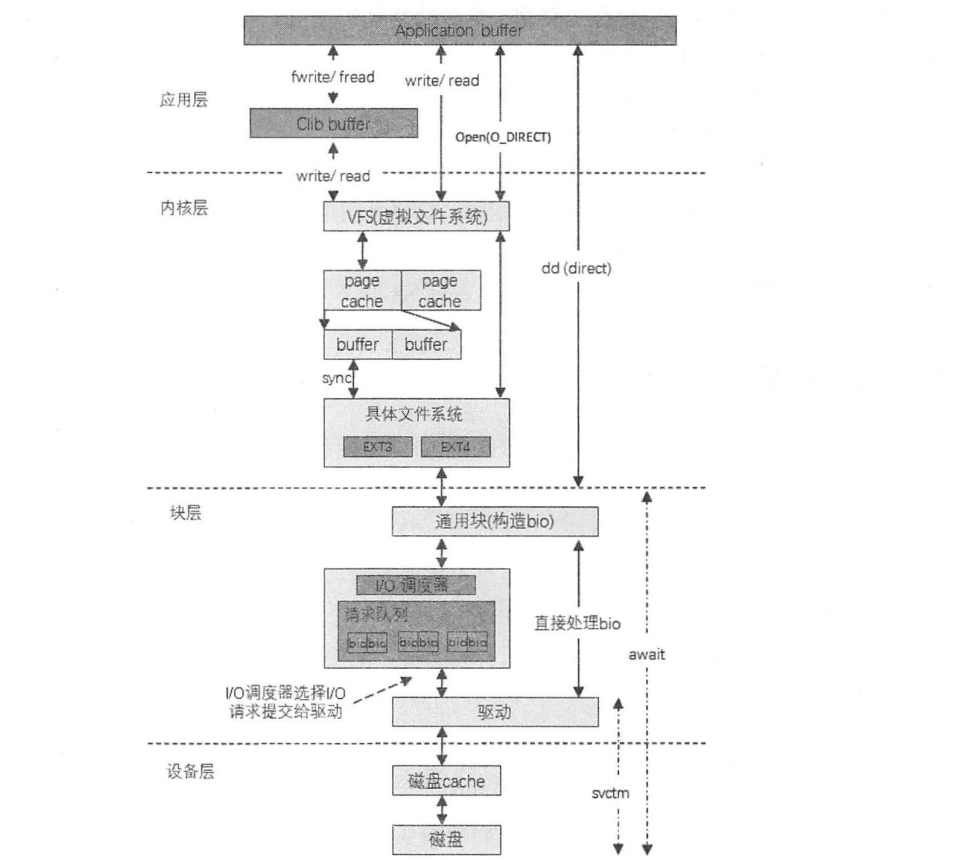

#### 零拷贝

`Kafka` 使用零拷贝技术来进一步提升性能。所谓的零拷贝是指将数据直接从磁盘文件复制到网卡设备中，而不需要经由应用程序之手。零拷贝大大提高了应用程序的性能，减少了内核和用户模式之间的上下文切换。对 `Linux` 操作系统而言，零拷贝技术依赖于底层的 `sendfile（）` 方法实现。对应于 `Java` 语言，`FileChannal.transferTo（）` 方法的底层实现就是 `sendfile（）` 方法。考虑这样一种常用的情形：你需要将静态内容展示给用户。这个情形就意味着需要先将静态内容从磁盘中复制出来放到一个内存 `buf` 中，然后将这个 `buf` 通过套接字传输给用户，进而用户获得静态内容。这看起来再正常不过了，但实际上这是很低效的流程，我们把上面的这种情形抽象成下面的过程：

首先调用 `read（）` 将静态内容读取到 `tmp_buf` ，然后调用 `write（）` 将 `tmp_buf` 写入 `Socket` 。在这个过程中，文件 `A` 经历了 `4` 次复制的过程：

1. 调用 `read（）` 时，文件 `A` 中的内容被复制到了内核模式下的 `Read Buffer` 中
2.  `CPU` 控制将内核模式数据复制到用户模式下
3. 调用 `write（）` 时，将用户模式下的内容复制到内核模式下的 `Socket Buffer` 中
4. 将内核模式下的 `Socket Buffer` 的数据复制到网卡设备中传送

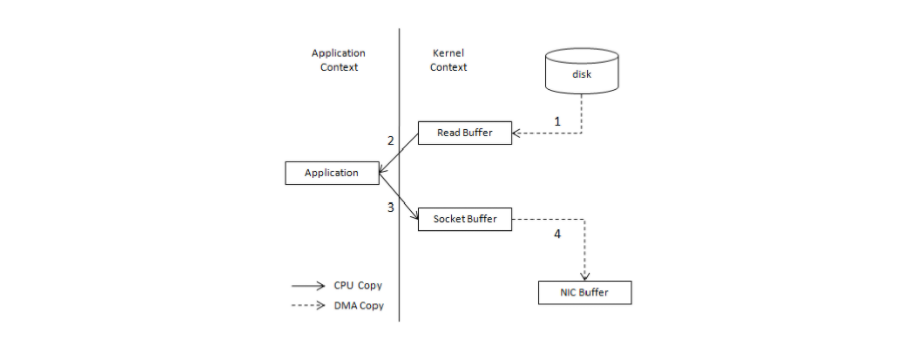

如果采用了零拷贝技术，那么应用程序可以直接请求内核把磁盘中的数据传输给 `Socket`：

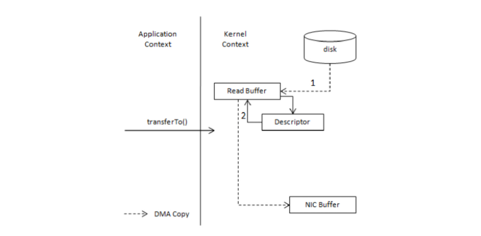

零拷贝技术通过 `DMA` 技术将文件内容复制到内核模式下的 `Read Buffer` 中。不过没有数据被复制到 `Socket Buffer` ，相反只有包含数据的位置和长度的信息的文件描述符被加到 `Socket Buffer` 中。 `DMA` 引擎直接将数据从内核模式中传递到网卡设备（协议引擎）。这里数据只经历了 `2` 次复制就从磁盘中传送出去了，并且上下文切换也变成了 `2` 次。零拷贝是针对内核模式而言的，数据在内核模式下实现了零拷贝。