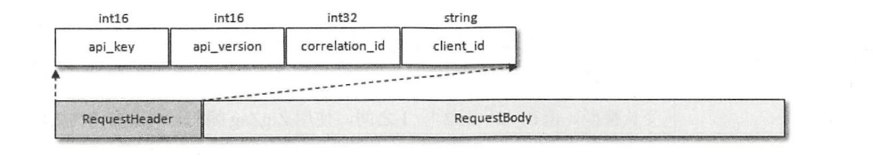
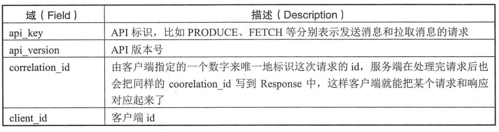
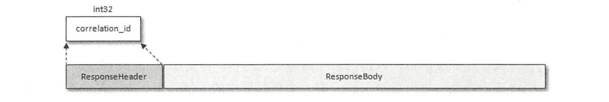
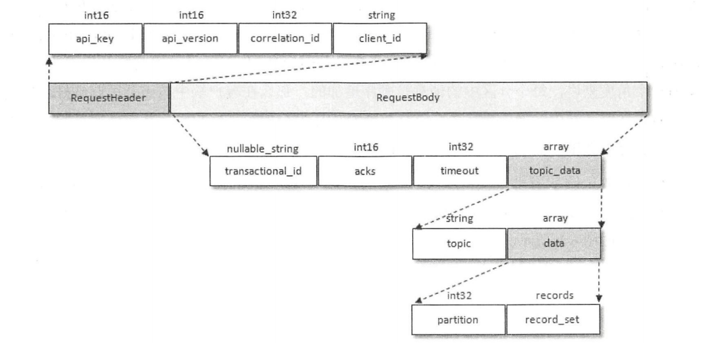
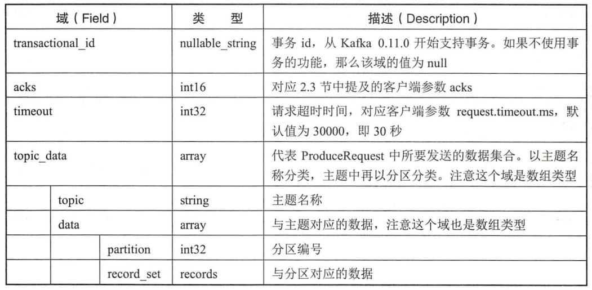
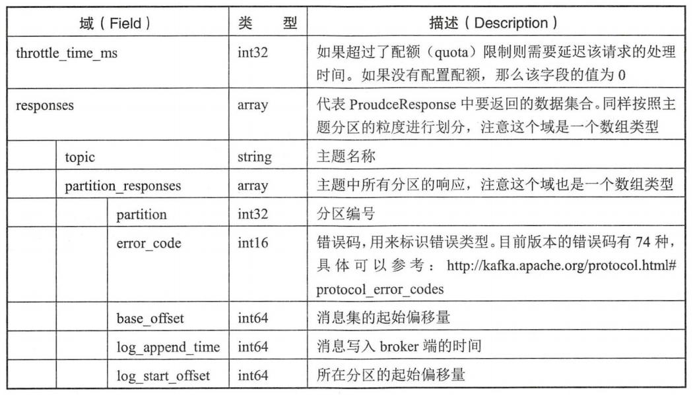
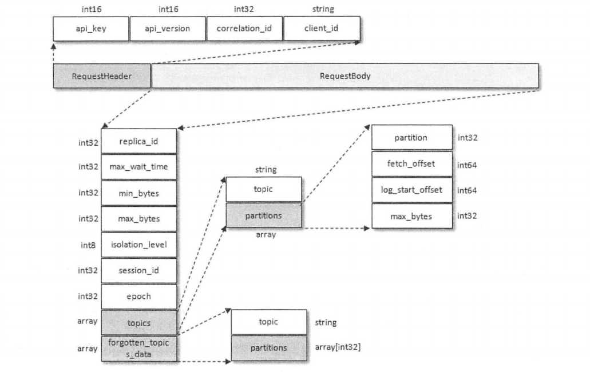
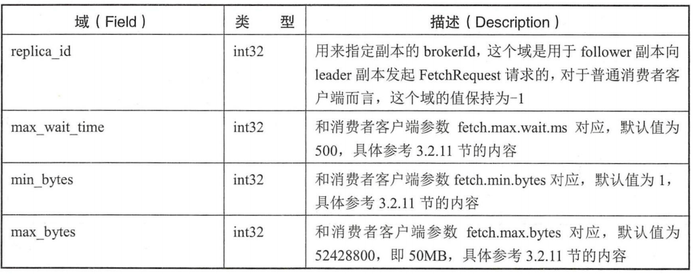
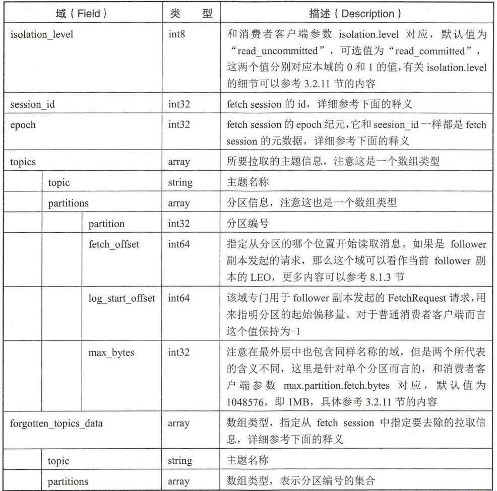
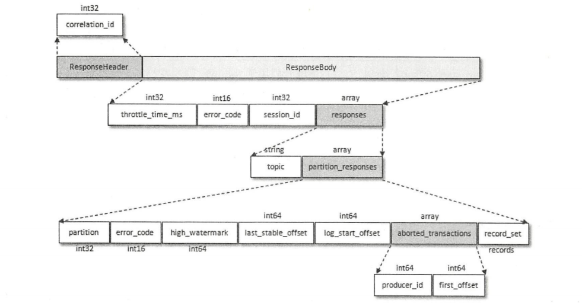

`Kafka` 经常被用作高性能、可扩展的消息中间件。 `Kafka` 自定义了一组基于 `TCP` 的二进制协议，只要遵守这组协议的格式，就可以向 `Kafka` 发送消息，也可以从 `Kafka` 中拉取消息，或者做一些其他的事情，比如提交消费位移等。在 `Kafka 2.0.0` 中，一共包含了 `43` 种协议类型，每种协议类型都有对应的请求和响应，它们都遵守特定的协议模式。每种类型的 `Request` 都包含相同结构的协议请求头和不同结构的协议请求体。

每种类型的 `Response` 也包含相同结构的协议响应头和不同结构的响应体。

以最常见的消息发送和消息拉取的两种协议类型做细致的讲解。消息发送的协议类型，即 `ProduceRequest/ProduceResponse` ，对应的 `api_key = 0` ，表示 `PRODUCE` 。`ProduceRequest` 的组织结构如图所示：

每个分区中的消息是顺序追加的，那么在客户端中按照分区归纳好之后就可以省去在服务端中转换的操作了，这样将负载的压力分摊给了客户端，从而使服务端可以专注于它的分内之事，如此也可以提升整体的性能。

如果参数 `acks` 设置非 `0` 值，那么生产者客户端在发送 `ProduceRequest` 请求之后就需要（异步）等待服务端的响应 `ProduceResponse` 。

消息追加是针对单个分区而言的，那么响应也是针对分区粒度来进行划分的，这样 `ProduceRequest` 和 `ProduceResponse` 做到了一一对应。

拉取消息的协议类型，即 `FetchRequest/FetchResponse` ，对应的 `api_key = 1` ，表示 `FETCH` ：

不管是 `follower` 副本还是普通的消费者客户端，如果要拉取某个分区中的消息，就需要指定详细的拉取信息，也就是需要设定 `partition` 、`fetch_offset` 、 `log_start_offset` 和 `max_bytes` 这 `4` 个域的具体值，那么对每个分区而言，就需要占用 `4B + 8B + 8B + 4B = 24B` 的空间。一般情况下，不管是 `follower` 副本还是普通的消费者，它们的订阅信息是长期固定的。也就是说，`FetchRequest` 中的 `topics` 域的内容是长期固定的，只有在拉取开始时或发生某些异常时会有所变动。`FetchRequest` 请求是一个非常频繁的请求，如果要拉取的分区数有很多，比如有 `1000` 个分区，那么在网络上频繁交互 `FetchRequest` 时就会有固定的 `1000 × 24B ≈ 24KB` 的字节的内容在传动，如果可以将这 `24KB` 的状态保存起来，那么就可以节省这部分所占用的带宽。`Kafka` 针对 `FetchRequest` 引入了 `session_id` 、`epoch` 和 `forgotten_topics_data` 等域，`session_id` 和 `epoch` 确定一条拉取链路的 `fetchsession` ，当 `session` 建立或变更时会发送全量式的  `FetchRequest` ，所谓的全量式就是指请求体中包含所有需要拉取的分区信息；当 `session` 稳定时则会发送增量式的 `FetchRequest` 请求，里面的 `topics` 域为空，因为 `topics` 域的内容已经被缓存在了 `session` 链路的两侧。如果需要从当前 `fetch session` 中取消对某些分区的拉取订阅，则可以使用 `forgotten_topics_data` 字段来实现。

这个改进在大规模的 `Kafka` 集群中非常有用，它可以提升集群间的网络带宽的有效使用率。不过对客户端而言效果不是那么明显，一般情况下单个客户端不会订阅太多的分区，不过总体上这也是一个很好的优化改进。与 `FetchRequest` 对应的 `FetchResponse` 的组织结构：

`FetchResponse` 结构中的域也很多，它主要分为 `4` 层，第 `1` 层包含 `throttle_time_ms` 、 `error_code` 、 `session_id` 和 `responses` 。`responses` 是一个数组类型，表示响应的具体内容，也就是 `FetchResponse` 结构中的第 `2` 层，具体地细化到每个分区的响应。第 `3` 层中包含分区的元数据信息及具体的消息内容（ `record_set` ），`aborted_transactions` 和事务相关。

