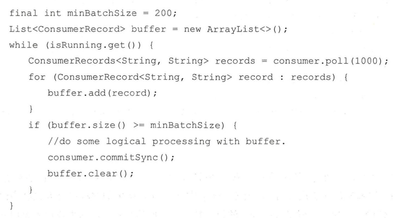
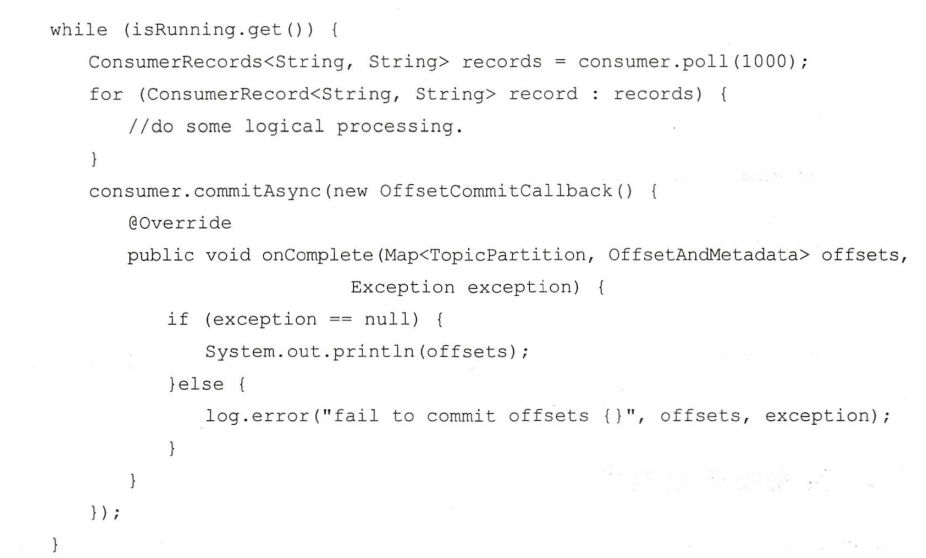
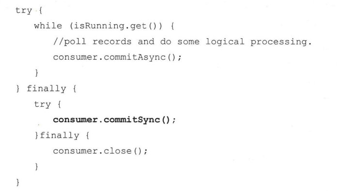
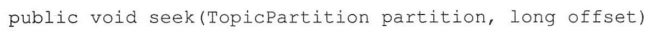
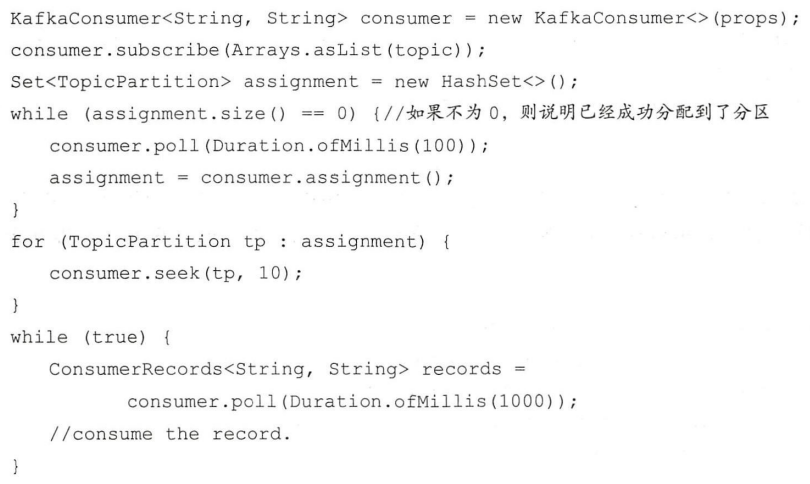
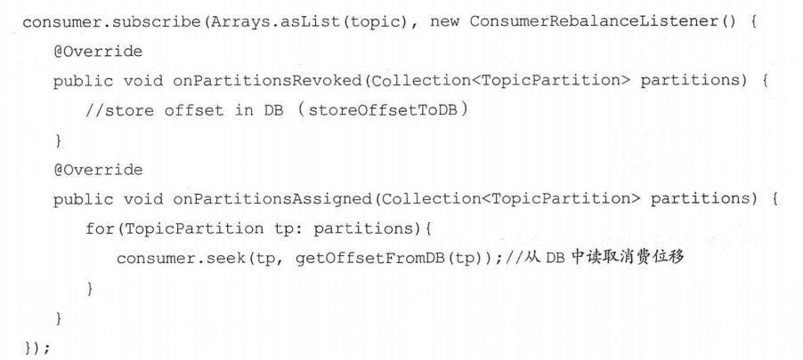
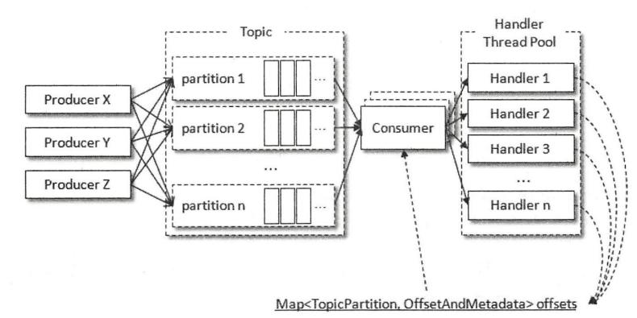
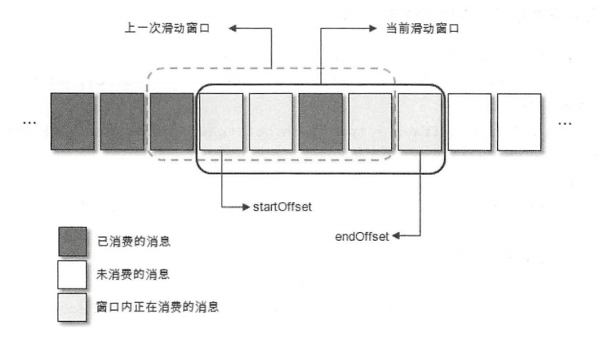

消费者（`Consumer`）负责订阅 `Kafka` 中的主题（`Topic`），并且从订阅的主题上拉取消息。在Kafka的消费理念中还有一层消费组的概念，每个消费者都有一个对应的消费组。当消息发布到主题后，只会被投递给订阅它的每个消费组中的一个消费者。消费者与消费组这种模型可以让整体的消费能力具备横向伸缩性，我们可以增加（或减少）消费者的个数来提高（或降低）整体的消费能力。对于分区数固定的情况，一味地增加消费者并不会让消费能力一直得到提升，如果消费者过多，出现了消费者的个数大于分区个数的情况，就会有消费者分配不到任何分区。

Kafka 同时支持两种消息投递模式：点对点（`P2P`，`Point-to-Point`）模式和发布/订阅（`Pub/Sub`）模式。

- 如果所有的消费者都隶属于同一个消费组，那么所有的消息都会被均衡地投递给每一个消费者，即每条消息只会被一个消费者处理，这就相当于点对点模式的应用。

- 如果所有的消费者都隶属于不同的消费组，那么所有的消息都会被广播给所有的消费者，即每条消息会被所有的消费者处理，这就相当于发布/订阅模式的应用。

一个正常的消费逻辑需要具备以下几个步骤：

1. 配置消费者客户端参数及创建相应的消费者实例。
2. 订阅主题。
3. 拉取消息并消费。
4. 提交消费位移。
5. 关闭消费者实例。

#### 位移提交

`Kafka` 中的消费是基于拉模式的，是一个不断轮询的过程，消费者所要做的就是重复地调用 `poll（）` 方法，而 `poll（）` 方法返回的是所订阅的主题（分区）上的一组消息。消费者消费到的每条消息的类型为 `ConsumerRecord` 。`poll()` 内部逻辑而言并不简单，它涉及消费位移、消费者协调器、组协调器、消费者的选举、分区分配的分发、再均衡的逻辑、心跳等内容

在每次调用 `poll（）` 方法时，它返回的是还没有被消费过的消息集，因此需要记录上一次消费时的消费位移，并做持久化保存。在消费者客户端中，消费位移存储在 `Kafka` 内部的主题 `__consumer_offsets` 中。这里把将消费位移存储起来（持久化）的动作称为“提交”，消费者在消费完消息之后需要执行消费位移的提交。

用 `x` 表示某一次拉取操作中此分区消息的最大偏移量，假设当前消费者已经消费了 `x`  位置的消息，那么我们就可以说消费者的消费位移为 `x` 。不过需要非常明确的是，当前消费者需要提交的消费位移并不是 `x` ，而是 `x + 1` ，它表示下一条需要拉取的消息的位置。

在默认的方式下，消费者每隔 `5` 秒会将拉取到的每个分区中最大的消息位移进行提交。自动位移提交的动作是在 `poll（）` 方法的逻辑里完成的，在每次真正向服务端发起拉取请求之前会检查是否可以进行位移提交，如果可以，那么就会提交上一次轮询的位移。自动提交消费位移免去了复杂的位移提交逻辑，让编码更简洁，但随之而来的是重复消费和消息丢失的问题。

在 `Kafka` 中还提供了手动位移提交的方式，这样可以使得开发人员对消费位移的管理控制更加灵活。手动提交可以细分为同步提交和异步提交，对应于 `KafkaConsumer`  中的 `commitSync（）` 和 `commitAsync（）` 两种类型的方法。

同步提交示例：

示例中将拉取到的消息存入缓存 `buffer` ，等到积累到足够多的时候，再做相应的批量处理，之后再做批量提交。如果在业务逻辑处理完之后，并且在同步位移提交前，程序出现了崩溃，那么待恢复之后又只能从上一次位移提交的地方拉取消息，由此在两次位移提交的窗口中出现了重复消费的现象。

异步提交示例：

异步提交的时候同样会有失败的情况发生，如果某一次异步提交的消费位移为 `x`，但是提交失败了，然后下一次又异步提交了消费位移为 `x + y` ，这次成功了。如果这里引入了重试机制，前一次的异步提交的消费位移在重试的时候提交成功了，那么此时的消费位移又变为了 `x  。如果此时发生异常（或者再均衡），那么恢复之后的消费者（或者新的消费者）就会从 `x` 处开始消费消息，这样就发生了重复消费的问题。为此我们可以设置一个递增的序号来维护异步提交的顺序，每次位移提交之后就增加序号相对应的值。在遇到位移提交失败需要重试的时候，可以检查所提交的位移和序号的值的大小，如果前者小于后者，则说明有更大的位移已经提交了，不需要再进行本次重试；如果两者相同，则说明可以进行重试提交。除非程序编码错误，否则不会出现前者大于后者的情况。

在一般情况下，位移提交失败的情况很少发生，不重试也没有关系，后面的提交也会有成功的。重试会增加代码逻辑的复杂度，不重试会增加重复消费的概率。如果消费者异常退出，那么这个重复消费的问题就很难避免，因为这种情况下无法及时提交消费位移；如果消费者正常退出或发生再均衡的情况，那么可以在退出或再均衡执行之前使用同步提交的方式做最后的把关。

#### 指定位移消费

正是有了消费位移的持久化，才使消费者在关闭、崩溃或者在遇到再均衡的时候，可以让接替的消费者能够根据存储的消费位移继续进行消费。

当一个新的消费组建立的时候，它根本没有可以查找的消费位移，此时就会根据消费者客户端参数 `auto.offset.reset` 的配置来决定从何处开始进行消费，这个参数的默认值为 `latest` ，表示从分区末尾开始消费消息。如果将 `auto.offset.reset` 参数配置为 `earliest` ，那么消费者会从起始处，也就是 `0` 开始消费。

消息的拉取是根据 `poll（）` 方法中的逻辑来处理的， `poll（）` 方法中的逻辑对于普通的开发人员而言是一个黑盒，无法精确地掌控其消费的起始位置。有些时候，我们需要一种更细粒度的掌控，可以让我们从特定的位移处开始拉取消息，而 `KafkaConsumer` 中的 `seek（）` 方法正好提供了这个功能，让我们得以追前消费或回溯消费。`seek（）` 方法的具体定义如下：

`seek（）` 方法只能重置消费者分配到的分区的消费位置，而分区的分配是在 `poll（）` 方法的调用过程中实现的。也就是说，在执行 `seek（）` 方法之前需要先执行一次 `poll（）` 方法，等到分配到分区之后才可以重置消费位置。

如果消费组内的消费者在启动的时候能够找到消费位移，除非发生位移越界，否则 `auto.offset.reset` 参数并不会奏效，此时如果想指定从开头或末尾开始消费，就需要 `seek（）` 方法的帮助了。 `seek（）` 方法为我们提供了从特定位置读取消息的能力，我们可以通过这个方法来向前跳过若干消息，也可以通过这个方法来向后回溯若干消息，这样为消息的消费提供了很大的灵活性。`seek（）` 方法也为我们提供了将消费位移保存在外部存储介质中的能力，还可以配合再均衡监听器来提供更加精准的消费能力。

#### 再均衡

再均衡是指分区的所属权从一个消费者转移到另一消费者的行为，它为消费组具备高可用性和伸缩性提供保障，使我们可以既方便又安全地删除消费组内的消费者或往消费组内添加消费者。不过在再均衡发生期间，消费组会变得不可用，消费者当前的状态也会丢失。比如消费者消费完某个分区中的一部分消息时还没有来得及提交消费位移就发生了再均衡操作，之后这个分区又被分配给了消费组内的另一个消费者，原来被消费完的那部分消息又被重新消费一遍，也就是发生了重复消费。一般情况下，应尽量避免不必要的再均衡的发生。

在 `subscribe（Collection＜String＞ topics，ConsumerRebalanceListener listener）` 和 `subscribe（Pattern pattern，ConsumerRebalanceListener listener）`方法中都有它的身影。再均衡监听器用来设定发生再均衡动作前后的一些准备或收尾的动作。

`ConsumerRebalanceListener` 是一个接口，包含 `2` 个方法：

1.  `void onPartitionsRevoked(Collection＜TopicPartition＞partitions)` 这个方法会在再均衡开始之前和消费者停止读取消息之后被调用。可以通过这个回调方法来处理消费位移的提交，以此来避免一些不必要的重复消费现象的发生。
2.  `void onPartitionsAssigned(Collection＜TopicPartition＞partitions)` 这个方法会在重新分配分区之后和消费者开始读取消费之前被调用。

#### 多线程实现

`KafkaProducer` 是线程安全的，然而 `KafkaConsumer` 却是非线程安全的。`KafkaConsumer` 中定义了一个 `acquire（）` 方法，用来检测当前是否只有一个线程在操作，若有其他线程正在操作则会抛出 `ConcurrentModifcationException` 异常。`KafkaConsumer` 中的每个公用方法在执行所要执行的动作之前都会调用这个`acquire（）` 方法，只有 `wakeup（）` 方法是个例外。 `acquire（）` 方法和我们通常所说的锁不同，它不会造成阻塞等待，我们可以将其看作一个轻量级锁，它仅通过线程操作计数标记的方式来检测线程是否发生了并发操作，以此保证只有一个线程在操作。`acquire（）` 方法和 `release（）` 方法成对出现，表示相应的加锁和解锁操作。 `acquire（）` 方法和 `release（）` 方法都是私有方法，因此在实际应用中不需要我们显式地调用。

`KafkaConsumer` 非线程安全并不意味着只能以单线程的方式执行。如果生产者发送消息的速度大于消费者处理消息的速度，那么就会有越来越多的消息得不到及时的消费。由于 `Kafka` 中消息保留机制的作用，有些消息有可能在被消费之前就被清理了，从而造成消息的丢失。我们可以通过多线程的方式来实现消息消费，提高整体的消费能力。

多线程的实现方式有多种：

1. 线程封闭，为每个线程实例化一个 `KafkaConsumer` 对象，我们可以称之为消费线程。一个消费线程可以消费一个或多个分区中的消息，所有的消费线程都隶属于同一个消费组。这种实现方式的并发度受限于分区的实际个数。
2. 多个消费线程同时消费同一个分区，通过 `assign（）`、 `seek（）` 等方法实现，可以打破原有的消费线程的个数不能超过分区数的限制，进一步提高了消费的能力。不过这种实现方式对于位移提交和顺序控制的处理就会变得非常复杂，实际应用中使用得极少。
3. 将处理消息模块改成多线程的实现方式。第一种方式中，每个消费线程都要维护一个独立的 `TCP` 连接，如果分区数和 `consumerThreadNum` 的值都很大，那么会造成不小的系统开销。一般而言，`poll（）` 拉取消息的速度是相当快的，而整体消费的瓶颈也正是在处理消息这一块，如果我们通过一定的方式来改进这一部分，那么我们就能带动整体消费性能的提升。

第三种方式示意图：

每一个处理消息的 `RecordHandler` 类在处理完消息之后都将对应的消费位移保存到共享变量 `offsets` 中， `KafkaConsumerThread` 在每一次 `poll（）` 方法之后都读取 `offsets` 中的内容并对其进行位移提交。但是这种位移提交的方式会有数据丢失的风险。对于同一个分区中的消息，假设一个处理线程 `RecordHandler1` 正在处理 `offset` 为 `0～99` 的消息，而另一个处理线程 `RecordHandler2` 已经处理完了 `offset` 为 `100～199` 的消息并进行了位移提交，此时如果 `RecordHandler1` 发生异常，则之后的消费只能从 `200` 开始而无法再次消费 `0～99` 的消息，从而造成了消息丢失的现象。

对此就要引入更加复杂的处理机制，总体结构上是基于滑动窗口实现的，所呈现的结构是通过消费者拉取分批次的消息，然后提交给多线程进行处理，而这里的滑动窗口式的实现方式是将拉取到的消息暂存起来，多个消费线程可以拉取暂存的消息，这个用于暂存消息的缓存大小即为滑动窗口的大小，总体上而言没有太多的变化，不同的是对于消费位移的把控。

每一个方格代表一个批次的消息，一个滑动窗口包含若干方格，`startOffset` 标注的是当前滑动窗口的起始位置， `endOffset` 标注的是末尾位置。每当 `startOffset` 指向的方格中的消息被消费完成，就可以提交这部分的位移，与此同时，窗口向前滑动一格，删除原来 `startOffset` 所指方格中对应的消息，并且拉取新的消息进入窗口。滑动窗口的大小固定，所对应的用来暂存消息的缓存大小也就固定了。如果一个方格内的消息无法被标记为消费完成，那么就会造成 `startOffset` 的悬停。为了使窗口能够继续向前滑动，那么就需要设定一个阈值，当 `startOffset` 悬停一定的时间后就对这部分消息进行本地重试消费，如果重试失败就转入重试队列，如果还不奏效就转入死信队列。

