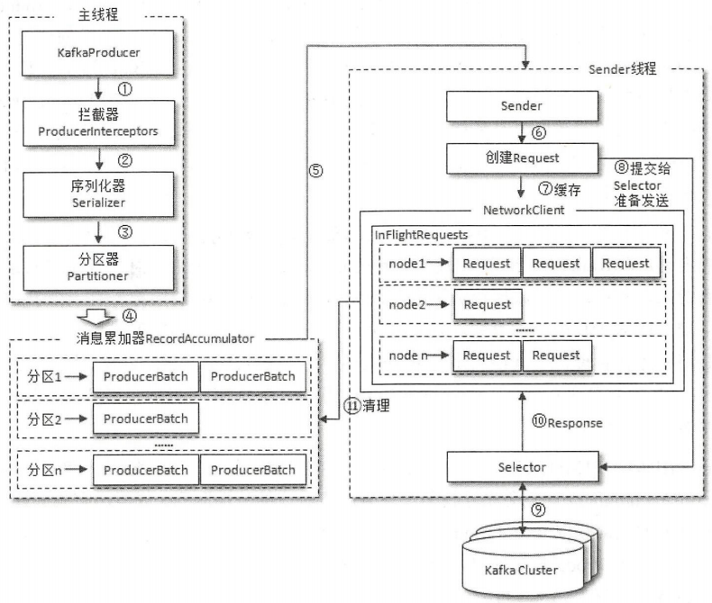

从编程的角度而言，生产者就是负责向 `Kafka` 发送消息的应用程序。

一个正常的生产逻辑需要具备以下几个步骤：

1. 配置生产者客户端参数及创建相应的生产者实例。
2. 构建待发送的消息。
3. 发送消息。
4. 关闭生产者实例。

生产者客户端的消息在真正发往 `kafka` 之前，有可能需要经过拦截器（`Interceptor`）、序列化器（`Serializer`）、 分区器（`Partitioner`）等一系列的作用。

整个生产者客户端有两个线程协调运行，这两个线程分别为主线程和 `Sender` 线程（发送线程）。在主线程中由 `KafkaProducer` 创建消息，然后通过可能的拦截器、序列化器和分区器的作用后缓存到消息累加器（RecordAccumulator）中。`Sender` 线程负责从 `RecordAccumulator` 中获取消息并将其发送到 `kafka` 中。

`RecordAccumulator` 主要用来缓存消息以便 `Sender` 线程可以批量发送，进而减少网络传输的资源消耗以提升性能。 `RecordAccumulator` 缓存的大小默认为 `32MB` 。 如果生产者发送消息的速度超过发送到服务器的速度，则会导致生产者空间不足，这个时候 `kafkaProducer.send()` 方法调用要么被阻塞要么抛出异常。 

在 `RecordAccumulator` 的内部为每一个分区维护了一个双端队列，队列的内容就是 `ProducerBatch`。消息写入时都会被追加到队尾，`Sender` 读取消息时，从双端队列头部读取。`ProducerBatch` 是一个消息批次， `ProducerRecord` 会被包含在 `ProducerBatch` 中，这样可以使字节的使用更加紧凑，并且减少网络传输开销。

`Sender` 从 `RecordAccumulator` 中获取缓存的消息后，将原本的 `<Partition, Deque<ProducerBatch>>` 的保存形式转变成了 `<Node, List<ProducerBatch>>` 的形式，其中 `Node` 表示 `kafka` 集群的 `broker` 节点。对于网络连接来说，生产者客户端是与具体的 `broker` 节点建立的连接，向具体的 `broker` 节点发送消息，而并不关心消息属于哪个分区。之后 `Sender` 还会进一步封装成 `<Node, Request>` 的形式，这样就可以将 `Request` 请求发往各个 `Node `了，`Request` 是指 `kafka` 的各种协议请求，对于消息发送而言就是 `ProducerRequest`。

请求从 `Sender` 线程发往 `kafka` 之前还会保存到 `InFlightRequests` 中，具体保存形式为 `Map<NodeId, Deque<Request>>`，用于缓存已经发出去但还没有收到响应的请求。当 `Node` 中堆积了很多未响应的消息时，说明这个 `Node` 节点负载较大或者网络连接有问题。`InFlightRequests` 还可以获取 `LeastLoadedNode`，即所有 `Node` 中负载最小的那个。

