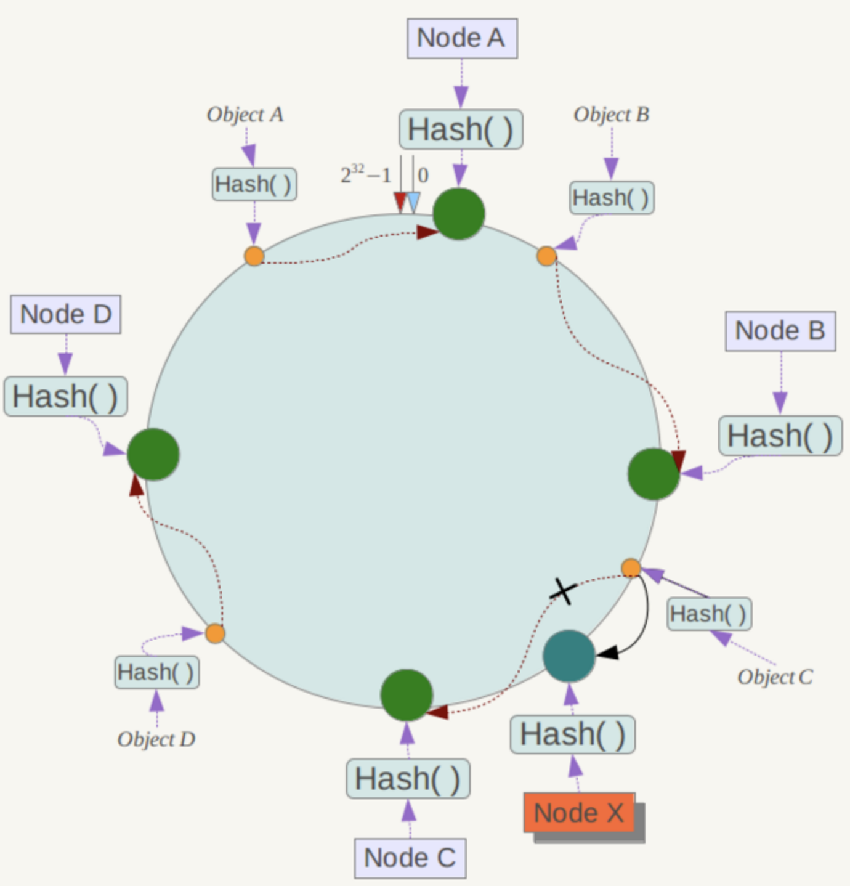

### 为什么要用 redis?

这个问题也可以描述为为什么要用缓存。主要从**高性能**和**高并发**这两点来看待这个问题。

**高性能：**

用户首次访问数据库中的某些数据时会比较慢，因为是从硬盘上读取的。将该用户访问的数据存在数缓存中，这样下一次再访问这些数据的时候就可以直接从缓存中获取了。操作缓存就是直接操作内存，所以速度相当快。如果数据库中的对应数据改变的之后，同步改变缓存中相应的数据即可！

**高并发：**

直接操作缓存能够承受的请求是远远大于直接访问数据库的，所以我们可以考虑把数据库中的部分数据转移到缓存中去，这样用户的一部分请求会直接到缓存这里而不用经过数据库。

### 缓存雪崩

简介：由于缓存机器意外宕机等原因导致缓存同一时间大面积的失效，后面的请求都会落到数据库上，造成数据库短时间内承受大量请求而崩掉。

解决办法：

- 事前：尽量保证整个 redis 集群的高可用性，发现机器宕机尽快补上。选择合适的内存淘汰策略。
- 事中：本地ehcache缓存 + hystrix限流&降级，避免MySQL崩掉
- 事后：利用 redis 持久化机制保存的数据尽快恢复缓存

### 缓存穿透

简介：一般是黑客故意去请求缓存中不存在的数据，导致所有的请求都落到数据库上，造成数据库短时间内承受大量请求而崩掉。

解决办法： 有很多种方法可以有效地解决缓存穿透问题，最常见的则是采用布隆过滤器，将所有可能存在的数据哈希到一个足够大的bitmap中，一个一定不存在的数据会被 这个bitmap拦截掉，从而避免了对底层存储系统的查询压力。另外也有一个更为简单粗暴的方法，如果一个查询返回的数据为空，我们仍然把这个空结果进行缓存，但它的过期时间会很短，最长不超过五分钟。

### 缓存击穿

简介：某个 key 非常热点，访问非常频繁，处于集中式高并发访问的情况，当这个 key 在失效的瞬间，大量的请求就击穿了缓存，直接请求数据库，就像是在一道屏障上凿开了一个洞。

解决办法：

1. 可以将热点数据设置为永远不过期
2. 基于 redis or zookeeper 实现互斥锁，等待第一个请求构建完缓存之后，再释放锁，进而其它请求才能通过该 key 访问数据。

### 如何保证缓存与数据库双写时的数据一致性?

在高并发的业务场景下，数据库大多数情况都是用户并发访问最薄弱的环节。所以，就需要使用redis做一个缓冲操作，让请求先访问到redis，而不是直接访问MySQL等数据库。

读取缓存一般没有什么问题，但是一旦涉及到数据更新，就容易出现缓存和数据库间的数据一致性问题。

不管是先写MySQL数据库，再删除Redis缓存；还是先删除缓存，再写库，都有可能出现数据不一致的情况。举一个例子：

1. 如果删除了缓存Redis，还没有来得及写库MySQL，另一个线程就来读取，发现缓存为空，则去数据库中读取数据写入缓存，此时缓存中为脏数据。
2. 如果先写了库，在删除缓存前，写库的线程宕机了，没有删除掉缓存，则也会出现数据不一致情况。

因为写和读是并发的，没法保证顺序，就会出现缓存和数据库的数据不一致的问题。

**第一种方案：采用延时双删策略**

在写库前后都进行redis.del(key)操作，并且设定合理的超时时间。

``` java
public void write(String key,Object data) {
  redis.delKey(key);
  db.updateData(data);
  Thread.sleep(500);
  redis.delKey(key); 
}
```

**具体步骤：**

1. 先删除缓存

2. 再写数据库

3. 休眠500毫秒

4. 再次删除缓存

具体休眠多久，需要评估自己的项目的读数据业务逻辑的耗时。这么做的目的，就是确保读请求结束，写请求可以删除读请求造成的缓存脏数据。

当然这种策略还要考虑redis和数据库主从同步的耗时。最后的的写数据的休眠时间：则在读数据业务逻辑的耗时基础上，加几百ms即可。

**设置缓存过期时间**

从理论上来说，给缓存设置过期时间，是保证最终一致性的解决方案。所有的写操作以数据库为准，只要到达缓存过期时间，则后面的读请求自然会从数据库中读取新值然后回填缓存。

**该方案的弊端**

结合双删策略 + 缓存超时设置，这样最差的情况就是在超时时间内数据存在不一致，而且又增加了写请求的耗时。

**第二种方案：异步更新缓存**

**整体思路：**

MySQL binlog增量订阅消费 + 消息队列 + 增量数据更新到redis

1. 读Redis：热数据基本都在Redis

2. 写MySQL：增删改都是操作MySQL

3. 更新Redis数据：MySQL的数据操作binlog，来更新到Redis

**Redis更新**

数据操作主要分为两大块：

全量（将全部数据一次写入到redis）和增量（update、insert、delate变更数据）

读取binlog后分析，利用消息队列推送更新各台的redis缓存数据。

这样一旦MySQL中产生了新的写入、更新、删除等操作，就可以把binlog相关的消息推送至Redis，Redis再根据binlog中的记录，对Redis进行更新。

其实这种机制，很类似MySQL的主从备份机制，因为MySQL的主备也是通过binlog来实现的数据一致性。

这里可以结合使用canal，通过该框架可以对MySQL的binlog进行订阅，而canal正是模仿了mysql的slave数据库的备份请求，使得Redis的数据更新达到了相同的效果。

### 如何解决 Redis 的并发竞争 Key 问题

所谓 Redis 的并发竞争 Key 的问题也就是多个系统同时对一个 key 进行操作，但是最后执行的顺序和我们期望的顺序不同，这样也就导致了结果的不同！

推荐一种方案：分布式锁（zookeeper 和 redis 都可以实现）。如果不存在 Redis 的并发竞争 Key 问题，不要使用分布式锁，这样会影响性能。

基于zookeeper临时有序节点可以实现的分布式锁。大致思想为：每个客户端对某个方法加锁时，在zookeeper上的与该方法对应的指定节点的目录下，生成一个唯一的瞬时有序节点。 判断是否获取锁的方式很简单，只需要判断有序节点中序号最小的一个。 当释放锁的时候，只需将这个瞬时节点删除即可。同时，其可以避免服务宕机导致的锁无法释放，而产生的死锁问题。完成业务流程后，删除对应的子节点释放锁。

### Redis分布式寻址算法

常见的分布式寻址算法可分为三大类：

- hash 算法
- 一致性 hash 算法+ 虚拟节点
- redis cluster 的 hash slot 算法

#### hash 算法

简介：对key计算hash值，然后对节点数取模。然后找到对应的master节点上。

存在的问题：一旦某一个master节点宕机，所有请求过来，都会基于最新的剩余 master 节点数去取模，尝试去取数据。这会导致大部分的请求无法得到有效的缓存数据，从而导致大量的流量涌入数据库。

#### 一致性 hash 算法

简介：将整个 hash 值空间组织成一个虚拟的圆环，整个空间按顺时针方向组织，将各个 master 节点进行 hash，这样就能确定每个节点在其哈希环上的位置。对key计算hash值，并确定此数据在环上的位置，从此位置沿环顺时针行走，遇到的第一个 master 节点就是 key 所在位置。

在一致性哈希算法中，如果一个节点挂了，受影响的数据仅仅是此节点到环空间前一个节点之间的数据，其它不受影响。增加一个节点也同理。

一致性哈希算法在节点太少时，容易因为节点分布不均匀而造成**缓存热点**的问题。为了解决这种热点问题，一致性 hash 算法引入了虚拟节点机制，即对每一个节点计算多个 hash，每个计算结果位置都放置一个虚拟节点。这样就实现了数据的均匀分布，负载均衡。




#### redis cluster 的 hash slot 算法

redis cluster 有固定的 `16384` 个 hash slot，对每个 `key` 计算 `CRC16` 值，然后对 `16384` 取模，可以获取 key 对应的 hash slot。

redis cluster 中每个 master 都会持有部分 slot，`hash slot` 让 node 的增加和移除很简单，增加一个 master，就将其他 master 的 `hash slot` 移动部分过去，减少一个 master，就将它的 `hash slot` 移动到其他 master 上去。移动 `hash slot` 的成本是非常低的。任何一台机器宕机，其他节点不受影响，因为 key 找的是 hash slot，不是机器。

### 参考资料

[互联网 Java 工程师进阶知识完全扫盲](https://github.com/doocs/advanced-java)

