redis中有六种比较重要的数据结构：SDS、链表、字典、跳跃表、整数集合、压缩列表。redis的对象主要都是靠这六种数据结构实现的。

## 数据结构

### 简单动态字符串（SDS）

Redis没有使用C语言中的传统字符串，而是自己构建了一种SDS的数据结构来表示字符串。在redis中包含字符串的键值对底层都是用SDS实现的。除此之外，AOF缓冲区，客户端状态中的输入缓冲区都是由SDS实现的。

#### SDS结构

```c
struct sdshdr {
  // 已使用的字节数
  int len;
  // 剩余字节数
  int free;
  // 字节数组，用来保存字符串
  char buf[];
}
```


带有未使用空间的sds示例：

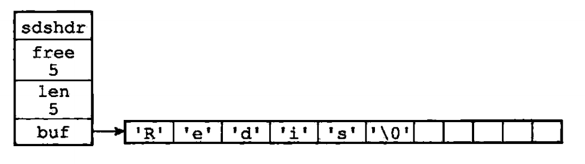

#### SDS与C字符串的对比

- C字符串不会记录自身的长度，所以如果想要获取C字符串的长度信息就意味着要把整个字符串遍历一遍，这样获取长度的时间复杂度就为O(n)。而在SDS中，用了len字段来记录字符串的长度，这样获取长度的之间复杂度就降低到了O(1)。

- C字符串不会记录自身的长度，所以在执行strcat等函数时可能会造成缓冲区溢出的问题。而在SDS中，如果想要进行这类操作，会先检测是否会出现缓冲区溢出的情况，然后再执行操作。

- C字符串不会记录自身的长度，所以在字符串需要增长或缩短时，需要重新分配内存，这期间可能会产生缓冲区溢出或者内存泄漏等问题。而在SDS中，采用了空间预分配和惰性空间释放两种优化策略来提升性能。
  - 空间预分配
    - 在SDS空间需要扩展的时候，不仅会为SDS分配所需要的空间，还会分配额外未使用空间，这样可以减少连续执行字符串增长操作所需要的内存分配次数。
  - 惰性空间释放
    - 在SDS空间需要缩短的时候，并不会立即重新分配内存来释放多余空间，而是使用free字段将这些字节的数量记录下来，以便将来使用。当然SDS也提供了释放空间的API，在有需要的时候执行来释放空间。
- SDS二进制安全。C字符串的字符必须符合某种编码，并且除了末尾以外，不能包含空字符，所以如果保存二进制数据的话，会误以为空字符是字符串结尾。而SDS是通过len属性来判断是否结束，从而可以保存任意格式的二进制数据。
- SDS会像C字符串一样，以'\0'结尾，这一操作对用户是透明的，从而兼容了部分C字符串操作。


### 链表

由于C语言中没有提供链表这样的数据结构，所以Redis自己实现了双向链表。

链表在Redis中的应用非常广泛，比如列表键的底层实现之一就是链表。当一个列表键中包含了比较多的元素，又或者列表中包含的都是比较长的字符串时，Redis就会使用链表作为列表键的底层实现。

由list结构和listNode结构组成的链表：

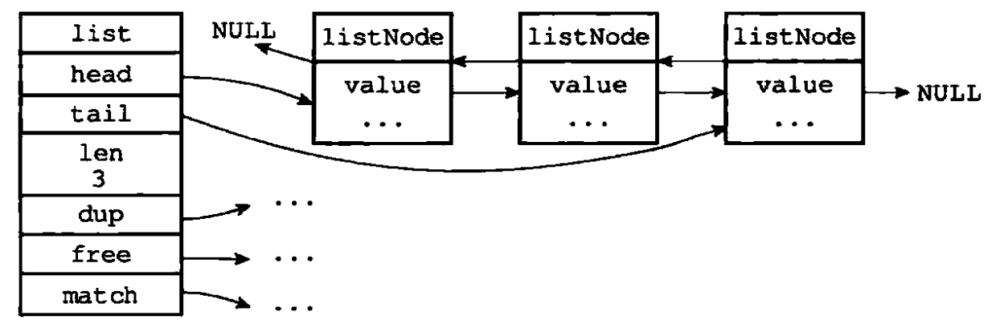

#### Redis链表特性

- 双端：链表节点带有prev和next两个指针。

- 无环：链表头结点的prev指针和链表尾节点的next指针都指向NULL。
- 带表头和表尾指针。
- 带链表长度计数器。
- 多态。

### 字典

字典在Redis中的应用相当广泛，redis数据库就是使用字典来作为底层实现，字典使用hash表作为底层实现。

#### 哈希表结构

``` c
typedef struct dictht {
  // 哈希表数组
  dictEntry **table;
  // 哈希表大小，即数组大小
  unsigned long size;
  // size - 1
  unsigned long sizemask;
  // 已使用的键值对数
  unsigned long used;
}
```


一个大小为4的哈希表：

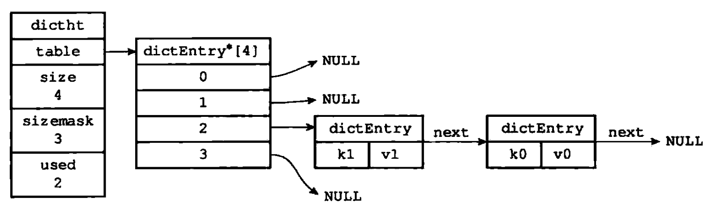

#### 字典结构

``` c
typedef struct dict {
  dictType *type;
  void *privdata;
  dictht ht[2];
  // rehash 索引，rehash不在进行时，为-1
  int rehashidx;
}
```

一般情况下，字典只使用ht[0]哈希表，ht[1]哈希表只会在对ht[0]进行rehash时使用。

Rehashidx记录了rehash目前的进度，如果没有进行rehash，则为-1。


没有进行rehash的字典：

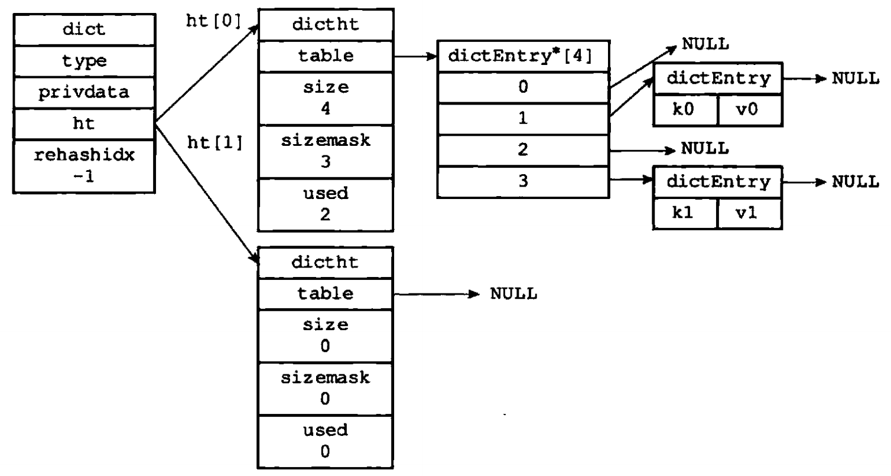

#### 链地址法解决hash冲突

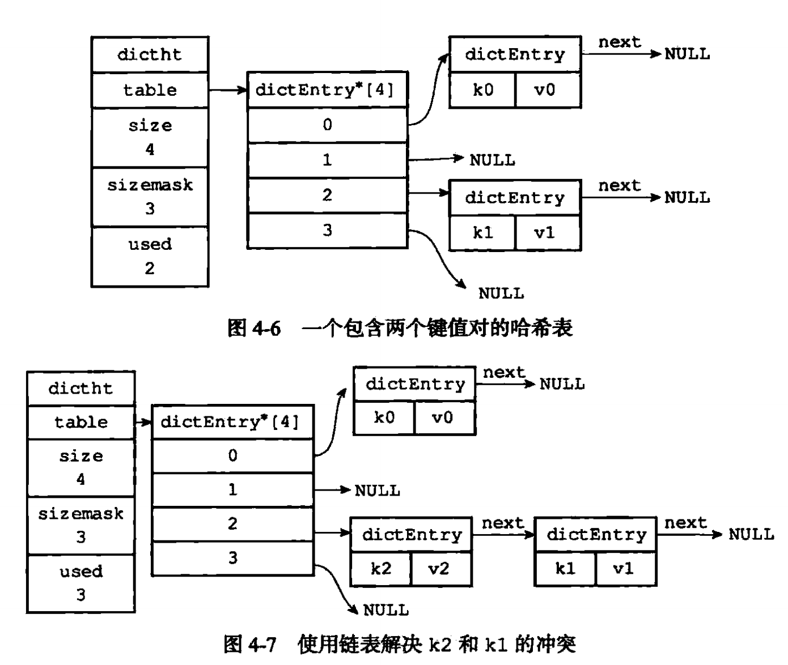


#### rehash

##### 发生扩容的条件

- 服务器没有执行`BGSAVE`或者`BGREWRITEAOF`命令，并且负载因子大于等于1

- 服务器正在执行`BGSAVE`或者`BGREWRITEAOF`命令，并且负载因子大于等于5

##### 发生收缩的条件

- 负载因子小于0.1


扩展和收缩哈希表可以通过执行rehash操作来完成。

rehash步骤：

1. 为ht[1]分配空间：
   - 扩展空间：ht[1]大小为第一个大于等于`ht[0].used * 2`的2的幂。
   - 收缩空间：ht[1]大小为第一个大于等于`ht[0].used`的2的幂。
2. 将ht[0]上的键值对rehash到ht[1]上：重新计算键的哈希值和索引值，然后放到ht[1]的指定位置上。
3. ht[0]的键值对全部迁移到ht[1]后，释放ht[0]，将ht[1]置为ht[0]，然后在ht[1]创建一个空哈希表。

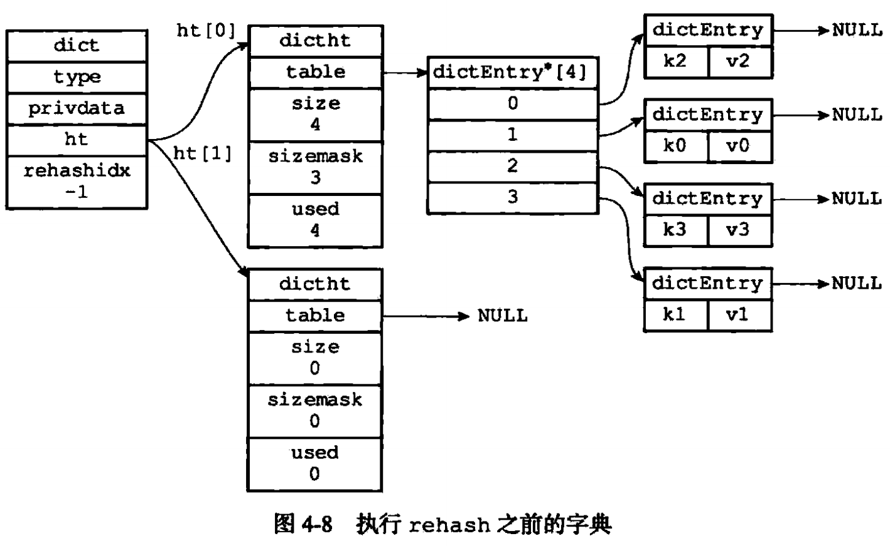

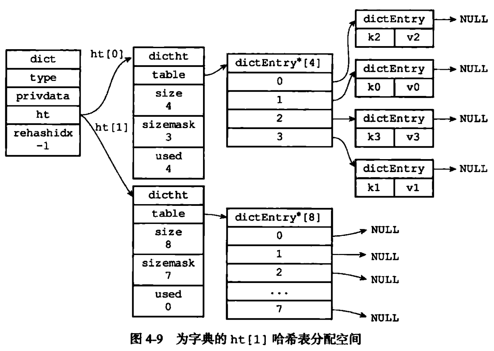

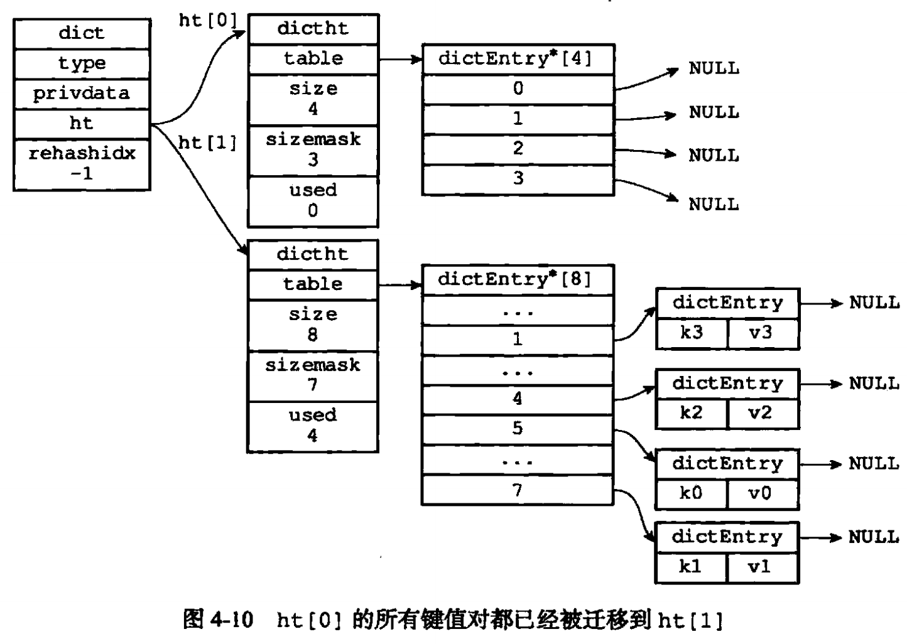

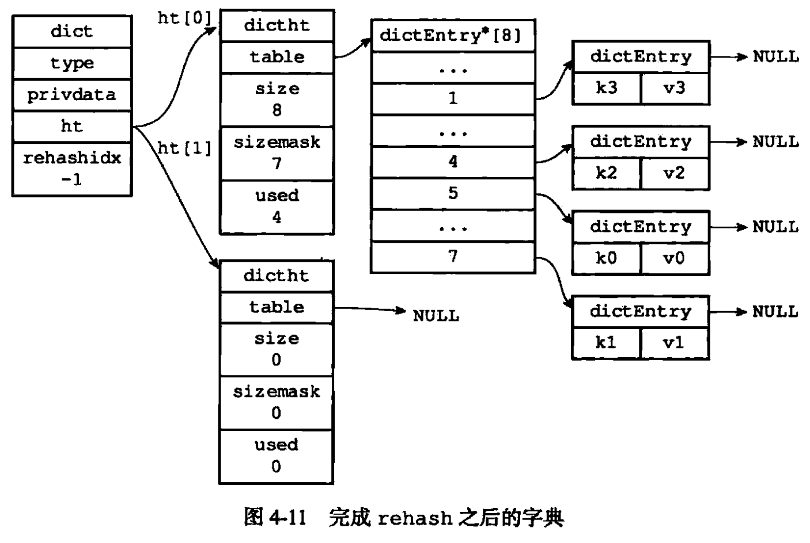

#### 渐进式rehash

为了避免`rehash`对服务器性能造成影响，服务器选择了分多次、渐进式地将ht[0]里面的键值对rehash到ht[1]。

##### 渐进式rehash步骤

1. 为ht[1]分配空间
2. 将rehashidx置为0
3. rehash期间，每次crud操作时，程序除了执行指定的操作外，还会顺带将ht[0]哈希表在rehashidx索引上的所有键值对rehash到ht[1]，完成后rehash增加1
4. 在rehash完成后，将rehashidx置为-1，表示rehash完成

##### 渐进式rehash期间的哈希表操作

渐进式rehash期间，对哈希表的crud操作会在两个哈希表上进行。

- 查询操作：先查询ht[0]，如果没查到再查ht[1]
- 插入操作：一律保存到ht[1]


### 跳跃表

跳跃表是一种有序数据结构，通过在每个节点维持多个指向其他节点的指针，从而达到快速访问节点的目的。

跳跃表支持平均`O(logN)`, 最坏`O(N)`复杂度的节点查找，还可以通过顺序性操作来批量处理节点。

在大部分情况下，跳跃表的效率可以和平衡树相媲美，因为跳跃表实现起来更简单，所以redis采用了它作为有序集合底层实现之一。当有序集合保存的元素数量比较多或者元素是比较长的字符串时，Redis就会使用跳跃表来作为有序集合的底层实现。

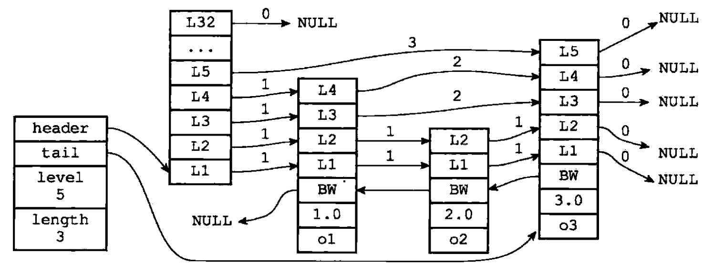

#### 跳跃表节点结构

``` c
typedef struct zskiplistNode {
  // 层
  struct zskiplistLevel {
    // 前进指针
    struct zskiplistNode *forward;
    // 跨度
    usigned int span;
  } level[];
  // 后退指针
  struct zskiplistNode *backword;
  // 分数
  double score;
  // 成员对象
  robj *obj;
} zskiplistNode;
```


#### 跳跃表结构

``` c
typedef struct zskiplist {
  struct zskiplistNode *header, *tail;
  // 表中节点的数量
  unsigned long length;
  // 表中层数最大的节点的层数
  int level;
} zskiplist;
```


- 层
  - 每次创建一个新的节点都会根据幂次定律随机生成一个介于1 和 32之间的值作为level数组的大小，这个值就是层的高度。
  - 每个层都有一个指向表尾方向的指针，用于从表头向表尾方向访问节点。
- 跨度
  - 用于记录两个节点之间的距离
  - 跨度不是用来做遍历操作的，遍历只需要使用前进指针就可以完成。
  - 跨度是用来计算排位的，在查找某个节点的过程中，将沿途访问过的所有层的跨度累加起来，就是目标节点的排位。
- 后退指针
  - 用于从表尾向表头方向访问节点，每次只能后退一个节点。
- 分值和成员
  - 分值是一个double类型的浮点数，用来排序（先按照分值排序，再按照成员排序）。
  - 成员是一个指针，用来指向字符串对象。

#### 查找(O(logN))

在跳跃表中查找一个元素x的步骤：

1. 从最上层的链的开头开始假设当前位置为p，它向右指向的节点为q，且q的值为y。
2. 将y与x作比较：
   1. 如果x=y，输出查询成功，输出相关信息；
   2. 如果x>y，从p向右移动到q的位置；
   3. 如果x<y，从p向下移动一格，如果当前位置在最底层的链S0中，且还要往下移动的话，则输出查询失败。

### 整数集合

当集合只包含整数，且元素不多时，会采用整数集合作为集合键的底层实现。整数集合是redis用来保存整数值的集合抽象数据结构，它可以保存类型为`int16_t`、`int32_t`、`int64_t`的整数，并且不会重复。

#### intset数据结构

``` c
typedef struct intset {
  uint32_t encoding;
  uint32_t length;
  // 保存元素的数组，不重复并且按递增排序
  int8_t contents[];
} intset;
```

`contents`中元素的类型取决于`encoding`，在有需要时，程序会根据新添加元素的类型，改变数组的类型。

### 压缩列表

当一个列表键或者哈希键只包含少量列表项，并且每个列表项要么是小整数值，要么是长度比较短的字符串时，Redis就会使用压缩列表作为列表键或者哈希键的底层实现。

压缩列表是Redis为了节约内存而开发的，由一系列特殊编码的连续内存块组成的顺序型数据结构。一个压缩列表可以包含多个节点，每个节点保存一个字节数组或整数。

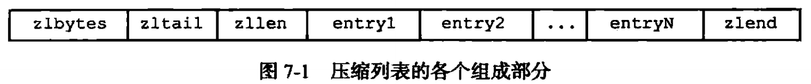

## 对象

Redis中并没有直接使用以上几种数据结构来实现键值对数据库，而是基于这几种数据结构创建了一个对象系统，其中包含了字符串对象、列表对象、哈希对象、集合对象和有序集合对象。针对不同的使用场景，Redis会为对象设置多种不同的数据结构实现，从而优化对象在不同场景下的使用效率。此外，Redis还实现了基于引用计数法的内存回收机制和对象共享机制。最后，Redis的对象带有访问时间记录，可用于计算数据库键的空转时长。

我们在Redis中新创建一个键值对时，至少会创建两个对象（键对象和值对象）。

#### redisObject数据结构

``` c
typedef struct redisObject {
  unsigned type:4;
  // 对象所使用的的编码，即使用的底层数据结构
  unsigned encoding:4;
  // 指向底层数据结构的指针
  void *ptr;
  // ...
} robj;
```

#### 每种对象的底层数据结构

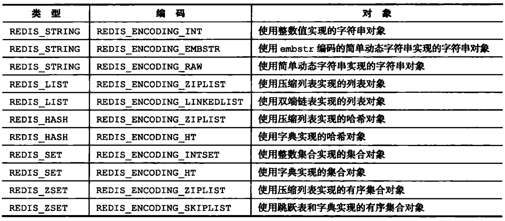
