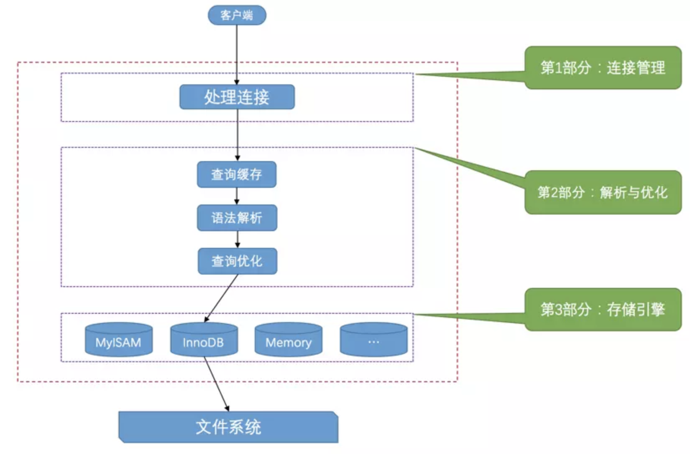

### MySQL的使用过程

1. 启动`MySQL`服务器程序。
2. 启动`MySQL`客户端程序并连接到服务器程序。
3. 在客户端程序中输入一些命令语句作为请求发送到服务器程序，服务器程序收到这些请求后，会根据请求的内容来操作具体的数据并向客户端返回操作结果。

我们的`MySQL`服务器程序和客户端程序本质上都算是计算机上的一个`进程`，这个代表着`MySQL`服务器程序的进程也被称为`MySQL数据库实例`，简称`数据库实例`。

每个进程都有一个唯一的编号，称为`进程ID`，英文名叫`PID`，这个编号是在我们启动程序的时候由操作系统随机分配的，操作系统会保证在某一时刻同一台机器上的进程号不重复。每个进程都有一个名称，这个名称是编写程序的人自己定义的，比如我们启动的`MySQL`服务器进程的默认名称为`mysqld`， 而我们常用的`MySQL`客户端进程的默认名称为`mysql`。

### 服务器处理客户端请求

其实不论客户端进程和服务器进程是采用哪种方式进行通信，最后实现的效果都是：客户端进程向服务器进程发送一段文本（MySQL语句），服务器进程处理后再向客户端进程发送一段文本（处理结果）。那服务器进程对客户端进程发送的请求做了什么处理，才能产生最后的处理结果呢？客户端可以向服务器发送增删改查各类请求，我们这里以比较复杂的查询请求为例来画个图展示一下大致的过程：

从图中我们可以看出，服务器程序处理来自客户端的查询请求大致需要经过三个部分，分别是`连接管理`、`解析与优化`、`存储引擎`。下边我们来详细看一下这三个部分都干了什么。

### 连接管理

客户端进程可以采用`TCP/IP`、`命名管道或共享内存`、`Unix域套接字`这几种方式之一来与服务器进程建立连接，每当有一个客户端进程连接到服务器进程时，服务器进程都会创建一个线程来专门处理与这个客户端的交互，当该客户端退出时会与服务器断开连接，服务器并不会立即把与该客户端交互的线程销毁掉，而是把它缓存起来，在另一个新的客户端再进行连接时，把这个缓存的线程分配给该新客户端。这样就起到了不频繁创建和销毁线程的效果，从而节省开销。从这一点大家也能看出，`MySQL`服务器会为每一个连接进来的客户端分配一个线程，但是线程分配的太多了会严重影响系统性能，所以我们也需要限制一下可以同时连接到服务器的客户端数量，至于怎么限制我们后边再说哈～

在客户端程序发起连接的时候，需要携带主机信息、用户名、密码，服务器程序会对客户端程序提供的这些信息进行认证，如果认证失败，服务器程序会拒绝连接。另外，如果客户端程序和服务器程序不运行在一台计算机上，我们还可以采用使用了`SSL`（安全套接字）的网络连接进行通信，来保证数据传输的安全性。

当连接建立后，与该客户端关联的服务器线程会一直等待客户端发送过来的请求，`MySQL`服务器接收到的请求只是一个文本消息，该文本消息还要经过各种处理，预知后事如何，继续往下看哈～

### 解析与优化

到现在为止，`MySQL`服务器已经获得了文本形式的请求，接着 还要经过九九八十一难的处理，其中的几个比较重要的部分分别是`查询缓存`、`语法解析`和`查询优化`，下边我们详细来看。

#### 查询缓存

`MySQL`服务器程序处理查询请求的过程中，会把刚刚处理过的查询请求和结果`缓存`起来，如果下一次有一模一样的请求过来，直接从缓存中查找结果就好了，就不用再傻呵呵的去底层的表中查找了。这个查询缓存可以在不同客户端之间共享，也就是说如果客户端A刚刚查询了一个语句，而客户端B之后发送了同样的查询请求，那么客户端B的这次查询就可以直接使用查询缓存中的数据。

当然，`MySQL`服务器并没有人聪明，如果两个查询请求在任何字符上的不同（例如：空格、注释、大小写），都会导致缓存不会命中。另外，如果查询请求中包含某些系统函数、用户自定义变量和函数、一些系统表，如 mysql 、information_schema、 performance_schema 数据库中的表，那这个请求就不会被缓存。

不过既然是缓存，那就有它缓存失效的时候。MySQL的缓存系统会监测涉及到的每张表，只要该表的结构或者数据被修改，如对该表使用了`INSERT`、 `UPDATE`、`DELETE`、`TRUNCATE TABLE`、`ALTER TABLE`、`DROP TABLE`或 `DROP DATABASE`语句，那使用该表的所有高速缓存查询都将变为无效并从高速缓存中删除！

> 小贴士： 虽然查询缓存有时可以提升系统性能，但也不得不因维护这块缓存而造成一些开销，比如每次都要去查询缓存中检索，查询请求处理完需要更新查询缓存，维护该查询缓存对应的内存区域。从MySQL 5.7.20开始，不推荐使用查询缓存，并在MySQL 8.0中删除。

#### 语法解析

如果查询缓存没有命中，接下来就需要进入正式的查询阶段了。因为客户端程序发送过来的请求只是一段文本而已，所以`MySQL`服务器程序首先要对这段文本做分析，判断请求的语法是否正确，然后从文本中将要查询的表、各种查询条件都提取出来放到`MySQL`服务器内部使用的一些数据结构上来。

#### 查询优化

语法解析之后，服务器程序获得到了需要的信息，比如要查询的列是哪些，表是哪个，搜索条件是什么等等，但光有这些是不够的，因为我们写的`MySQL`语句执行起来效率可能并不是很高，`MySQL`的优化程序会对我们的语句做一些优化，如外连接转换为内连接、表达式简化、子查询转为连接吧啦吧啦的一堆东西。优化的结果就是生成一个执行计划，这个执行计划表明了应该使用哪些索引进行查询，表之间的连接顺序是啥样的。我们可以使用`EXPLAIN`语句来查看某个语句的执行计划。

### 存储引擎

`MySQL`服务器把数据的存储和提取操作都封装到了一个叫`存储引擎`的模块里。我们知道`表`是由一行一行的记录组成的，但这只是一个逻辑上的概念，物理上如何表示记录，怎么从表中读取数据，怎么把数据写入具体的物理存储器上，这都是`存储引擎`负责的事情。不同`存储引擎`管理的表具体的存储结构可能不同，采用的存取算法也可能不同。

为了管理方便，人们把`连接管理`、`查询缓存`、`语法解析`、`查询优化`这些并不涉及真实数据存储的功能划分为`MySQL server`的功能，把真实存取数据的功能划分为`存储引擎`的功能。各种不同的存储引擎向上边的`MySQL server`层提供统一的调用接口（也就是存储引擎API）。所以在`MySQL server`完成了查询优化后，只需按照生成的执行计划调用底层存储引擎提供的API，获取到数据后返回给客户端就好了。

### 常用存储引擎

`MySQL`支持非常多种存储引擎，我这先列举一些：

|  存储引擎   |                 描述                 |
| :---------: | :----------------------------------: |
|  `ARCHIVE`  | 用于数据存档（行被插入后不能再修改） |
| `BLACKHOLE` |    丢弃写操作，读操作会返回空内容    |
|    `CSV`    |  在存储数据时，以逗号分隔各个数据项  |
| `FEDERATED` |            用来访问远程表            |
|  `InnoDB`   |    具备外键支持功能的事务存储引擎    |
|  `MEMORY`   |             置于内存的表             |
|   `MERGE`   |   用来管理多个MyISAM表构成的表集合   |
|  `MyISAM`   |       主要的非事务处理存储引擎       |
|    `NDB`    |        MySQL集群专用存储引擎         |

