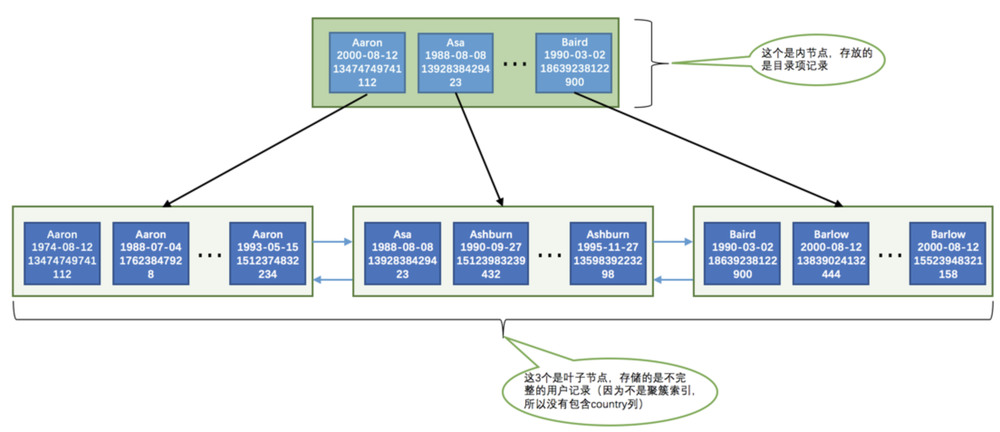
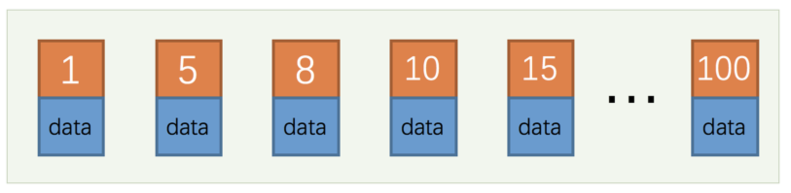
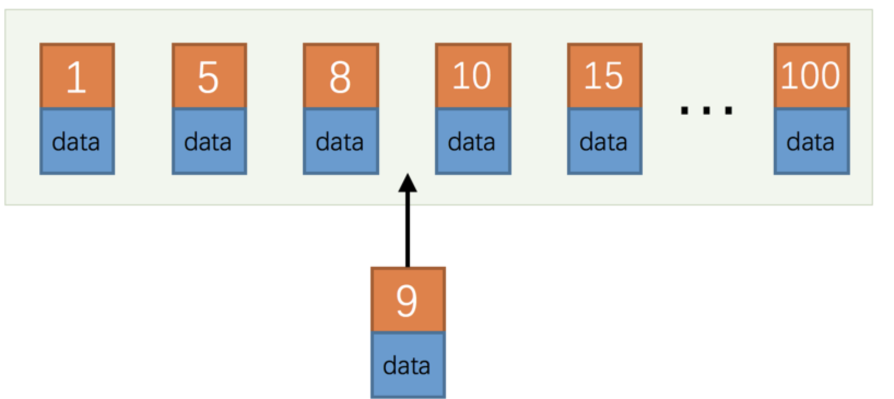

## 索引的代价

虽然索引是个好东西，但是不能乱建，在介绍如何更好的使用索引之前先要了解一下使用这玩意的代价：

- 空间上的代价

  每建立一个索引都要为它建立一棵`B+`树。

- 时间上的代价

  每次对表中的数据进行增、删、改操作时，都需要去修改各个`B+`树索引。

所以说，一个表上索引建的越多，就会占用越多的存储空间，在增删改记录的时候性能就越差。

## B+树索引适用的条件

我们需要先创建一个表，这个表是用来存储人的一些基本信息的：

```mysql
CREATE TABLE person_info(
    id INT NOT NULL auto_increment,
    name VARCHAR(100) NOT NULL,
    birthday DATE NOT NULL,
    phone_number CHAR(11) NOT NULL,
    country varchar(100) NOT NULL,
    PRIMARY KEY (id),
    KEY idx_name_birthday_phone_number (name, birthday, phone_number)
);
```

对于这个`person_info`表我们需要注意两点：

- 表中的主键是`id`列，它存储一个自动递增的整数。
- 我们额外定义了一个二级索引`idx_name_birthday_phone_number`。

`idx_name_birthday_phone_number`的示意图：



### 全值匹配

如果我们的搜索条件中的列和索引列一致的话，这种情况就称为全值匹配，比方说下边这个查找语句：

```mysql
SELECT * FROM person_info WHERE name = 'Ashburn' AND birthday = '1990-09-27' AND phone_number = '15123983239';
```

如果我们调换`name`、`birthday`、`phone_number`这几个搜索列的顺序对查询的执行过程有影响么？

```mysql
SELECT * FROM person_info WHERE birthday = '1990-09-27' AND phone_number = '15123983239' AND name = 'Ashburn';
```

答案是：没影响哈。`MySQL`有一个叫查询优化器的东东，会分析这些搜索条件并且按照可以使用的索引中列的顺序来决定先使用哪个搜索条件，后使用哪个搜索条件。我们后边儿会有专门的章节来介绍查询优化器，敬请期待。

### 匹配左边的列

如果我们想使用联合索引中尽可能多的列，搜索条件中的各个列必须是联合索引中从最左边连续的列。比方说联合索引`idx_name_birthday_phone_number`中列的定义顺序是`name`、`birthday`、`phone_number`，如果我们的搜索条件中只有`name`和`phone_number`，而没有中间的`birthday`，这样就只能用到`name`列的索引，`birthday`和`phone_number`的索引就用不上了。

### 匹配列前缀

我们前边说过为某个列建立索引的意思其实就是在对应的`B+`树的记录中使用该列的值进行排序，比方说`person_info`表上建立的联合索引`idx_name_birthday_phone_number`会先用`name`列的值进行排序，所以这个联合索引对应的`B+`树中的记录的`name`列的排列就是这样的：

```mysql
Aaron
Aaron
...
Aaron
Asa
Ashburn
...
Ashburn
Baird
Barlow
...
Barlow
```

字符串排序的本质就是比较哪个字符串大一点儿，哪个字符串小一点，比较字符串大小就用到了该列的字符集和比较规则。所以一个排好序的字符串的前n个字符，也就是前缀都是排好序的，所以对于字符串类型的索引列来说，我们只匹配它的前缀也是可以快速定位记录的，比方说我们想查询名字以`'As'`开头的记录，那就可以这么写查询语句：

```mysql
SELECT * FROM person_info WHERE name LIKE 'As%';
```

### 匹配范围值

所有记录都是按照索引列的值从小到大的顺序排好序的，所以这极大的方便我们查找索引列的值在某个范围内的记录。比方说下边这个查询语句：

```mysql
SELECT * FROM person_info WHERE name > 'Asa' AND name < 'Barlow';
```

由于`B+`树中的数据页和记录是先按`name`列排序的，所以我们上边的查询过程其实是这样的：

- 找到`name`值为`Asa`的记录。
- 找到`name`值为`Barlow`的记录。
- 哦啦，由于所有记录都是由链表连起来的（记录之间用单链表，数据页之间用双链表），所以他们之间的记录都可以很容易的取出来喽。
- 找到这些记录的主键值，再到`聚簇索引`中`回表`查找完整的记录。

不过在使用联合进行范围查找的时候需要注意，如果对多个列同时进行范围查找的话，只有对索引最左边的那个列进行范围查找的时候才能用到`B+`树索引。

### 精确匹配某一列并范围匹配另外一列

对于同一个联合索引来说，虽然对多个列都进行范围查找时只能用到最左边那个索引列，但是如果左边的列是精确查找，则右边的列可以进行范围查找。

### 用于排序

我们在写查询语句的时候经常需要对查询出来的记录通过`ORDER BY`子句按照某种规则进行排序。在`MySQL`中，把这种在内存中或者磁盘上进行排序的方式统称为文件排序，跟`文件`这个词一沾边，就显得这些排序操作非常慢了。但是如果`ORDER BY`子句里使用到了我们的索引列，就有可能省去在内存或文件中排序的步骤，比如下边这个简单的查询语句：

```mysql
SELECT * FROM person_info ORDER BY name, birthday, phone_number LIMIT 10;
```

这个查询的结果集需要先按照`name`值排序，如果记录的`name`值相同，则需要按照`birthday`来排序，如果`birthday`的值相同，则需要按照`phone_number`排序，因为这个`B+`树索引本身就是按照上述规则排好序的，所以直接从索引中提取数据，然后进行`回表`操作取出该索引中不包含的列就好了。

#### 使用联合索引进行排序注意事项

对于`联合索引`有个问题需要注意，`ORDER BY`的子句后边的列的顺序也必须按照索引列的顺序给出，如果给出`ORDER BY phone_number, birthday, name`的顺序，那也是用不了`B+`树索引，这种颠倒顺序就不能使用索引的原因我们上边详细说过了，这就不赘述了。

同理，`ORDER BY name`、`ORDER BY name, birthday`这种匹配索引左边的列的形式可以使用部分的`B+`树索引。当联合索引左边列的值为常量，也可以使用后边的列进行排序，比如这样：

```mysql
SELECT * FROM person_info WHERE name = 'A' ORDER BY birthday, phone_number LIMIT 10;
```

这个查询能使用联合索引进行排序是因为`name`列的值相同的记录是按照`birthday`, `phone_number`排序的，说了好多遍了都。

#### 不可以使用索引进行排序的几种情况

##### ASC、DESC混用

对于使用联合索引进行排序的场景，我们要求各个排序列的排序顺序是一致的，也就是要么各个列都是`ASC`规则排序，要么都是`DESC`规则排序。

##### WHERE子句中出现非排序使用到的索引列

如果WHERE子句中出现了非排序使用到的索引列，那么排序依然是使用不到索引的，比方说这样：

```mysql
SELECT * FROM person_info WHERE country = 'China' ORDER BY name LIMIT 10;
```

这个查询只能先把符合搜索条件`country = 'China'`的记录提取出来后再进行排序，是使用不到索引。注意和下边这个查询作区别：

```mysql
SELECT * FROM person_info WHERE name = 'A' ORDER BY birthday, phone_number LIMIT 10;
```

虽然这个查询也有搜索条件，但是`name = 'A'`可以使用到索引`idx_name_birthday_phone_number`，而且过滤剩下的记录还是按照`birthday`、`phone_number`列排序的，所以还是可以使用索引进行排序的。

##### 排序列包含非同一个索引的列

有时候用来排序的多个列不是一个索引里的，这种情况也不能使用索引进行排序，比方说：

```mysql
SELECT * FROM person_info ORDER BY name, country LIMIT 10;
```

`name`和`country`并不属于一个联合索引中的列，所以无法使用索引进行排序。

##### 排序列使用了复杂的表达式

要想使用索引进行排序操作，必须保证索引列是以单独列的形式出现，而不是修饰过的形式，比方说这样：

```mysql
SELECT * FROM person_info ORDER BY UPPER(name) LIMIT 10;
```

使用了`UPPER`函数修饰过的列就不是单独的列啦，这样就无法使用索引进行排序啦。

### 用于分组

有时候我们为了方便统计表中的一些信息，会把表中的记录按照某些列进行分组。比如下边这个分组查询：

```mysql
SELECT name, birthday, phone_number, COUNT(*) FROM person_info GROUP BY name, birthday, phone_number
```

这个查询语句相当于做了3次分组操作：

1. 先把记录按照`name`值进行分组，所有`name`值相同的记录划分为一组。
2. 将每个`name`值相同的分组里的记录再按照`birthday`的值进行分组，将`birthday`值相同的记录放到一个小分组里，所以看起来就像在一个大分组里又化分了好多小分组。
3. 再将上一步中产生的小分组按照`phone_number`的值分成更小的分组，所以整体上看起来就像是先把记录分成一个大分组，然后把`大分组`分成若干个`小分组`，然后把若干个`小分组`再细分成更多的`小小分组`。

然后针对那些`小小分组`进行统计，比如在我们这个查询语句中就是统计每个`小小分组`包含的记录条数。如果没有索引的话，这个分组过程全部需要在内存里实现，而如果有了索引的话，恰巧这个分组顺序又和我们的`B+`树中的索引列的顺序是一致的，所以可以直接使用`B+`树索引进行分组。

## 回表的代价

以`idx_name_birthday_phone_number`索引为例，看下边这个查询：

```mysql
SELECT * FROM person_info WHERE name > 'Asa' AND name < 'Barlow';
```

在使用`idx_name_birthday_phone_number`索引进行查询时大致可以分为这两个步骤：

1. 从索引`idx_name_birthday_phone_number`对应的`B+`树中取出`name`值在`Asa`～`Barlow`之间的用户记录。
2. 由于索引`idx_name_birthday_phone_number`对应的`B+`树用户记录中只包含`name`、`birthday`、`phone_number`、`id`这4个字段，而查询列表是`*`，意味着要查询表中所有字段，也就是还要包括`country`字段。这时需要把从上一步中获取到的每一条记录的`id`字段都到聚簇索引对应的`B+`树中找到完整的用户记录，也就是我们通常所说的`回表`，然后把完整的用户记录返回给查询用户。

由于索引`idx_name_birthday_phone_number`对应的`B+`树中的记录首先会按照`name`列的值进行排序，所以值在`Asa`～`Barlow`之间的记录在磁盘中的存储是相连的，集中分布在一个或几个数据页中，我们可以很快的把这些连着的记录从磁盘中读出来，这种读取方式我们也可以称为`顺序I/O`。根据第1步中获取到的记录的`id`字段的值可能并不相连，而在聚簇索引中记录是根据`id`的顺序排列的，所以根据这些并不连续的`id`值到聚簇索引中访问完整的用户记录可能分布在不同的数据页中，这样读取完整的用户记录可能要访问更多的数据页，这种读取方式我们也可以称为`随机I/O`。一般情况下，顺序I/O比随机I/O的性能高很多，所以步骤1的执行可能很快，而步骤2就慢一些。所以这个使用索引`idx_name_birthday_phone_number`的查询有这么两个特点：

- 会使用到两个`B+`树索引，一个二级索引，一个聚簇索引。
- 访问二级索引使用`顺序I/O`，访问聚簇索引使用`随机I/O`。

需要回表的记录越多，使用二级索引的性能就越低，甚至让某些查询宁愿使用全表扫描也不使用`二级索引`。比方说`name`值在`Asa`～`Barlow`之间的用户记录数量占全部记录数量90%以上，那么如果使用`idx_name_birthday_phone_number`索引的话，有90%多的`id`值需要回表，这不是吃力不讨好么，还不如直接去扫描聚簇索引。

那什么时候采用全表扫描的方式，什么时候使用采用`二级索引 + 回表`的方式去执行查询呢？这个就是传说中的查询优化器做的工作，查询优化器会事先对表中的记录计算一些统计数据，然后再利用这些统计数据根据查询的条件来计算一下需要回表的记录数，需要回表的记录数越多，就越倾向于使用全表扫描，反之倾向于使用`二级索引 + 回表`的方式。一般情况下，限制查询获取较少的记录数会让优化器更倾向于选择使用`二级索引 + 回表`的方式进行查询，因为回表的记录越少，性能提升就越高，比方说上边的查询可以改写成这样：

```mysql
SELECT * FROM person_info WHERE name > 'Asa' AND name < 'Barlow' LIMIT 10;
```

添加了`LIMIT 10`的查询更容易让优化器采用`二级索引 + 回表`的方式进行查询。

对于有排序需求的查询，上边讨论的采用`全表扫描`还是`二级索引 + 回表`的方式进行查询的条件也是成立的，比方说下边这个查询：

```mysql
SELECT * FROM person_info ORDER BY name, birthday, phone_number;
```

由于查询列表是`*`，所以如果使用二级索引进行排序的话，需要把排序完的二级索引记录全部进行回表操作，这样操作的成本还不如直接遍历聚簇索引然后再进行文件排序（`filesort`）低，所以优化器会倾向于使用`全表扫描`的方式执行查询。如果我们加了`LIMIT`子句，比如这样：

```mysql
SELECT * FROM person_info ORDER BY name, birthday, phone_number LIMIT 10;
```

这样需要回表的记录特别少，优化器就会倾向于使用`二级索引 + 回表`的方式执行查询。

### 覆盖索引

为了彻底告别`回表`操作带来的性能损耗，我们建议：最好在查询列表里只包含索引列，比如这样：

```mysql
SELECT name, birthday, phone_number FROM person_info WHERE name > 'Asa' AND name < 'Barlow'
```

因为我们只查询`name`, `birthday`, `phone_number`这三个索引列的值，所以在通过`idx_name_birthday_phone_number`索引得到结果后就不必到`聚簇索引`中再查找记录的剩余。

当然，如果业务需要查询出索引以外的列，那还是以保证业务需求为重。但是我们很不鼓励用`*`号作为查询列表，最好把我们需要查询的列依次标明。

## 如何挑选索引

下边看一下我们在建立索引时或者编写查询语句时就应该注意的一些事项。

### 只为用于搜索、排序或分组的列创建索引

也就是说，只为出现在`WHERE`子句中的列、连接子句中的连接列，或者出现在`ORDER BY`或`GROUP BY`子句中的列创建索引。

### 考虑列的基数

`列的基数`指的是某一列中不重复数据的个数，直接影响我们是否能有效的利用索引。如果某个建立了二级索引的列的重复值特别多，那么使用这个二级索引查出的记录还可能要做回表操作，这样性能损耗就更大了。

### 索引列的类型尽量小

我们在定义表结构的时候要显式的指定列的类型，如果我们想要对某个整数列建立索引的话，在表示的整数范围允许的情况下，尽量让索引列使用较小的类型，比如我们能使用`INT`就不要使用`BIGINT`，这是因为：

- 数据类型越小，在查询时进行的比较操作越快
- 数据类型越小，索引占用的存储空间就越少，在一个数据页内就可以放下更多的记录，从而减少磁盘`I/O`带来的性能损耗，也就意味着可以把更多的数据页缓存在内存中，从而加快读写效率。

这个建议对于表的主键来说更加适用，因为不仅是聚簇索引中会存储主键值，其他所有的二级索引的节点处都会存储一份记录的主键值，如果主键适用更小的数据类型，也就意味着节省更多的存储空间和更高效的`I/O`。

### 索引字符串值的前缀

假设我们的字符串很长，那存储一个字符串就需要占用很大的存储空间。在我们需要为这个字符串列建立索引时，那就意味着在对应的`B+`树中有这么两个问题：

- `B+`树索引中的记录需要把该列的完整字符串存储起来，而且字符串越长，在索引中占用的存储空间越大。
- 如果`B+`树索引中索引列存储的字符串很长，那在做字符串比较时会占用更多的时间。

我们前边儿说过索引列的字符串前缀其实也是排好序的，所以索引的设计者提出了个方案 --- 只对字符串的前几个字符进行索引也就是说在二级索引的记录中只保留字符串前几个字符。这样只在`B+`树中存储字符串的前几个字符的编码，既节约空间，又减少了字符串的比较时间，还大概能解决排序的问题，比方说我们在建表语句中只对`name`列的前10个字符进行索引可以这么写：

```mysql
CREATE TABLE person_info(
    name VARCHAR(100) NOT NULL,
    birthday DATE NOT NULL,
    phone_number CHAR(11) NOT NULL,
    country varchar(100) NOT NULL,
    KEY idx_name_birthday_phone_number (name(10), birthday, phone_number)
);
```

`name(10)`就表示在建立的`B+`树索引中只保留记录的前`10`个字符的编码，这种只索引字符串值的前缀的策略是我们非常鼓励的，尤其是在字符串类型能存储的字符比较多的时候。

#### 索引列前缀对排序的影响

如果使用了索引列前缀，比方说前边只把`name`列的前10个字符放到了二级索引中，下边这个查询可能就有点儿尴尬了：

```mysql
SELECT * FROM person_info ORDER BY name LIMIT 10;
```

因为二级索引中不包含完整的`name`列信息，所以无法对前十个字符相同，后边的字符不同的记录进行排序，也就是使用索引列前缀的方式无法支持使用索引排序，只好乖乖的用文件排序喽。

### 让索引列在比较表达式中单独出现

假设表中有一个整数列`my_col`，我们为这个列建立了索引。下边的两个`WHERE`子句虽然语义是一致的，但是在效率上却有差别：

1. `WHERE my_col * 2 < 4`
2. `WHERE my_col < 4/2`

第1个`WHERE`子句中`my_col`列并不是以单独列的形式出现的，这种情况下是使用不到为`my_col`列建立的`B+`树索引的。而第2个`WHERE`子句中`my_col`列并是以单独列的形式出现的，这样的情况可以直接使用`B+`树索引。

所以结论就是：如果索引列在比较表达式中不是以单独列的形式出现，而是以某个表达式，或者函数调用形式出现的话，是用不到索引的。

### 主键插入顺序

对于一个使用`InnoDB`存储引擎的表来说，在我们没有显式的创建索引时，表中的数据实际上都是存储在`聚簇索引`的叶子节点的。而记录又是存储在数据页中的，数据页和记录又是按照记录主键值从小到大的顺序进行排序，所以如果我们插入的主键值忽大忽小的话，这就比较麻烦了，假设某个数据页存储的记录已经满了，它存储的主键值在`1~100`之间：



如果此时再插入一条主键值为`9`的记录，那它插入的位置就如下图：



我们需要把当前页面分裂成两个页面，把本页中的一些记录移动到新创建的这个页中。页面分裂和记录移位意味着性能损耗！所以如果我们想尽量避免这样无谓的性能损耗，最好让插入的记录的主键值依次递增。所以我们建议：让主键具有`AUTO_INCREMENT`，让存储引擎自己为表生成主键。

## 总结

1. `B+`树索引在空间和时间上都有代价，所以没事别瞎建索引。
2. `B+`树索引适用于下边这些情况：
   - 全值匹配
   - 匹配左边的列
   - 匹配范围值
   - 精确匹配某一列并范围匹配另外一列
   - 用于排序
   - 用于分组
3. 在使用索引时需要注意下边这些事项：
   - 只为用于搜索、排序或分组的列创建索引
   - 为列的基数大的列创建索引
   - 索引列的类型尽量小
   - 可以只对字符串值的前缀建立索引
   - 只有索引列在比较表达式中单独出现才可以适用索引
   - 为了尽可能少的让`聚簇索引`发生页面分裂和记录移位的情况，建议让主键拥有`AUTO_INCREMENT`属性。
   - 定位并删除表中的重复和冗余索引
   - 尽量使用`覆盖索引`进行查询，避免`回表`带来的性能损耗。

