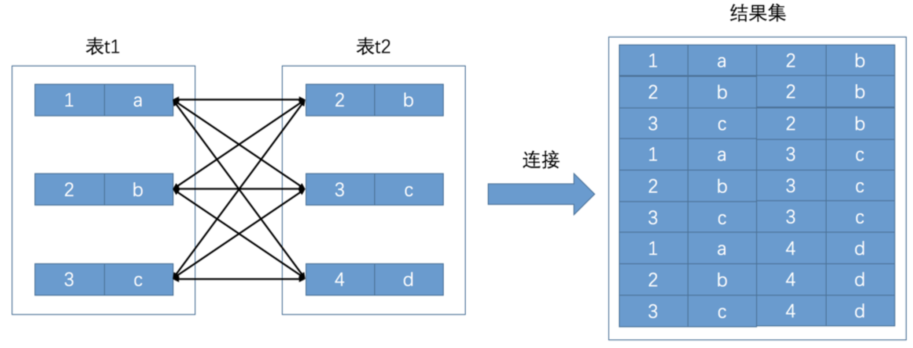
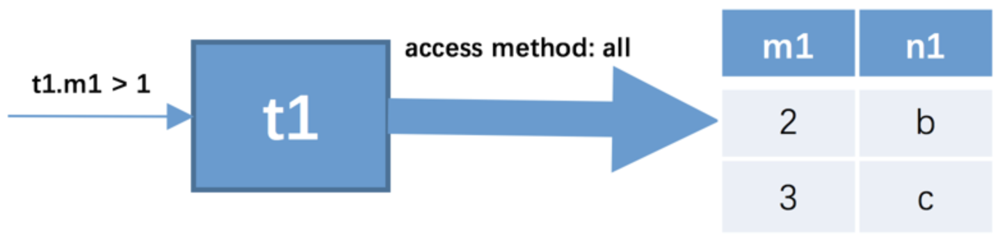
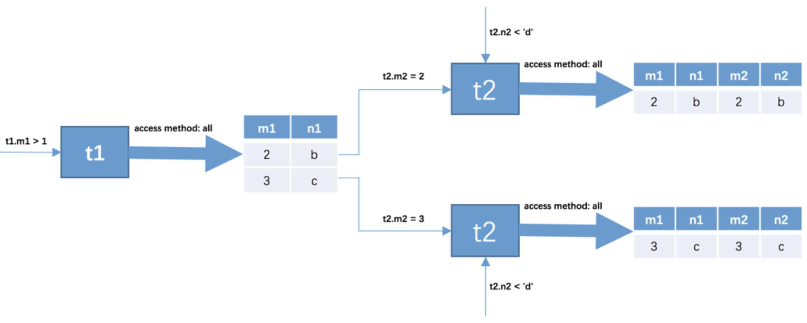
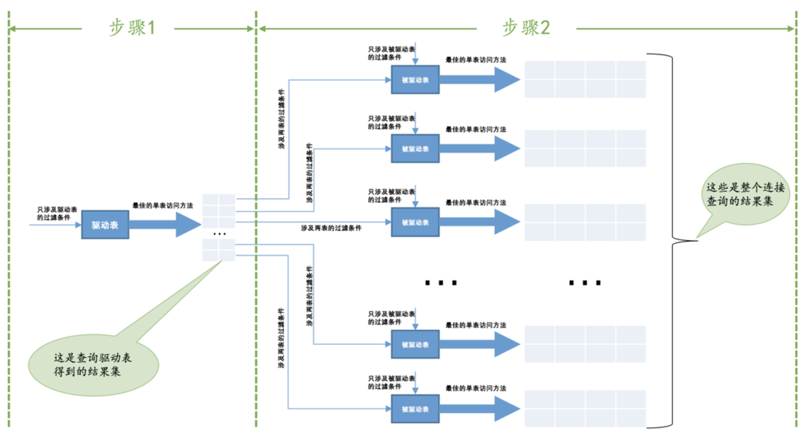
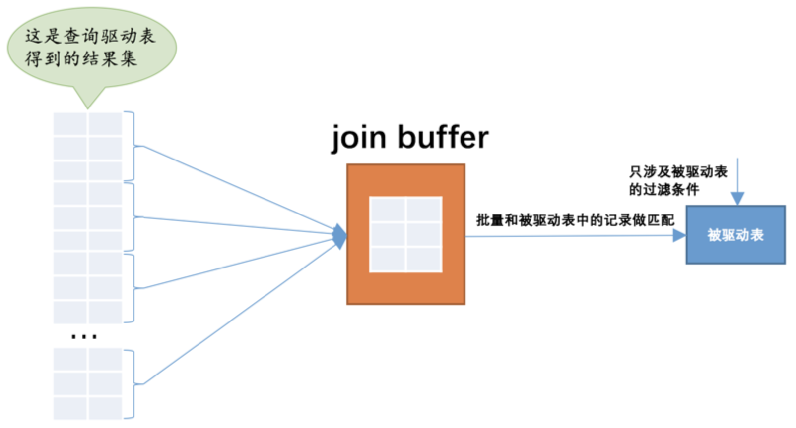

## 连接简介

### 连接的本质

为了故事的顺利发展，我们先建立两个简单的表并给它们填充一点数据：

```mysql
CREATE TABLE t1 (m1 int, n1 char(1));
CREATE TABLE t2 (m2 int, n2 char(1));
INSERT INTO t1 VALUES(1, 'a'), (2, 'b'), (3, 'c');
INSERT INTO t2 VALUES(2, 'b'), (3, 'c'), (4, 'd');
```

我们成功建立了`t1`、`t2`两个表，这两个表都有两个列，一个是`INT`类型的，一个是`CHAR(1)`类型的。

`连接`的本质就是把各个连接表中的记录都取出来依次匹配的组合加入结果集并返回给用户。所以我们把`t1`和`t2`两个表连接起来的过程如下图所示：



这个过程看起来就是把`t1`的记录和`t2`的记录连起来组成新的更大的记录，所以这个查询过程称之为连接查询。连接查询的结果集中包含一个表中的每一条记录与另一个表中的每一条记录相互匹配的组合，像这样的结果集就可以称之为`笛卡尔积`。在`MySQL`中，连接查询的语法也很随意，只要在`FROM`语句后边跟多个表名就好了，比如我们把`t1`表和`t2`表连接起来的查询语句可以写成这样：

```mysql
SELECT * FROM t1, t2;
```

### 连接过程简介

我们可以连接任意数量张表，但是如果没有任何限制条件的话，这些表连接起来产生的`笛卡尔积`可能是非常巨大的。所以在连接的时候过滤掉特定记录组合是有必要的，在连接查询中的过滤条件可以分成两种：

- 涉及单表的条件

  这种只设计单表的过滤条件我们之前都提到过一万遍了，我们之前也一直称为`搜索条件`。

- 涉及两表的条件

  这种过滤条件我们之前没见过，比如`t1.m1 = t2.m2`、`t1.n1 > t2.n2`等，这些条件中涉及到了两个表。

下边我们就要看一下携带过滤条件的连接查询的大致执行过程了，比方说下边这个查询语句：

```mysql
SELECT * FROM t1, t2 WHERE t1.m1 > 1 AND t1.m1 = t2.m2 AND t2.n2 < 'd';
```

这个连接查询的大致执行过程如下：

1. 首先确定第一个需要查询的表，这个表称之为`驱动表`。此处假设使用`t1`作为驱动表，那么就需要到`t1`表中找满足`t1.m1 > 1`的记录，因为表中的数据太少，我们也没在表上建立二级索引，所以此处查询`t1`表的访问方法就设定为`all`吧。所以查询过程就如下图所示：

   

   我们可以看到，`t1`表中符合`t1.m1 > 1`的记录有两条。

2. 上一步骤中从驱动表产生的结果集中的每一条记录，分别需要到`t2`表中查找匹配的记录。所以`t2`表也可以被称之为`被驱动表`。上一步骤从驱动表中得到了2条记录，所以需要查询2次`t2`表。此时涉及两个表的列的过滤条件`t1.m1 = t2.m2`就派上用场了：

   - 当`t1.m1 = 2`时，过滤条件`t1.m1 = t2.m2`就相当于`t2.m2 = 2`，所以此时`t2`表相当于有了`t2.m2 = 2`、`t2.n2 < 'd'`这两个过滤条件，然后到`t2`表中执行单表查询。
   - 当`t1.m1 = 3`时，过滤条件`t1.m1 = t2.m2`就相当于`t2.m2 = 3`，所以此时`t2`表相当于有了`t2.m2 = 3`、`t2.n2 < 'd'`这两个过滤条件，然后到`t2`表中执行单表查询。

   所以整个连接查询的执行过程就如下图所示：

   

从上边两个步骤可以看出来，这个两表连接查询共需要查询1次`t1`表，2次`t2`表。如果我们把`t1.m1 > 1`这个条件去掉，就需要查询3次`t2`表了。在两表连接查询中，驱动表只需要访问一次，被驱动表可能被访问多次。

## 连接的原理

### 嵌套循环连接（Nested-Loop Join）

对于两表连接来说，驱动表只会被访问一遍，但被驱动表却要被访问到好多遍。对于内连接来说，选取哪个表为驱动表都没关系，而外连接的驱动表是固定的：

- 步骤1：选取驱动表，使用与驱动表相关的过滤条件，选取代价最低的单表访问方法来执行对驱动表的单表查询。
- 步骤2：对上一步骤中查询驱动表得到的结果集中每一条记录，都分别到被驱动表中查找匹配的记录。

通用的两表连接过程如下图所示：



如果有3个表进行连接的话，那么`步骤2`中得到的结果集就像是新的驱动表，然后第三个表就成为了被驱动表，重复上边过程。这个过程就像是一个嵌套的循环，所以这种驱动表只访问一次，但被驱动表却可能被多次访问，访问次数取决于对驱动表执行单表查询后的结果集中的记录条数的连接执行方式称之为`嵌套循环连接`，这是最简单，也是最笨拙的一种连接查询算法。

### 使用索引加快连接速度

在`嵌套循环连接`的`步骤2`中可能需要访问多次被驱动表，我们可以利用索引来加快查询速度。

### 基于块的嵌套循环连接

采用`嵌套循环连接`算法的两表连接过程中，被驱动表可是要被访问好多次的，这个`I/O`代价就非常大了。设计`MySQL`的大叔提出了一个`join buffer`的概念，就是执行连接查询前申请的一块固定大小的内存，先把若干条驱动表结果集中的记录装在这个`join buffer`中，然后开始扫描被驱动表，每一条被驱动表的记录一次性和`join buffer`中的多条驱动表记录做匹配，因为匹配的过程都是在内存中完成的，所以这样可以显著减少被驱动表的`I/O`代价。使用`join buffer`的过程如下图所示：



最好的情况是`join buffer`足够大，能容纳驱动表结果集中的所有记录，这样只需要访问一次被驱动表就可以完成连接操作了。设计`MySQL`的大叔把这种加入了`join buffer`的嵌套循环连接算法称之为`基于块的嵌套连接`算法。

这个`join buffer`的大小是可以通过启动参数或者系统变量`join_buffer_size`进行配置。对于优化被驱动表的查询来说，最好是为被驱动表加上效率高的索引，如果实在不能使用索引，并且自己的机器的内存也比较大可以尝试调大`join_buffer_size`的值来对连接查询进行优化。