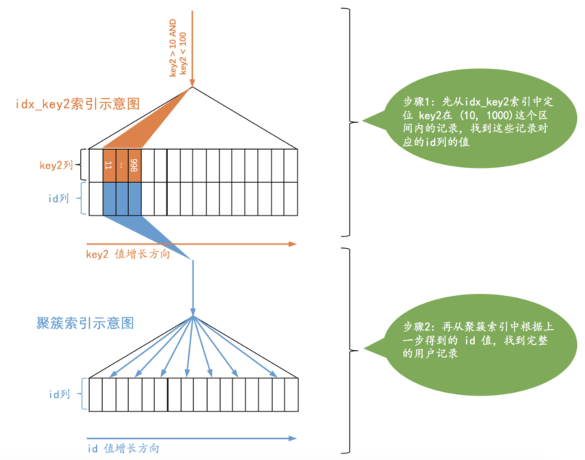
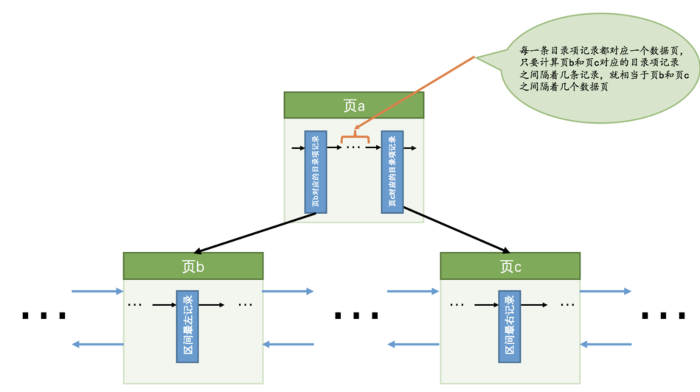
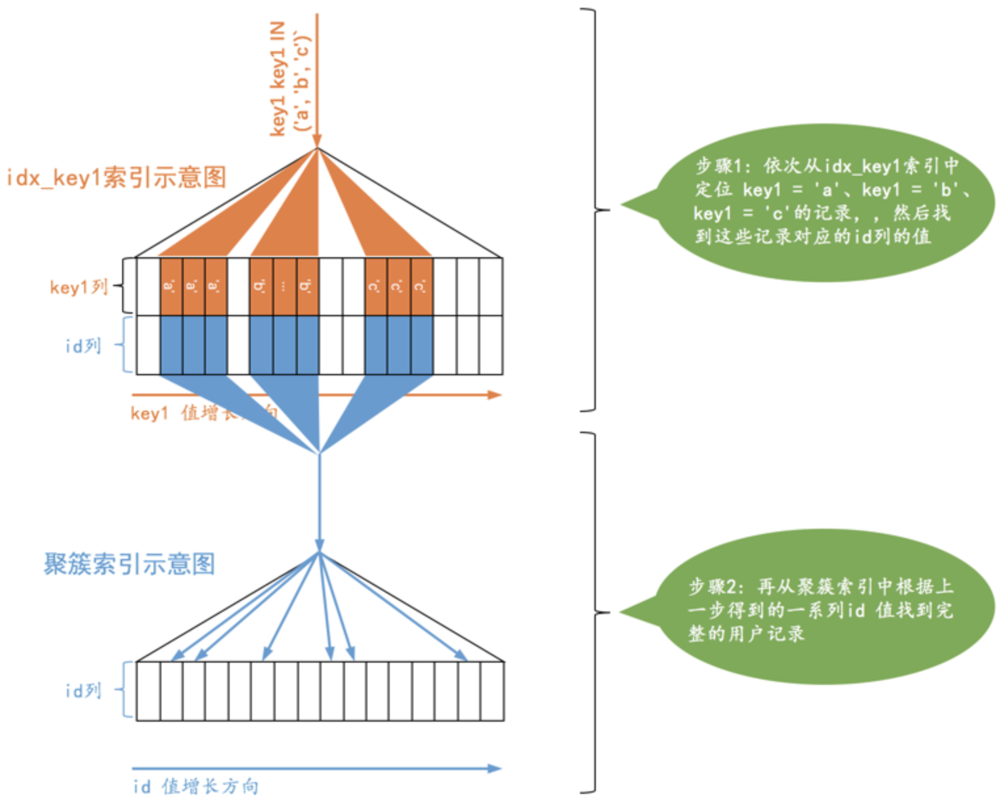

## 什么是成本

`MySQL`执行一个查询可以有不同的执行方案，它会选择其中成本最低的那种方案去真正的执行查询。其实在`MySQL`中一条查询语句的执行成本是由下边这两个方面组成的：

- `I/O`成本

  从磁盘到内存这个加载的过程损耗的时间称之为`I/O`成本。

- `CPU`成本

  读取以及检测记录是否满足对应的搜索条件、对结果集进行排序等这些操作损耗的时间称之为`CPU`成本。

规定读取一个页面花费的成本默认是`1.0`，读取以及检测一条记录是否符合搜索条件的成本默认是都`0.2`。`1.0`、`0.2`这些数字称之为`成本常数`，这两个成本常数我们最常用到，其余的成本常数我们后边再说哈。

## 单表查询的成本

### 准备工作

`single_table`表：

```mysql
CREATE TABLE single_table (
    id INT NOT NULL AUTO_INCREMENT,
    key1 VARCHAR(100),
    key2 INT,
    key3 VARCHAR(100),
    key_part1 VARCHAR(100),
    key_part2 VARCHAR(100),
    key_part3 VARCHAR(100),
    common_field VARCHAR(100),
    PRIMARY KEY (id),
    KEY idx_key1 (key1),
    UNIQUE KEY idx_key2 (key2),
    KEY idx_key3 (key3),
    KEY idx_key_part(key_part1, key_part2, key_part3)
) Engine=InnoDB CHARSET=utf8;
```

插入10000条随机数据。

### 基于成本的优化步骤

在一条单表查询语句真正执行之前，`MySQL`的查询优化器会找出执行该语句所有可能使用的方案，对比之后找出成本最低的方案，即`执行计划`，之后才会调用存储引擎提供的接口真正的执行查询，这个过程总结一下就是这样：

1. 根据搜索条件，找出所有可能使用的索引
2. 计算全表扫描的代价
3. 计算使用不同索引执行查询的代价
4. 对比各种执行方案的代价，找出成本最低的那一个

下边我们就以一个实例来分析一下这些步骤，单表查询语句如下：

```mysql
SELECT * FROM single_table WHERE 
    key1 IN ('a', 'b', 'c') AND 
    key2 > 10 AND key2 < 1000 AND 
    key3 > key2 AND 
    key_part1 LIKE '%hello%' AND
    common_field = '123';
```

#### 1. 根据搜索条件，找出所有可能使用的索引

设计`MySQL`的大叔把一个查询中可能使用到的索引称之为`possible keys`。

上边的查询语句可能用到的索引，也就是`possible keys`只有`idx_key1`和`idx_key2`。

#### 2. 计算全表扫描的代价

对于`InnoDB`存储引擎来说，全表扫描需要将聚簇索引对应的页面加载到内存中，然后再检测记录是否符合搜索条件。查询成本=`I/O`成本+`CPU`成本，所以计算全表扫描的代价需要两个信息：

- 聚簇索引占用的页面数
- 该表中的记录数

设计`MySQL`的大叔为每个表维护了一系列的`统计信息`，并提供了`SHOW TABLE STATUS`语句来查看表的统计信息，如果要看指定的某个表的统计信息，在该语句后加对应的`LIKE`语句就好了，比方说我们要查看`single_table`这个表的统计信息可以这么写：

```mysql
mysql> SHOW TABLE STATUS LIKE 'single_table'\G
*************************** 1. row ***************************
           Name: single_table
         Engine: InnoDB
        Version: 10
     Row_format: Dynamic
           Rows: 9693
 Avg_row_length: 163
    Data_length: 1589248
Max_data_length: 0
   Index_length: 2752512
      Data_free: 4194304
 Auto_increment: 10001
    Create_time: 2018-12-10 13:37:23
    Update_time: 2018-12-10 13:38:03
     Check_time: NULL
      Collation: utf8_general_ci
       Checksum: NULL
 Create_options:
        Comment:
1 row in set (0.01 sec)
```

我们目前只关心两个：

- `Rows`

  表中的记录条数。对于`InnoDB`存储引擎的表来说，该值是一个估计值。所以虽然实际上表中有10000条记录，但是`SHOW TABLE STATUS`显示的`Rows`值只有9693条记录。

- `Data_length`

  表占用的存储空间字节数。对于`InnoDB`存储引擎的表来说，该值就相当于聚簇索引占用的存储空间大小，也就是说可以这样计算该值的大小：

  ``` mysql
  Data_length = 聚簇索引的页面数量 x 每个页面的大小
  ```

  得到了聚簇索引占用的页面数量以及该表记录数的估计值，所以就可以计算全表扫描成本了，但是在真实计算成本时会进行一些`微调`，这些微调的值是直接硬编码到代码里的，我们也没有必要在这些微调值上纠结了。现在可以看一下全表扫描成本的计算过程：

- `I/O`成本

  ```mysql
  97 x 1.0 + 1.1 = 98.1
  ```

  `97`指的是聚簇索引占用的页面数，`1.0`指的是加载一个页面的成本常数，后边的`1.1`是一个微调值，我们不用在意。

- `CPU`成本：

  ```mysql
  9693 x 0.2 + 1.0 = 1939.6
  ```

  `9693`指的是统计数据中表的记录数，`0.2`指的是访问一条记录所需的成本常数，后边的`1.0`是一个微调值，我们不用在意。

- 总成本：

  ```mysql
  98.1 + 1939.6 = 2037.7
  ```

#### 3. 计算使用不同索引执行查询的代价

上述查询可能使用到`idx_key1`和`idx_key2`这两个索引，我们需要分别分析单独使用这些索引执行查询的成本，最后还要分析是否可能使用到索引合并。`MySQL`查询优化器先分析使用唯一二级索引的成本，再分析使用普通索引的成本，所以我们也先分析`idx_key2`的成本，然后再看使用`idx_key1`的成本。

##### 使用idx_key2执行查询的成本分析

`idx_key2`对应的搜索范围区间就是：`(10, 1000)`，使用`idx_key2`搜索的示意图就是这样子：



对于使用`二级索引 + 回表`方式的查询，设计`MySQL`的大叔计算这种查询的成本依赖两个方面的数据：

- 范围区间数量

  查询优化器粗暴的认为读取索引的一个范围区间的`I/O`成本和读取一个页面是相同的，所以本例中相当于访问这个范围区间的二级索引付出的`I/O`成本就是：

  ```mysql
  1 x 1.0 = 1.0
  ```

- 需要回表的记录数

  优化器需要计算二级索引的某个范围区间到底包含多少条记录，对于本例来说就是要计算`idx_key2`在`(10, 1000)`这个范围区间中包含多少二级索引记录，计算过程是这样的：

  - 步骤1：先根据`key2 > 10`这个条件访问一下`idx_key2`对应的`B+`树索引，找到满足`key2 > 10`这个条件的第一条记录，我们把这条记录称之为`区间最左记录`。我们前头说过在`B+`数树中定位一条记录的过程是贼快的，是常数级别的，所以这个过程的性能消耗是可以忽略不计的。

  - 步骤2：然后再根据`key2 < 1000`这个条件继续从`idx_key2`对应的`B+`树索引中找出第一条满足这个条件的记录，我们把这条记录称之为`区间最右记录`，这个过程的性能消耗也可以忽略不计的。

  - 步骤3：如果`区间最左记录`和`区间最右记录`相隔不太远，那就可以精确统计出满足`key2 > 10 AND key2 < 1000`条件的二级索引记录条数。否则只沿着`区间最左记录`向右读10个页面，计算平均每个页面中包含多少记录，然后用这个平均值乘以`区间最左记录`和`区间最右记录`之间的页面数量就可以了。怎么估计`区间最左记录`和`区间最右记录`之间有多少个页面呢？解决这个问题还得回到`B+`树索引的结构中来：

    

    假设`区间最左记录`在`页b`中，`区间最右记录`在`页c`中，那么我们想计算记录之间的页面数量就相当于计算`页b`和`页c`之间有多少页面，所以计算`页b`和`页c`之间有多少页面就相当于计算它们父节点中对应的目录项记录之间隔着几条记录。如果`页b`和`页c`之间的页面实在太多，以至于`页b`和`页c`对应的目录项记录都不在一个页面中就继续递归，再统计`页b`和`页c`对应的目录项记录所在页之间有多少个页面。

  根据上述算法测得`idx_key2`在区间`(10, 1000)`之间大约有`95`条记录。读取这`95`条二级索引记录需要付出的`CPU`成本就是：

  ```mysql
  95 x 0.2 + 0.01 = 19.01
  ```

  在通过二级索引获取到记录之后，还需要干两件事儿：

  - 根据这些记录里的主键值到聚簇索引中做回表操作

    评估回表操作的`I/O`成本依旧很豪放，每次回表操作都相当于访问一个页面，也就是说二级索引范围区间有多少记录，就需要进行多少次回表操作，也就是需要进行多少次页面`I/O`。所以回表操作带来的`I/O`成本就是：

    ```mysql
    95 x 1.0 = 95.0
    ```

  - 回表操作后得到的完整用户记录，然后再检测除`key2 > 10 AND key2 < 1000`这个搜索条件以外的搜索条件是否成立。因为我们通过范围区间获取到二级索引记录共`95`条，也就对应着聚簇索引中`95`条完整的用户记录，读取并检测这些完整的用户记录是否符合其余的搜索条件的`CPU`成本如下：

    ```mysql
    95 x 0.2 = 19.0
    ```

所以本例中使用`idx_key2`执行查询的成本就如下所示：

- `I/O`成本：

  ```mysql
  1.0 + 95 x 1.0 = 96.0 (范围区间的数量 + 预估的二级索引记录条数)
  ```

- `CPU`成本：

  ```mysql
  95 x 0.2 + 0.01 + 95 x 0.2 = 38.01 （读取二级索引记录的成本 + 读取并检测回表后聚簇索引记录的成本）
  ```

综上所述，使用`idx_key2`执行查询的总成本就是：

```mysql
96.0 + 38.01 = 134.01
```

##### 使用idx_key1执行查询的成本分析

`idx_key1`对应的搜索条件是：`key1 IN ('a', 'b', 'c')`，使用`idx_key1`搜索的示意图就是这样子：



我们也需要计算使用`idx_key1`时需要访问的范围区间数量以及需要回表的记录数：

- 范围区间数量

  使用`idx_key1`执行查询时很显然有3个单点区间，所以访问这3个范围区间的二级索引付出的I/O成本就是：

  ```mysql
  3 x 1.0 = 3.0
  ```

- 需要回表的记录数

  由于使用`idx_key1`时有3个单点区间，所以每个单点区间都需要查找一遍对应的二级索引记录数：

  - 查找单点区间`['a', 'a']`对应的二级索引记录数：`35`。
  - 查找单点区间`['b', 'b']`对应的二级索引记录数：`44`。
  - 查找单点区间`['c', 'c']`对应的二级索引记录数：`39`。

  所以，这三个单点区间总共需要回表的记录数就是：

  ```mysql
  35 + 44 + 39 = 118
  ```

  读取这些二级索引记录的`CPU`成本就是：

  ```mysql
  118 x 0.2 + 0.01 = 23.61
  ```

  得到总共需要回表的记录数之后，就要考虑：

  - 根据这些记录里的主键值到聚簇索引中做回表操作，所需的`I/O`成本就是：

    ```mysql
    118 x 1.0 = 118.0
    ```

  - 回表操作后得到的完整用户记录，然后再比较其他搜索条件是否成立，对应的`CPU`成本就是：

    ```mysql
    118 x 0.2 = 23.6
    ```

所以本例中使用`idx_key1`执行查询的成本就如下所示：

- `I/O`成本：

  ```mysql
  3.0 + 118 x 1.0 = 121.0 (范围区间的数量 + 预估的二级索引记录条数)
  ```

- `CPU`成本：

  ```mysql
  118 x 0.2 + 0.01 + 118 x 0.2 = 47.21 （读取二级索引记录的成本 + 读取并检测回表后聚簇索引记录的成本）
  ```

综上所述，使用`idx_key1`执行查询的总成本就是：

```mysql
121.0 + 47.21 = 168.21
```

##### 是否有可能使用索引合并

本例中有关`key1`和`key2`的搜索条件是使用`AND`连接起来的，而对于`idx_key1`和`idx_key2`都是范围查询，也就是说查找到的二级索引记录并不是按照主键值进行排序的，并不满足使用`Intersection`索引合并的条件，所以并不会使用索引合并。

#### 4. 对比各种执行方案的代价，找出成本最低的那一个

很显然，使用`idx_key2`的成本最低，所以当然选择`idx_key2`来执行查询喽。

### 基于索引统计数据的成本计算

有时候使用索引执行查询时会有许多单点区间，比如使用`IN`语句就很容易产生非常多的单点区间。当查询可能使用到的索引只有普通二级索引时，并不能确定一个单点区间对应的二级索引记录的条数有多少，需要我们去计算。设计`MySQL`的大叔把这种通过直接访问索引对应的`B+`树来计算某个范围区间对应的索引记录条数的方式称之为`index dive`。

单点区间很少的话，使用`index dive`也不是什么问题，可是如果`IN`语句里有20000个参数的，这就意味着`MySQL`的查询优化器为了计算这些单点区间对应的索引记录条数，要进行20000次`index dive`操作。`MySQL`当然考虑到了这种情况，所以提供了一个系统变量`eq_range_index_dive_limit`：

```mysql
mysql> SHOW VARIABLES LIKE '%dive%';
+---------------------------+-------+
| Variable_name             | Value |
+---------------------------+-------+
| eq_range_index_dive_limit | 200   |
+---------------------------+-------+
1 row in set (0.08 sec)
```

如果我们的`IN`语句中的参数个数小于200个的话，将使用`index dive`的方式，否则就不能使用`index dive`了，要使用索引统计数据来进行估算。

`MySQL`也会为表中的每一个索引维护一份统计数据

```mysql
mysql> SHOW INDEX FROM single_table;
+--------------+------------+--------------+--------------+-------------+-----------+-------------+----------+--------+------+------------+---------+---------------+
| Table        | Non_unique | Key_name     | Seq_in_index | Column_name | Collation | Cardinality | Sub_part | Packed | Null | Index_type | Comment | Index_comment |
+--------------+------------+--------------+--------------+-------------+-----------+-------------+----------+--------+------+------------+---------+---------------+
| single_table |          0 | PRIMARY      |            1 | id          | A         |       9693  |     NULL | NULL   |      | BTREE      |         |               |
| single_table |          0 | idx_key2     |            1 | key2        | A         |       9693  |     NULL | NULL   | YES  | BTREE      |         |               |
| single_table |          1 | idx_key1     |            1 | key1        | A         |        968 |     NULL | NULL   | YES  | BTREE      |         |               |
| single_table |          1 | idx_key3     |            1 | key3        | A         |        799 |     NULL | NULL   | YES  | BTREE      |         |               |
| single_table |          1 | idx_key_part |            1 | key_part1   | A         |        9673 |     NULL | NULL   | YES  | BTREE      |         |               |
| single_table |          1 | idx_key_part |            2 | key_part2   | A         |        9999 |     NULL | NULL   | YES  | BTREE      |         |               |
| single_table |          1 | idx_key_part |            3 | key_part3   | A         |       10000 |     NULL | NULL   | YES  | BTREE      |         |               |
+--------------+------------+--------------+--------------+-------------+-----------+-------------+----------+--------+------+------------+---------+---------------+
7 rows in set (0.01 sec)
```

|     属性名      | 描述                                                         |
| :-------------: | ------------------------------------------------------------ |
|     `Table`     | 索引所属表的名称。                                           |
|  `Non_unique`   | 索引列的值是否是唯一的，聚簇索引和唯一二级索引的该列值为`0`，普通二级索引该列值为`1`。 |
|   `Key_name`    | 索引的名称。                                                 |
| `Seq_in_index`  | 索引列在索引中的位置，从1开始计数。比如对于联合索引`idx_key_part`，来说，`key_part1`、`key_part2`和`key_part3`对应的位置分别是1、2、3。 |
|  `Column_name`  | 索引列的名称。                                               |
|   `Collation`   | 索引列中的值是按照何种排序方式存放的，值为`A`时代表升序存放，为`NULL`时代表降序存放。 |
|  `Cardinality`  | 索引列中不重复值的数量。后边我们会重点看这个属性的。         |
|   `Sub_part`    | 对于存储字符串或者字节串的列来说，有时候我们只想对这些串的前`n`个字符或字节建立索引，这个属性表示的就是那个`n`值。如果对完整的列建立索引的话，该属性的值就是`NULL`。 |
|    `Packed`     | 索引列如何被压缩，`NULL`值表示未被压缩。这个属性我们暂时不了解，可以先忽略掉。 |
|     `Null`      | 该索引列是否允许存储`NULL`值。                               |
|  `Index_type`   | 使用索引的类型，我们最常见的就是`BTREE`，其实也就是`B+`树索引。 |
|    `Comment`    | 索引列注释信息。                                             |
| `Index_comment` | 索引注释信息。                                               |

现在最在意的是`Cardinality`属性，`Cardinality`直译过来就是`基数`的意思，表示索引列中不重复值的个数。对于InnoDB存储引擎来说，使用`SHOW INDEX`语句展示出来的某个索引列的`Cardinality`属性是一个估计值。

当`IN`语句中的参数个数大于或等于系统变量`eq_range_index_dive_limit`的值的话，就不会使用`index dive`方式，而是使用索引统计数据，这里所指的`索引统计数据`指的是这两个值：

- 使用`SHOW TABLE STATUS`展示出的`Rows`值，也就是一个表中有多少条记录。

- 使用`SHOW INDEX`语句展示出的`Cardinality`属性。

  结合上一个`Rows`统计数据，我们可以针对索引列，计算出平均一个值重复多少次。

  ```mysql
  一个值的重复次数 ≈ Rows ÷ Cardinality
  ```

使用统计数据来计算单点区间对应的索引记录条数可比`index dive`的方式简单多了，但是它的致命弱点就是：不精确！使用统计数据算出来的查询成本与实际所需的成本可能相差非常大。

## 连接查询的成本

### 准备工作

构造一个和`single_table`表一模一样的`single_table2`表。

### Condition filtering介绍

`MySQL`中连接查询采用的是嵌套循环连接算法，驱动表会被访问一次，被驱动表可能会被访问多次，所以对于两表连接查询来说，它的查询成本由下边两个部分构成：

- 单次查询驱动表的成本
- 多次查询被驱动表的成本

我们把对驱动表进行查询后得到的记录条数称之为驱动表的`扇出`。当查询优化器想计算整个连接查询所使用的成本时，就需要计算出驱动表的扇出值，有的时候扇出值的计算是很容易的，比如下边这两个查询：

- 查询一：

  ```mysql
  SELECT * FROM single_table AS s1 INNER JOIN single_table2 AS s2;
  ```

  `s1`表的记录行数是`9693`，也就是说优化器就直接会把`9693`当作在`s1`表的扇出值。

- 查询二：

  ```mysql
  SELECT * FROM single_table AS s1 INNER JOIN single_table2 AS s2 
  WHERE s1.key2 >10 AND s1.key2 < 1000;
  ```

  此时`idx_key2`的范围区间`(10, 1000)`中有多少条记录，那么扇出值就是多少，也就是说本查询中优化器会把`95`当作驱动表`s1`的扇出值。

有的时候扇出值的计算就变得很棘手，比方说下边几个查询：

- 查询三：

  ```mysql
  SELECT * FROM single_table AS s1 INNER JOIN single_table2 AS s2 
      WHERE s1.common_field > 'xyz';
  ```

  多了一个`common_field > 'xyz'`的搜索条件。查询优化器不会真正的去执行查询，所以它只能`猜`这`9693`记录里有多少条记录满足`common_field > 'xyz'`条件。

- 查询四：

  ```mysql
  SELECT * FROM single_table AS s1 INNER JOIN single_table2 AS s2 
      WHERE s1.key2 > 10 AND s1.key2 < 1000 AND
            s1.common_field > 'xyz';
  ```

  多了一个`common_field > 'xyz'`的搜索条件。不过因为本查询可以使用`idx_key2`索引，所以只需要从符合二级索引范围区间的记录中猜有多少条记录符合`common_field > 'xyz'`条件。

- 查询五：

  ```mysql
  SELECT * FROM single_table AS s1 INNER JOIN single_table2 AS s2 
      WHERE s1.key2 > 10 AND s1.key2 < 1000 AND
            s1.key1 IN ('a', 'b', 'c') AND
            s1.common_field > 'xyz';
  ```

  在驱动表`s1`选取`idx_key2`索引执行查询后，优化器需要从符合二级索引范围区间的记录中猜有多少条记录符合下边两个条件：

  - `key1 IN ('a', 'b', 'c')`
  - `common_field > 'xyz'`

其实在这两种情况下计算驱动表扇出值时需要靠`猜`：

- 如果使用的是全表扫描的方式执行的单表查询，那么计算驱动表扇出时需要猜满足搜索条件的记录到底有多少条。
- 如果使用的是索引执行的单表扫描，那么计算驱动表扇出的时候需要猜满足除使用到对应索引的搜索条件外的其他搜索条件的记录有多少条。

设计`MySQL`的大叔把这个`猜`的过程称之为`condition filtering`。

### 两表连接的成本分析

连接查询的成本计算公式是这样的：

```mysql
连接查询总成本 = 单次访问驱动表的成本 + 驱动表扇出数 x 单次访问被驱动表的成本
```

对于左连接和右连接查询来说，它们的驱动表是固定的，所以想要得到最优的查询方案只需要：

- 分别为驱动表和被驱动表选择成本最低的访问方法。

对于内连接来说，驱动表和被驱动表的位置是可以互换的，所以需要考虑两个方面的问题：

- 不同的表作为驱动表最终的查询成本可能是不同的，也就是需要考虑最优的表连接顺序。
- 然后分别为驱动表和被驱动表选择成本最低的访问方法。

很显然，计算内连接查询成本的方式更麻烦一些。

## 调节成本常数

我们前边之介绍了两个`成本常数`：

- 读取一个页面花费的成本默认是`1.0`
- 检测一条记录是否符合搜索条件的成本默认是`0.2`

除了这两个成本常数，`MySQL`还支持好多呢，它们被存储到了`mysql`数据库的两个表中：

```mysql
mysql> SHOW TABLES FROM mysql LIKE '%cost%';
+--------------------------+
| Tables_in_mysql (%cost%) |
+--------------------------+
| engine_cost              |
| server_cost              |
+--------------------------+
2 rows in set (0.00 sec)
```

我们在第一章中就说过，一条语句的执行其实是分为两层的：

- `server`层
- 存储引擎层

在`server`层进行连接管理、查询缓存、语法解析、查询优化等操作，在存储引擎层执行具体的数据存取操作。也就是说一条语句在`server`层中执行的成本是和它操作的表使用的存储引擎是没关系的，所以关于这些操作对应的`成本常数`就存储在了`server_cost`表中，而依赖于存储引擎的一些操作对应的`成本常数`就存储在了`engine_cost`表中。