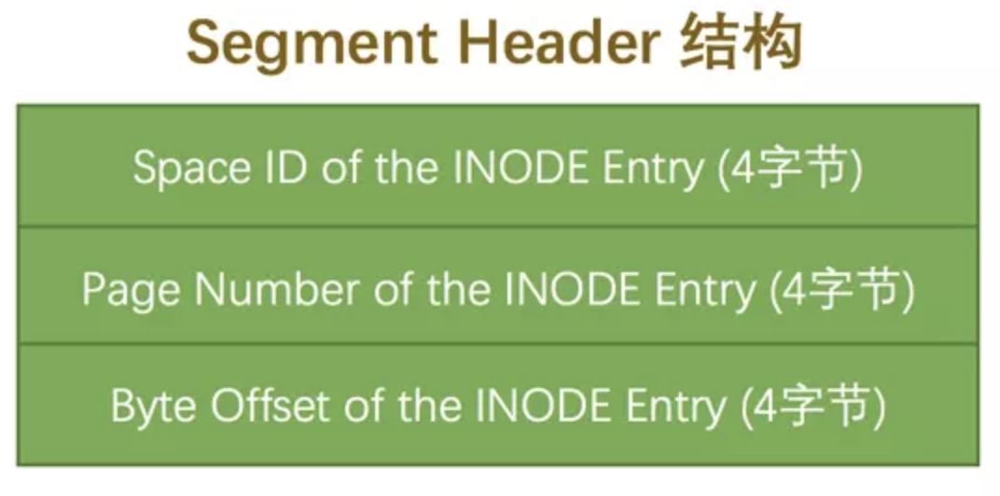
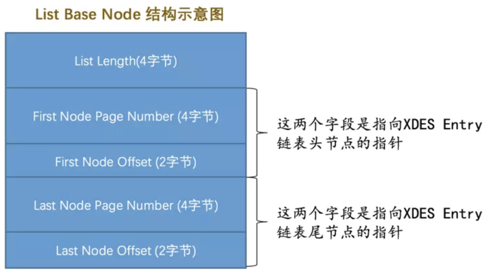

## 两种不同的统计数据存储方式

`InnoDB`提供了两种存储统计数据的方式：

- 永久性的统计数据

- 非永久性的统计数据

  这种统计数据存储在内存中，当服务器关闭时这些这些统计数据就都被清除掉了，等到服务器重启之后，在某些适当的场景下才会重新收集这些统计数据。

设计`MySQL`的大叔们给我们提供了系统变量`innodb_stats_persistent`来控制到底采用哪种方式去存储统计数据。不过`InnoDB`默认是以表为单位来收集和存储统计数据的，也就是说我们可以把某些表的统计数据存储在磁盘上，把另一些表的统计数据存储在内存中。我们可以在创建和修改表的时候通过指定`STATS_PERSISTENT`属性来指明该表的统计数据存储方式：

```mysql
CREATE TABLE 表名 (...) Engine=InnoDB, STATS_PERSISTENT = (1|0);

ALTER TABLE 表名 Engine=InnoDB, STATS_PERSISTENT = (1|0);
```

当`STATS_PERSISTENT=1`时，表明我们想把该表的统计数据永久的存储到磁盘上，当`STATS_PERSISTENT=0`时，表明我们想把该表的统计数据临时的存储到内存中。

## 基于磁盘的永久性统计数据

当我们把某个表以及该表索引的统计数据存放到磁盘上时，实际上是把这些统计数据存储到了两个表里，这两个表都位于`mysql`系统数据库下边，其中：

- `innodb_table_stats`存储了关于表的统计数据，每一条记录对应着一个表的统计数据。
- `innodb_index_stats`存储了关于索引的统计数据，每一条记录对应着一个索引的一个统计项的统计数据。

### innodb_table_stats

|           字段名           | 描述                       |
| :------------------------: | :------------------------- |
|      `database_name`       | 数据库名                   |
|        `table_name`        | 表名                       |
|       `last_update`        | 本条记录最后更新时间       |
|          `n_rows`          | 表中记录的条数             |
|   `clustered_index_size`   | 表的聚簇索引占用的页面数量 |
| `sum_of_other_index_sizes` | 表的其他索引占用的页面数量 |

注意这个表的主键是`(database_name,table_name)`，也就是innodb_table_stats表的每条记录代表着一个表的统计信息：

```mysql
mysql> SELECT * FROM mysql.innodb_table_stats;
+---------------+---------------+---------------------+--------+----------------------+--------------------------+
| database_name | table_name    | last_update         | n_rows | clustered_index_size | sum_of_other_index_sizes |
+---------------+---------------+---------------------+--------+----------------------+--------------------------+
| mysql         | gtid_executed | 2018-07-10 23:51:36 |      0 |                    1 |                        0 |
| sys           | sys_config    | 2018-07-10 23:51:38 |      5 |                    1 |                        0 |
| xiaohaizi     | single_table  | 2018-12-10 17:03:13 |   9693 |                   97 |                      175 |
+---------------+---------------+---------------------+--------+----------------------+--------------------------+
3 rows in set (0.01 sec)
```

可以看到`single_table`表的统计信息就对应着`mysql.innodb_table_stats`的第三条记录。几个重要统计信息项的值如下：

- `n_rows`的值是`9693`（估计值），表明`single_table`表中大约有`9693`条记录。
- `clustered_index_size`的值是`97`（估计值），表明`single_table`表的聚簇索引占用97个页。
- `sum_of_other_index_sizes`的值是`175`（估计值），表明`single_table`表的其他索引一共占用175个页。

#### n_rows统计项的收集

`InnoDB`统计一个表中有多少行记录的套路是这样的：

- 按照一定算法选取几个叶子节点页面，计算每个页面中主键值记录数量，然后计算平均一个页面中主键值的记录数量乘以全部叶子节点的数量就算是该表的`n_rows`值。

  `n_rows`值精确与否取决于统计时采样的页面数量，一个名为`innodb_stats_persistent_sample_pages`的系统变量来控制使用永久性的统计数据时，计算统计数据时采样的页面数量。该值设置的越大，统计出的`n_rows`值越精确，但是统计耗时也就最久。该系统变量的默认值是`20`。

  `InnoDB`默认是以表为单位来收集和存储统计数据的，我们也可以单独设置某个表的采样页面的数量，设置方式就是在创建或修改表的时候通过指定`STATS_SAMPLE_PAGES`属性来指明该表的统计数据存储方式：

  ```mysql
  CREATE TABLE 表名 (...) Engine=InnoDB, STATS_SAMPLE_PAGES = 具体的采样页面数量;
  
  ALTER TABLE 表名 Engine=InnoDB, STATS_SAMPLE_PAGES = 具体的采样页面数量;
  ```

  如果没有指定`STATS_SAMPLE_PAGES`属性，将默认使用系统变量`innodb_stats_persistent_sample_pages`的值作为该属性的值。

#### clustered_index_size和sum_of_other_index_sizes统计项的收集

这两个统计项的收集过程如下：

- 从数据字典里找到表的各个索引对应的根页面位置。

  系统表`SYS_INDEXES`里存储了各个索引对应的根页面信息。

- 从根页面的`Page Header`里找到叶子节点段和非叶子节点段对应的`Segment Header`。

  在每个索引的根页面的`Page Header`部分都有两个字段：

  - `PAGE_BTR_SEG_LEAF`：表示B+树叶子段的`Segment Header`信息。
  - `PAGE_BTR_SEG_TOP`：表示B+树非叶子段的`Segment Header`信息。

- 从叶子节点段和非叶子节点段的`Segment Header`中找到这两个段对应的`INODE Entry`结构。

  这个是`Segment Header`结构：

  

- 从对应的`INODE Entry`结构中可以找到该段对应所有零散的页面地址以及`FREE`、`NOT_FULL`、`FULL`链表的基节点。

  这个是`INODE Entry`结构：

  

- 直接统计零散的页面有多少个，然后从那三个链表的`List Length`字段中读出该段占用的区的大小，每个区占用`64`个页，所以就可以统计出整个段占用的页面。

  这个是链表基节点的示意图：

  

- 分别计算聚簇索引的叶子结点段和非叶子节点段占用的页面数，它们的和就是`clustered_index_size`的值，按照同样的套路把其余索引占用的页面数都算出来，加起来之后就是`sum_of_other_index_sizes`的值。

这里需要大家注意一个问题，我们说一个段的数据在非常多时（超过32个页面），会以`区`为单位来申请空间，这里头的问题是以区为单位申请空间中有一些页可能并没有使用，但是在统计`clustered_index_size`和`sum_of_other_index_sizes`时都把它们算进去了，所以说聚簇索引和其他的索引占用的页面数可能比这两个值要小一些。

### innodb_index_stats

直接看一下这个`innodb_index_stats`表中的各个列都是干嘛的：

|       字段名       | 描述                           |
| :----------------: | :----------------------------- |
|  `database_name`   | 数据库名                       |
|    `table_name`    | 表名                           |
|    `index_name`    | 索引名                         |
|   `last_update`    | 本条记录最后更新时间           |
|    `stat_name`     | 统计项的名称                   |
|    `stat_value`    | 对应的统计项的值               |
|   `sample_size`    | 为生成统计数据而采样的页面数量 |
| `stat_description` | 对应的统计项的描述             |

注意这个表的主键是`(database_name,table_name,index_name,stat_name)`，其中的`stat_name`是指统计项的名称，也就是说innodb_index_stats表的每条记录代表着一个索引的一个统计项。

### 定期更新统计数据

随着我们不断的对表进行增删改操作，表中的数据也一直在变化，`innodb_table_stats`和`innodb_index_stats`表里的统计数据也要变`MySQL`的提供了如下两种更新统计数据的方式：

- 开启`innodb_stats_auto_recalc`。

  系统变量`innodb_stats_auto_recalc`决定着服务器是否自动重新计算统计数据，它的默认值是`ON`，也就是该功能默认是开启的。

- 手动调用`ANALYZE TABLE`语句来更新统计信息

  如果`innodb_stats_auto_recalc`系统变量的值为`OFF`的话，我们也可以手动调用`ANALYZE TABLE`语句来重新计算统计数据：

  ```mysql
  ANALYZE TABLE single_table;
  ```

  `ANALYZE TABLE`语句会立即重新计算统计数据，也就是这个过程是同步的，在表中索引多或者采样页面特别多时这个过程可能会特别慢，请不要没事就运行一下`ANALYZE TABLE`语句。

## innodb_stats_method的使用

我们知道`索引列不重复的值的数量`这个统计数据对于`MySQL`查询优化器十分重要，因为通过它可以计算出在索引列中平均一个值重复多少行。

设计`MySQL`的大叔蛮贴心的，他们提供了一个名为`innodb_stats_method`的系统变量，相当于在计算某个索引列不重复值的数量时如何对待`NULL`值这个锅甩给了用户，这个系统变量有三个候选值：

- `nulls_equal`：认为所有`NULL`值都是相等的。这个值也是`innodb_stats_method`的默认值。

  如果某个索引列中`NULL`值特别多的话，这种统计方式会让优化器认为某个列中平均一个值重复次数特别多，所以倾向于不使用索引进行访问。

- `nulls_unequal`：认为所有`NULL`值都是不相等的。

  如果某个索引列中`NULL`值特别多的话，这种统计方式会让优化器认为某个列中平均一个值重复次数特别少，所以倾向于使用索引进行访问。

- `nulls_ignored`：直接把`NULL`值忽略掉。

## 总结

- `InnoDB`以表为单位来收集统计数据，这些统计数据可以是基于磁盘的永久性统计数据，也可以是基于内存的非永久性统计数据。
- `innodb_stats_persistent`控制着使用永久性统计数据还是非永久性统计数据；`innodb_stats_persistent_sample_pages`控制着永久性统计数据的采样页面数量；`innodb_stats_transient_sample_pages`控制着非永久性统计数据的采样页面数量；`innodb_stats_auto_recalc`控制着是否自动重新计算统计数据。
- 我们可以针对某个具体的表，在创建和修改表时通过指定`STATS_PERSISTENT`、`STATS_AUTO_RECALC`、`STATS_SAMPLE_PAGES`的值来控制相关统计数据属性。
- `innodb_stats_method`决定着在统计某个索引列不重复值的数量时如何对待`NULL`值。

