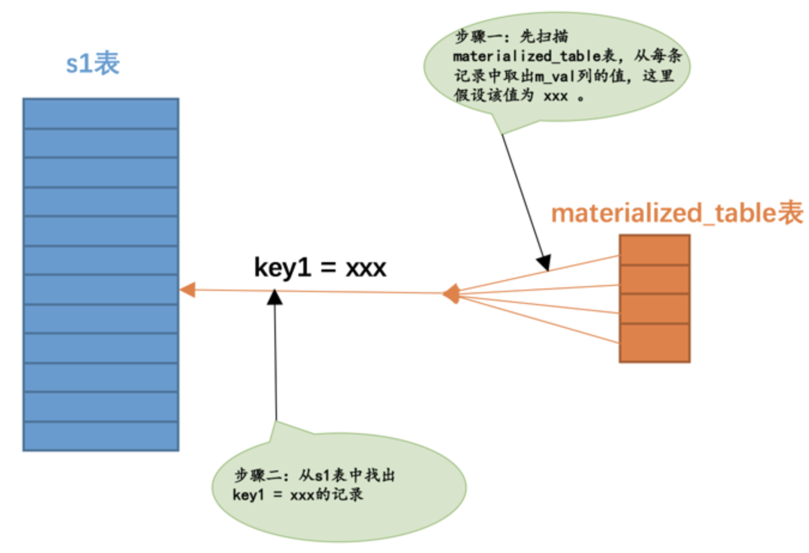

## 条件化简

我们编写的查询语句的搜索条件本质上是一个表达式，这些表达式可能比较繁杂，或者不能高效的执行，`MySQL`的查询优化器会为我们简化这些表达式。

### 移除不必要的括号

有时候表达式里有许多无用的括号，比如这样：

```mysql
((a = 5 AND b = c) OR ((a > c) AND (c < 5)))
```

看着就很烦，优化器会把那些用不到的括号给干掉，就是这样：

```mysql
(a = 5 and b = c) OR (a > c AND c < 5)
```

### 常量传递

有时候某个表达式是某个列和某个常量做等值匹配，比如这样：

当这个表达式和其他涉及列`a`的表达式使用`AND`连接起来时，可以将其他表达式中的`a`的值替换为`5`，比如这样：

```mysql
a = 5 AND b > a
```

就可以被转换为：

```mysql
a = 5 AND b > 5
```

### 等值传递

有时候多个列之间存在等值匹配的关系，比如这样：

```mysql
a = b and b = c and c = 5
```

这个表达式可以被简化为：

```mysql
a = 5 and b = 5 and c = 5
```

### 移除没用的条件

对于一些明显永远为`TRUE`或者`FALSE`的表达式，优化器会移除掉它们

### 表达式计算

在查询开始执行之前，如果表达式中只包含常量的话，它的值会被先计算出来，比如这个：

```mysql
a = 5 + 1
```

因为`5 + 1`这个表达式只包含常量，所以就会被化简成：

```mysql
a = 6
```

但是这里需要注意的是，如果某个列并不是以单独的形式作为表达式的操作数时，比如出现在函数中：

```mysql
ABS(a) > 5
```

优化器是不会尝试对这些表达式进行化简的。所以如果可以的话，最好让索引列以单独的形式出现在表达式中。

### HAVING子句和WHERE子句的合并

如果查询语句中没有出现诸如`SUM`、`MAX`等等的聚集函数以及`GROUP BY`子句，优化器就把`HAVING`子句和`WHERE`子句合并起来。

### 常量表检测

设计`MySQL`的大叔觉得下边这两种查询运行的特别快：

- 查询的表中一条记录没有，或者只有一条记录。
- 使用主键等值匹配或者唯一二级索引列等值匹配作为搜索条件来查询某个表。

设计`MySQL`的大叔觉得这两种查询花费的时间少到可以忽略，所以也把通过这两种方式查询的表称之为`常量表`。优化器在分析一个查询语句时，先首先**执行常量表查询**，然后把查询中涉及到该表的条件全部替换成常数，最后再分析其余表的查询成本，比方说这个查询语句：

```mysql
SELECT * FROM table1 INNER JOIN table2
    ON table1.column1 = table2.column2 
    WHERE table1.primary_key = 1;
```

上边的语句会被转换成这样：

```mysql
SELECT table1表记录的各个字段的常量值, table2.* FROM table1 INNER JOIN table2 
    ON table1表column1列的常量值 = table2.column2;
```

## 外连接消除

我们前边说过，`内连接`的驱动表和被驱动表的位置可以相互转换，而`左连接`和`右连接`的驱动表和被驱动表是固定的。这就导致`内连接`可能通过优化表的连接顺序来降低整体的查询成本，而`外连接`却无法优化表的连接顺序。我们再看一下这两个表的结构：

```
CREATE TABLE t1 (
    m1 int, 
    n1 char(1)
) Engine=InnoDB, CHARSET=utf8;

CREATE TABLE t2 (
    m2 int, 
    n2 char(1)
) Engine=InnoDB, CHARSET=utf8;
```

外连接和内连接的本质区别就是：对于外连接的驱动表的记录来说，如果无法在被驱动表中找到匹配ON子句中的过滤条件的记录，那么该记录仍然会被加入到结果集中，对应的被驱动表记录的各个字段使用NULL值填充；而内连接的驱动表的记录如果无法在被驱动表中找到匹配ON子句中的过滤条件的记录，那么该记录会被舍弃。查询效果就是这样：

```mysql
SELECT * FROM t1 INNER JOIN t2 ON t1.m1 = t2.m2;
SELECT * FROM t1 LEFT JOIN t2 ON t1.m1 = t2.m2;
```

对于上边例子中的左连接来说，由于驱动表`t1`中`m1=1, n1='a'`的记录无法在被驱动表`t2`中找到符合`ON`子句条件`t1.m1 = t2.m2`的记录，所以就直接把这条记录加入到结果集，对应的`t2`表的`m2`和`n2`列的值都设置为`NULL`。

我们知道`WHERE`子句的杀伤力比较大，凡是不符合WHERE子句中条件的记录都不会参与连接。只要我们在搜索条件中指定关于被驱动表相关列的值不为`NULL`，那么外连接中在被驱动表中找不到符合`ON`子句条件的驱动表记录也就被排除出最后的结果集了，也就是说：在这种情况下：外连接和内连接也就没有什么区别了！比方说这个查询：

```mysql
SELECT * FROM t1 LEFT JOIN t2 ON t1.m1 = t2.m2 WHERE t2.n2 IS NOT NULL;
```

由于指定了被驱动表`t2`的`n2`列不允许为`NULL`，所以上边的`t1`和`t2`表的左（外）连接查询和内连接查询是一样一样的。当然，我们也可以不用显式的指定被驱动表的某个列`IS NOT NULL`，只要隐含的有这个意思就行了，比方说这样：

```mysql
SELECT * FROM t1 LEFT JOIN t2 ON t1.m1 = t2.m2 WHERE t2.m2 = 2;
```

在这个例子中，我们在`WHERE`子句中指定了被驱动表`t2`的`m2`列等于`2`，也就相当于间接的指定了`m2`列不为`NULL`值，所以上边的这个左连接查询其实和下边这个内连接查询是等价的：

```mysql
SELECT * FROM t1 INNER JOIN t2 ON t1.m1 = t2.m2 WHERE t2.m2 = 2;
```

我们把这种在外连接查询中，指定的`WHERE`子句中包含被驱动表中的列不为`NULL`值的条件称之为`空值拒绝`。在被驱动表的WHERE子句符合空值拒绝的条件后，外连接和内连接可以相互转换。这种转换带来的好处就是查询优化器可以通过评估表的不同连接顺序的成本，选出成本最低的那种连接顺序来执行查询。

## 子查询优化

#### 按返回的结果集区分子查询

因为子查询本身也算是一个查询，所以可以按照它们返回的不同结果集类型而把这些子查询分为不同的类型：

- 标量子查询

  那些只返回一个单一值的子查询称之为`标量子查询`：

  ```mysql
  SELECT (SELECT m1 FROM t1 LIMIT 1);
  ```

- 行子查询

  顾名思义，就是返回一条记录的子查询，不过这条记录需要包含多个列：

  ```mysql
  SELECT * FROM t1 WHERE (m1, n1) = (SELECT m2, n2 FROM t2 LIMIT 1);
  ```

- 列子查询

  列子查询自然就是查询出一个列的数据喽，不过这个列的数据需要包含多条记录：

  ```mysql
  SELECT * FROM t1 WHERE m1 IN (SELECT m2 FROM t2);
  ```

- 表子查询

  顾名思义，就是子查询的结果既包含很多条记录，又包含很多个列：

  ```mysql
  SELECT * FROM t1 WHERE (m1, n1) IN (SELECT m2, n2 FROM t2);
  ```

#### 按与外层查询关系来区分子查询

- 不相关子查询

  如果子查询可以单独运行出结果，而不依赖于外层查询的值，我们就可以把这个子查询称之为`不相关子查询`。

- 相关子查询

  如果子查询的执行需要依赖于外层查询的值，我们就可以把这个子查询称之为`相关子查询`。比如：

  ```
  SELECT * FROM t1 WHERE m1 IN (SELECT m2 FROM t2 WHERE n1 = n2);
  ```

  子查询中有一个搜索条件是`n1 = n2`，`n1`是表`t1`的列，也就是外层查询的列。

#### 子查询语法注意事项

- 子查询必须用小括号扩起来。不扩起来的子查询是非法的。

- 在`SELECT`子句中的子查询必须是标量子查询。

  这样就是非法的：

  ```mysql
  SELECT (SELECT m1, n1 FROM t1);
  ```

- 想要得到标量子查询或者行子查询，但又不能保证子查询的结果集只有一条记录时，应该使用`LIMIT 1`语句来限制记录数量。

- 对于`[NOT] IN/ANY/SOME/ALL`子查询来说，子查询中不允许有`LIMIT`语句。

- 不允许在一条语句中增删改某个表的记录时同时还对该表进行子查询。

### 子查询在MySQL中是怎么执行的

`single_table`表：

```mysql
CREATE TABLE single_table (
    id INT NOT NULL AUTO_INCREMENT,
    key1 VARCHAR(100),
    key2 INT,
    key3 VARCHAR(100),
    key_part1 VARCHAR(100),
    key_part2 VARCHAR(100),
    key_part3 VARCHAR(100),
    common_field VARCHAR(100),
    PRIMARY KEY (id),
    KEY idx_key1 (key1),
    UNIQUE KEY idx_key2 (key2),
    KEY idx_key3 (key3),
    KEY idx_key_part(key_part1, key_part2, key_part3)
) Engine=InnoDB CHARSET=utf8;
```

我们假设有两个表`s1`、`s2`与这个`single_table`表的构造是相同的，而且这两个表里边有10000条记录。

#### 小白们眼中子查询的执行方式

在我还是一个单纯无知的少年时，觉得子查询的执行方式是这样的：

- 如果该子查询是不相关子查询：

  ```mysql
  SELECT * FROM s1 
      WHERE key1 IN (SELECT common_field FROM s2);
  ```

  - 先单独执行`(SELECT common_field FROM s2)`这个子查询。
  - 然后在将上一步子查询得到的结果当作外层查询的参数再执行外层查询`SELECT * FROM s1 WHERE key1 IN (...)`。

- 如果该子查询是相关子查询：

  ```mysql
  SELECT * FROM s1 
      WHERE key1 IN (SELECT common_field FROM s2 WHERE s1.key2 = s2.key2);
  ```

  - 先从外层查询中获取一条记录，本例中也就是先从`s1`表中获取一条记录。
  - 然后从上一步骤中获取的那条记录中找出子查询中涉及到的值，本例中就是从`s1`表中获取的那条记录中找出`s1.key2`列的值，然后执行子查询。
  - 最后根据子查询的查询结果来检测外层查询`WHERE`子句的条件是否成立，如果成立，就把外层查询的那条记录加入到结果集，否则就丢弃。
  - 再次执行第一步，获取第二条外层查询中的记录，依次类推～

`MySQL`想了一系列的办法来优化子查询的执行，大部分情况下这些优化措施其实挺有效的，但有的时候还是会马失前蹄。

#### 标量子查询、行子查询的执行方式

我们经常在下边两个场景中使用到标量子查询或者行子查询：

- `SELECT`子句中。
- 子查询使用`=`、`>`、`<`、`>=`、`<=`、`<>`、`!=`、`<=>`等操作符和某个操作数组成一个布尔表达式。

对于不相关标量子查询或者行子查询来说，它们的执行方式是简单的：

```mysql
SELECT * FROM s1 
    WHERE key1 = (SELECT common_field FROM s2 WHERE key3 = 'a' LIMIT 1);
```

它的执行方式和年少的我想的一样。

对于相关的标量子查询或者行子查询来说，比如下边这个查询：

```
SELECT * FROM s1 WHERE 
    key1 = (SELECT common_field FROM s2 WHERE s1.key3 = s2.key3 LIMIT 1);
```

事情也和年少的我想的一样。

#### IN子查询优化

##### 物化表的提出

对于不相关的`IN`子查询，比如这样：

```mysql
SELECT * FROM s1 
    WHERE key1 IN (SELECT common_field FROM s2 WHERE key3 = 'a');
```

对于不相关的`IN`子查询来说，如果子查询的结果集中的记录条数很少，那么把子查询和外层查询分别看成两个单独的单表查询效率还是蛮高的，但是如果单独执行子查询后的结果集太多的话，就会导致这些问题：

- 结果集太多，可能内存中都放不下
- 对于外层查询来说，如果子查询的结果集太多，那就意味着`IN`子句中的参数特别多，这就导致：
  - 无法有效的使用索引，只能对外层查询进行全表扫描。
  - 在对外层查询执行全表扫描时，由于`IN`子句中的参数太多，这会导致检测一条记录是否符合和`IN`子句中的参数匹配花费的时间太长。

`MySQL`想了一个招：不直接将不相关子查询的结果集当作外层查询的参数，而是将该结果集写入一个临时表：

- 该临时表的列就是子查询结果集中的列。
- 写入临时表的记录会被去重。
- 一般情况下子查询结果集不会大的离谱，所以会为它建立基于内存的使用`Memory`存储引擎的临时表，而且会为该表建立哈希索引。
- 如果子查询的结果集非常大，超过了系统变量`tmp_table_size`或者`max_heap_table_size`，临时表会转而使用基于磁盘的存储引擎来保存结果集中的记录，索引类型也对应转变为`B+`树索引。

设计`MySQL`的大叔把这个将子查询结果集中的记录保存到临时表的过程称之为`物化`。

##### 物化表转连接

我们重新审视一下最开始的那个查询语句：

```mysql
SELECT * FROM s1 
    WHERE key1 IN (SELECT common_field FROM s2 WHERE key3 = 'a');
```

当我们把子查询进行物化之后，假设子查询物化表的名称为`materialized_table`，该物化表存储的子查询结果集的列为`m_val`，那么这个查询其实可以从下边两种角度来看待：

- 从表`s1`的角度来看待，整个查询的意思其实是：对于`s1`表中的每条记录来说，如果该记录的`key1`列的值在子查询对应的物化表中，则该记录会被加入最终的结果集。画个图表示一下就是这样：

  

- 从子查询物化表的角度来看待，整个查询的意思其实是：对于子查询物化表的每个值来说，如果能在`s1`表中找到对应的`key1`列的值与该值相等的记录，那么就把这些记录加入到最终的结果集。画个图表示一下就是这样：

  

也就是说其实上边的查询就相当于表`s1`和子查询物化表`materialized_table`进行内连接：

```mysql
SELECT s1.* FROM s1 INNER JOIN materialized_table ON key1 = m_val;
```

转化成内连接之后就有意思了，查询优化器可以评估不同连接顺序需要的成本是多少，选取成本最低的那种查询方式执行查询：

- 如果使用`s1`表作为驱动表的话，总查询成本由下边几个部分组成：
  - 物化子查询时需要的成本
  - 扫描`s1`表时的成本
  - s1表中的记录数量 × 通过`m_val = xxx`对`materialized_table`表进行单表访问的成本。
- 如果使用`materialized_table`表作为驱动表的话，总查询成本由下边几个部分组成：
  - 物化子查询时需要的成本
  - 扫描物化表时的成本
  - 物化表中的记录数量 × 通过`key1 = xxx`对`s1`表进行单表访问的成本。

`MySQL`查询优化器会通过运算来选择上述成本更低的方案来执行查询。

##### 将子查询转换为semi-join

能不能不进行物化操作直接把子查询转换为连接呢？

```mysql
SELECT * FROM s1 
    WHERE key1 IN (SELECT common_field FROM s2 WHERE key3 = 'a');
```

我们可以把这个查询理解成：对于`s1`表中的某条记录，如果我们能在`s2`表中找到一条或多条记录，这些记录的`common_field`的值等于`s1`表记录的`key1`列的值，那么该条`s1`表的记录就会被加入到最终的结果集。这个过程其实和把`s1`和`s2`两个表连接起来的效果很像：

```mysql
SELECT s1.* FROM s1 INNER JOIN s2 
    ON s1.key1 = s2.common_field 
    WHERE s2.key3 = 'a';
```

只不过我们不能保证对于`s1`表的某条记录来说，在`s2`表中有多少条记录满足`s1.key1 = s2.common_field`这个条件，不过我们可以分三种情况讨论：

- 情况一：对于`s1`表的某条记录来说，`s2`表中没有任何记录满足`s1.key1 = s2.common_field`这个条件，那么该记录自然也不会加入到最后的结果集。
- 情况二：对于`s1`表的某条记录来说，`s2`表中有且只有记录满足`s1.key1 = s2.common_field`这个条件，那么该记录会被加入最终的结果集。
- 情况三：对于`s1`表的某条记录来说，`s2`表中至少有2条记录满足`s1.key1 = s2.common_field`这个条件，那么该记录会被多次加入最终的结果集。

设计`MySQL`的大叔在这里提出了一个新概念 --- `半连接`（英文名：`semi-join`）。将`s1`表和`s2`表进行半连接的意思就是：对于`s1`表的某条记录来说，我们只关心在`s2`表中是否存在与之匹配的记录是否存在，而不关心具体有多少条记录与之匹配，最终的结果集中只保留`s1`表的记录。为了让大家有更直观的感受，我们假设MySQL内部是这么改写上边的子查询的：

```mysql
SELECT s1.* FROM s1 SEMI JOIN s2
    ON s1.key1 = s2.common_field
    WHERE key3 = 'a';
```

##### semi-join的适用条件

当然，并不是所有包含`IN`子查询的查询语句都可以转换为`semi-join`，只有形如这样的查询才可以被转换为`semi-join`：

```mysql
SELECT ... FROM outer_tables 
    WHERE expr IN (SELECT ... FROM inner_tables ...) AND ...
```

或者这样的形式也可以：

```mysql
SELECT ... FROM outer_tables 
    WHERE (oe1, oe2, ...) IN (SELECT ie1, ie2, ... FROM inner_tables ...) AND ...
```

用文字总结一下，只有符合下边这些条件的子查询才可以被转换为`semi-join`：

- 该子查询必须是和`IN`语句组成的布尔表达式，并且在外层查询的`WHERE`或者`ON`子句中出现。
- 外层查询也可以有其他的搜索条件，只不过和`IN`子查询的搜索条件必须使用`AND`连接起来。
- 该子查询必须是一个单一的查询，不能是由若干查询由`UNION`连接起来的形式。
- 该子查询不能包含`GROUP BY`或者`HAVING`语句或者聚集函数。

##### 不适用于semi-join的情况

对于一些不能将子查询转位`semi-join`的情况，典型的比如下边这几种：

- 外层查询的WHERE条件中有其他搜索条件与IN子查询组成的布尔表达式使用`OR`连接起来

  ```mysql
  SELECT * FROM s1 
      WHERE key1 IN (SELECT common_field FROM s2 WHERE key3 = 'a')
          OR key2 > 100;
  ```

- 使用`NOT IN`而不是`IN`的情况

  ```mysql
  SELECT * FROM s1 
      WHERE key1 NOT IN (SELECT common_field FROM s2 WHERE key3 = 'a')
  ```

- 在`SELECT`子句中的IN子查询的情况

  ```mysql
  SELECT key1 IN (SELECT common_field FROM s2 WHERE key3 = 'a') FROM s1 ;
  ```

- 子查询中包含`GROUP BY`、`HAVING`或者聚集函数的情况

  ```mysql
  SELECT * FROM s1 
      WHERE key2 IN (SELECT COUNT(*) FROM s2 GROUP BY key1);
  ```

- 子查询中包含`UNION`的情况

  ```mysql
  SELECT * FROM s1 WHERE key1 IN (
      SELECT common_field FROM s2 WHERE key3 = 'a' 
      UNION
      SELECT common_field FROM s2 WHERE key3 = 'b'
  );
  ```

`MySQL`仍然留了两手绝活来优化不能转为`semi-join`查询的子查询，那就是：

- 对于不相关子查询来说，可以尝试把它们物化之后再参与查询

  比如我们上边提到的这个查询：

  ```
  SELECT * FROM s1 
      WHERE key1 NOT IN (SELECT common_field FROM s2 WHERE key3 = 'a')
  ```

  先将子查询物化，然后再判断`key1`是否在物化表的结果集中可以加快查询执行的速度。

- 不管子查询是相关的还是不相关的，都可以把`IN`子查询尝试专为`EXISTS`子查询

  其实对于任意一个IN子查询来说，都可以被转为`EXISTS`子查询，通用的例子如下：

  ```mysql
  outer_expr IN (SELECT inner_expr FROM ... WHERE subquery_where)
  ```

  可以被转换为：

  ```mysql
  EXISTS (SELECT inner_expr FROM ... WHERE subquery_where AND outer_expr=inner_expr)
  ```

##### 小结一下

- 如果`IN`子查询符合转换为`semi-join`的条件，查询优化器会优先把该子查询转换为`semi-join`，然后再考虑下边5种执行半连接的策略中哪个成本最低：

  - Table pullout
  - DuplicateWeedout
  - LooseScan
  - Materialization
  - FirstMatch

  选择成本最低的那种执行策略来执行子查询。

- 如果`IN`子查询不符合转换为`semi-join`的条件，那么查询优化器会从下边两种策略中找出一种成本更低的方式执行子查询：

  - 先将子查询物化之后再执行查询
  - 执行`IN to EXISTS`转换。