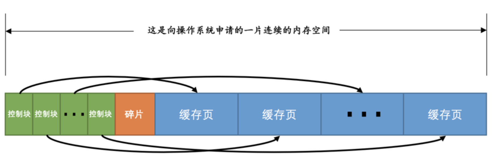
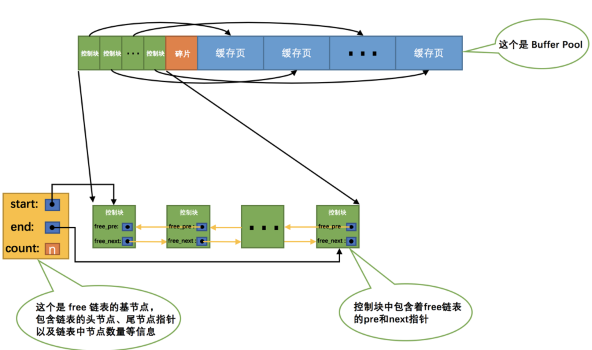
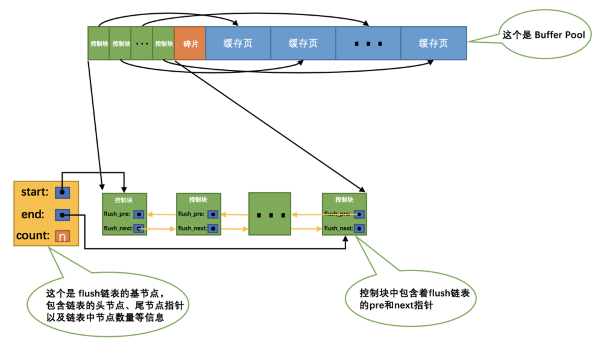
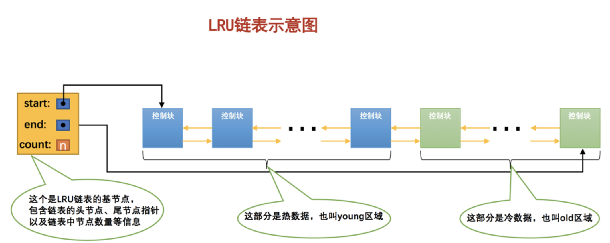
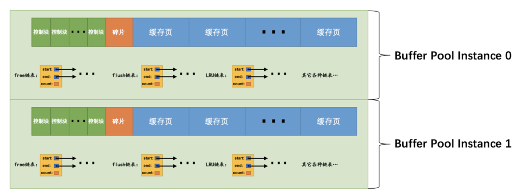
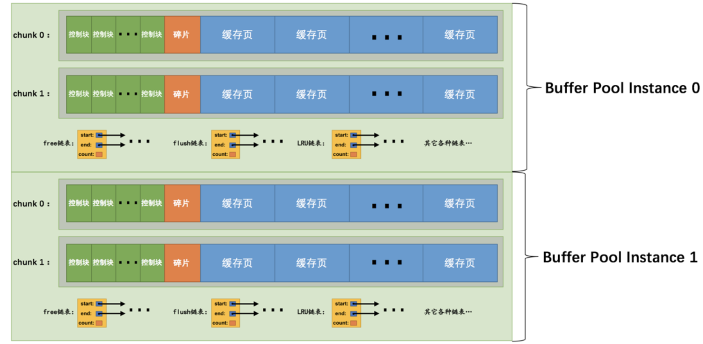

## 缓存的重要性

对于使用`InnoDB`作为存储引擎的表来说，不管是用于存储用户数据的索引，还是各种系统数据，都是以`页`的形式存放在`表空间`中的，而所谓的`表空间`只不过是`InnoDB`对文件系统上一个或几个实际文件的抽象，也就是说我们的数据说到底还是存储在磁盘上的。`InnoDB`存储引擎在处理客户端的请求时，当需要访问某个页的数据时，就会把完整的页的数据全部加载到内存中，也就是说即使我们只需要访问一个页的一条记录，那也需要先把整个页的数据加载到内存中。将整个页加载到内存中后就可以进行读写访问了，在进行完读写访问之后并不着急把该页对应的内存空间释放掉，而是将其`缓存`起来，这样将来有请求再次访问该页面时，就可以省去磁盘`IO`的开销了。

## InnoDB的Buffer Pool

### 啥是个Buffer Pool

为了缓存磁盘中的页，在`MySQL`服务器启动的时候就向操作系统申请了一片连续的内存，这片内存叫做`Buffer Pool`。默认情况下`Buffer Pool`只有`128M`大小。可以在启动服务器的时候配置`innodb_buffer_pool_size`参数的值，它表示`Buffer Pool`的大小，就像这样：

```mysql
[server]
innodb_buffer_pool_size = 268435456
```

### Buffer Pool内部组成

`Buffer Pool`中默认的缓存页是`16KB`。为了更好的管理这些在`Buffer Pool`中的缓存页，设计`InnoDB`的大叔为每一个缓存页都创建了一些所谓的`控制信息`，这些控制信息包括该页所属的表空间编号、页号、缓存页在`Buffer Pool`中的地址、链表节点信息、一些锁信息以及`LSN`信息，当然还有一些别的控制信息。

每个缓存页对应的控制信息占用的内存大小是相同的，我们就把每个页对应的控制信息占用的一块内存称为一个`控制块`吧，控制块和缓存页是一一对应的，它们都被存放到 Buffer Pool 中，其中控制块被存放到 Buffer Pool 的前边，缓存页被存放到 Buffer Pool 后边，所以整个`Buffer Pool`对应的内存空间看起来就是这样的：



### free链表的管理

当我们最初启动`MySQL`服务器的时候，需要完成对`Buffer Pool`的初始化过程，就是先向操作系统申请`Buffer Pool`的内存空间，然后把它划分成若干对控制块和缓存页。但是此时并没有真实的磁盘页被缓存到`Buffer Pool`中，之后随着程序的运行，会不断的有磁盘上的页被缓存到`Buffer Pool`中。我们可以把所有空闲的缓存页对应的控制块作为一个节点放到一个链表中，这个链表也可以被称作`free链表`。刚刚完成初始化的`Buffer Pool`中所有的缓存页都是空闲的，所以每一个缓存页对应的控制块都会被加入到`free链表`中，假设该`Buffer Pool`中可容纳的缓存页数量为`n`，那增加了`free链表`的效果图就是这样的：



从图中可以看出，我们为了管理好这个`free链表`，特意为这个链表定义了一个`基节点`，里边儿包含着链表的头节点地址，尾节点地址，以及当前链表中节点的数量等信息。这里需要注意的是，链表的基节点占用的内存空间并不包含在为`Buffer Pool`申请的一大片连续内存空间之内，而是单独申请的一块内存空间。

有了这个`free链表`之后事儿就好办了，每当需要从磁盘中加载一个页到`Buffer Pool`中时，就从`free链表`中取一个空闲的缓存页，并且把该缓存页对应的`控制块`的信息填上，然后把该缓存页对应的`free链表`节点从链表中移除，表示该缓存页已经被使用了。

### 缓存页的哈希处理

我们可以用`表空间号 + 页号`作为`key`，`缓存页`作为`value`创建一个哈希表，在需要访问某个页的数据时，先从哈希表中根据`表空间号 + 页号`看看有没有对应的缓存页，如果有，直接使用该缓存页就好，如果没有，那就从`free链表`中选一个空闲的缓存页，然后把磁盘中对应的页加载到该缓存页的位置。

### flush链表的管理

如果我们修改了`Buffer Pool`中某个缓存页的数据，那它就和磁盘上的页不一致了，这样的缓存页也被称为`脏页`。所以每次修改缓存页后，我们并不着急立即把修改同步到磁盘上，而是在未来的某个时间点进行同步。

我们再创建一个存储脏页的链表，凡是修改过的缓存页对应的控制块都会作为一个节点加入到一个链表中，因为这个链表节点对应的缓存页都是需要被刷新到磁盘上的，所以也叫`flush链表`。链表的构造和`free链表`差不多，假设某个时间点`Buffer Pool`中的脏页数量为`n`，那么对应的`flush链表`就长这样：



### LRU链表的管理

#### 简单的LRU链表

管理`Buffer Pool`的缓存页其实也是这个道理，当`Buffer Pool`中不再有空闲的缓存页时，就需要淘汰掉部分最近很少使用的缓存页。神奇的链表再一次派上了用场，我们可以再创建一个链表，由于这个链表是为了`按照最近最少使用`的原则去淘汰缓存页的，所以这个链表可以被称为`LRU链表`。只要我们使用到某个缓存页，就把该缓存页调整到`LRU链表`的头部，这样`LRU链表`尾部就是最近最少使用的缓存页喽。 所以当`Buffer Pool`中的空闲缓存页使用完时，到`LRU链表`的尾部找些缓存页淘汰就OK啦，但是这样存在这两种比较尴尬的情况：

- 情况一：`InnoDB`提供了`预读`。所谓`预读`，就是`InnoDB`认为执行当前的请求可能之后会读取某些页面，就预先把它们加载到`Buffer Pool`中。根据触发方式的不同，`预读`又可以细分为下边两种：

  - 线性预读

    设计`InnoDB`的大叔提供了一个系统变量`innodb_read_ahead_threshold`，如果顺序访问了某个区的页面超过这个系统变量的值，就会触发一次`异步`读取下一个区中全部的页面到`Buffer Pool`的请求。

  - 随机预读

    如果`Buffer Pool`中已经缓存了某个区的13个连续的页面，不论这些页面是不是顺序读取的，都会触发一次`异步`读取本区中所有其的页面到`Buffer Pool`的请求。设计`InnoDB`的大叔同时提供了`innodb_random_read_ahead`系统变量，它的默认值为`OFF`。

  这些预读的页都会放到`LRU`链表的头部，但是如果此时`Buffer Pool`的容量不太大而且很多预读的页面都没有用到的话，这就会导致处在`LRU链表`尾部的一些缓存页会很快的被淘汰掉，也就是所谓的`劣币驱逐良币`，会大大降低缓存命中率。

- 情况二：有的小伙伴可能会写一些需要扫描全表的查询语句。

  意味着将访问到该表所在的所有页！假设这个表中记录非常多的话，那该表会占用特别多的`页`，当需要访问这些页时，会把它们统统都加载到`Buffer Pool`中。这种全表扫描的语句执行的频率也不高，每次执行都要把`Buffer Pool`中的缓存页换一次血，这严重的影响到其他查询对 `Buffer Pool`的使用，从而大大降低了缓存命中率。

总结一下上边说的可能降低`Buffer Pool`的两种情况：

- 加载到`Buffer Pool`中的页不一定被用到。
- 如果非常多的使用频率偏低的页被同时加载到`Buffer Pool`时，可能会把那些使用频率非常高的页从`Buffer Pool`中淘汰掉。

因为有这两种情况的存在，所以设计`InnoDB`的大叔把这个`LRU链表`按照一定比例分成两截，分别是：

- 一部分存储使用频率非常高的缓存页，所以这一部分链表也叫做`热数据`，或者称`young区域`。
- 另一部分存储使用频率不是很高的缓存页，所以这一部分链表也叫做`冷数据`，或者称`old区域`。

为了方便大家理解，我们把示意图做了简化，各位领会精神就好：



我们是按照某个比例将LRU链表分成两半的，不是某些节点固定是young区域的，某些节点固定是old区域的，随着程序的运行，某个节点所属的区域也可能发生变化。我们可以通过查看系统变量`innodb_old_blocks_pct`的值来确定`old`区域在`LRU链表`中所占的比例。默认情况下，`old`区域在`LRU链表`中所占的比例是`37%`，也就是说`old`区域大约占`LRU链表`的`3/8`。这个比例我们是可以设置的，我们可以在启动时修改`innodb_old_blocks_pct`参数来控制`old`区域在`LRU链表`中所占的比例。

有了这个被划分成`young`和`old`区域的`LRU`链表之后，设计`InnoDB`的大叔就可以针对我们上边提到的两种可能降低缓存命中率的情况进行优化了：

- 针对预读的页面可能不进行后续访情况的优化

  当磁盘上的某个页面在初次加载到Buffer Pool中的某个缓存页时，该缓存页对应的控制块会被放到old区域的头部。这样针对预读到`Buffer Pool`却不进行后续访问的页面就会被逐渐从`old`区域逐出，而不会影响`young`区域中被使用比较频繁的缓存页。

- 针对全表扫描时，短时间内访问大量使用频率非常低的页面情况的优化

  在进行全表扫描时，虽然首次被加载到`Buffer Pool`的页被放到了`old`区域的头部，但是后续会被马上访问到，每次进行访问的时候又会把该页放到`young`区域的头部，这样仍然会把那些使用频率比较高的页面给顶下去。全表扫描的执行频率非常低，而且在执行全表扫描的过程中，即使某个页面中有很多条记录，也就是去多次访问这个页面所花费的时间也是非常少的。所以我们只需要规定，在对某个处在`old`区域的缓存页进行第一次访问时就在它对应的控制块中记录下来这个访问时间，如果后续的访问时间与第一次访问的时间在某个时间间隔内，那么该页面就不会被从old区域移动到young区域的头部，这个间隔时间是由系统变量`innodb_old_blocks_time`控制，默认值是`1000`毫秒，也就意味着对于从磁盘上被加载到`LRU`链表的`old`区域的某个页来说，如果第一次和最后一次访问该页面的时间间隔小于`1s`，那么该页是不会被加入到`young`区域的。

#### 更进一步优化LRU链表

对于`young`区域的缓存页来说，我们每次访问一个缓存页就要把它移动到`LRU链表`的头部，这样开销是不是太大啦，毕竟在`young`区域的缓存页都是热点数据，也就是可能被经常访问的，这样频繁的对`LRU链表`进行节点移动操作是不是不太好啊？是的，为了解决这个问题其实我们还可以提出一些优化策略，比如只有被访问的缓存页位于`young`区域的`1/4`的后边，才会被移动到`LRU链表`头部，这样就可以降低调整`LRU链表`的频率，从而提升性能。

### 刷新脏页到磁盘

后台有专门的线程每隔一段时间负责把脏页刷新到磁盘，这样可以不影响用户线程处理正常的请求。主要有两种刷新路径：

- 从`LRU链表`的冷数据中刷新一部分页面到磁盘。

  后台线程会定时从`LRU链表`尾部开始扫描一些页面，扫描的页面数量可以通过系统变量`innodb_lru_scan_depth`来指定，如果从里边儿发现脏页，会把它们刷新到磁盘。这种刷新页面的方式被称之为`BUF_FLUSH_LRU`。

- 从`flush链表`中刷新一部分页面到磁盘。

  后台线程也会定时从`flush链表`中刷新一部分页面到磁盘，刷新的速率取决于当时系统是不是很繁忙。这种刷新页面的方式被称之为`BUF_FLUSH_LIST`。

有时候后台线程刷新脏页的进度比较慢，导致用户线程在准备加载一个磁盘页到`Buffer Pool`时没有可用的缓存页，这时就会尝试看看`LRU链表`尾部有没有可以直接释放掉的未修改页面，如果没有的话会不得不将`LRU链表`尾部的一个脏页同步刷新到磁盘。这种刷新单个页面到磁盘中的刷新方式被称之为`BUF_FLUSH_SINGLE_PAGE`。

有时候系统特别繁忙时，也可能出现用户线程批量的从`flush链表`中刷新脏页的情况，很显然在处理用户请求过程中去刷新脏页是一种严重降低处理速度的行为，这属于一种迫不得已的情况。

### 多个Buffer Pool实例

`Buffer Pool`本质是`InnoDB`向操作系统申请的一块连续的内存空间，在多线程环境下，访问`Buffer Pool`中的各种链表都需要加锁处理啥的，在`Buffer Pool`特别大而且多线程并发访问特别高的情况下，单一的`Buffer Pool`可能会影响请求的处理速度。所以在`Buffer Pool`特别大的时候，我们可以把它们拆分成若干个小的`Buffer Pool`，每个`Buffer Pool`都称为一个`实例`，它们都是独立的，独立的去申请内存空间，独立的管理各种链表，独立的吧啦吧啦，所以在多线程并发访问时并不会相互影响，从而提高并发处理能力。我们可以在服务器启动的时候通过设置`innodb_buffer_pool_instances`的值来修改`Buffer Pool`实例的个数，示意图：



每个`Buffer Pool`实例实际内存空间使用这个公式算出来的：

```mysql
innodb_buffer_pool_size/innodb_buffer_pool_instances
```

不是说`Buffer Pool`实例创建的越多越好，分别管理各个`Buffer Pool`也是需要性能开销的，规定：当innodb_buffer_pool_size的值小于1G的时候设置多个实例是无效的，InnoDB会默认把innodb_buffer_pool_instances 的值修改为1。而我们鼓励在`Buffer Pool`大小或等于1G的时候设置多个`Buffer Pool`实例。

### innodb_buffer_pool_chunk_size

每次当我们要重新调整`Buffer Pool`大小时，都需要重新向操作系统申请一块连续的内存空间，然后将旧的`Buffer Pool`中的内容复制到这一块新空间，这是极其耗时的。所以决定不再一次性为某个`Buffer Pool`实例向操作系统申请一大片连续的内存空间，而是以一个所谓的`chunk`为单位向操作系统申请空间。也就是说一个`Buffer Pool`实例其实是由若干个`chunk`组成的，一个`chunk`就代表一片连续的内存空间，里边儿包含了若干缓存页与其对应的控制块，画个图表示就是这样：



我们在服务器运行期间调整`Buffer Pool`的大小时就是以`chunk`为单位增加或者删除内存空间，而不需要重新向操作系统申请一片大的内存，然后进行缓存页的复制。

### Buffer Pool中存储的其它信息

`Buffer Pool`的缓存页除了用来缓存磁盘上的页面以外，还可以存储锁信息、自适应哈希索引等信息。

### 查看Buffer Pool的状态信息

设计`MySQL`的大叔贴心的给我们提供了`SHOW ENGINE INNODB STATUS`语句来查看关于`InnoDB`存储引擎运行过程中的一些状态信息。

## 总结

1. 磁盘太慢，用内存作为缓存很有必要。

2. `Buffer Pool`本质上是`InnoDB`向操作系统申请的一段连续的内存空间，可以通过`innodb_buffer_pool_size`来调整它的大小。

3. `Buffer Pool`向操作系统申请的连续内存由控制块和缓存页组成，每个控制块和缓存页都是一一对应的，在填充足够多的控制块和缓存页的组合后，`Buffer Pool`剩余的空间可能产生不够填充一组控制块和缓存页，这部分空间不能被使用，也被称为`碎片`。

4. `InnoDB`使用了许多`链表`来管理`Buffer Pool`。

5. `free链表`中每一个节点都代表一个空闲的缓存页，在将磁盘中的页加载到`Buffer Pool`时，会从`free链表`中寻找空闲的缓存页。

6. 为了快速定位某个页是否被加载到`Buffer Pool`，使用`表空间号 + 页号`作为`key`，缓存页作为`value`，建立哈希表。

7. 在`Buffer Pool`中被修改的页称为`脏页`，脏页并不是立即刷新，而是被加入到`flush链表`中，待之后的某个时刻同步到磁盘上。

8. `LRU链表`分为`young`和`old`两个区域，可以通过`innodb_old_blocks_pct`来调节`old`区域所占的比例。首次从磁盘上加载到`Buffer Pool`的页会被放到`old`区域的头部，在`innodb_old_blocks_time`间隔时间内访问该页不会把它移动到`young`区域头部。在`Buffer Pool`没有可用的空闲缓存页时，会首先淘汰掉`old`区域的一些页。

9. 我们可以通过指定`innodb_buffer_pool_instances`来控制`Buffer Pool`实例的个数，每个`Buffer Pool`实例中都有各自独立的链表，互不干扰。

10. 自`MySQL 5.7.5`版本之后，可以在服务器运行过程中调整`Buffer Pool`大小。每个`Buffer Pool`实例由若干个`chunk`组成，每个`chunk`的大小可以在服务器启动时通过启动参数调整。

11. 可以用下边的命令查看`Buffer Pool`的状态信息：

    ```mysql
    SHOW ENGINE INNODB STATUS\G
    ```