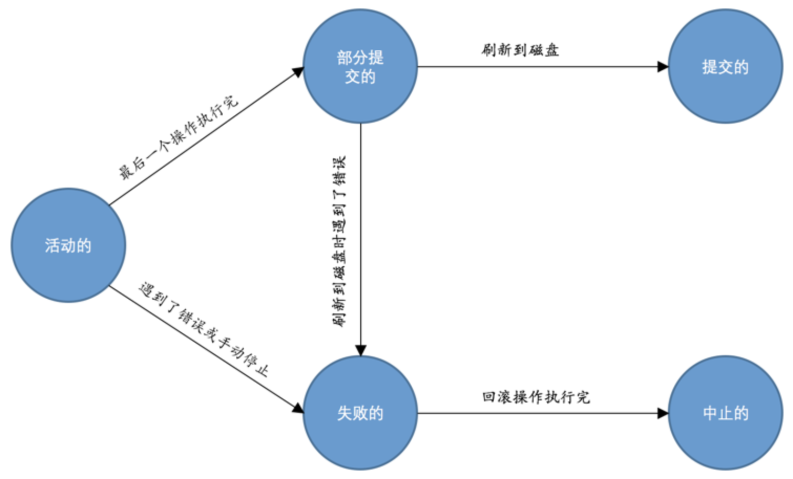

## 事务的起源

### 原子性（Atomicity）

现实世界中转账操作是一个不可分割的操作，也就是说要么压根儿就没转，要么转账成功，不能存在中间的状态，也就是转了一半的这种情况。设计数据库的大叔们把这种要么全做，要么全不做的规则称之为`原子性`。

### 隔离性（Isolation）

现实世界中不仅要保证这些操作以`原子性`的方式执行完成，而且要保证其它的状态转换不会影响到本次状态转换，这个规则被称之为`隔离性`。这时设计数据库的大叔们就需要采取一些措施来让访问相同数据的不同状态转换对应的数据库操作的执行顺序有一定规律，这也是我们后边章节要仔细唠叨的内容。

### 一致性（Consistency）

如果数据库中的数据全部符合现实世界中的约束，我们说这些数据就是一致的，或者说符合`一致性`的。

保证数据库中数据的一致性其实靠两方面的努力：

- 数据库本身能为我们保证一部分一致性需求（就是数据库自身可以保证一部分现实世界的约束永远有效）。
- 更多的一致性需求需要靠写业务代码的程序员自己保证。

### 持久性（Durability）

当现实世界的一个状态转换完成后，这个转换的结果将永久的保留，这个规则被设计数据库的大叔们称为`持久性`。

## 事务的概念

设计数据库的大叔为了方便起见，把需要保证`原子性`、`隔离性`、`一致性`和`持久性`的一个或多个数据库操作称之为一个`事务`。

我们现在知道`事务`是一个抽象的概念，它其实对应着一个或多个数据库操作，设计数据库的大叔根据这些操作所执行的不同阶段把`事务`大致上划分成了这么几个状态：

- 活动的（active）

  事务对应的数据库操作正在执行过程中

- 部分提交的（partially committed）

  当事务中的最后一个操作执行完成，但由于操作都在内存中执行，所造成的影响并没有刷新到磁盘时。

- 失败的（failed）

  事务处在`活动的`或者`部分提交的`状态时，可能遇到了某些错误而无法继续执行，或者人为的停止当前事务的执行，我们就说该事务处在`失败的`状态。

- 中止的（aborted）

  当`回滚`操作执行完毕时，也就是数据库恢复到了执行事务之前的状态，我们就说该事务处在了`中止的`状态。

- 提交的（committed）

  处在`部分提交的`状态的事务将修改过的数据都同步到磁盘上之后，我们就可以说该事务处在了`提交的`状态。

随着事务对应的数据库操作执行到不同阶段，事务的状态也在不断变化：

## MySQL中事务的语法

我们说`事务`的本质其实只是一系列数据库操作，只不过这些数据库操作符合`ACID`特性而已，那么`MySQL`中如何将某些操作放到一个事务里去执行的呢？我们下边就来重点唠叨唠叨。

### 支持事务的存储引擎

`MySQL`中目前只有`InnoDB`和`NDB`存储引擎支持，如果某个事务中包含了修改使用不支持事务的存储引擎的表，那么对该使用不支持事务的存储引擎的表所做的修改将无法进行回滚。

### 保存点

如果你开启了一个事务，并且已经敲了很多语句，忽然发现上一条语句有点问题，你只好使用`ROLLBACK`语句来让数据库状态恢复到事务执行之前的样子，然后一切从头再来，总有一种一夜回到解放前的感觉。所以设计数据库的大叔们提出了一个`保存点`的概念，就是在事务对应的数据库语句中打几个点，我们在调用`ROLLBACK`语句时可以指定会滚到哪个点，而不是回到最初的原点。