## redo日志

我们知道`InnoDB`存储引擎是以页为单位来管理存储空间的，在真正访问页面之前，需要把在磁盘上的页缓存到内存中的`Buffer Pool`之后才可以访问。就是说对于一个已经提交的事务，即使系统发生了崩溃，这个事务对数据库中所做的更改也不能丢失。如果我们只在内存的`Buffer Pool`中修改了页面，假设在事务提交后突然发生了某个故障，导致内存中的数据都失效了，那么这个已经提交了的事务对数据库中所做的更改也就跟着丢失了。我们其实没有必要在每次事务提交时就把该事务在内存中修改过的全部页面刷新到磁盘，只需要把修改了哪些东西记录一下就好了。这样我们在事务提交时，把上述内容刷新到磁盘中，即使之后系统崩溃了，重启之后只要按照上述内容所记录的步骤重新更新一下数据页，那么该事务对数据库中所做的修改又可以被恢复出来，也就意味着满足`持久性`的要求。上述内容也被称之为`重做日志`，英文名为`redo log`。只将该事务执行过程中产生的`redo`日志刷新到磁盘的好处如下：

- `redo`日志占用的空间非常小

  存储表空间ID、页号、偏移量以及需要更新的值所需的存储空间是很小的。

- `redo`日志是顺序写入磁盘的

  这些日志是按照产生的顺序写入磁盘的，也就是使用顺序IO。

## redo日志格式

`redo`日志本质上只是记录了一下事务对数据库做了哪些修改。 针对事务对数据库的不同修改场景定义了多种类型的`redo`日志，但是绝大部分类型的`redo`日志都有下边这种通用的结构：

各个部分的详细释义如下：

- `type`：该条`redo`日志的类型。

  在`MySQL 5.7.21`这个版本中，一共为`redo`日志设计了53种不同的类型。

- `space ID`：表空间ID。

- `page number`：页号。

- `data`：该条`redo`日志的具体内容。

### 简单的redo日志类型

如果我们没有为某个表显式的定义主键和`Unique`键，那么`InnoDB`会自动的为表添加一个称之为`row_id`的隐藏列作为主键。为这个`row_id`隐藏列赋值的方式如下：

- 服务器会在内存中维护一个全局变量，每当向某个包含隐藏的`row_id`列的表中插入一条记录时，就会把该变量的值当作新记录的`row_id`列的值，并且把该变量自增1。
- 每当这个变量的值为256的倍数时，就会将该变量的值刷新到系统表空间的页号为`7`的页面中一个称之为`Max Row ID`的属性处。
- 当系统启动时，会将上边提到的`Max Row ID`属性加载到内存中，将该值加上256之后赋值给我们前边提到的全局变量。

这个`Max Row ID`属性占用的存储空间是8个字节，当某个事务向某个包含`row_id`隐藏列的表插入一条记录，并且为该记录分配的`row_id`值为256的倍数时，就会向系统表空间页号为7的页面的相应偏移量处写入8个字节的值。但是我们要知道，这个写入实际上是在`Buffer Pool`中完成的，我们需要为这个页面的修改记录一条`redo`日志，以便在系统奔溃后能将已经提交的该事务对该页面所做的修改恢复出来。这种情况下对页面的修改是极其简单的，`redo`日志中只需要记录一下在某个页面的某个偏移量处修改了几个字节的值，具体被修改的内容是啥就好了，设计`InnoDB`的大叔把这种极其简单的`redo`日志称之为`物理日志`，并且根据在页面中写入数据的多少划分了几种不同的`redo`日志类型：

- `MLOG_1BYTE`（`type`字段对应的十进制数字为`1`）：表示在页面的某个偏移量处写入1个字节的`redo`日志类型。
- `MLOG_2BYTE`（`type`字段对应的十进制数字为`2`）：表示在页面的某个偏移量处写入2个字节的`redo`日志类型。
- `MLOG_4BYTE`（`type`字段对应的十进制数字为`4`）：表示在页面的某个偏移量处写入4个字节的`redo`日志类型。
- `MLOG_8BYTE`（`type`字段对应的十进制数字为`8`）：表示在页面的某个偏移量处写入8个字节的`redo`日志类型。
- `MLOG_WRITE_STRING`（`type`字段对应的十进制数字为`30`）：表示在页面的某个偏移量处写入一串数据。

`MLOG_8BYTE`的`redo`日志结构如下所示：

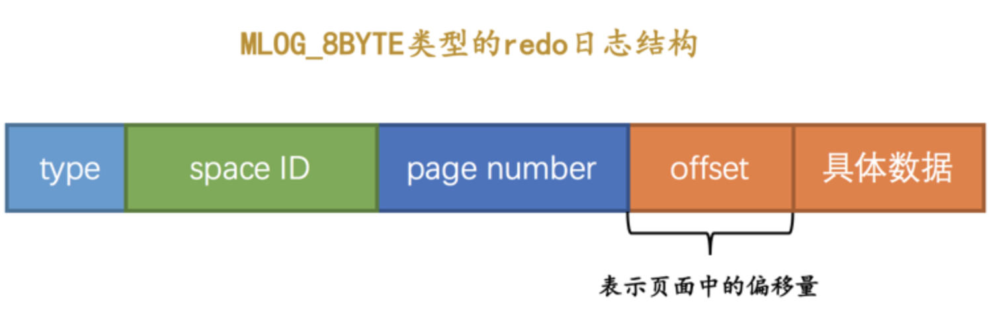

`MLOG_WRITE_STRING`类型的`redo`日志表示写入一串数据，但是因为不能确定写入的具体数据占用多少字节，所以需要在日志结构中添加一个`len`字段：

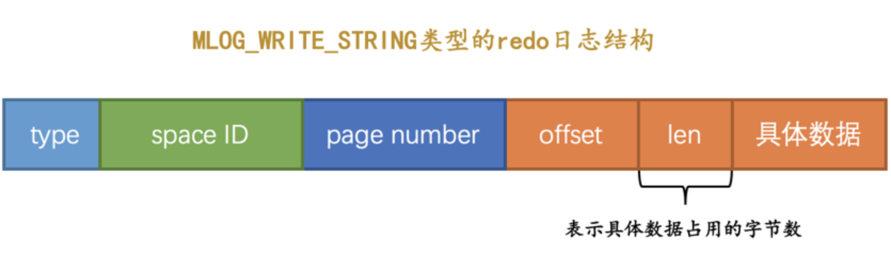

### 复杂一些的redo日志类型

有时候执行一条语句会修改非常多的页面。以一条`INSERT`语句为例，它除了要向`B+`树的页面中插入数据，也可能更新系统数据`Max Row ID`的值，不过对于我们用户来说，平时更关心的是语句对`B+`树所做更新：

- 表中包含多少个索引，一条`INSERT`语句就可能更新多少棵`B+`树。
- 针对某一棵`B+`树来说，既可能更新叶子节点页面，也可能更新内节点页面，也可能创建新的页面。

在语句执行过程中，`INSERT`语句对所有页面的修改都得保存到`redo`日志中去。但是每往叶子节点代表的数据页里插入一条记录时，还有其他很多地方会跟着更新，比如说：

- 可能更新`Page Directory`中的槽信息。
- `Page Header`中的各种页面统计信息。
- 上一条记录的记录头信息中的`next_record`属性来维护这个单向链表。

画一个简易的示意图就像是这样：

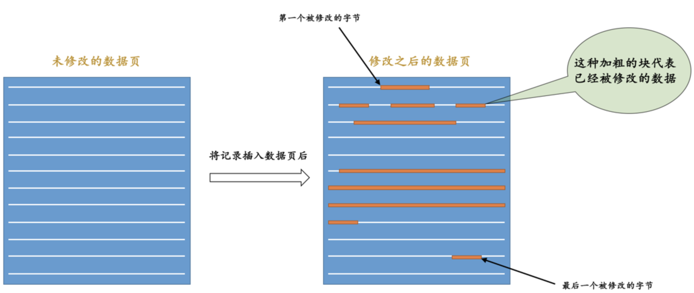

我们如果使用上边介绍的简单的物理`redo`日志来记录这些修改时，可以有两种解决方案：

- 方案一：在每个修改的地方都记录一条`redo`日志。

  这样子记录`redo`日志的缺点是显而易见的，因为被修改的地方是在太多了，可能记录的`redo`日志占用的空间都比整个页面占用的空间都多

- 方案二：将整个页面的`第一个被修改的字节`到`最后一个修改的字节`之间所有的数据当成是一条物理`redo`日志中的具体数据。但是`第一个被修改的字节`到`最后一个修改的字节`之间仍然有许多没有修改过的数据就太浪费了。

所以提出了一些新的`redo`日志类型，比如：

- `MLOG_REC_INSERT`（对应的十进制数字为`9`）：表示插入一条使用非紧凑行格式的记录时的`redo`日志类型。
- `MLOG_COMP_REC_INSERT`（对应的十进制数字为`38`）：表示插入一条使用紧凑行格式的记录时的`redo`日志类型。

- `MLOG_COMP_PAGE_CREATE`（`type`字段对应的十进制数字为`58`）：表示创建一个存储紧凑行格式记录的页面的`redo`日志类型。
- `MLOG_COMP_REC_DELETE`（`type`字段对应的十进制数字为`42`）：表示删除一条使用紧凑行格式记录的`redo`日志类型。
- `MLOG_COMP_LIST_START_DELETE`（`type`字段对应的十进制数字为`44`）：表示从某条给定记录开始删除页面中的一系列使用紧凑行格式记录的`redo`日志类型。
- `MLOG_COMP_LIST_END_DELETE`（`type`字段对应的十进制数字为`43`）：与`MLOG_COMP_LIST_START_DELETE`类型的`redo`日志呼应，表示删除一系列记录直到`MLOG_COMP_LIST_END_DELETE`类型的`redo`日志对应的记录为止。

- `MLOG_ZIP_PAGE_COMPRESS`（`type`字段对应的十进制数字为`51`）：表示压缩一个数据页的`redo`日志类型。

这些类型的`redo`日志既包含`物理`层面的意思，也包含`逻辑`层面的意思，具体指：

- 物理层面看，这些日志都指明了对哪个表空间的哪个页进行了修改。
- 逻辑层面看，在系统奔溃重启时，并不能直接根据这些日志里的记载，将页面内的某个偏移量处恢复成某个数据，而是需要调用一些事先准备好的函数，执行完这些函数后才可以将页面恢复成系统奔溃前的样子。

以类型为`MLOG_COMP_REC_INSERT`代表插入一条使用紧凑行格式的记录时的`redo`日志为例来理解一下我们上边所说的`物理`层面和`逻辑`层面到底是个啥意思。看一下这个类型为`MLOG_COMP_REC_INSERT`的`redo`日志的结构：

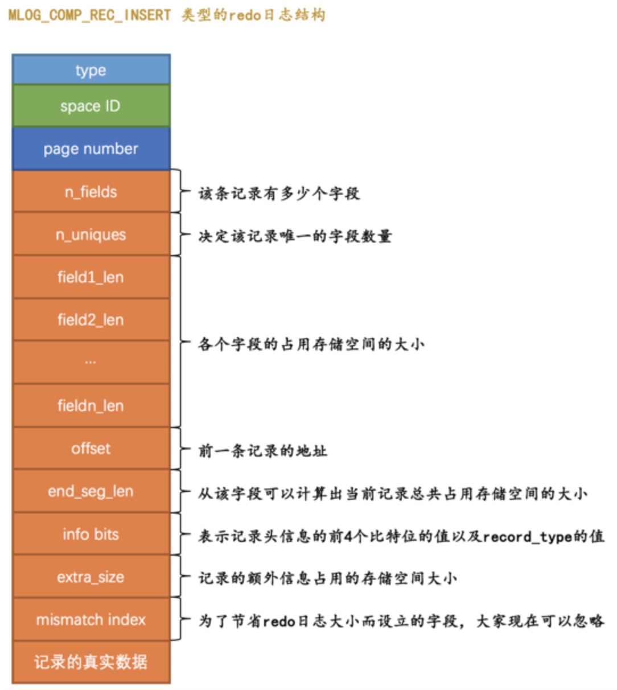

这个类型为`MLOG_COMP_REC_INSERT`的`redo`日志结构有几个地方需要大家注意：

- `n_uniques`的值的含义是在一条记录中，需要几个字段的值才能确保记录的唯一性，这样当插入一条记录时就可以按照记录的前`n_uniques`个字段进行排序。对于聚簇索引来说，`n_uniques`的值为主键的列数，对于其他二级索引来说，该值为索引列数+主键列数。
- `field1_len ~ fieldn_len`代表着该记录若干个字段占用存储空间的大小。
- `offset`是该记录的前一条记录在页面中的地址。在插入新记录时需要修改前一条记录的`next_record`属性。

`redo`日志并没有记录`PAGE_N_DIR_SLOTS`的值修改，`PAGE_HEAP_TOP`的值修改，`PAGE_N_HEAP`的值修改等等这些信息，而只是把在本页面中插入一条记录所有必备的要素记了下来，之后系统奔溃重启时，服务器会调用相关向某个页面插入一条记录的那个函数，而`redo`日志中的那些数据就可以被当成是调用这个函数所需的参数，在调用完该函数后，页面中的`PAGE_N_DIR_SLOTS`、`PAGE_HEAP_TOP`、`PAGE_N_HEAP`等等的值也就都被恢复到系统奔溃前的样子了。这就是所谓的`逻辑`日志的意思。

## Mini-Transaction

### 以组的形式写入redo日志

语句在执行过程中可能修改若干个页面。由于对这些页面的更改都发生在`Buffer Pool`中，所以在修改完页面之后，需要记录一下相应的`redo`日志。在执行语句的过程中产生的`redo`日志被设计`InnoDB`的大叔人为的划分成了若干个不可分割的组，比如：

- 更新`Max Row ID`属性时产生的`redo`日志是不可分割的。
- 向聚簇索引对应`B+`树的页面中插入一条记录时产生的`redo`日志是不可分割的。
- 向某个二级索引对应`B+`树的页面中插入一条记录时产生的`redo`日志是不可分割的。
- 还有其他的一些对页面的访问操作时产生的`redo`日志是不可分割的。

我们以向某个索引对应的`B+`树插入一条记录为例，在向`B+`树中插入这条记录之前，需要先定位到这条记录应该被插入到哪个叶子节点代表的数据页中，定位到具体的数据页之后，有两种可能的情况：

- 情况一：该数据页的剩余的空闲空间充足，足够容纳这一条待插入记录，直接把记录插入到这个数据页中，记录一条类型为`MLOG_COMP_REC_INSERT`的`redo`日志就好了，我们把这种情况称之为`乐观插入`。
- 情况二：该数据页剩余的空闲空间不足，要进行`页分裂`操作，这个过程要对多个页面进行修改，也就意味着会产生多条`redo`日志，我们把这种情况称之为`悲观插入`

设计`InnoDB`的大叔们认为向某个索引对应的`B+`树中插入一条记录的这个过程必须是原子的，在进行系统奔溃重启恢复时，针对某个组中的`redo`日志，要么把全部的日志都恢复掉，要么一条也不恢复：

- 有的需要保证原子性的操作会生成多条`redo`日志，比如向某个索引对应的`B+`树中进行一次悲观插入就需要生成许多条`redo`日志。

  把这些`redo`日志划分到一个组里边，在该组中的最后一条`redo`日志后边加上一条特殊类型的`redo`日志，该类型名称为`MLOG_MULTI_REC_END`，该类型的`redo`日志结构很简单，只有一个`type`字段。所以某个需要保证原子性的操作产生的一系列`redo`日志必须要以一个类型为`MLOG_MULTI_REC_END`结尾。这样在系统奔溃重启进行恢复时，只有当解析到类型为`MLOG_MULTI_REC_END`的`redo`日志，才认为解析到了一组完整的`redo`日志，才会进行恢复。

- 有的需要保证原子性的操作只生成一条`redo`日志，比如更新`Max Row ID`属性的操作就只会生成一条`redo`日志。我们用7个比特位就足以包括所有的`redo`日志类型，`type`字段其实是占用1个字节的，我们可以省出来一个比特位用来表示该需要保证原子性的操作只产生单一的一条`redo`日志。

### Mini-Transaction的概念

设计`MySQL`的大叔把对底层页面中的一次原子访问的过程称之为一个`Mini-Transaction`，简称`mtr`，一个所谓的`mtr`可以包含一组`redo`日志，在进行奔溃恢复时这一组`redo`日志作为一个不可分割的整体。

一个事务可以包含若干条语句，每一条语句其实是由若干个`mtr`组成，每一个`mtr`又可以包含若干条`redo`日志：

## redo日志的写入过程

### redo log block

设计`InnoDB`的大叔为了更好的进行系统奔溃恢复，他们把通过`mtr`生成的`redo`日志都放在了大小为`512字节`的`页`中。我们这里把用来存储`redo`日志的页称为`block`。一个`redo log block`的示意图如下：

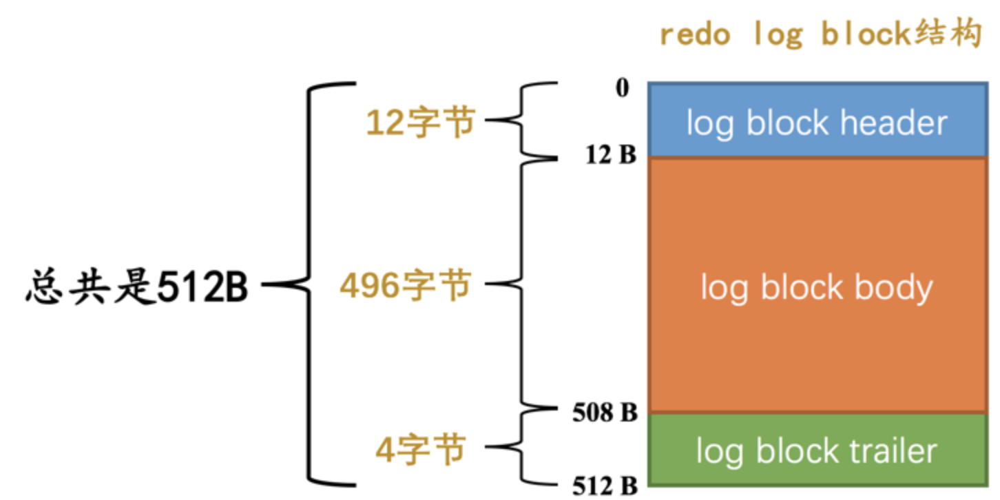

真正的`redo`日志都是存储到占用`496`字节大小的`log block body`中，图中的`log block header`和`log block trailer`存储的是一些管理信息：

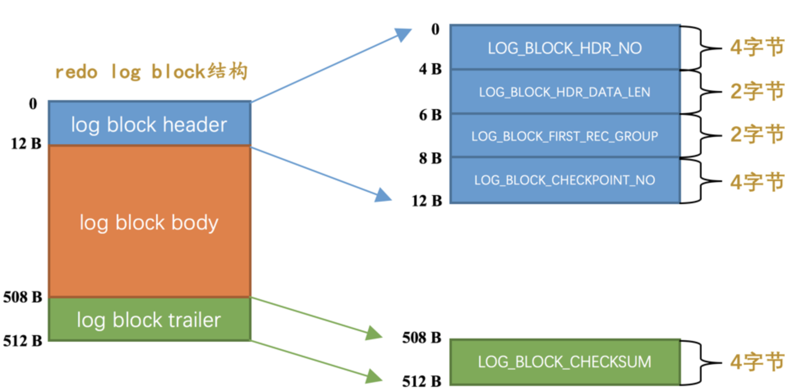

其中`log block header`的几个属性的意思分别如下：

- `LOG_BLOCK_HDR_NO`：每一个block都有一个大于0的唯一标号。
- `LOG_BLOCK_HDR_DATA_LEN`：表示block中已经使用了多少字节，初始值为`12`。
- `LOG_BLOCK_FIRST_REC_GROUP`：一个`mtr`会生产多条`redo`日志记录，这些`redo`日志记录被称之为一个`redo`日志记录组。`LOG_BLOCK_FIRST_REC_GROUP`就代表该block中第一个`mtr`生成的`redo`日志记录组的偏移量。
- `LOG_BLOCK_CHECKPOINT_NO`：`checkpoint`的序号。

`log block trailer`中属性的意思如下：

- `LOG_BLOCK_CHECKSUM`：表示block的校验值，用于正确性校验。

### redo日志缓冲区

在mysql服务器启动时就向操作系统申请了一大片称之为`redo log buffer`的连续内存空间。这片内存空间被划分成若干个连续的`redo log block`：

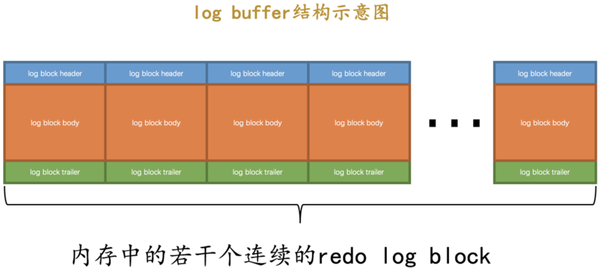

### redo日志写入log buffer

向`log buffer`写入`redo`日志的过程是顺序的，设计`InnoDB`的大叔提供了一个称之为`buf_free`的全局变量，该变量指明后续写入的`redo`日志应该写入到`log buffer`中的哪个位置，如图所示：

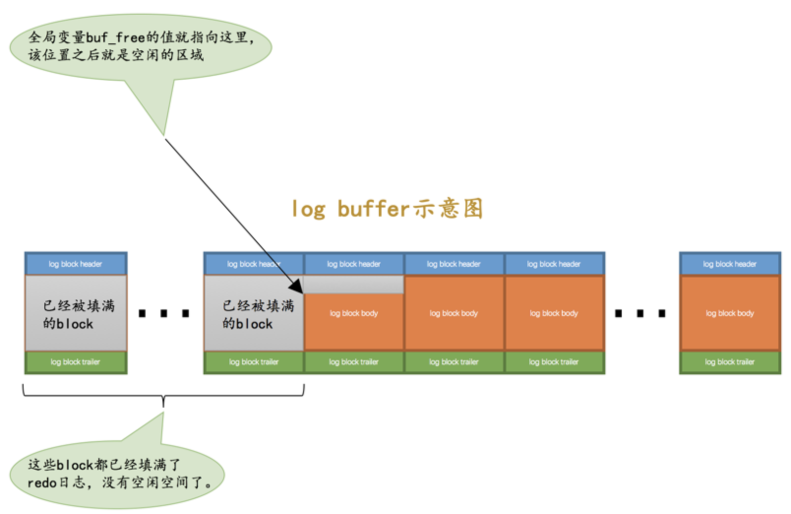

一个`mtr`执行过程中可能产生若干条`redo`日志，这些`redo`日志是一个不可分割的组，所以其实并不是每生成一条`redo`日志，就将其插入到`log buffer`中，而是每个`mtr`运行过程中产生的日志先暂时存到一个地方，当该`mtr`结束的时候，将过程中产生的一组`redo`日志再全部复制到`log buffer`中。不同的事务可能是并发执行的，所以`T1`、`T2`之间的`mtr`可能是交替执行的。每当一个`mtr`执行完成时，伴随该`mtr`生成的一组`redo`日志就需要被复制到`log buffer`中，也就是说不同事务的`mtr`可能是交替写入`log buffer`的。

### redo日志刷盘时机

`redo`日志在一些情况下它们会被刷新到磁盘里，比如：

- `log buffer`空间不足时

  `log buffer`的大小是有限的，如果当前写入`log buffer`的`redo`日志量已经占满了`log buffer`总容量的大约一半左右，就需要把这些日志刷新到磁盘上。

- 事务提交时

  在事务提交时可以不把修改过的`Buffer Pool`页面刷新到磁盘，但是为了保证持久性，必须要把修改这些页面对应的`redo`日志刷新到磁盘。

- 后台有一个线程，大约每秒都会刷新一次`log buffer`中的`redo`日志到磁盘。

- 正常关闭服务器时

- 所谓的`checkpoint`时

### redo日志文件组

`MySQL`的数据目录下默认有两个名为`ib_logfile0`和`ib_logfile1`的文件，`log buffer`中的日志默认情况下就是刷新到这两个磁盘文件中。如果我们对默认的`redo`日志文件不满意，可以调节参数指定`redo`日志文件的个数，默认值为2，最大值为100。

磁盘上的`redo`日志文件不只一个，而是以一个`日志文件组`的形式出现的。所以整个过程如下图所示：

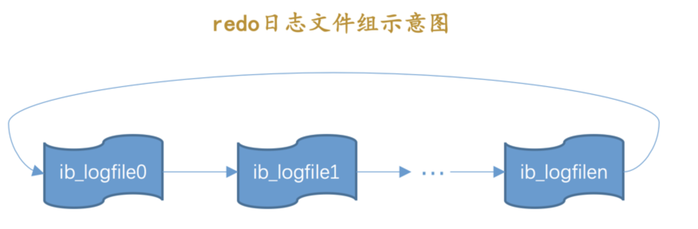

### redo日志文件格式

`redo`日志文件其实也是由若干个`512`字节大小的block组成。

`redo`日志文件组中的每个文件大小都一样，格式也一样，都是由两部分组成：

- 前2048个字节，也就是前4个block是用来存储一些管理信息的。
- 从第2048字节往后是用来存储`log buffer`中的block镜像的。

所以循环`使用redo日志文件，其实是从每个日志文件的第2048个字节开始算：

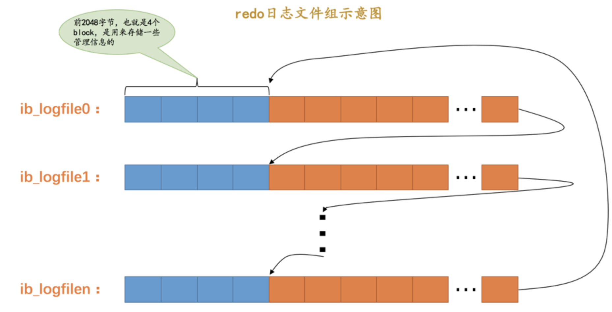

介绍一下每个`redo`日志文件前2048个字节，也就是前4个特殊block的格式都是干嘛的：

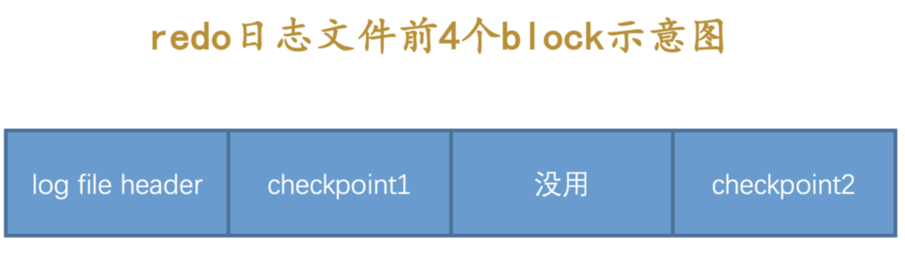各个属性的具体释义如下：

|         属性名         | 长度（字节） | 描述                                                         |
| :--------------------: | :----------: | :----------------------------------------------------------- |
|  `LOG_HEADER_FORMAT`   |     `4`      | `redo`日志的版本，在`MySQL 5.7.21`中该值永远为1              |
|   `LOG_HEADER_PAD1`    |     `4`      | 做字节填充用的，没什么实际意义，忽略～                       |
| `LOG_HEADER_START_LSN` |     `8`      | 标记本`redo`日志文件开始的LSN值，也就是文件偏移量为2048字节初对应的LSN值。 |
|  `LOG_HEADER_CREATOR`  |     `32`     | 一个字符串，标记本`redo`日志文件的创建者是谁。               |
|  `LOG_BLOCK_CHECKSUM`  |     `4`      | 本block的校验值，所有block都有，我们不关心                   |

从图中可以看出来，这4个block分别是：

- `log file header`：描述该`redo`日志文件的一些整体属性，看一下它的结构：

  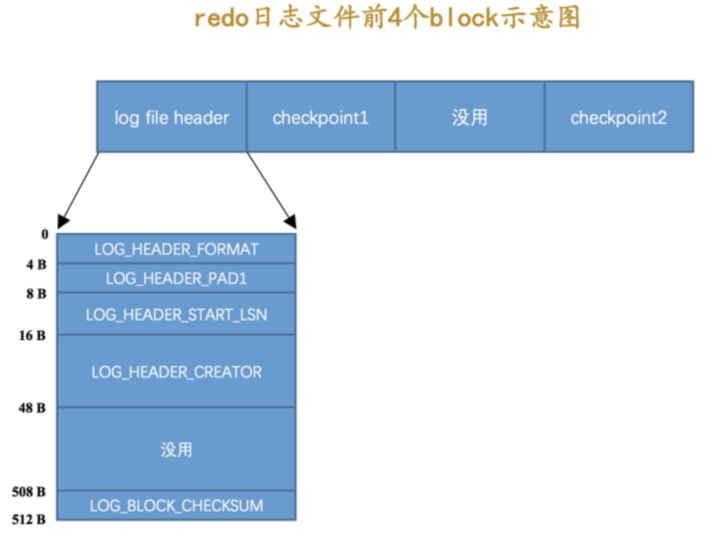

- `checkpoint1`：记录关于`checkpoint`的一些属性，看一下它的结构：

  各个属性的具体释义如下：

  |            属性名             | 长度（单位：字节） | 描述                                                         |
  | :---------------------------: | :----------------: | :----------------------------------------------------------- |
  |      `LOG_CHECKPOINT_NO`      |        `8`         | 服务器做`checkpoint`的编号，每做一次`checkpoint`，该值就加1。 |
  |     `LOG_CHECKPOINT_LSN`      |        `8`         | 服务器做`checkpoint`结束时对应的`LSN`值，系统奔溃恢复时将从该值开始。 |
  |    `LOG_CHECKPOINT_OFFSET`    |        `8`         | 上个属性中的`LSN`值在`redo`日志文件组中的偏移量              |
  | `LOG_CHECKPOINT_LOG_BUF_SIZE` |        `8`         | 服务器在做`checkpoint`操作时对应的`log buffer`的大小         |
  |     `LOG_BLOCK_CHECKSUM`      |        `4`         | 本block的校验值，所有block都有，我们不关心                   |

- `checkpoint2`：结构和`checkpoint1`一样。

## Log Sequeue Number

为记录已经写入的`redo`日志量，设计了一个称之为`Log Sequeue Number`的全局变量，翻译过来就是：`日志序列号`，简称`lsn`。规定初始的`lsn`值为`8704`。

在统计`lsn`的增长量时，是按照实际写入的日志量加上占用的`log block header`和`log block trailer`来计算的。我们来看一个例子：

- 系统第一次启动后初始化`log buffer`时，`buf_free`就会指向第一个`block`的偏移量为12字节的地方，那么`lsn`值也会跟着增加12：

  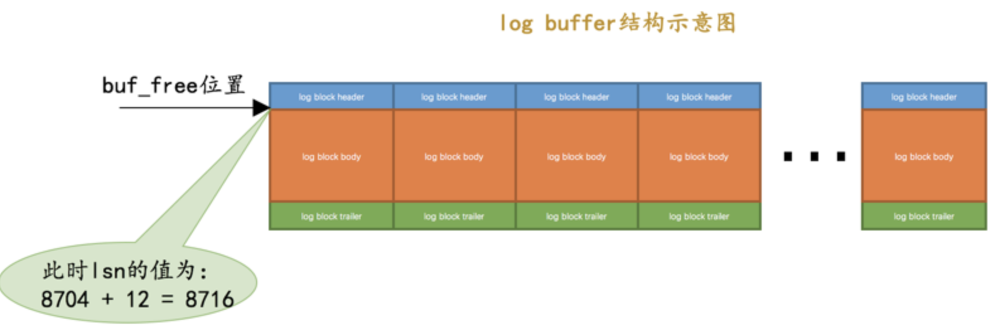

- 如果某个`mtr`产生的一组`redo`日志占用的存储空间比较小，也就是待插入的block剩余空闲空间能容纳这个`mtr`提交的日志时，`lsn`增长的量就是该`mtr`生成的`redo`日志占用的字节数。

- 如果某个`mtr`产生的一组`redo`日志占用的存储空间比较大，也就是待插入的block剩余空闲空间不足以容纳这个`mtr`提交的日志时，`lsn`增长的量就是该`mtr`生成的`redo`日志占用的字节数加上额外占用的`log block header`和`log block trailer`的字节数。

### flushed_to_disk_lsn

一个称之为`buf_next_to_write`的全局变量，标记当前`log buffer`中已经有哪些日志被刷新到磁盘中了：

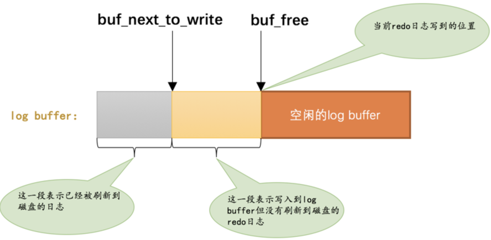

当有新的`redo`日志写入到`log buffer`时，首先`lsn`的值会增长，但`flushed_to_disk_lsn`不变，随后随着不断有`log buffer`中的日志被刷新到磁盘上，`flushed_to_disk_lsn`的值也跟着增长。如果两者的值相同时，说明log buffer中的所有redo日志都已经刷新到磁盘中了。

### flush链表中的LSN

在`mtr`结束时还有一件非常重要的事情要做，就是把在mtr执行过程中可能修改过的页面加入到Buffer Pool的flush链表。在这个过程中会在缓存页对应的控制块中记录两个关于页面何时修改的属性：

- `oldest_modification`：如果某个页面被加载到`Buffer Pool`后进行第一次修改，那么就将修改该页面的`mtr`开始时对应的`lsn`值写入这个属性。
- `newest_modification`：每修改一次页面，都会将修改该页面的`mtr`结束时对应的`lsn`值写入这个属性。也就是说该属性表示页面最近一次修改后对应的系统`lsn`值。

flush链表中的脏页按照修改发生的时间顺序进行排序，也就是按照oldest_modification代表的LSN值进行排序，被多次更新的页面不会重复插入到flush链表中，但是会更新newest_modification属性的值。

## checkpoint

判断某些redo日志占用的磁盘空间是否可以覆盖的依据就是它对应的脏页是否已经刷新到磁盘里：

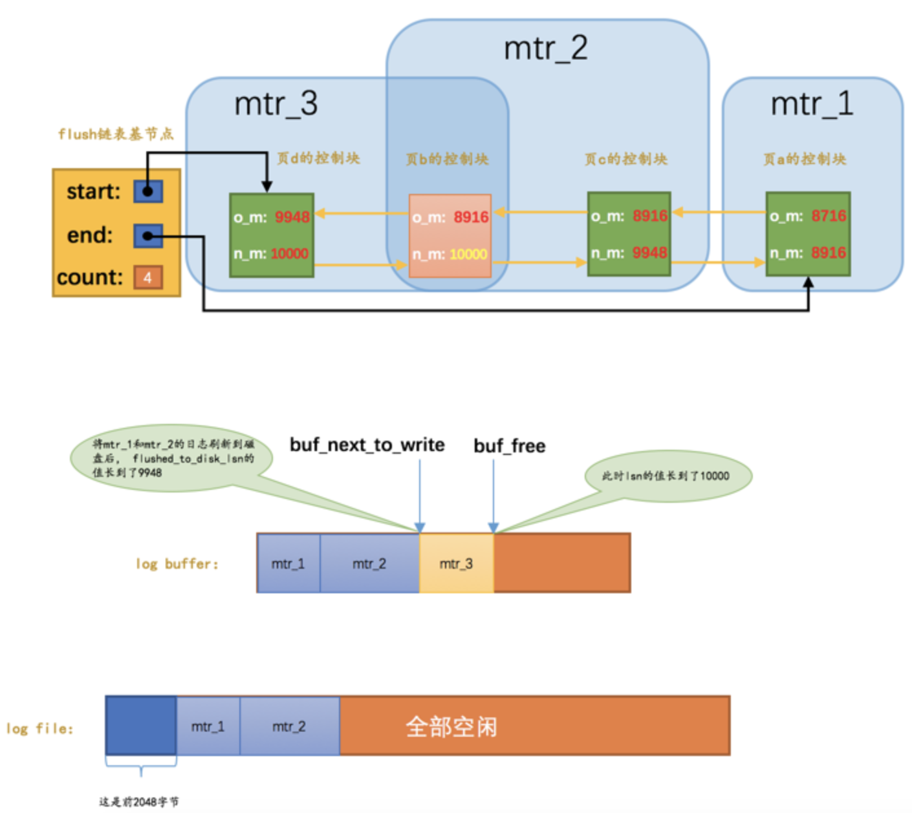

虽然`mtr_1`和`mtr_2`生成的`redo`日志都已经被写到了磁盘上，但是它们修改的脏页仍然留在`Buffer Pool`中，所以它们生成的`redo`日志在磁盘上的空间是不可以被覆盖的。如果`页a`被刷新到了磁盘，那么它对应的控制块就会从`flush链表`中移除：

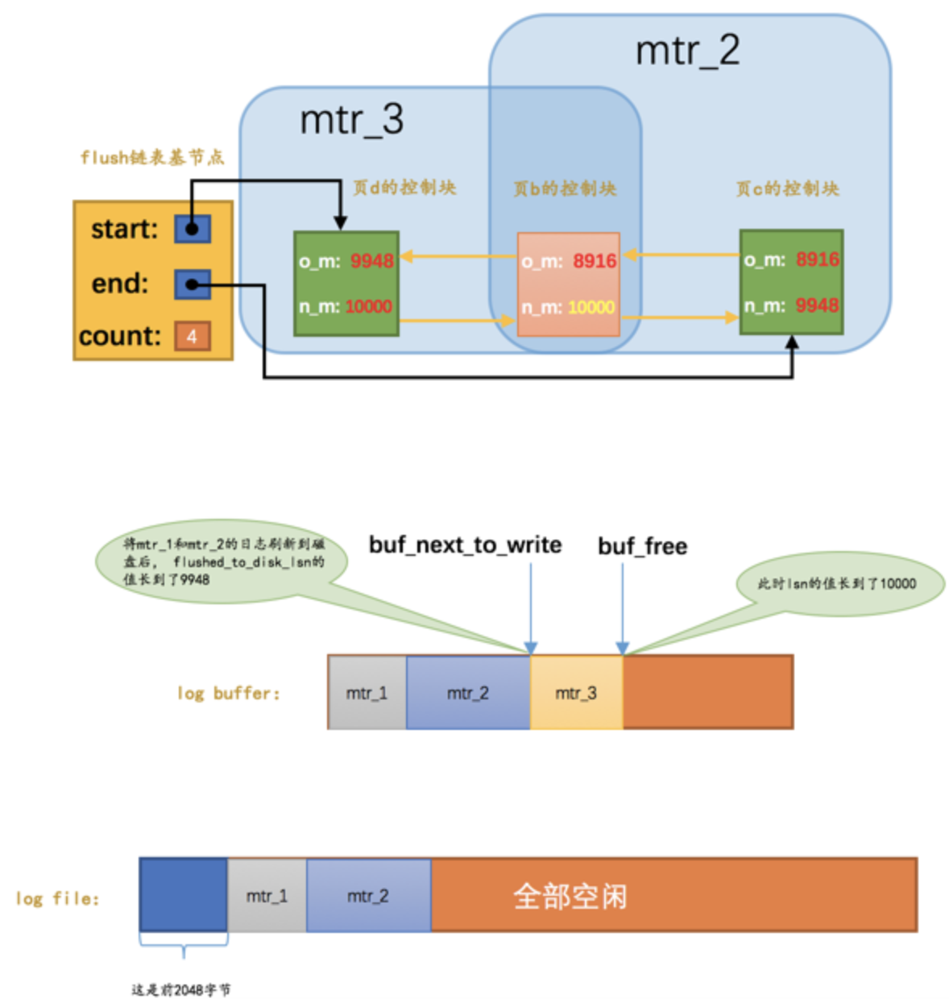

这样`mtr_1`生成的`redo`日志就没有用了，它们占用的磁盘空间就可以被覆盖掉了。设计`InnoDB`的大叔提出了一个全局变量`checkpoint_lsn`来代表当前系统中可以被覆盖的`redo`日志总量是多少，这个变量初始值也是`8704`。

比方说现在`页a`被刷新到了磁盘，`mtr_1`生成的`redo`日志就可以被覆盖了，所以我们可以进行一个增加`checkpoint_lsn`的操作，我们把这个过程称之为做一次`checkpoint`。做一次`checkpoint`其实可以分为两个步骤：

- 步骤一：计算一下当前系统中可以被覆盖的`redo`日志对应的`lsn`值最大是多少。
- 步骤二：将`checkpoint_lsn`和对应的`redo`日志文件组偏移量以及此次`checkpint`的编号写到日志文件的管理信息（就是`checkpoint1`或者`checkpoint2`）中。

记录完`checkpoint`的信息之后，`redo`日志文件组中各个`lsn`值的关系就像这样：

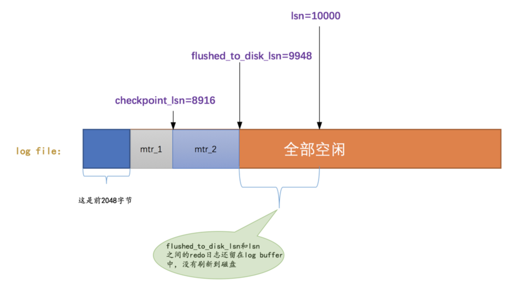

### 批量从flush链表中刷出脏页

如果当前系统修改页面的操作十分频繁，这样就导致写日志操作十分频繁，系统`lsn`值增长过快。如果后台的刷脏操作不能将脏页刷出，那么系统无法及时做`checkpoint`，可能就需要用户线程同步的从`flush链表`中把那些最早修改的脏页刷新到磁盘，这样这些脏页对应的`redo`日志就没用了，然后就可以去做`checkpoint`了。

## 崩溃恢复

### 确定恢复的起点

我们前边说过，`checkpoint_lsn`之前的`redo`日志都可以被覆盖，也就是说这些`redo`日志对应的脏页都已经被刷新到磁盘中了，既然它们已经被刷盘，我们就没必要恢复它们了。对于`checkpoint_lsn`之后的`redo`日志，它们对应的脏页可能没被刷盘，也可能被刷盘了，我们不能确定，所以需要从`checkpoint_lsn`开始读取`redo`日志来恢复页面。

当然，`redo`日志文件组的第一个文件的管理信息中有两个block都存储了`checkpoint_lsn`的信息，我们当然是要选取最近发生的那次checkpoint的信息。衡量`checkpoint`发生时间早晚的信息就是所谓的`checkpoint_no`，我们只要把`checkpoint1`和`checkpoint2`这两个block中的`checkpoint_no`值读出来比一下大小，哪个的`checkpoint_no`值更大，说明哪个block存储的就是最近的一次`checkpoint`信息。这样我们就能拿到最近发生的`checkpoint`对应的`checkpoint_lsn`值以及它在`redo`日志文件组中的偏移量`checkpoint_offset`。

### 确定恢复的终点

我们说在写`redo`日志的时候都是顺序写的，写满了一个block之后会再往下一个block中写：

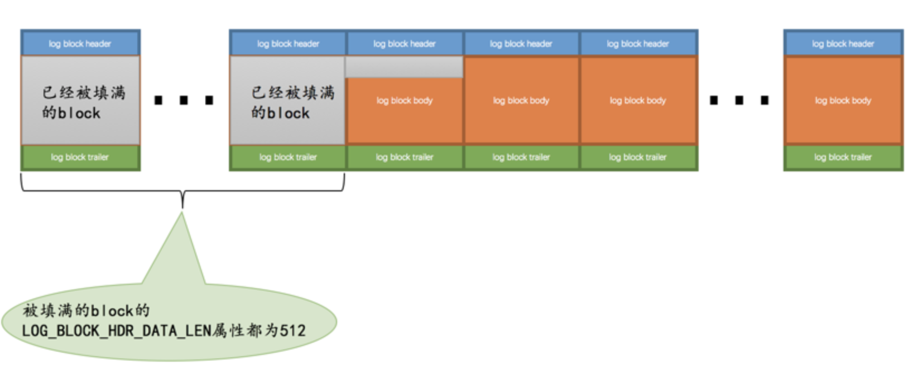

普通block的`log block header`部分有一个称之为`LOG_BLOCK_HDR_DATA_LEN`的属性，该属性值记录了当前block里使用了多少字节的空间。对于被填满的block来说，该值永远为`512`。如果该属性的值不为`512`，那么就是它了，它就是此次奔溃恢复中需要扫描的最后一个block。

### 怎么恢复

假设现在的`redo`日志文件中有5条`redo`日志，如图：

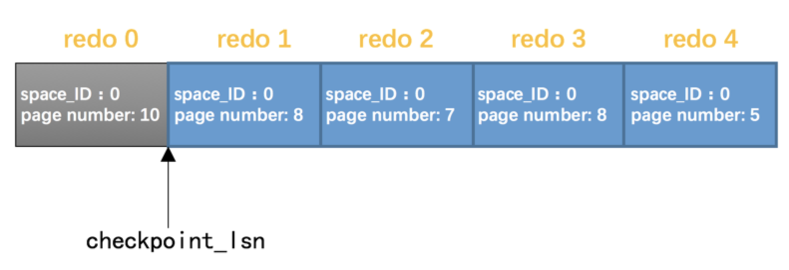

由于`redo 0`在`checkpoint_lsn`后边，恢复时可以不管它。我们现在可以按照`redo`日志的顺序依次扫描`checkpoint_lsn`之后的各条redo日志，按照日志中记载的内容将对应的页面恢复出来。这样没什么问题，不过设计`InnoDB`的大叔还是想了一些办法加快这个恢复的过程：

- 使用哈希表

  根据`redo`日志的`space ID`和`page number`属性计算出散列值，把`space ID`和`page number`相同的`redo`日志放到哈希表的同一个槽里，如果有多个`space ID`和`page number`都相同的`redo`日志，那么它们之间使用链表连接起来，按照生成的先后顺序链接起来的，之后就可以遍历哈希表，因为对同一个页面进行修改的`redo`日志都放在了一个槽里，所以可以一次性将一个页面修复好（避免了很多读取页面的随机IO），这样可以加快恢复速度。另外需要注意一点的是，同一个页面的`redo`日志是按照生成时间顺序进行排序的，所以恢复的时候也是按照这个顺序进行恢复，如果不按照生成时间顺序进行排序的话，那么可能出现错误。

- 跳过已经刷新到磁盘的页面

  每个页面都有一个称之为`File Header`的部分，在`File Header`里有一个称之为`FIL_PAGE_LSN`的属性，该属性记载了最近一次修改页面时对应的`lsn`值。如果在做了某次`checkpoint`之后有脏页被刷新到磁盘中，那么该页对应的`FIL_PAGE_LSN`代表的`lsn`值肯定大于`checkpoint_lsn`的值，凡是符合这种情况的页面就不需要重复执行lsn值小于`FIL_PAGE_LSN`的redo日志了，所以更进一步提升了奔溃恢复的速度。