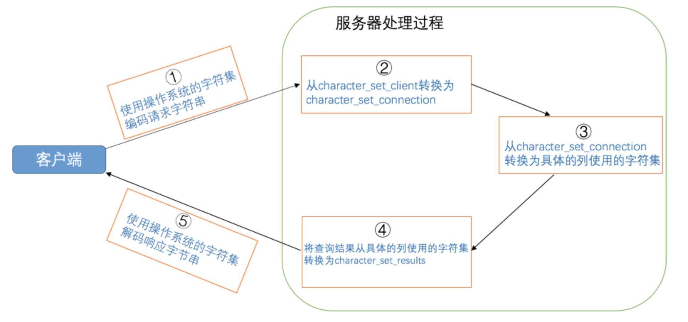

## MySQL中支持的字符集和比较规则

### MySQL中的utf8和utf8mb4

`utf8`字符集表示一个字符需要使用1～4个字节，但是我们常用的一些字符使用1～3个字节就可以表示了。而在`MySQL`中字符集表示一个字符所用最大字节长度在某些方面会影响系统的存储和性能，所以设计`MySQL`的大叔偷偷的定义了两个概念：

- `utf8mb3`：阉割过的`utf8`字符集，只使用1～3个字节表示字符。
- `utf8mb4`：正宗的`utf8`字符集，使用1～4个字节表示字符。

有一点需要大家十分的注意，在`MySQL`中`utf8`是`utf8mb3`的别名，所以之后在`MySQL`中提到`utf8`就意味着使用1~3个字节来表示一个字符，如果大家有使用4字节编码一个字符的情况，比如存储一些emoji表情啥的，那请使用`utf8mb4`。

## 字符集和比较规则的应用

### 各级别的字符集和比较规则

`MySQL`有4个级别的字符集和比较规则，分别是：

- 服务器级别
- 数据库级别
- 表级别
- 列级别

这4个级别字符集和比较规则的联系如下：

- 如果创建或修改列时没有显式的指定字符集和比较规则，则该列默认用表的字符集和比较规则
- 如果创建或修改表时没有显式的指定字符集和比较规则，则该表默认用数据库的字符集和比较规则
- 如果创建或修改数据库时没有显式的指定字符集和比较规则，则该数据库默认用服务器的字符集和比较规则

#### 仅修改字符集或仅修改比较规则

由于字符集和比较规则是互相有联系的，如果我们只修改了字符集，比较规则也会跟着变化，如果只修改了比较规则，字符集也会跟着变化，具体规则如下：

- 只修改字符集，则比较规则将变为修改后的字符集默认的比较规则。
- 只修改比较规则，则字符集将变为修改后的比较规则对应的字符集。

### 客户端和服务器通信中的字符集

#### 字符集转换的概念

如果接收`0xE68891`这个字节串的程序按照`utf8`字符集进行解码，然后又把它按照`gbk`字符集进行编码，最后编码后的字节串就是`0xCED2`，我们把这个过程称为`字符集的转换`，也就是字符串`'我'`从`utf8`字符集转换为`gbk`字符集。

#### MySQL中字符集的转换

我们知道从客户端发往服务器的请求本质上就是一个字符串，服务器向客户端返回的结果本质上也是一个字符串，而字符串其实是使用某种字符集编码的二进制数据。这个字符串可不是使用一种字符集的编码方式一条道走到黑的，从发送请求到返回结果这个过程中伴随着多次字符集的转换，在这个过程中会用到3个系统变量，我们先把它们写出来看一下：

|          系统变量          |                             描述                             |
| :------------------------: | :----------------------------------------------------------: |
|   `character_set_client`   |                 服务器解码请求时使用的字符集                 |
| `character_set_connection` | 服务器处理请求时会把请求字符串从`character_set_client`转为`character_set_connection` |
|  `character_set_results`   |             服务器向客户端返回数据时使用的字符集             |


这几个系统变量的默认值都是`utf8`，为了体现出字符集在请求处理过程中的变化，我们这里特意修改一个系统变量的值：

```
mysql> set character_set_connection = gbk;
Query OK, 0 rows affected (0.00 sec)
```

所以现在系统变量`character_set_client`和`character_set_results`的值还是`utf8`，而`character_set_connection`的值为`gbk`。现在假设我们客户端发送的请求是下边这个字符串：

```
SELECT * FROM t WHERE s = '我';
```

为了方便大家理解这个过程，我们只分析字符`'我'`在这个过程中字符集的转换。

现在看一下在请求从发送到结果返回过程中字符集的变化：



我们通常都把 ***character_set_client*** 、***character_set_connection***、***character_set_results*** 这三个系统变量设置成和客户端使用的字符集一致的情况，这样减少了很多无谓的字符集转换。

## 总结

1. `字符集`指的是某个字符范围的编码规则。

2. `比较规则`是针对某个字符集中的字符比较大小的一种规则。

3. 在`MySQL`中，一个字符集可以有若干种比较规则，其中有一个默认的比较规则，一个比较规则必须对应一个字符集。

4. 查看`MySQL`中查看支持的字符集和比较规则的语句如下：

   ```
   SHOW (CHARACTER SET|CHARSET) [LIKE 匹配的模式];
   SHOW COLLATION [LIKE 匹配的模式];
   ```

5. MySQL有四个级别的字符集和比较规则

- 服务器级别

  `character_set_server`表示服务器级别的字符集，`collation_server`表示服务器级别的比较规则。

- 数据库级别

  创建和修改数据库时可以指定字符集和比较规则：

  ```
  CREATE DATABASE 数据库名
      [[DEFAULT] CHARACTER SET 字符集名称]
      [[DEFAULT] COLLATE 比较规则名称];
  
  ALTER DATABASE 数据库名
      [[DEFAULT] CHARACTER SET 字符集名称]
      [[DEFAULT] COLLATE 比较规则名称];
  ```

  `character_set_database`表示当前数据库的字符集，`collation_database`表示当前默认数据库的比较规则，这两个系统变量是只读的，不能修改。如果没有指定当前默认数据库，则变量与相应的服务器级系统变量具有相同的值。

- 表级别

  创建和修改表的时候指定表的字符集和比较规则：

  ```
  CREATE TABLE 表名 (列的信息)
      [[DEFAULT] CHARACTER SET 字符集名称]
      [COLLATE 比较规则名称]];
  
  ALTER TABLE 表名
      [[DEFAULT] CHARACTER SET 字符集名称]
      [COLLATE 比较规则名称];
  ```

- 列级别

  创建和修改列定义的时候可以指定该列的字符集和比较规则：

  ```
  CREATE TABLE 表名(
      列名 字符串类型 [CHARACTER SET 字符集名称] [COLLATE 比较规则名称],
      其他列...
  );
  
  ALTER TABLE 表名 MODIFY 列名 字符串类型 [CHARACTER SET 字符集名称] [COLLATE 比较规则名称];
  ```

1. 从发送请求到接收结果过程中发生的字符集转换：
2. 比较规则的作用通常体现比较字符串大小的表达式以及对某个字符串列进行排序中。