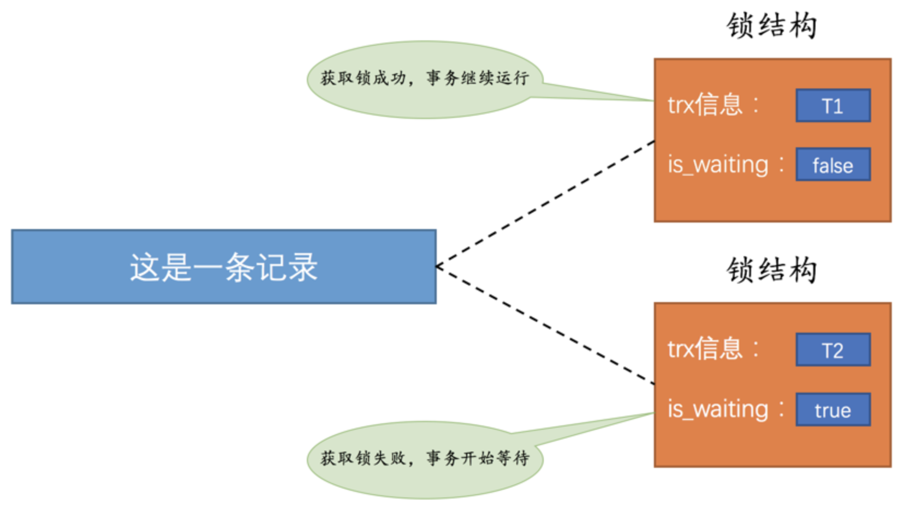
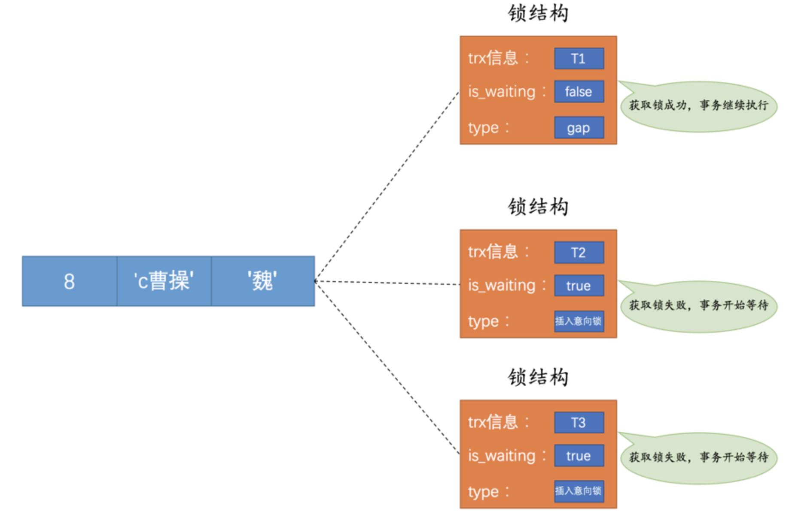

## 解决并发事务带来问题的两种基本方式

上一章唠叨了事务并发执行时可能带来的各种问题，并发事务访问相同记录的情况大致可以划分为3种：

- `读-读`情况：并不会引起什么问题，所以允许这种情况的发生。

- `写-写`情况：这种情况下会发生`脏写`问题，任何一种隔离级别都不允许这种问题的发生。所以在多个未提交事务相继对一条记录做改动时，需要让它们排队执行，这个排队的过程其实是通过`锁`来实现的。这个所谓的`锁`其实是一个内存中的结构，在事务执行前本来是没有锁的，也就是说一开始是没有`锁结构`和记录进行关联的：

  

  当一个事务想对这条记录做改动时，首先会看看内存中有没有与这条记录关联的`锁结构`，当没有的时候就会在内存中生成一个`锁结构`与之关联。比方说事务`T1`要对这条记录做改动，就需要生成一个`锁结构`与之关联：

  

  其实在`锁结构`里有两个比较重要的属性：

  - `trx信息`：代表这个锁结构是哪个事务生成的。
  - `is_waiting`：代表当前事务是否在等待。

  当事务`T1`改动了这条记录后，就生成了一个`锁结构`与该记录关联，因为之前没有别的事务为这条记录加锁，所以`is_waiting`属性就是`false`，我们把这个场景就称之为获取锁成功，然后就可以继续执行操作了。

  在事务`T1`提交之前，另一个事务`T2`也想对该记录做改动，那么先去看看有没有`锁结构`与这条记录关联，发现有一个`锁结构`与之关联后，然后也生成了一个`锁结构`与这条记录关联，不过`锁结构`的`is_waiting`属性值为`true`，表示当前事务需要等待，：

  

  在事务`T1`提交之后，就会把该事务生成的`锁结构`释放掉，然后看看还有没有别的事务在等待获取锁，然后把事务`T2`对应的锁结构的`is_waiting`属性设置为`false`，把该事务对应的线程唤醒，让它继续执行：

  

- `读-写`或`写-读`情况：也就是一个事务进行读取操作，另一个进行改动操作。

  我们前边说过，这种情况下可能发生`脏读`、`不可重复读`、`幻读`的问题。

  > 小贴士： 幻读问题的产生是因为某个事务读了一个范围的记录，之后别的事务在该范围内插入了新记录，该事务再次读取该范围的记录时，可以读到新插入的记录，所以幻读问题准确的说并不是因为读取和写入一条相同记录而产生的，这一点要注意一下。

  怎么解决`脏读`、`不可重复读`、`幻读`这些问题呢？其实有两种可选的解决方案：

  - 方案一：读操作利用多版本并发控制（`MVCC`），写操作进行`加锁`。

    `MVCC`就是通过生成一个`ReadView`，然后通过`ReadView`找到符合条件的记录版本，其实就像是在生成`ReadView`的那个时刻做了一次时间静止，查询语句只能读到在生成`ReadView`之前已提交事务所做的更改，在生成`ReadView`之前未提交的事务或者之后才开启的事务所做的更改是看不到的。而写操作肯定针对的是最新版本的记录，读记录的历史版本和改动记录的最新版本本身并不冲突，也就是采用`MVCC`时，`读-写`操作并不冲突。

    > 小贴士： 我们说过普通的SELECT语句在READ COMMITTED和REPEATABLE READ隔离级别下会使用到MVCC读取记录。在READ COMMITTED隔离级别下，一个事务在执行过程中每次执行SELECT操作时都会生成一个ReadView，ReadView的存在本身就保证了事务不可以读取到未提交的事务所做的更改，也就是避免了脏读现象；REPEATABLE READ隔离级别下，一个事务在执行过程中只有第一次执行SELECT操作才会生成一个ReadView，之后的SELECT操作都复用这个ReadView，这样也就避免了不可重复读和幻读的问题。

  - 方案二：读、写操作都采用`加锁`的方式。

    我们的一些业务场景不允许读取记录的旧版本，而是每次都必须去读取记录的最新版本，比方在银行存款的事务中，你需要先把账户的余额读出来，然后将其加上本次存款的数额，最后再写到数据库中。在将账户余额读取出来后，就不想让别的事务再访问该余额，直到本次存款事务执行完成，其他事务才可以访问账户的余额。这样在读取记录的时候也就需要对其进行`加锁`操作，这样也就意味着`读`操作和`写`操作也像`写-写`操作那样排队执行。

    > 小贴士： 我们说脏读的产生是因为当前事务读取了另一个未提交事务写的一条记录，如果另一个事务在写记录的时候就给这条记录加锁，那么当前事务就无法继续读取该记录了，所以也就不会有脏读问题的产生了。不可重复读的产生是因为当前事务先读取一条记录，另外一个事务对该记录做了改动之后并提交之后，当前事务再次读取时会获得不同的值，如果在当前事务读取记录时就给该记录加锁，那么另一个事务就无法修改该记录，自然也不会发生不可重复读了。我们说幻读问题的产生是因为当前事务读取了一个范围的记录，然后另外的事务向该范围内插入了新记录，当前事务再次读取该范围的记录时发现了新插入的新记录，我们把新插入的那些记录称之为幻影记录。采用加锁的方式解决幻读问题就有那么一丢丢麻烦了，因为当前事务在第一次读取记录时那些幻影记录并不存在，所以读取的时候加锁就有点尴尬 —— 因为你并不知道给谁加锁，没关系，这难不倒设计InnoDB的大叔的，我们稍后揭晓答案，稍安勿躁。

  很明显，采用`MVCC`方式的话，`读-写`操作彼此并不冲突，性能更高，采用`加锁`方式的话，`读-写`操作彼此需要排队执行，影响性能。一般情况下我们当然愿意采用`MVCC`来解决`读-写`操作并发执行的问题，但是业务在某些特殊情况下，要求必须采用`加锁`的方式执行，那也是没有办法的事。

### 一致性读

事务利用`MVCC`进行的读取操作称之为`一致性读`，或者`一致性无锁读`，有的地方也称之为`快照读`。所有普通的`SELECT`语句（`plain SELECT`）在`READ COMMITTED`、`REPEATABLE READ`隔离级别下都算是`一致性读`，`一致性读`并不会对表中的任何记录做`加锁`操作，其他事务可以自由的对表中的记录做改动。

### 锁定读（Locking Reads）

#### 共享锁和独占锁

在使用`加锁`的方式解决问题时，由于既要允许`读-读`情况不受影响，又要使`写-写`、`读-写`或`写-读`情况中的操作相互阻塞，所以设计`MySQL`的大叔给锁分了个类：

- `共享锁`，简称`S锁`。在事务要读取一条记录时，需要先获取该记录的`S锁`。
- `独占锁`，也常称`排他锁`，简称`X锁`。在事务要改动一条记录时，需要先获取该记录的`X锁`。

`S锁`和`S锁`是兼容的，`S锁`和`X锁`是不兼容的，`X锁`和`X锁`也是不兼容的

#### 锁定读的语句

我们前边说在采用`加锁`方式解决`脏读`、`不可重复读`、`幻读`这些问题时，读取一条记录时需要获取一下该记录的`S锁`，其实这是不严谨的，有时候想在读取记录时就获取记录的`X锁`，来禁止别的事务读写该记录，为此设计`MySQL`的大叔提出了两种比较特殊的`SELECT`语句格式：

- 对读取的记录加`S锁`：

  ```mysql
  SELECT ... LOCK IN SHARE MODE;
  ```

- 对读取的记录加`X锁`：

  ```mysql
  SELECT ... FOR UPDATE;
  ```

### 写操作

平常所用到的`写操作`无非是`DELETE`、`UPDATE`、`INSERT`这三种：

- `DELETE`：

  对一条记录做`DELETE`操作的过程其实是先在`B+`树中定位到这条记录的位置，然后获取一下这条记录的`X锁`，然后再执行`delete mark`操作。我们也可以把这个定位待删除记录在`B+`树中位置的过程看成是一个获取`X锁`的`锁定读`。

- `UPDATE`：

  在对一条记录做`UPDATE`操作时分为三种情况：

  - 如果未修改该记录的键值并且被更新的列占用的存储空间在修改前后未发生变化，则先在`B+`树中定位到这条记录的位置，然后再获取一下记录的`X锁`，最后在原记录的位置进行修改操作。其实我们也可以把这个定位待修改记录在`B+`树中位置的过程看成是一个获取`X锁`的`锁定读`。
  - 如果未修改该记录的键值并且至少有一个被更新的列占用的存储空间在修改前后发生变化，则先在`B+`树中定位到这条记录的位置，然后获取一下记录的`X锁`，将该记录彻底移入垃圾链表，最后再插入一条新记录。这个定位待修改记录在`B+`树中位置的过程看成是一个获取`X锁`的`锁定读`，新插入的记录由`INSERT`操作提供的`隐式锁`进行保护。
  - 如果修改了该记录的键值，则相当于在原记录上做`DELETE`操作之后再来一次`INSERT`操作，加锁操作就需要按照`DELETE`和`INSERT`的规则进行了。

- `INSERT`：

  一般情况下，新插入一条记录的操作并不加锁，设计`InnoDB`的大叔通过一种称之为`隐式锁`的东东来保护这条新插入的记录在本事务提交前不被别的事务访问。

## 多粒度锁

前边提到的`锁`都是针对记录的，也可以被称之为`行级锁`或者`行锁`，这个锁的粒度比较细；其实一个事务也可以在`表`级别进行加锁，自然就被称之为`表级锁`或者`表锁`，这个锁的粒度比较粗。给表加的锁也可以分为`共享锁`和`独占锁`。

我们在对表加锁时，怎么知道表中有没有行已经被上锁了呢？于是设计`InnoDB`的大叔们提出了`意向锁`：

- 意向共享锁，简称`IS锁`。当事务准备在某条记录上加`S锁`时，需要先在表级别加一个`IS锁`。
- 意向独占锁，简称`IX锁`。当事务准备在某条记录上加`X锁`时，需要先在表级别加一个`IX锁`。

总结一下：IS、IX锁是表级锁，它们的提出仅仅为了在之后加表级别的S锁和X锁时可以快速判断表中的记录是否被上锁，以避免用遍历的方式来查看表中有没有上锁的记录，也就是说其实IS锁和IX锁是兼容的，IX锁和IX锁是兼容的。我们画个表来看一下表级别的各种锁的兼容性：

| 兼容性 |  `X`   |  `IX`  |  `S`   |  `IS`  |
| :----: | :----: | :----: | :----: | :----: |
|  `X`   | 不兼容 | 不兼容 | 不兼容 | 不兼容 |
|  `IX`  | 不兼容 |  兼容  | 不兼容 |  兼容  |
|  `S`   | 不兼容 | 不兼容 |  兼容  |  兼容  |
|  `IS`  | 不兼容 |  兼容  |  兼容  |  兼容  |

## MySQL中的行锁和表锁

### InnoDB存储引擎中的锁

`InnoDB`存储引擎既支持表锁，也支持行锁。表锁实现简单，占用资源较少，不过粒度很粗，有时候你仅仅需要锁住几条记录，但使用表锁的话相当于为表中的所有记录都加锁，所以性能比较差。行锁粒度更细，可以实现更精准的并发控制。

#### InnoDB中的表级锁

- 表级别的`S锁`、`X锁`

  在对某个表执行`SELECT`、`INSERT`、`DELETE`、`UPDATE`语句时，`InnoDB`不会添加表级别的`S锁`或者`X锁`。

  在对某个表执行一些诸如`ALTER TABLE`、`DROP TABLE`这类的`DDL`语句时，其他事务对这个表并发执行诸如`SELECT`、`INSERT`、`DELETE`、`UPDATE`的语句会发生阻塞，同理，某个事务中对某个表执行`SELECT`、`INSERT`、`DELETE`、`UPDATE`语句时，在其他会话中对这个表执行`DDL`语句也会发生阻塞。这个过程其实是通过在`server层`使用`元数据锁`来实现的，一般情况下也不会使用`InnoDB`存储引擎自己提供的表级别的`S锁`和`X锁`。

- 表级别的`IS锁`、`IX锁`

- 表级别的`AUTO-INC锁`

  在使用`MySQL`过程中，我们可以为表的某个列添加`AUTO_INCREMENT`属性，之后在插入记录时，可以不指定该列的值，系统会自动为它赋上递增的值。

  系统实现这种自动给`AUTO_INCREMENT`修饰的列递增赋值的原理主要是两个：

  - 采用`AUTO-INC`锁，也就是在执行插入语句时就在表级别加一个`AUTO-INC`锁，然后为每条待插入记录的`AUTO_INCREMENT`修饰的列分配递增的值，在该语句执行结束后，再把`AUTO-INC`锁释放掉。这样一个事务在持有`AUTO-INC`锁的过程中，其他事务的插入语句都要被阻塞，可以保证一个语句中分配的递增值是连续的。

  - 采用一个轻量级的锁，在为插入语句生成`AUTO_INCREMENT`修饰的列的值时获取一下这个轻量级锁，然后生成本次插入语句需要用到的`AUTO_INCREMENT`列的值之后，就把该轻量级锁释放掉，并不需要等到整个插入语句执行完才释放锁。

    如果我们的插入语句在执行前就可以确定具体要插入多少条记录，比方说我们上边举的关于表`t`的例子中，在语句执行前就可以确定要插入2条记录，那么一般采用轻量级锁的方式对`AUTO_INCREMENT`修饰的列进行赋值。这种方式可以避免锁定表，可以提升插入性能。

#### InnoDB中的行级锁

即使对同一条记录加`行锁`，如果类型不同，起到的功效也是不同的。先将之前唠叨`MVCC`时用到的表抄一遍：

```mysql
CREATE TABLE hero (
    number INT,
    name VARCHAR(100),
    country varchar(100),
    PRIMARY KEY (number)
) Engine=InnoDB CHARSET=utf8;
```

我们主要是想用这个表存储三国时的英雄，然后向这个表里插入几条记录：

```mysql
INSERT INTO hero VALUES
    (1, 'l刘备', '蜀'),
    (3, 'z诸葛亮', '蜀'),
    (8, 'c曹操', '魏'),
    (15, 'x荀彧', '魏'),
    (20, 's孙权', '吴');
```

现在准备工作做完了，下边我们来看看都有哪些常用的`行锁类型`。

- `Record Locks`：

  我们前边提到的记录锁就是这种类型，也就是仅仅把一条记录锁上，我决定给这种类型的锁起一个比较不正经的名字：`正经记录锁`。官方的类型名称为：`LOCK_REC_NOT_GAP`。比方说我们把`number`值为`8`的那条记录加一个`正经记录锁`的示意图如下：

  

  `正经记录锁`是有`S锁`和`X锁`之分的，我们分别称之为`S型正经记录锁`和`X型正经记录锁`

- `Gap Locks`：

  我们说`MySQL`在`REPEATABLE READ`隔离级别下是可以解决幻读问题的，解决方案有两种，可以使用`MVCC`方案解决，也可以采用`加锁`方案解决。但是在使用`加锁`方案解决时有个大问题，就是事务在第一次执行读取操作时，那些幻影记录尚不存在，我们无法给这些幻影记录加上`正经记录锁`。不过这难不倒设计`InnoDB`的大叔，他们提出了`gap锁`。比方说我们把`number`值为`8`的那条记录加一个`gap锁`的示意图如下：

  

  如图中为`number`值为`8`的记录加了`gap锁`，意味着不允许别的事务在`number`值为`8`的记录前边的`间隙`插入新记录，其实就是`number`列的值`(3, 8)`这个区间的新记录是不允许立即插入的。比方说有另外一个事务再想插入一条`number`值为`4`的新记录，它定位到该条新记录的下一条记录的`number`值为8，而这条记录上又有一个`gap锁`，所以就会阻塞插入操作，直到拥有这个`gap锁`的事务提交了之后，`number`列的值在区间`(3, 8)`中的新记录才可以被插入。

  这个`gap锁`的提出仅仅是为了防止插入幻影记录而提出的，给一条记录加了`gap锁`只是不允许其他事务往这条记录前边的间隙插入新记录，那对于最后一条记录之后的间隙，也就是说给哪条记录加`gap锁`才能阻止其他事务插入`number`值在`(20, +∞)`这个区间的新记录呢？这时候应该想起我们在前边唠叨`数据页`时介绍的两条伪记录了：

  - `Infimum`记录，表示该页面中最小的记录。
  - `Supremum`记录，表示该页面中最大的记录。

  为了实现阻止其他事务插入`number`值在`(20, +∞)`这个区间的新记录，我们可以给索引中的最后一条记录，也就是`number`值为`20`的那条记录所在页面的`Supremum`记录加上一个`gap锁`，画个图就是这样：

  

  这样就可以阻止其他事务插入`number`值在`(20, +∞)`这个区间的新记录。

- `Next-Key Locks`：

  有时候我们既想锁住某条记录，又想阻止其他事务在该记录前边的`间隙`插入新记录，所以设计`InnoDB`的大叔们就提出了一种称之为`Next-Key Locks`的锁，官方的类型名称为：`LOCK_ORDINARY`，我们也可以简称为`next-key锁`。比方说我们把`number`值为`8`的那条记录加一个`next-key锁`的示意图如下：

  

  `next-key锁`的本质就是一个`正经记录锁`和一个`gap锁`的合体，它既能保护该条记录，又能阻止别的事务将新记录插入被保护记录前边的`间隙`。

- `Insert Intention Locks`：

  我们说一个事务在插入一条记录时需要判断一下插入位置是不是被别的事务加了所谓的`gap锁`，如果有的话，插入操作需要等待，直到拥有`gap锁`的那个事务提交。但是设计`InnoDB`的大叔规定事务在等待的时候也需要在内存中生成一个`锁结构`，表明有事务想在某个`间隙`中插入新记录，但是现在在等待。设计`InnoDB`的大叔就把这种类型的锁命名为`Insert Intention Locks`，官方的类型名称为：`LOCK_INSERT_INTENTION`，我们也可以称为`插入意向锁`。

  比方说我们把`number`值为`8`的那条记录加一个`插入意向锁`的示意图如下：

  

  比方说现在`T1`为`number`值为`8`的记录加了一个`gap锁`，然后`T2`和`T3`分别想向`hero`表中插入`number`值分别为`4`、`5`的两条记录，所以现在为`number`值为`8`的记录加的锁的示意图就如下所示：

  

  由于`T1`持有`gap锁`，所以`T2`和`T3`需要生成一个`插入意向锁`的`锁结构`并且处于等待状态。当`T1`提交后会把它获取到的锁都释放掉，这样`T2`和`T3`就能获取到对应的`插入意向锁`了，`T2`和`T3`之间也并不会相互阻塞，它们可以同时获取到`number`值为8的`插入意向锁`，然后执行插入操作。事实上插入意向锁并不会阻止别的事务继续获取该记录上任何类型的锁（`插入意向锁`就是这么鸡肋）。