`InnoDB`数据页和记录的关系示意图如下：

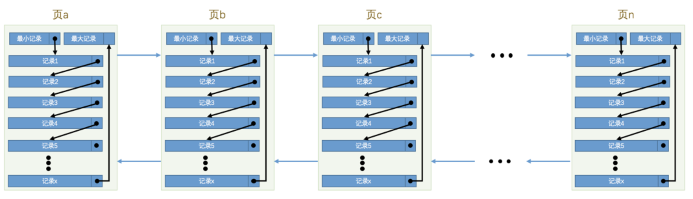

## 没有索引的查找

### 在一个页中的查找

假设目前表中的记录比较少，所有的记录都可以被存放到一个页中，在查找记录的时候可以根据搜索条件的不同分为两种情况：

- 以主键为搜索条件

  这个查找过程我们已经很熟悉了，可以在`页目录`中使用二分法快速定位到对应的槽，然后再遍历该槽对应分组中的记录即可快速找到指定的记录。

- 以其他列作为搜索条件

  这种情况下只能从`最小记录`开始依次遍历单链表中的每条记录，然后对比每条记录是不是符合搜索条件。很显然，这种查找的效率是非常低的。

### 在很多页中查找

大部分情况下我们表中存放的记录都是非常多的，需要好多的数据页来存储这些记录。在很多页中查找记录的话可以分为两个步骤：

1. 定位到记录所在的页。
2. 从所在的页内中查找相应的记录。

在没有索引的情况下，不论是根据主键列或者其他列的值进行查找，由于我们并不能快速的定位到记录所在的页，所以只能从第一个页沿着双向链表一直往下找，在每一个页中根据我们刚刚唠叨过的查找方式去查找指定的记录。因为要遍历所有的数据页，所以这种方式显然是超级耗时的。

## 索引

为了故事的顺利发展，我们先建一个表：

```mysql
mysql> CREATE TABLE index_demo(
    ->     c1 INT,
    ->     c2 INT,
    ->     c3 CHAR(1),
    ->     PRIMARY KEY(c1)
    -> ) ROW_FORMAT = Compact;
Query OK, 0 rows affected (0.03 sec)
```

这个新建的`index_demo`表中有2个`INT`类型的列，1个`CHAR(1)`类型的列，而且我们规定了`c1`列为主键，这个表使用`Compact`行格式来实际存储记录的。为了我们理解上的方便，我们简化了一下`index_demo`表的行格式示意图：

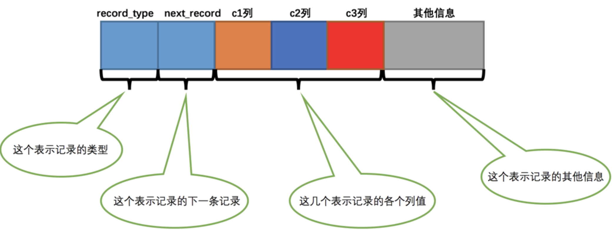

我们只在示意图里展示记录的这几个部分：

- `record_type`：记录头信息的一项属性，表示记录的类型，`0`表示普通记录、`2`表示最小记录、`3`表示最大记录、`1`我们还没用过，等会再说～
- `next_record`：记录头信息的一项属性，表示下一条地址相对于本条记录的地址偏移量，为了方便大家理解，我们都会用箭头来表明下一条记录是谁。
- `各个列的值`：这里只记录在`index_demo`表中的三个列，分别是`c1`、`c2`和`c3`。
- `其他信息`：除了上述3种信息以外的所有信息，包括其他隐藏列的值以及记录的额外信息。

为了节省篇幅，我们之后的示意图中会把记录的`其他信息`这个部分省略掉，所以将记录格式示意图的`其他信息`去掉并把它竖起来的效果就是这样：

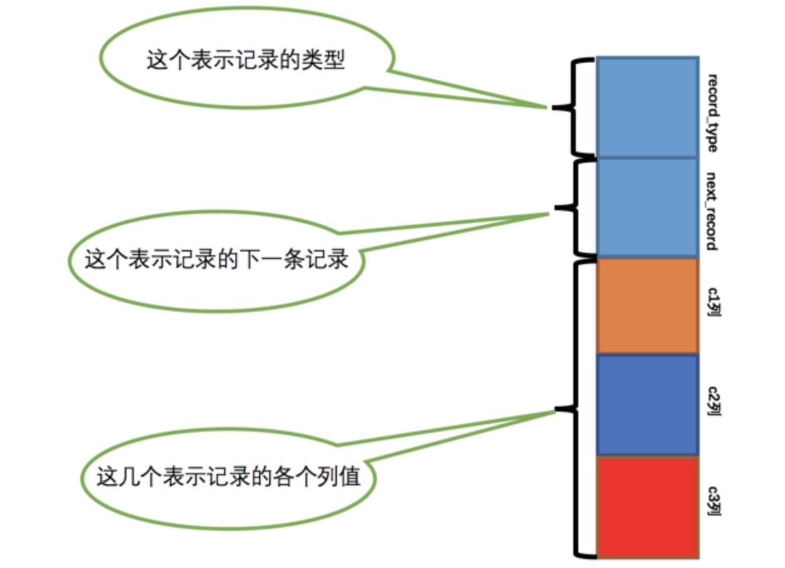

把一些记录放到页里边的示意图就是：

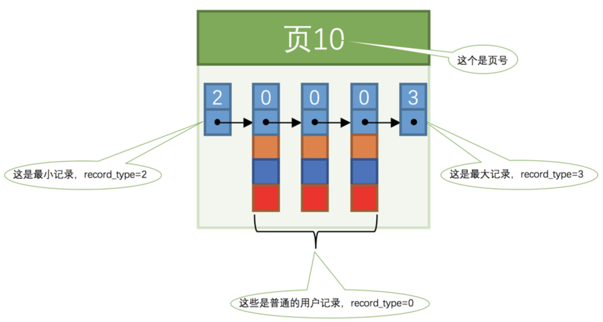

### 一个简单的索引方案

我们可以想办法为快速定位记录所在的数据页而建立一个别的目录，建这个目录必须完成下边这些事：

- 下一个数据页中用户记录的主键值必须大于上一个页中用户记录的主键值。

  假设我们的每个数据页最多能存放3条记录，之后我们向`index_demo`表插入3条记录：

  ```mysql
  mysql> INSERT INTO index_demo VALUES(1, 4, 'u'), (3, 9, 'd'), (5, 3, 'y');
  Query OK, 3 rows affected (0.01 sec)
  Records: 3  Duplicates: 0  Warnings: 0
  ```

  那么这些记录已经按照主键值的大小串联成一个单向链表了，如图所示：

  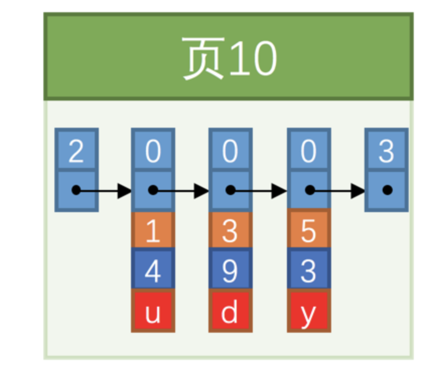

  从图中可以看出来，`index_demo`表中的3条记录都被插入到了编号为`10`的数据页中了。此时我们再来插入一条记录：

  ```mysql
  mysql> INSERT INTO index_demo VALUES(4, 4, 'a');
  Query OK, 1 row affected (0.00 sec)
  ```

  因为`页10`最多只能放3条记录，所以我们不得不再分配一个新页：

  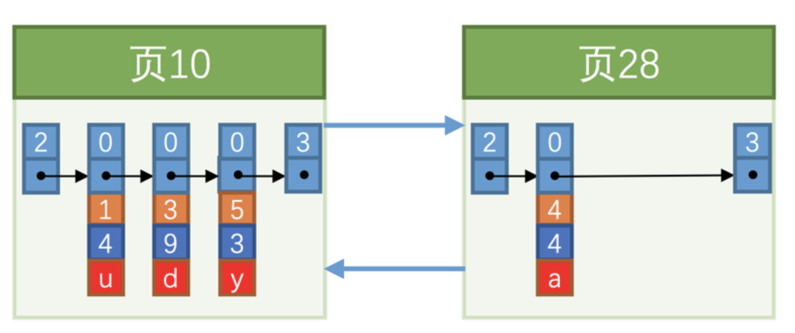

  新分配的数据页编号可能并不是连续的，另外，`页10`中用户记录最大的主键值是`5`，而`页28`中有一条记录的主键值是`4`，因为`5 > 4`，所以这就不符合下一个数据页中用户记录的主键值必须大于上一个页中用户记录的主键值的要求，所以需要一次记录移动，把主键值为`5`的记录移动到`页28`中，然后再把主键值为`4`的记录插入到`页10`中，这个过程的示意图如下：

  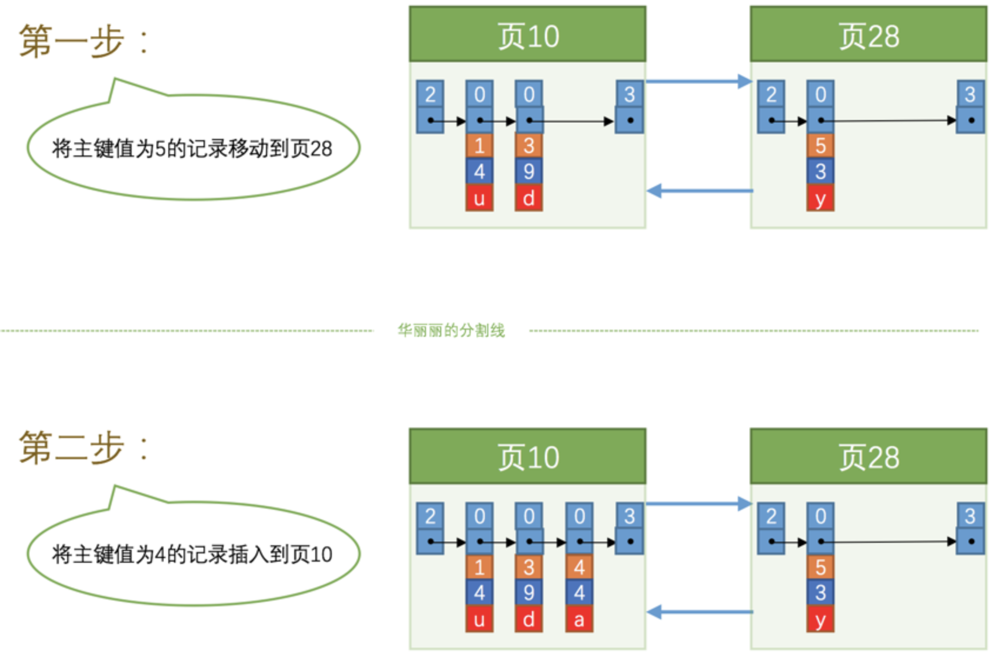

  对页中的记录进行增删改操作的过程中，必须通过一些诸如记录移动的操作来始终保证下一个数据页中用户记录的主键值必须大于上一个页中用户记录的主键值。这个过程我们也可以称为`页分裂`。

- 给所有的页建立一个目录项。

  由于数据页的编号可能并不是连续的，所以在向`index_demo`表中插入许多条记录后，可能是这样的效果：

  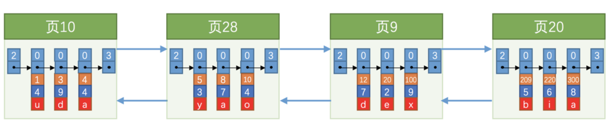

  因为这些`16KB`的页在物理存储上可能并不挨着，我们需要给它们做个目录，每个页对应一个目录项，每个目录项包括下边两个部分：

  - 页的用户记录中最小的主键值，我们用`key`来表示。
  - 页号，我们用`page_no`表示。

  所以我们为上边几个页做好的目录就像这样子：

  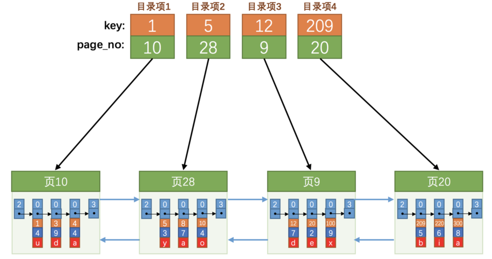

  以`页28`为例，它对应`目录项2`，这个目录项中包含着该页的页号`28`以及该页中用户记录的最小主键值`5`。我们只需要把几个目录项在物理存储器上连续存储，比如把他们放到一个数组里，就可以实现根据主键值快速查找某条记录的功能了。比方说我们想找主键值为`20`的记录，具体查找过程分两步：

  1. 先从目录项中根据二分法快速确定出主键值为`20`的记录在`目录项3`中，它对应的页是`页9`。
  2. 再根据前边说的在页中查找记录的方式去`页9`中定位具体的记录。

至此，针对数据页做的简易目录就搞定了。

### InnoDB中的索引方案

上边假设所有目录项都可以在物理存储器上连续存储，但是这样做有几个问题：

- `InnoDB`是使用页来作为管理存储空间的基本单位，也就是最多能保证`16KB`的连续存储空间，而随着表中记录数量的增多，需要非常大的连续的存储空间才能把所有的目录项都放下，这对记录数量非常多的表是不现实的。
- 我们时常会对记录进行增删，假设我们把`页28`中的记录都删除了，`页28`也就没有存在的必要了，那意味着`目录项2`也就没有存在的必要了，这就需要把`目录项2`后的目录项都向前移动一下。

设计`InnoDB`的大叔们需复用了之前存储用户记录的数据页来存储目录项，为了和用户记录做一下区分，我们把这些用来表示目录项的记录称为`目录项记录`。记录头信息里的`record_type`属性，它的各个取值代表的意思如下：

- `0`：普通的用户记录
- `1`：目录项记录
- `2`：最小记录
- `3`：最大记录

我们把前边使用到的目录项放到数据页中的样子就是这样：

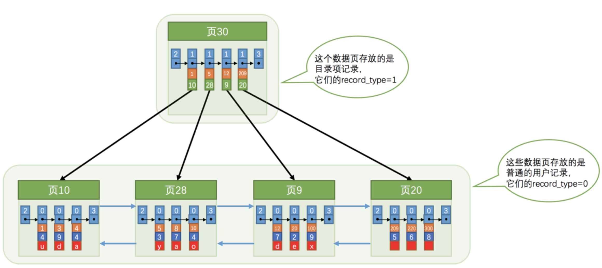

从图中可以看出来，我们新分配了一个编号为`30`的页来专门存储`目录项记录`。

- `目录项记录`的`record_type`值是1，而普通用户记录的`record_type`值是0。
- `目录项记录`只有主键值和页的编号两个列
- 只有在存储`目录项记录`的页中的主键值最小的`目录项记录`的`min_rec_mask`值为`1`，其他别的记录的`min_rec_mask`值都是`0`。

它们用的是一样的数据页，页的组成结构也是一样一样的，都会为主键值生成`Page Directory`。现在以查找主键为`20`的记录为例，根据某个主键值去查找记录的步骤就可以大致拆分成下边两步：

1. 先到存储`目录项记录`的页，也就是页`30`中通过二分法快速定位到对应目录项，因为`12 < 20 < 209`，所以定位到对应的记录所在的页就是`页9`。
2. 再到存储用户记录的`页9`中根据二分法快速定位到主键值为`20`的用户记录。

那如果表中的数据太多，以至于一个数据页不足以存放所有的`目录项记录`，这时候就再多整一个存储`目录项记录`的页。假设一个存储`目录项记录`的页最多只能存放4条`目录项记录`，所以如果此时我们再向上图中插入一条主键值为`320`的用户记录的话，那就需要分配一个新的存储`目录项记录`的页喽：

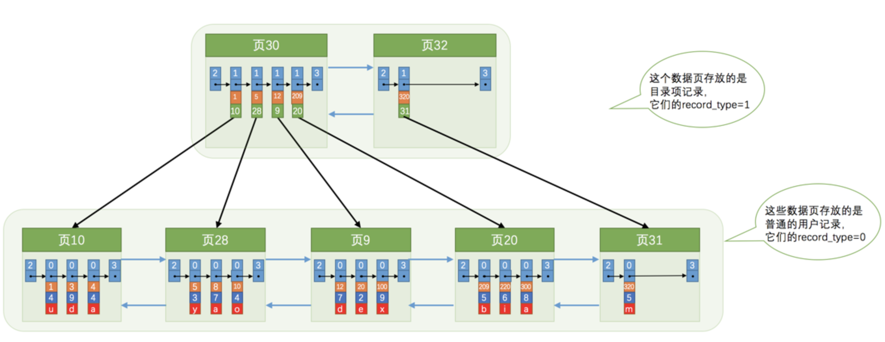

从图中可以看出，我们插入了一条主键值为`320`的用户记录之后需要两个新的数据页：

- 为存储该用户记录而新生成了`页31`。
- 因为原先存储`目录项记录`的`页30`的容量已满，所以需要一个新的`页32`来存放`页31`对应的目录项。

现在因为存储`目录项记录`的页不止一个，所以如果我们想根据主键值查找一条用户记录大致需要3个步骤，以查找主键值为`20`的记录为例：

1. 确定`目录项记录`页
2. 通过`目录项记录`页确定用户记录真实所在的页。
3. 在真实存储用户记录的页中定位到具体的记录。

在这个查询步骤的第1步中我们需要定位存储`目录项记录`的页，所以为这些存储`目录项记录`的页再生成一个更高级的目录，所以现在各个页的示意图就是这样子：

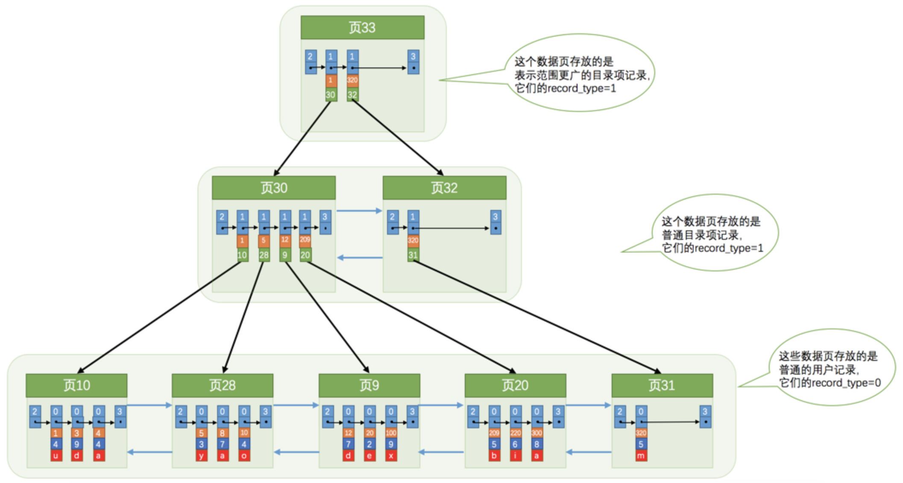

如果简化一下，它就是`B+`树，那么我们可以用下边这个图来描述它：

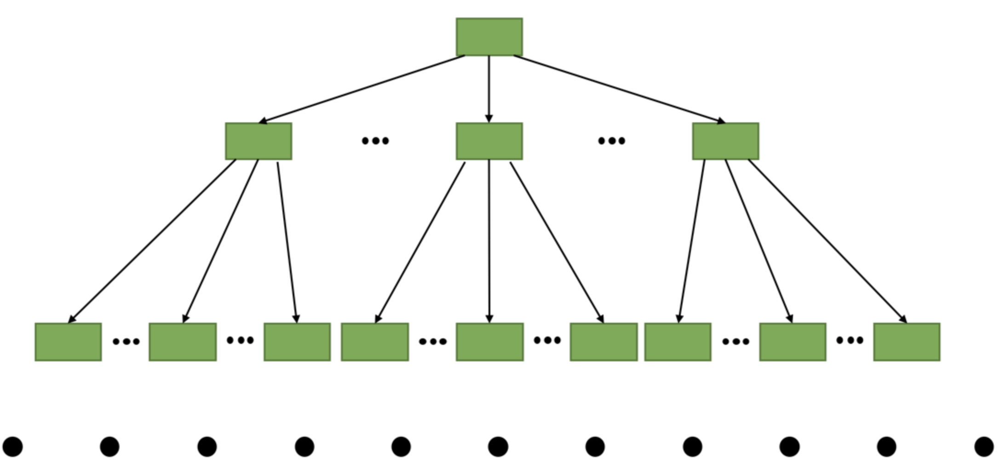

`B+`树的节点其实可以分成好多层，规定存放我们用户记录的那层为第`0`层，之后依次往上加。其实真实环境中一个页存放的记录数量是非常大的，假设所有存放用户记录的叶子节点代表的数据页可以存放100条用户记录，所有存放目录项记录的内节点代表的数据页可以存放1000条目录项记录，那么：

- 如果`B+`树只有1层，也就是只有1个用于存放用户记录的节点，最多能存放`100`条记录。
- 如果`B+`树有2层，最多能存放`1000×100=100000`条记录。
- 如果`B+`树有3层，最多能存放`1000×1000×100=100000000`条记录。
- 如果`B+`树有4层，最多能存放`1000×1000×1000×100=100000000000`条记录。哇咔咔～这么多的记录！！！

所以一般情况下，我们用到的`B+`树都不会超过4层，那我们通过主键值去查找某条记录最多只需要做4个页面内的查找，又因为在每个页面内有所谓的`Page Directory`，所以在页面内也可以通过二分法实现快速定位记录

#### 聚簇索引

我们上边介绍的`B+`树本身就是一个目录，或者说本身就是一个索引。它有两个特点：

1. 使用记录主键值的大小进行记录和页的排序，这包括三个方面的含义：
   - 页内的记录是按照主键的大小顺序排成一个单向链表。
   - 各个存放用户记录的页也是根据页中用户记录的主键大小顺序排成一个双向链表。
   - 存放目录项记录的页分为不同的层次，在同一层次中的页也是根据页中目录项记录的主键大小顺序排成一个双向链表。
2. `B+`树的叶子节点存储的是完整的用户记录。

我们把具有这两种特性的`B+`树称为`聚簇索引`，所有完整的用户记录都存放在这个`聚簇索引`的叶子节点处。

#### 二级索引

上边介绍的`聚簇索引`只能在搜索条件是主键值时才能发挥作用，除此之外，我们还可以多建几棵`B+`树，不同的`B+`树中的数据采用不同的排序规则。比方说我们用`c2`列的大小作为数据页、页中记录的排序规则，再建一棵`B+`树，效果如下图所示：

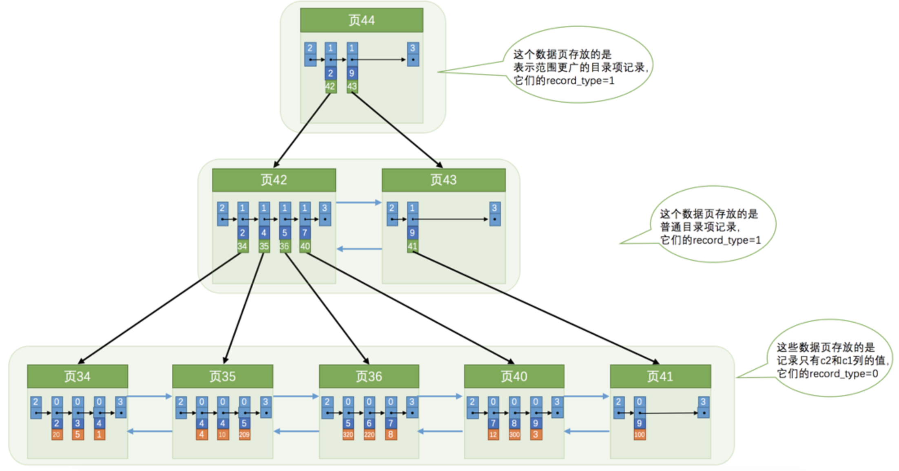

这个`B+`树与上边介绍的聚簇索引有几处不同：

- 使用记录`c2`列的大小进行记录和页的排序，这包括三个方面的含义：
  - 页内的记录是按照`c2`列的大小顺序排成一个单向链表。
  - 各个存放用户记录的页也是根据页中记录的`c2`列大小顺序排成一个双向链表。
  - 存放目录项记录的页分为不同的层次，在同一层次中的页也是根据页中目录项记录的`c2`列大小顺序排成一个双向链表。
- `B+`树的叶子节点存储的只是`c2列+主键`这两个列的值。
- 目录项记录中不再是`主键+页号`的搭配，而变成了`c2列+页号`的搭配。

所以如果我们现在想通过`c2`列的值查找某些记录的话就可以使用我们刚刚建好的这个`B+`树了。以查找`c2`列的值为`4`的记录为例，查找过程如下：

1. 确定`目录项记录`页
2. 通过`目录项记录`页确定用户记录真实所在的页。
3. 在真实存储用户记录的页中定位到具体的记录。
4. 但是这个`B+`树的叶子节点中的记录只存储了`c2`和`主键`两个列，所以我们必须再根据主键值去聚簇索引中再查找一遍完整的用户记录，这个过程也被称为`回表`。也就是根据`c2`列的值查询一条完整的用户记录需要使用到`2`棵`B+`树。所以这种`B+`树也被称为`二级索引`或者`辅助索引`。

##### 联合索引

我们也可以同时以多个列的大小作为排序规则，比方说我们想让`B+`树按照`c2`和`c3`列的大小进行排序，这个包含两层含义：

- 先把各个记录和页按照`c2`列进行排序。
- 在记录的`c2`列相同的情况下，采用`c3`列进行排序。

为`c2`和`c3`列建立的索引的示意图如下：


如图所示，我们需要注意以下几点：

- 每条`目录项记录`都由`c2`、`c3`、`页号`这三个部分组成，各条记录先按照`c2`列的值进行排序，如果记录的`c2`列相同，则按照`c3`列的值进行排序。
- `B+`树叶子节点处的用户记录由`c2`、`c3`和主键`c1`列组成。

### InnoDB的B+树索引的注意事项

#### 根页面万年不动窝

`B+`树的形成过程是这样的：

- 每当为某个表创建一个`B+`树索引的时候，都会为这个索引创建一个`根节点`页面。
- 随后向表中插入用户记录时，先把用户记录存储到这个`根节点`中。
- 当`根节点`中的可用空间用完时继续插入记录，此时会将`根节点`中的所有记录复制到一个新分配的页，比如`页a`中，然后对这个新页进行`页分裂`的操作，得到另一个新页，比如`页b`。这时新插入的记录根据键值的大小就会被分配到`页a`或者`页b`中，而`根节点`便升级为存储目录项记录的页。

这个过程需要大家特别注意的是：一个B+树索引的根节点自诞生之日起，便不会再移动。这样只要我们对某个表建立一个索引，那么它的`根节点`的页号便会被记录到某个地方。

#### 内节点中目录项记录的唯一性

为了让新插入记录能找到自己在那个页里，我们需要保证在B+树的同一层内节点的目录项记录除`页号`这个字段以外是唯一的。所以对于二级索引的内节点的目录项记录的内容实际上是由三个部分构成的：

- 索引列的值
- 主键值
- 页号

也就是我们把`主键值`也添加到二级索引内节点中的目录项记录了，这样就能保证`B+`树每一层节点中各条目录项记录除`页号`这个字段外是唯一的，所以我们为`c2`列建立二级索引后的示意图实际上应该是这样子的：

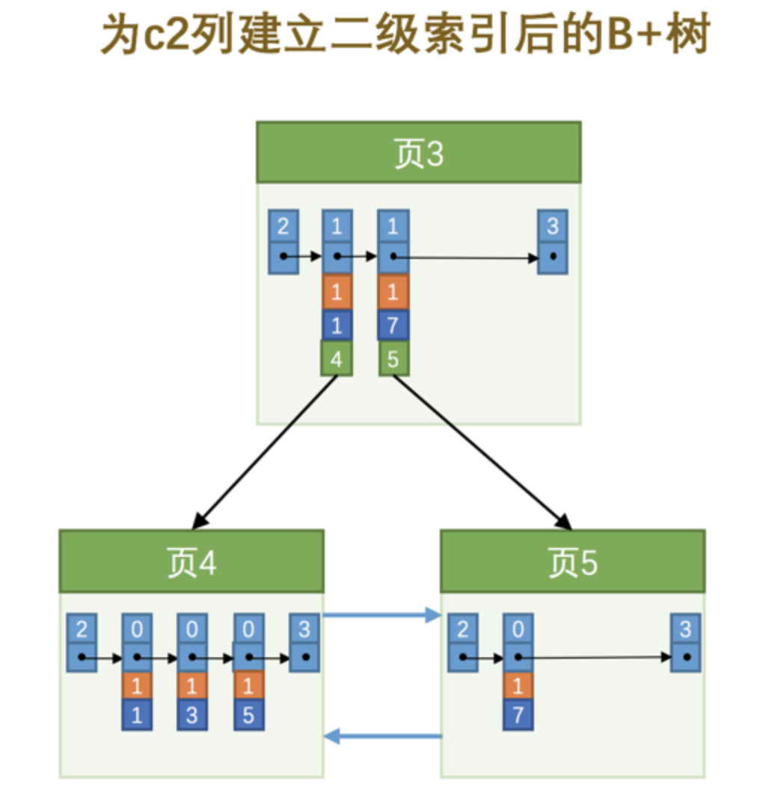

这样我们再插入记录`(9, 1, 'c')`时，由于`页3`中存储的目录项记录是由`c2列 + 主键 + 页号`的值构成的，可以先把新记录的`c2`列的值和`页3`中各目录项记录的`c2`列的值作比较，如果`c2`列的值相同的话，可以接着比较主键值，因为`B+`树同一层中不同目录项记录的`c2列 + 主键`的值肯定是不一样的，所以最后肯定能定位唯一的一条目录项记录。