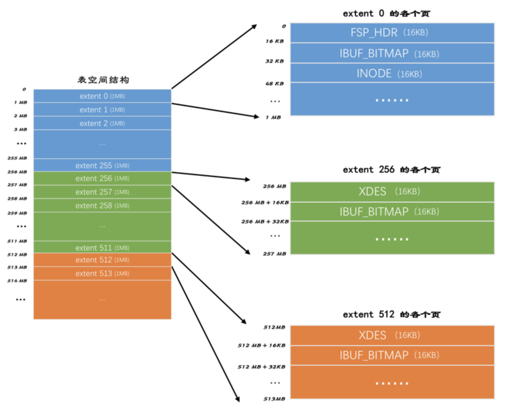
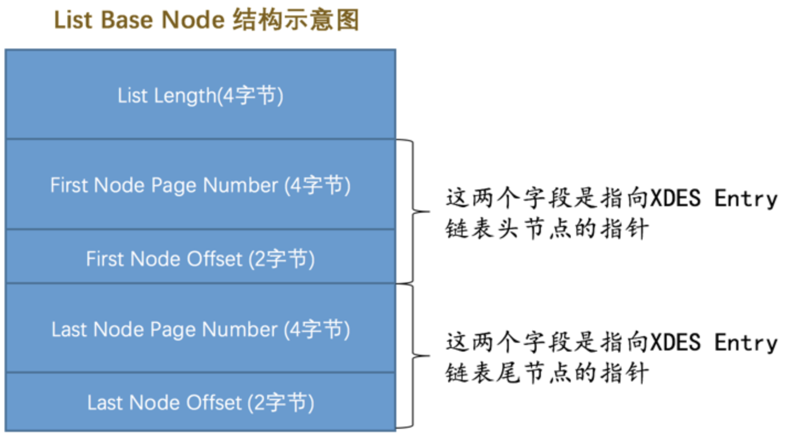
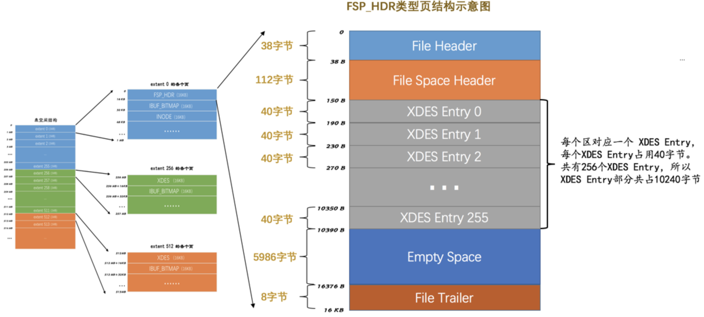
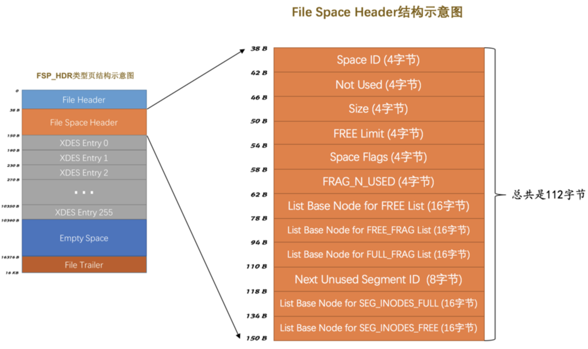
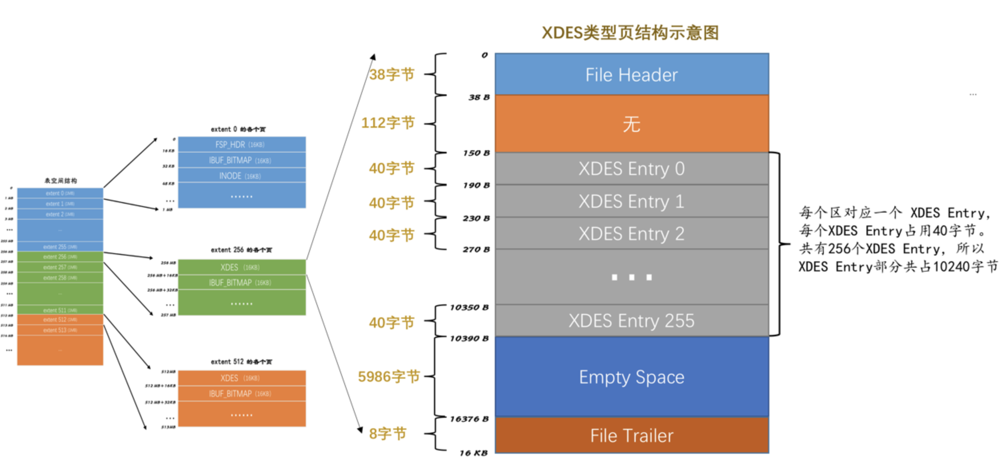
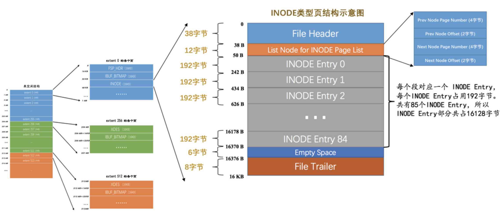
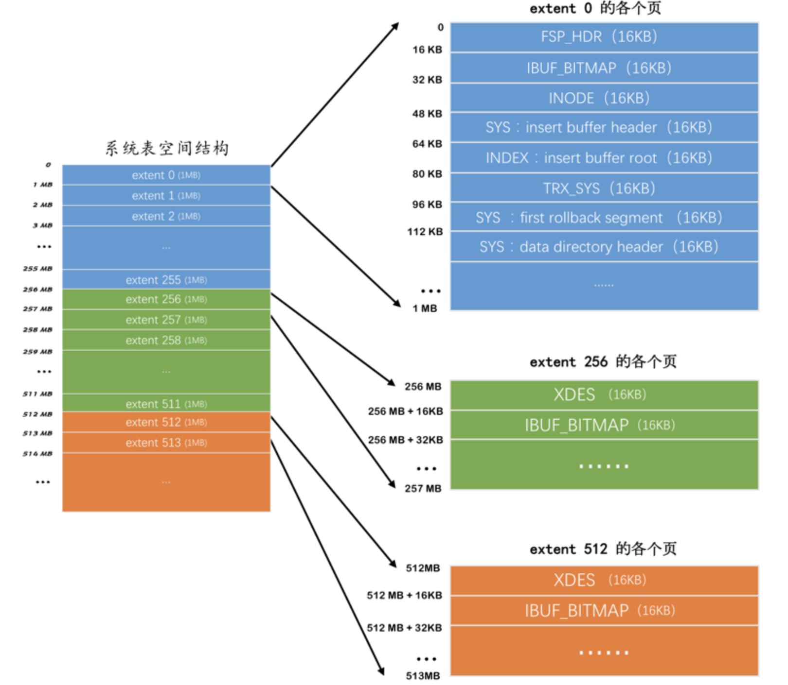

`表空间`是一个抽象的概念，对于系统表空间来说，对应着文件系统中一个或多个实际文件；对于每个独立表空间来说，对应着文件系统中一个名为`表名.ibd`的实际文件。**大家可以把表空间想象成被切分为许许多多个`页`的池子，当我们想为某个表插入一条记录的时候，就从池子中捞出一个对应的页来把数据写进去。**

## 回忆一些旧知识

### 页面类型

再一次强调，InnoDB是以页为单位管理存储空间的。InnoDB为了不同的目的设计了若干种不同类型的页面，：

|         类型名称          | 十六进制 |               描述               |
| :-----------------------: | :------: | :------------------------------: |
| `FIL_PAGE_TYPE_ALLOCATED` |  0x0000  |        最新分配，还没使用        |
|    `FIL_PAGE_UNDO_LOG`    |  0x0002  |            Undo日志页            |
|     `FIL_PAGE_INODE`      |  0x0003  |            段信息节点            |
| `FIL_PAGE_IBUF_FREE_LIST` |  0x0004  |      Insert Buffer空闲列表       |
|  `FIL_PAGE_IBUF_BITMAP`   |  0x0005  |        Insert Buffer位图         |
|    `FIL_PAGE_TYPE_SYS`    |  0x0006  |              系统页              |
|  `FIL_PAGE_TYPE_TRX_SYS`  |  0x0007  |           事务系统数据           |
|  `FIL_PAGE_TYPE_FSP_HDR`  |  0x0008  |          表空间头部信息          |
|   `FIL_PAGE_TYPE_XDES`    |  0x0009  |            扩展描述页            |
|   `FIL_PAGE_TYPE_BLOB`    |  0x000A  |              BLOB页              |
|     `FIL_PAGE_INDEX`      |  0x45BF  | 索引页，也就是我们所说的`数据页` |

### 页面通用部分

`INDEX`类型的页由7个部分组成，其中的两个部分是所有类型的页面都通用的，任何类型的页面都有下边这种通用的结构：

从上图中可以看出，任何类型的页都会包含这两个部分：

- `File Header`：记录页面的一些通用信息
- `File Trailer`：校验页是否完整，保证从内存到磁盘刷新时内容的一致性。

这里再强调一遍`File Header`的各个组成部分：

|                名称                | 占用空间大小 |                             描述                             |
| :--------------------------------: | :----------: | :----------------------------------------------------------: |
|     `FIL_PAGE_SPACE_OR_CHKSUM`     |   `4`字节    |                   页的校验和（checksum值）                   |
|         `FIL_PAGE_OFFSET`          |   `4`字节    |                             页号                             |
|          `FIL_PAGE_PREV`           |   `4`字节    |                        上一个页的页号                        |
|          `FIL_PAGE_NEXT`           |   `4`字节    |                        下一个页的页号                        |
|           `FIL_PAGE_LSN`           |   `8`字节    |              页面被最后修改时对应的日志序列位置              |
|          `FIL_PAGE_TYPE`           |   `2`字节    |                          该页的类型                          |
|     `FIL_PAGE_FILE_FLUSH_LSN`      |   `8`字节    | 仅在系统表空间的一个页中定义，代表文件至少被刷新到了对应的LSN值 |
| `FIL_PAGE_ARCH_LOG_NO_OR_SPACE_ID` |   `4`字节    |                       页属于哪个表空间                       |

我们要强调这么几点：

- 表空间中的每一个页都对应着一个页号，也就是`FIL_PAGE_OFFSET`，这个页号由4个字节组成，也就是32个比特位，如果按照页的默认大小16KB来算，一个表空间最多支持64TB的数据。
- 某些类型的页可以组成链表，链表中的页可以不按照物理顺序存储，而是根据`FIL_PAGE_PREV`和`FIL_PAGE_NEXT`来存储上一个页和下一个页的页号。这两个字段主要是为了`INDEX`类型的页，为每层节点建立双向链表用的，一般类型的页是不使用这两个字段的。

## 独立表空间结构

### 区的概念

表空间中的页实在是太多了，为了更好的管理这些页面，设计`InnoDB`的大叔们提出了`区`的概念。对于16KB的页来说，**连续的64个页就是一个`区`**，也就是说一个区默认占用1MB空间大小。不论是系统表空间还是独立表空间，都可以看成是由若干个区组成的，每256个区被划分成一组。画个图表示就是这样：

从上图中我们能得到如下信息：

- 第一个组最开始的3个页面的类型是固定的，分别是：
  - `FSP_HDR`类型：这个类型的页面是用来登记整个表空间的一些整体属性以及本组所有的`区`的属性。
  - `IBUF_BITMAP`类型：这个类型的页面是存储本组所有的区的所有页面关于`INSERT BUFFER`的信息。
  - `INODE`类型：这个类型的页面存储了许多称为`INODE`的数据结构。
- 其余各组最开始的2个页面的类型是固定的，分别是：
  - `XDES`类型：，用来登记本组256个区的属性。
  - `IBUF_BITMAP`类型：这个类型的页面是存储本组所有的区的所有页面关于`INSERT BUFFER`的信息。

**表空间被划分为许多连续的`区`，每个区默认由64个页组成，每256个区划分为一组，每个组的最开始的几个页面类型是固定的。**

### 段（segment）的概念

**一个区就是在物理位置上连续的64个页。在表中数据量大的时候，为某个索引分配空间的时候就不再按照页为单位分配了，而是按照`区`为单位分配，甚至在表中的数据十分非常特别多的时候，可以一次性分配多个连续的区。虽然可能造成一点点空间的浪费，但是从性能角度看，可以消除很多的随机`I/O`。**

范围查询其实是对`B+`树叶子节点中的记录进行顺序扫描，而如果不区分叶子节点和非叶子节点，统统把节点代表的页面放到申请到的区中的话，进行范围扫描的效果就大打折扣了。所以设计`InnoDB`的大叔们对`B+`树的叶子节点和非叶子节点进行了区别对待，**也就是说叶子节点有自己独有的`区`，非叶子节点也有自己独有的`区`**。存放叶子节点的区的集合就算是一个`段`，存放非叶子节点的区的集合也算是一个`段`。**也就是说一个索引会生成2个段，一个叶子节点段，一个非叶子节点段。**

默认情况`InnoDB`存储引擎的表只有一个聚簇索引，一个索引会生成2个段，而段是以区为单位申请存储空间的，一个区默认占用1M存储空间，如果一个只存了几条记录的小表也需要2M的存储空间，这对于存储记录比较少的表简直是天大的浪费。设计`InnoDB`的大叔们提出了碎片区的概念，也就是在一个碎片区中，有些页用于段A，有些页用于段B，有些页甚至哪个段都不属于。**碎片区直属于表空间，并不属于任何一个段。**所以此后为某个段分配存储空间的策略是这样的：

- **在刚开始向表中插入数据的时候，段是从某个碎片区以单个页面为单位来分配存储空间的。**
- **当某个段已经占用了32个碎片区页面之后，就会以完整的区为单位来分配存储空间。**

所以现在段不能仅定义为是某些区的集合，更精确的应该是**某些零散的页面以及一些完整的区的集合**。除了索引的叶子节点段和非叶子节点段之外，`InnoDB`中还有为存储一些特殊的数据而定义的段，比如回滚段。

### 区的分类

区大体上可以分为4种类型：

- 空闲的区：现在还没有用到这个区中的任何页面。
- 有剩余空间的碎片区：表示碎片区中还有可用的页面。
- 没有剩余空间的碎片区：表示碎片区中的所有页面都被使用，没有空闲页面。
- 附属于某个段的区。每一个索引都可以分为叶子节点段和非叶子节点段，除此之外InnoDB还会另外定义一些特殊作用的段，在这些段中的数据量很大时将使用区来作为基本的分配单位。

这4种类型的区也可以被称为区的4种状态（`State`），设计`InnoDB`的大叔们为这4种状态的区定义了特定的名词儿：

|   状态名    |         含义         |
| :---------: | :------------------: |
|   `FREE`    |       空闲的区       |
| `FREE_FRAG` |  有剩余空间的碎片区  |
| `FULL_FRAG` | 没有剩余空间的碎片区 |
|   `FSEG`    |   附属于某个段的区   |

处于`FREE`、`FREE_FRAG`以及`FULL_FRAG`这三种状态的区都是独立的，算是直属于表空间；而处于`FSEG`状态的区是附属于某个段的。

为了方便管理这些区，设计`InnoDB`的大叔设计了一个称为`XDES Entry`的结构，每一个区都对应着一个`XDES Entry`结构，这个结构记录了对应的区的一些属性。我们先看图来对这个结构有个大致的了解：

从图中我们可以看出，`XDES Entry`是一个40个字节的结构，大致分为4个部分，各个部分的释义如下：

- `Segment ID`（8字节）

  每一个段都有一个唯一的编号，用ID表示，此处的`Segment ID`字段表示就是该区所在的段。

- `List Node`（12字节）

  这个部分可以将若干个`XDES Entry`结构串联成一个链表，大家看一下这个`List Node`的结构：

  

  如果我们想定位表空间内的某一个位置的话，只需指定页号以及该位置在指定页号中的页内偏移量即可。所以：

  - `Pre Node Page Number`和`Pre Node Offset`的组合就是指向前一个`XDES Entry`的指针
  - `Next Node Page Number`和`Next Node Offset`的组合就是指向后一个`XDES Entry`的指针。

- `State`（4字节）

  这个字段表明区的状态。可选的值：`FREE`、`FREE_FRAG`、`FULL_FRAG`和`FSEG`。

- `Page State Bitmap`（16字节）

  这个部分共占用16个字节，也就是128个比特位。每个部分2个比特位，对应区中的一个页。这两个比特位的第一个位表示对应的页是否是空闲的，第二个比特位还没有用。

#### XDES Entry链表

我们捋一捋向某个段中插入数据的过程：

- 当段中数据较少的时候，首先会查看表空间中是否有状态为`FREE_FRAG`（空闲空间）的区，如果找到了，那么从该区中取一些零碎的页把数据插进去；否则到表空间下申请一个状态为`FREE`的区，把该区的状态变为`FREE_FRAG`，然后从该新申请的区中取一些零碎的页把数据插进去。之后不同的段使用零碎页的时候都会从该区中取，直到该区中没有空闲空间，然后该区的状态就变成了`FULL_FRAG`。

  我们可以通过`XDES Entry`中的`List Node`中的指针，做这么三件事：

  - 把状态为`FREE`的区对应的`XDES Entry`结构通过`List Node`来连接成一个`FREE`链表。
  - 把状态为`FREE_FRAG`的区对应的`XDES Entry`结构通过`List Node`来连接成一个`FREE_FRAG`链表。
  - 把状态为`FULL_FRAG`的区对应的`XDES Entry`结构通过`List Node`来连接成一个`FULL_FRAG`链表。

  每当我们想找一个`FREE_FRAG`状态的区时，就直接把`FREE_FRAG`链表的头节点拿出来，从这个节点中取一些零碎的页来插入数据，当这个节点对应的区用完时，就修改一下这个节点的`State`字段的值，然后从`FREE_FRAG`链表中移到`FULL_FRAG`链表中。同理，如果`FREE_FRAG`链表中一个节点都没有，那么就直接从`FREE`链表中取一个节点移动到`FREE_FRAG`链表的状态，并修改该节点的`STATE`字段值为`FREE_FRAG`，然后从这个节点对应的区中获取零碎的页就好了。

- 当段中数据已经占满了32个零散的页后，就直接申请完整的区来插入数据了。

  我们不能把状态为`FSEG`的区对应的`XDES Entry`结构都加入到一个链表，显然我们想要每个段都有它独立的链表，所以可以根据段号来建立链表，有多少个段就建多少个链表。但是好像也有点问题，因为一个段中可以有好多个区，有的区是完全空闲的，有的区还有一些页面可以用，有的区已经没有空闲页面可以用了，所以我们有必要继续细分，设计`InnoDB`的大叔们为每个段中的区对应的`XDES Entry`结构建立了三个链表：

  - `FREE`链表：同一个段中，所有页面都是空闲的区对应的`XDES Entry`结构会被加入到这个链表。
  - `NOT_FULL`链表：同一个段中，仍有空闲空间的区对应的`XDES Entry`结构会被加入到这个链表。
  - `FULL`链表：同一个段中，已经没有空闲空间的区对应的`XDES Entry`结构会被加入到这个链表。

  再次强调一遍，每一个索引都对应两个段，每个段都会维护上述的3个链表。比如表`t`，共有两个索引，一个聚簇索引，一个二级索引`idx_c2`，所以这个表共有4个段，每个段都会维护上述3个链表，总共是12个链表，加上我们上边说过的直属于表空间的3个链表，整个独立表空间共需要维护15个链表。所以段在数据量比较大时插入数据的话，会先获取`NOT_FULL`链表的头节点，直接把数据插入这个头节点对应的区中即可，如果该区的空间已经被用完，就把该节点移到`FULL`链表中。

#### 链表基节点

我们怎么找到这些链表呢？设计`InnoDB`的大叔设计了一个叫`List Base Node`的结构。这个结构中包含了链表的头节点和尾节点的指针以及这个链表中包含了多少节点的信息，我们画图看一下这个结构的示意图：

我们上边介绍的每个链表都对应这么一个`List Base Node`结构，其中：

- `List Length`表明该链表一共有多少节点，
- `First Node Page Number`和`First Node Offset`表明该链表的头节点在表空间中的位置。
- `Last Node Page Number`和`Last Node Offset`表明该链表的尾节点在表空间中的位置。

我们把某个链表对应的`List Base Node`结构放置在表空间中固定的位置，这样就很容易定位某个链表了。

### 段的结构

我们前边说过，段是一个逻辑上的概念，由若干个零散的页面以及一些完整的区组成。设计`InnoDB`的大叔为每个段都定义了一个`INODE Entry`结构来记录一下段中的属性：

它的各个部分释义如下：

- `Segment ID`

- `NOT_FULL_N_USED`

  在`NOT_FULL`链表中已经使用了多少个页面。下次从`NOT_FULL`链表分配空闲页面时直接根据这个字段定位。

- 3个`List Base Node`

  分别为段的`FREE`链表、`NOT_FULL`链表、`FULL`链表定义了`List Base Node`，这样我们想查找某个段的某个链表的头节点和尾节点的时候，就可以直接到这个部分找到对应链表的`List Base Node`。so easy!

- `Magic Number`：

  标记这个`INODE Entry`是否已经被初始化了。如果这个数字是值的`97937874`，表明该`INODE Entry`已经初始化，否则没有被初始化。

- `Fragment Array Entry`

  每个`Fragment Array Entry`都对应着一个零散页面，这个结构一共4个字节，表示一个零散页面的页号。

### 各类型页面详细情况

每个区对应的`XDES Entry`结构存在表空间的什么地方？直属于表空间的`FREE`、`FREE_FRAG`、`FULL_FRAG`链表的基节点存在表空间的什么地方？每个段对应的`INODE Entry`结构存在表空间的什么地方？我们前边介绍了每256个连续的区算是一个组，想解决刚才提出来的这些个疑问还得从每个组开头的一些类型相同的页面说起。

#### `FSP_HDR`类型

首先看第一个组的第一个页面，当然也是表空间的第一个页面，页号为`0`。这个页面的类型是`FSP_HDR`，它存储了表空间的一些整体属性以及第一个组内256个区的对应的`XDES Entry`结构，直接看这个类型的页面的示意图：

从图中可以看出，一个完整的`FSP_HDR`类型的页面大致由5个部分组成，各个部分的具体释义如下表：

|        名称         |    中文名    | 占用空间大小 |            简单描述            |
| :-----------------: | :----------: | :----------: | :----------------------------: |
|    `File Header`    |   文件头部   |   `38`字节   |        页的一些通用信息        |
| `File Space Header` |  表空间头部  |  `112`字节   |    表空间的一些整体属性信息    |
|    `XDES Entry`     |  区描述信息  | `10240`字节  | 存储本组256个区对应的属性信息  |
|    `Empty Space`    | 尚未使用空间 |  `5986`字节  | 用于页结构的填充，没啥实际意义 |
|   `File Trailer`    |   文件尾部   |   `8`字节    |         校验页是否完整         |

`Empty Space`是尚未使用的空间，重点来看看`File Space Header`和`XDES Entry`这两个部分。

##### File Space Header部分

这个部分是用来存储表空间的一些整体属性的，看图：

下面是各个属性的简单描述：

|                   名称                    | 占用空间大小 |                             描述                             |
| :---------------------------------------: | :----------: | :----------------------------------------------------------: |
|                `Space ID`                 |   `4`字节    |                          表空间的ID                          |
|                `Not Used`                 |   `4`字节    |                 这4个字节未被使用，可以忽略                  |
|                  `Size`                   |   `4`字节    |                    当前表空间占有的页面数                    |
|               `FREE Limit`                |   `4`字节    | 尚未被初始化的最小页号，大于或等于这个页号的区对应的XDES Entry结构都没有被加入FREE链表 |
|               `Space Flags`               |   `4`字节    |             表空间的一些占用存储空间比较小的属性             |
|               `FRAG_N_USED`               |   `4`字节    |               FREE_FRAG链表中已使用的页面数量                |
|      `List Base Node for FREE List`       |   `16`字节   |                       FREE链表的基节点                       |
|    `List Base Node for FREE_FRAG List`    |   `16`字节   |                    FREE_FREG链表的基节点                     |
|    `List Base Node for FULL_FRAG List`    |   `16`字节   |                    FULL_FREG链表的基节点                     |
|         `Next Unused Segment ID`          |   `8`字节    |            当前表空间中下一个未使用的 Segment ID             |
| `List Base Node for SEG_INODES_FULL List` |   `16`字节   |                 SEG_INODES_FULL链表的基节点                  |
| `List Base Node for SEG_INODES_FREE List` |   `16`字节   |                 SEG_INODES_FREE链表的基节点                  |

- `List Base Node for FREE List`、`List Base Node for FREE_FRAG List`、`List Base Node for FULL_FRAG List`。

  这三个链表的基节点在表空间的位置是固定的，就是在表空间的第一个页面的`File Space Header`部分。

- `FRAG_N_USED`

  这个字段表明在`FREE_FRAG`链表中已经使用的页面数量，方便之后在链表中查找空闲的页面。

- `Next Unused Segment ID`

  该字段表明当前表空间中最大的段ID的下一个ID，在创建新段的时候赋予新段一个唯一的ID值就ok了。

- `Space Flags`

  表空间对于一些布尔类型的属性，或者只需要几个比特位搞定的属性都放在了这个`Space Flags`中存储，虽然它只有4个字节，32个比特位大小，却存储了好多表空间的属性，详细情况如下表：

  |    标志名称     | 占用的空间（单位：bit） |                   描述                   |
  | :-------------: | :---------------------: | :--------------------------------------: |
  | `POST_ANTELOPE` |            1            |      表示文件格式是否大于`ANTELOPE`      |
  |   `ZIP_SSIZE`   |            4            |            表示压缩页面的大小            |
  | `ATOMIC_BLOBS`  |            1            | 表示是否自动把值非常长的字段放到BLOB页里 |
  |  `PAGE_SSIZE`   |            4            |                 页面大小                 |
  |   `DATA_DIR`    |            1            | 表示表空间是否是从默认的数据目录中获取的 |
  |    `SHARED`     |            1            |             是否为共享表空间             |
  |   `TEMPORARY`   |            1            |             是否为临时表空间             |
  |  `ENCRYPTION`   |            1            |              表空间是否加密              |
  |    `UNUSED`     |           18            |            没有使用到的比特位            |

- `List Base Node for SEG_INODES_FULL List`和`List Base Node for SEG_INODES_FREE List`

  每个段对应的`INODE Entry`结构会集中存放到一个类型为`INODE`的页中，如果表空间中的段特别多，则会有多个`INODE Entry`结构，可能一个页放不下，这些`INODE`类型的页会组成两种列表：

  - `SEG_INODES_FULL`链表，该链表中的`INODE`类型的页面都已经被`INODE Entry`结构填充满了，没空闲空间存放额外的`INODE Entry`了。
  - `SEG_INODES_FREE`链表，该链表中的`INODE`类型的页面都已经仍有空闲空间来存放`INODE Entry`结构。

##### XDES Entry部分

`XDES Entry`就是在表空间的第一个页面中保存的。我们知道一个`XDES Entry`结构的大小是40字节，但是一个页面的大小有限，只能存放有限个`XDES Entry`结构，所以我们才把256个区划分成一组，在每组的第一个页面中存放256个`XDES Entry`结构。

#### `XDES`类型

在区的数量非常多时，一个单独的页可能就不够存放足够多的`XDES Entry`结构，所以我们把表空间的区分为了若干个组，每组开头的一个页面记录着本组内所有的区对应的`XDES Entry`结构。我们把第一个分组（第一个分组中`FSP_HDR`页有记录）之后每个分组的第一个页面的类型定义为`XDES`，只需要记录本组内所有的区对应的`XDES Entry`结构即可，它的结构和`FSP_HDR`类型是非常相似的：

与`FSP_HDR`类型的页面对比，除了少了`File Space Header`部分之外，其余的部分是一样一样的。

#### `IBUF_BITMAP`类型

这种类型的页里边记录了一些有关`Change Buffer`的东西，后边的章节中会介绍。

#### `INODE`类型

这个`INODE`类型的页就是为了存储`INODE Entry`结构而存在的：

从图中可以看出，一个`INODE`类型的页面是由这几部分构成的：

|              名称               |    中文名    | 占用空间大小 |                  简单描述                  |
| :-----------------------------: | :----------: | :----------: | :----------------------------------------: |
|          `File Header`          |   文件头部   |   `38`字节   |              页的一些通用信息              |
| `List Node for INODE Page List` | 通用链表节点 |   `12`字节   | 存储上一个INODE页面和下一个INODE页面的指针 |
|          `INODE Entry`          |  段描述信息  | `16128`字节  |                                            |
|          `Empty Space`          | 尚未使用空间 |   `6`字节    |       用于页结构的填充，没啥实际意义       |
|         `File Trailer`          |   文件尾部   |   `8`字节    |               校验页是否完整               |

我们重点关注`List Node for INODE Page List`和`INODE Entry`这两个部分。

首先看`INODE Entry`部分，我们前边已经详细介绍过这个结构的组成了，主要包括对应的段内零散页面的地址以及附属于该段的`FREE`、`NOT_FULL`和`FULL`链表的基节点。每个`INODE Entry`结构占用192字节，一个页面里可以存储`85`个这样的结构。

重点看一下`List Node for INODE Page List`，因为一个表空间中可能存在超过85个段，所以可能一个`INODE`类型的页面不足以存储所有的段对应的`INODE Entry`结构，所以就需要额外的`INODE`类型的页面来存储这些结构。还是为了方便管理这些`INODE`类型的页面，设计`InnoDB`的大叔们将这些`INODE`类型的页面串联成两个不同的链表：

- `SEG_INODES_FULL`链表：该链表中的`INODE`类型的页面中已经没有空闲空间来存储额外的`INODE Entry`结构了。
- `SEG_INODES_FREE`链表：该链表中的`INODE`类型的页面中还有空闲空间来存储额外的`INODE Entry`结构了。

我们前边提到过这两个链表的基节点就存储在`File Space Header`里边，所以我们可以很轻松的访问到这两个链表。以后每当我们新创建一个段时，都会创建一个`INODE Entry`结构与之对应，存储`INODE Entry`的大致过程就是这样的：

- 先看看`SEG_INODES_FREE`链表是否为空，如果不为空，直接从该链表中获取一个节点，然后把该`INODE Entry`结构放到该页面中。当该页面中无剩余空间时，就把该页放到`SEG_INODES_FULL`链表中。
- 如果`SEG_INODES_FREE`链表为空，则需要从表空间的`FREE_FRAG`链表中申请一个页面，修改该页面的类型为`INODE`，把该页面放到`SEG_INODES_FREE`链表中，与此同时把该`INODE Entry`结构放入该页面。

### Segment Header 结构的运用

我们怎么知道某个段对应哪个`INODE Entry`结构呢？所以得找个地方记下来这个对应关系，`INDEX`类型的页时有一个`Page Header`部分：

**Page Header部分**

|        名称         | 占用空间大小 |                    描述                    |
| :-----------------: | :----------: | :----------------------------------------: |
|         ...         |     ...      |                    ...                     |
| `PAGE_BTR_SEG_LEAF` |   `10`字节   |  B+树叶子段的头部信息，仅在B+树的根页定义  |
| `PAGE_BTR_SEG_TOP`  |   `10`字节   | B+树非叶子段的头部信息，仅在B+树的根页定义 |

其中的`PAGE_BTR_SEG_LEAF`和`PAGE_BTR_SEG_TOP`都占用10个字节，它们对应一个`Segment Header`的结构：

各个部分的具体释义如下：

|               名称               | 占用字节数 |               描述                |
| :------------------------------: | :--------: | :-------------------------------: |
|  `Space ID of the INODE Entry`   |    `4`     |   INODE Entry结构所在的表空间ID   |
| `Page Number of the INODE Entry` |    `4`     |   INODE Entry结构所在的页面页号   |
|  `Byte Offset of the INODE Ent`  |    `2`     | INODE Entry结构在该页面中的偏移量 |

`PAGE_BTR_SEG_LEAF`记录着叶子节点段对应的`INODE Entry`结构的地址是哪个表空间的哪个页面的哪个偏移量，`PAGE_BTR_SEG_TOP`记录着非叶子节点段对应的`INODE Entry`结构的地址是哪个表空间的哪个页面的哪个偏移量。因为一个索引只对应两个段，所以只需要在索引的根页面中记录这两个结构即可。

## 系统表空间

系统表空间的结构和独立表空间基本类似，只不过由于整个MySQL进程只有一个系统表空间，在系统表空间中会额外记录一些有关整个系统信息的页面，系统表空间的`表空间 ID`（Space ID）是`0`。

### 系统表空间的整体结构

系统表空间与独立表空间的一个非常明显的不同之处就是在表空间开头有许多记录整个系统属性的页面，如图：

可以看到只是页号为`3`～`7`的页面是系统表空间特有的：

| 页号 | 页面类型  |        英文描述        | 描述                        |
| :--: | :-------: | :--------------------: | :-------------------------- |
| `3`  |   `SYS`   |  Insert Buffer Header  | 存储Insert Buffer的头部信息 |
| `4`  |  `INDEX`  |   Insert Buffer Root   | 存储Insert Buffer的根页面   |
| `5`  | `TRX_SYS` |   Transction System    | 事务系统的相关信息          |
| `6`  |   `SYS`   | First Rollback Segment | 第一个回滚段的页面          |
| `7`  |   `SYS`   | Data Dictionary Header | 数据字典头部信息            |

除了这几个记录系统属性的页面之外，系统表空间的`extent 1`和`extent 2`这两个区，也就是页号从`64`~`191`这128个页面被称为`Doublewrite buffer`，也就是双写缓冲区。

#### InnoDB数据字典

MySQL除了保存着我们插入的用户数据之外，还需要保存许多额外的信息，比方说：

- 某个表属于哪个表空间，表里边有多少列
- 表对应的每一个列的类型是什么
- 该表有多少索引，每个索引对应哪几个字段，该索引对应的根页面在哪个表空间的哪个页面
- 该表有哪些外键，外键对应哪个表的哪些列
- 某个表空间对应文件系统上文件路径是什么
- …...

这些数据并不是我们使用`INSERT`语句插入的用户数据，是为了更好的管理我们这些用户数据而引入的一些额外数据。InnoDB存储引擎特意定义了一些列的内部系统表来记录这些这些`元数据`，这些系统表也被称为`数据字典`，其中`SYS_TABLES`、`SYS_COLUMNS`、`SYS_INDEXES`、`SYS_FIELDS`这四个表尤其重要，称之为基本系统表。

##### Data Dictionary Header页面

有了上述4个基本系统表，就意味着可以获取其他系统表以及用户定义的表的所有元数据。也就是说这4个表是表中之表，这4个表的元数据是硬编码到代码中的，然后设计`InnoDB`的大叔又拿出一个固定的页面来记录这4个表的聚簇索引和二级索引对应的`B+树`位置，这个页面就是页号为`7`的页面，类型为`SYS`，记录了`Data Dictionary Header`，也就是数据字典的头部信息。除了这4个表的5个索引的根页面信息外，这个页号为`7`的页面还记录了整个InnoDB存储引擎的一些全局属性，说话太啰嗦，直接看这个页面的示意图：

可以看到这个页面由下边几个部分组成：

|           名称           |      中文名      | 占用空间大小 |                           简单描述                           |
| :----------------------: | :--------------: | :----------: | :----------------------------------------------------------: |
|      `File Header`       |     文件头部     |   `38`字节   |                       页的一些通用信息                       |
| `Data Dictionary Header` | 数据字典头部信息 |   `56`字节   | 记录一些基本系统表的根页面位置以及InnoDB存储引擎的一些全局信息 |
|     `Segment Header`     |    段头部信息    |   `10`字节   |          记录本页面所在段对应的INODE Entry位置信息           |
|      `Empty Space`       |   尚未使用空间   | `16272`字节  |                用于页结构的填充，没啥实际意义                |
|      `File Trailer`      |     文件尾部     |   `8`字节    |                        校验页是否完整                        |

可以看到这个页面里竟然有`Segment Header`部分，意味着设计InnoDB的大叔把这些有关数据字典的信息当成一个段来分配存储空间，我们就姑且称之为`数据字典段`吧。由于目前我们需要记录的数据字典信息非常少，所以该段只有一个碎片页，也就是页号为`7`的这个页。

##### information_schema系统数据库

需要注意一点的是，用户是不能直接访问`InnoDB`的这些内部系统表的。不过设计InnoDB的大叔考虑到查看这些表的内容可能有助于大家分析问题，所以在系统数据库`information_schema`中提供了一些以`innodb_sys`开头的表，在`information_schema`数据库中的这些以`INNODB_SYS`开头的表并不是真正的内部系统表，而是在存储引擎启动时读取这些以`SYS`开头的系统表，然后填充到这些以`INNODB_SYS`开头的表中。

### 个人总结

每个页16KB，表空间被划分为许多连续的`区`，每个区默认由64个页组成（1MB），每256个区划分为一组（256MB）。引入区的概念是为了开辟物理地址连续的页面，消除了很多随机IO的操作，从而提高性能。每个组的最开始的几个页面类型是固定的（第一个组除外），用来维护组内区的信息。

每个区都对应一个`XDES Entry`的结构，`XDES Entry`结构记录了对应的区的一些属性（所属段ID，区状态，区内页面是否空闲等）。所有区的`XDES Entry`结构可以连成若干链表。我们知道一个`XDES Entry`结构的大小是40字节，如果都放到表空间第一个页面`FSP_HDR`页中，受页面大小限制，只能存放有限个`XDES Entry`结构，所以我们才把256个区划分成一组，在每组的第一个页面中存放256个`XDES Entry`结构。

每个表空间都有三个链表，分别是`FREE`（空闲区）链表、`FREE_FRAG`（有剩余空间的碎片区）链表、`FULL_FRAG`（没有剩余空间的碎片区）链表，这些区直属于表空间，不属于单独的段。每个链表都对应一个`List Base Node`的结构，这个结构里记录了链表的头、尾节点的位置以及该链表中包含的节点数。我们把某个链表对应的`List Base Node`结构放置在表空间中固定的位置（直属表空间链表基节点存在`FSP_HDR`页的`File Space Header`部分。段中的三条链表基节点则存在`INODE Entry`中），这样就很容易定位某个链表了。

每个索引都有两个段：存放叶子节点的段和存放非叶子节点的段。

- 当段中的数据不足32个页时，直接向`FREE_FRAG`链表中的区申请页来存放数据，当`FREE_FRAG`链表中的区存满时，将该区移动到`FREE_FULL`链表上。当`FREE_FRAG`链表为空时，则向`FREE`链表申请一个区，然后移动到`FREE_FRAG`链表中，之后向`FREE_FRAG`链表中的区申请页面即可。
- 当段中的数据占满32个零散页时，直接向`FREE_FRAG`链表申请完整的区来存放数据。每个段都会单独维护三个链表：`FREE`链表、`NOT_FULL`链表、`FULL`链表，分别维护段内的全是空闲的区、有空闲的区、用满的区。

第一个组的第一个页面为`FSP_HDR`页，记录了它存储了表空间的一些整体属性以及第一个组内256个区的对应的`XDES Entry`结构。第二个组开始，第一个页面为`XDES`页，它记录了当前组内256个区的对应的`XDES Entry`结构。每个分组的第二个页面的类型都是`IBUF_BITMAP`，这种类型的页里边记录了一些有关`Change Buffer`的信息。第一个分组的第三个页面的类型是`INODE`，主要记录了`List Node for INODE Page List`和`INODE Entry`这两个部分。`INODE Entry`主要包括对应的段内零散页面的地址以及附属于该段的`FREE`、`NOT_FULL`和`FULL`链表的基节点。每个`INODE Entry`结构占用192字节，一个页面里可以存储`85`个这样的结构。因为一个表空间中可能存在超过85个段，所以可能一个`INODE`类型的页面不足以存储所有的段对应的`INODE Entry`结构，所以就需要额外的`INODE`类型的页面来存储这些结构。`List Node for INODE Page List`就是负责记录其他`INODE`类型页面的位置。这些`INODE`类型的页会组成两种列表：`SEG_INODES_FULL`链表和`SEG_INODES_FREE`链表。他们的基节点和直属表空间链表基节点一样，存在`FSP_HDR`页的`File Space Header`部分。