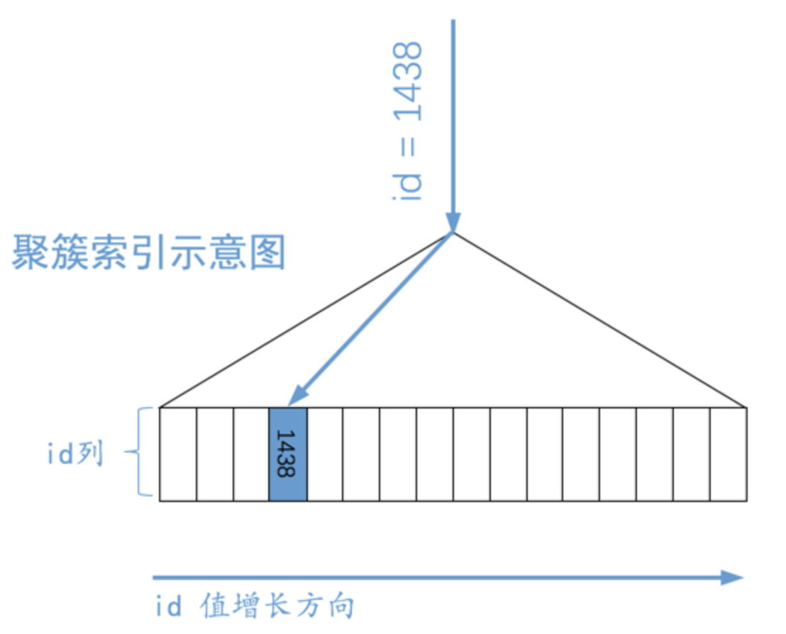
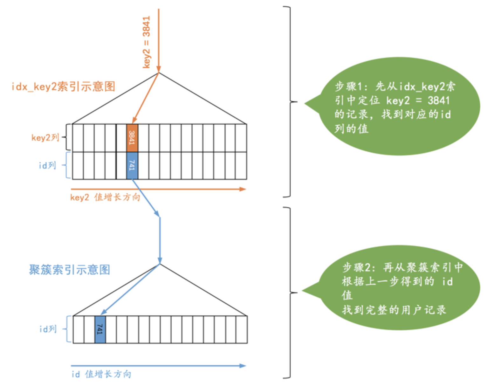
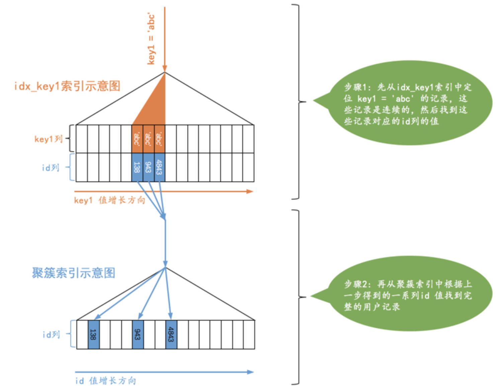
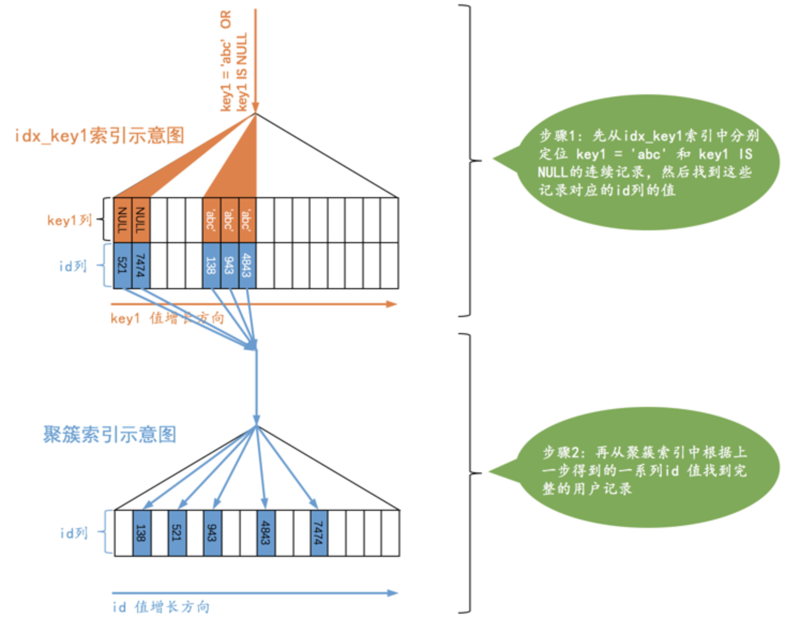

`MySQL Server`有一个称为`查询优化器`的模块，一条查询语句进行语法解析之后就会被交给查询优化器来进行优化，优化的结果就是生成一个所谓的`执行计划`，这个执行计划表明了应该使用哪些索引进行查询，表之间的连接顺序是啥样的，最后会按照执行计划中的步骤调用存储引擎提供的方法来真正的执行查询，并将查询结果返回给用户。本章先来瞅瞅`MySQL`怎么执行单表查询。

为了故事的顺利发展，我们先得有个表：

```mysql
CREATE TABLE single_table (
    id INT NOT NULL AUTO_INCREMENT,
    key1 VARCHAR(100),
    key2 INT,
    key3 VARCHAR(100),
    key_part1 VARCHAR(100),
    key_part2 VARCHAR(100),
    key_part3 VARCHAR(100),
    common_field VARCHAR(100),
    PRIMARY KEY (id),
    KEY idx_key1 (key1),
    UNIQUE KEY idx_key2 (key2),
    KEY idx_key3 (key3),
    KEY idx_key_part(key_part1, key_part2, key_part3)
) Engine=InnoDB CHARSET=utf8;
```

我们为这个`single_table`表建立了1个聚簇索引和4个二级索引，然后随机为这个表插入了10000行记录。

## 访问方法（access method）的概念

我们平时所写的那些查询语句本质上只是一种声明式的语法，只是告诉`MySQL`我们要获取的数据符合哪些规则，至于`MySQL`背地里是怎么把查询结果搞出来的那是`MySQL`自己的事儿。单表查询的执行方式大致分为下边两种：

- 使用全表扫描进行查询

  这种执行方式就是把表的每一行记录都扫一遍，把符合搜索条件的记录加入到结果集就完了。

- 使用索引进行查询

  如果查询语句中的搜索条件可以使用到某个索引，那直接使用索引来执行查询可能会加快查询执行的时间。使用索引来执行查询又可以细分为许多种类：

  - 针对主键或唯一二级索引的等值查询
  - 针对普通二级索引的等值查询
  - 针对索引列的范围查询
  - 直接扫描整个索引

设计`MySQL`的大叔把`MySQL`执行查询语句的方式称之为`访问方法`或者`访问类型`。同一个查询语句可能可以使用多种不同的访问方法来执行。下边细细道来各种`访问方法`的具体内容。

## const

有的时候我们可以通过主键列来定位一条记录，比方说这个查询：

```mysql
SELECT * FROM single_table WHERE id = 1438;
```

`MySQL`会直接利用主键值在聚簇索引中定位对应的用户记录，就像这样：



对于`single_table`表的聚簇索引来说，展示的就是`id`列。`B+`树叶子节点中的记录是按照索引列排序的，对于的聚簇索引来说，它对应的`B+`树叶子节点中的记录就是按照`id`列排序的。所以这样根据主键值定位一条记录的速度贼快。类似的，我们根据唯一二级索引列来定位一条记录的速度也是贼快的，比如下边这个查询：

```mysql
SELECT * FROM single_table WHERE key2 = 3841;
```

这个查询的执行过程的示意图就是这样：



可以看到这个查询的执行分两步，第一步先从`idx_key2`对应的`B+`树索引中根据`key2`列与常数的等值比较条件定位到一条二级索引记录，然后再根据该记录的`id`值到聚簇索引中获取到完整的用户记录。

设计`MySQL`的大叔认为通过**主键或者唯一二级索引**列与常数的等值比较来定位一条记录贼快，所以他们把这种通过主键或者唯一二级索引列来定位一条记录的访问方法定义为：`const`，意思是常数级别的，代价是忽略不计。不过这种`const`访问方法只能在主键列或者唯一二级索引列和一个常数进行等值比较时才有效，如果主键或者唯一二级索引是由多个列构成的话，索引中的每一个列都需要与常数进行等值比较，这个`const`访问方法才有效。

对于唯一二级索引来说，查询该列为`NULL`值的情况比较特殊，比如这样：

```mysql
SELECT * FROM single_table WHERE key2 IS NULL;
```

因为唯一二级索引列并不限制 NULL 值的数量，所以上述语句可能访问到多条记录，也就是说 上边这个语句不可以使用`const`访问方法来执行。

## ref

有时候我们对某个普通的二级索引列与常数进行等值比较，比如这样：

```mysql
SELECT * FROM single_table WHERE key1 = 'abc';
```

对于这个查询，我们可以选择全表扫描也可以先使用二级索引找到对应记录的`id`值，然后再回表到聚簇索引中查找完整的用户记录。由于普通二级索引并不限制索引列值的唯一性，所以可能找到多条对应的记录。如果匹配的记录较少，则回表的代价还是比较低的，所以`MySQL`可能选择使用索引而不是全表扫描的方式来执行查询。设计`MySQL`的大叔就把这种搜索条件为二级索引列与常数等值比较，采用二级索引来执行查询的访问方法称为：`ref`。我们看一下采用`ref`访问方法执行查询的图示：



从图示中可以看出，对于普通的二级索引来说，通过索引列进行等值比较后可能匹配到多条连续的记录，所以这种`ref`访问方法比`const`差了那么一丢丢，但是在二级索引等值比较时匹配的记录数较少时的效率还是很高的。不过需要注意下边两种情况：

- 二级索引列值为`NULL`的情况

  不论是普通的二级索引，还是唯一二级索引，它们的索引列对包含`NULL`值的数量并不限制，所以我们采用`key IS NULL`这种形式的搜索条件最多只能使用`ref`的访问方法。

- 对于某个包含多个索引列的二级索引来说，只要是最左边的连续索引列中没有不是与常数的等值比较就可能采用`ref`的访问方法，否则它的访问方法就不能称为`ref`了。

## ref_or_null

有时候我们不仅想找出某个二级索引列的值等于某个常数的记录，还想把该列的值为`NULL`的记录也找出来：

```mysql
SELECT * FROM single_demo WHERE key1 = 'abc' OR key1 IS NULL;
```

当使用二级索引执行该查询时，这种类型的查询使用的访问方法就称为`ref_or_null`：



## range

我们之前介绍的几种访问方法都是在对索引列与某一个常数进行等值比较的时候才可能使用到，但是有时候我们面对的搜索条件更复杂，比如下边这个查询：

```mysql
SELECT * FROM single_table WHERE key2 IN (1438, 6328) OR (key2 >= 38 AND key2 <= 79);
```

我们可以使用全表扫描的方式和`二级索引 + 回表`的方式执行，如果采用`二级索引 + 回表`的方式来执行的话，那么此时的搜索条件就不只是要求索引列与常数的等值匹配了，而是索引列需要匹配某个或某些范围的值：

设计`MySQL`的大叔把这种利用索引进行范围匹配的访问方法称之为：`range`。

## index

看下边这个查询：

```mysql
SELECT key_part1, key_part2, key_part3 FROM single_table WHERE key_part2 = 'abc';
```

这个查询符合下边这两个条件：

- 它的查询列表只有3个列：`key_part1`, `key_part2`, `key_part3`，而索引`idx_key_part`又包含这三个列。
- 搜索条件中只有`key_part2`列。这个列也包含在索引`idx_key_part`中。

我们可以直接通过遍历`idx_key_part`索引的叶子节点的记录来比较`key_part2 = 'abc'`这个条件是否成立，把匹配成功的二级索引记录的`key_part1`, `key_part2`, `key_part3`列的值直接加到结果集中就行了。由于二级索引记录比聚簇索记录小的多，而且这个过程也不用进行回表操作，所以成本要小很多，设计`MySQL`的大叔就把这种采用遍历二级索引记录的执行方式称之为：`index`。

## all

全表扫描

## 注意事项

一般情况下只能利用单个二级索引执行查询，比方说下边的这个查询：

```
SELECT * FROM single_table WHERE key1 = 'abc' AND key2 > 1000;
```

查询优化器会识别到这个查询中的两个搜索条件：

- `key1 = 'abc'`
- `key2 > 1000`

优化器一般会根据`single_table`表的统计数据来判断到底使用哪个条件到对应的二级索引中查询扫描的行数会更少，选择那个扫描行数较少的条件到对应的二级索引中查询。然后将从该二级索引中查询到的结果经过回表得到完整的用户记录后再根据其余的`WHERE`条件过滤记录。一般来说，等值查找比范围查找需要扫描的行数更少，所以这里假设优化器决定使用`idx_key1`索引进行查询，那么整个查询过程可以分为两个步骤：

- 步骤1：使用二级索引定位记录的阶段，也就是根据条件`key1 = 'abc'`从`idx_key1`索引代表的`B+`树中找到对应的二级索引记录。
- 步骤2：根据上一步骤中找到的记录的主键值进行`回表`操作，到聚簇索引中找到对应的完整的用户记录，再根据条件`key2 > 1000`到完整的用户记录继续过滤。

### 明确range访问方法使用的范围区间

### 索引合并

在一些特殊情况下也可能在一个查询中使用到多个二级索引，设计`MySQL`的大叔把这种使用到多个索引来完成一次查询的执行方法称之为：`index merge`，具体的索引合并算法有下边三种。

#### Intersection合并

`Intersection`翻译过来的意思是`交集`。这里是说某个查询可以使用多个二级索引，将从多个二级索引中查询到的结果取交集，比方说下边这个查询：

```mysql
SELECT * FROM single_table WHERE key1 = 'a' AND key3 = 'b';
```

`MySQL`在某些特定的情况下才可能会使用到`Intersection`索引合并：

- 情况一：二级索引列是等值匹配的情况，对于联合索引来说，在联合索引中的**每个列**都必须等值匹配，不能出现只匹配部分列的情况。
- 情况二：主键列可以是范围匹配

上边说的`情况一`和`情况二`只是发生`Intersection`索引合并的必要条件，不是充分条件。也就是说即使情况一、情况二成立，也不一定发生`Intersection`索引合并，这得看优化器的心情。

#### Union合并

我们在写查询语句时经常想把既符合某个搜索条件的记录取出来，也把符合另外的某个搜索条件的记录取出来，我们说这些不同的搜索条件之间是`OR`关系。有时候`OR`关系的不同搜索条件会使用到不同的索引，比方说这样：

```mysql
SELECT * FROM single_table WHERE key1 = 'a' OR key3 = 'b'
```

`Union`是并集的意思，适用于使用不同索引的搜索条件之间使用`OR`连接起来的情况。与`Intersection`索引合并类似，`MySQL`在某些特定的情况下才可能会使用到`Union`索引合并：

- 情况一：二级索引列是等值匹配的情况，对于联合索引来说，在联合索引中的**每个列**都必须等值匹配，不能出现只出现匹配部分列的情况。

- 情况二：主键列可以是范围匹配

- 情况三：使用`Intersection`索引合并的搜索条件

  这种情况其实也挺好理解，就是搜索条件的某些部分使用`Intersection`索引合并的方式得到的主键集合和其他方式得到的主键集合取交集。

  这些情况也不一定就会采用`Union`索引合并，也得看优化器的心情。

#### Sort-Union合并

必须保证各个二级索引列在进行等值匹配的条件下才可能被用到，比方说下边这个查询就无法使用到`Union`索引合并：

```mysql
SELECT * FROM single_table WHERE key1 < 'a' OR key3 > 'z'
```

这是因为根据`key1 < 'a'`从`idx_key1`索引中获取的二级索引记录的主键值不是排好序的，根据`key3 > 'z'`从`idx_key3`索引中获取的二级索引记录的主键值也不是排好序的，但是`key1 < 'a'`和`key3 > 'z'`这两个条件又特别让我们动心，所以我们可以这样：

- 先根据`key1 < 'a'`条件从`idx_key1`二级索引总获取记录，并按照记录的主键值进行排序
- 再根据`key3 > 'z'`条件从`idx_key3`二级索引总获取记录，并按照记录的主键值进行排序
- 因为上述的两个二级索引主键值都是排好序的，剩下的操作和`Union`索引合并方式就一样了。

我们把上述这种先按照二级索引记录的主键值进行排序，之后按照`Union`索引合并方式执行的方式称之为`Sort-Union`索引合并，很显然，这种`Sort-Union`索引合并比单纯的`Union`索引合并多了一步对二级索引记录的主键值排序的过程。

#### 索引合并注意事项

#### 联合索引替代Intersection索引合并

```mysql
SELECT * FROM single_table WHERE key1 = 'a' AND key3 = 'b';
```

之所以可能使用`Intersection`索引合并的方式执行，是因为`idx_key1`和`idx_key3`是两个单独的`B+`树索引，那直接使用这个联合索引就把事情搞定了，何必用索引合并呢。