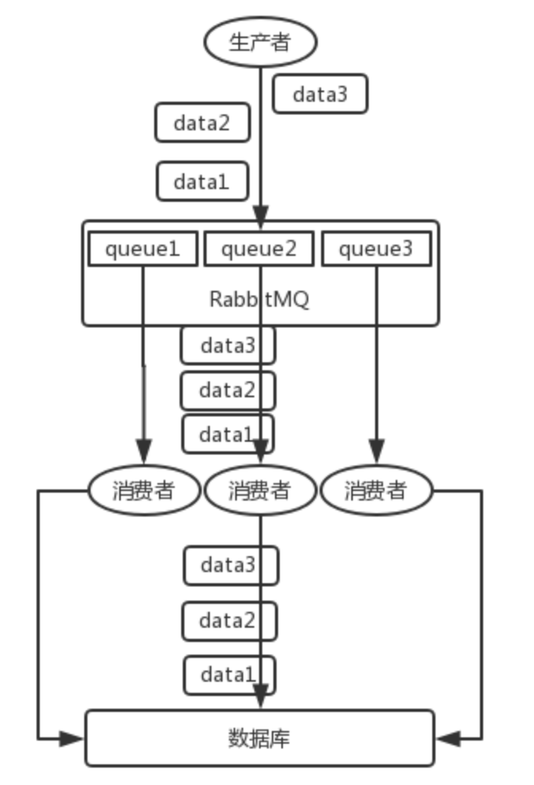

### 为什么使用消息队列

消息队列常见的使用场景有很多，但是比较核心的有 3 个：**解耦**、**异步**、**削峰**。

#### 解耦

**场景：** A系统发送数据到B、C、D三个系统，通过接口同步调用发送。如果现在E系统也需要这个数据或者C系统现在不需要了，需要去修改A系统的代码。这里A系统跟其它系统严重耦合，很多系统都需要 A 系统将这个数据发送过来。

**使用MQ：** A系统产生一条数据，发送到 MQ 里面去，其他系统需要数据就去 MQ 里面消费，如果不需要这条数据了，就取消对 MQ 消息的消费即可。通过一个 MQ，A 系统就跟其它系统彻底解耦了。

#### 异步

**场景：** A系统接收一个请求，需要在自己本地写库，还需要在B、C、D三个系统写库，自己本地写库要 3ms，B、C、D三个系统分别写库要 300ms、450ms、200ms。最终请求总延时是 3 + 300 + 450 + 200 = 953ms，接近 1s。用户通过浏览器发起请求等待1s，这几乎是不可接受的。

**使用MQ：** A系统连续发送3条消息到MQ队列中，假如耗时5ms，A系统从接受一个请求到返回响应给用户，总时长是3 + 5 = 8ms，对于用户而言，其实感觉上就是点个按钮，8ms 以后就直接返回了。

#### 削峰

**场景：** 每天晚上，系统A的TPS为50。12:00 ~ 13:00时，TPS暴增到5k+。一般的MySQL，TPS最多也就2k，如果5k的话，mysql就会直接崩溃。但是高峰期一过，TPS就又恢复到了50，整个系统几乎没有任何的压力。

**使用MQ：** 每秒 5k 个请求写入 MQ，A系统从MQ中慢慢拉取请求，每秒拉取 2k 个请求，这样下来，哪怕是高峰期的时候，A 系统也绝对不会挂掉。而 MQ 每秒钟 5k 个请求进来，就 2k 个请求出去，就导致在中午高峰期，可能有几十万甚至几百万的请求积压在 MQ 中。高峰期过了之后，每秒钟就 50 个请求进 MQ，但是 A 系统依然会按照每秒 2k 个请求的速度在处理。只要高峰期一过，A 系统就会快速将积压的消息给解决掉。

### 消息队列有什么优点和缺点

好处：**解耦**、**异步**、**削峰**。

缺点：

- 系统可用性降低：MQ一旦挂掉，整套系统崩溃。
- 系统复杂度提高：要保证没有重复消费、没有消息丢失，保证消息传递的顺序性。
- 一致性问题：A 系统处理完了直接返回成功了，但是BCD三个系统中BD写库成功了，C写库失败，导致数据不一致。

### RabbitMQ的高可用性

RabbitMQ 有三种模式：单机模式、普通集群模式、镜像集群模式。

#### 单机模式

玩玩就好。

#### 普通集群模式（无高可用性）

在多台机器上启动多个 RabbitMQ 实例。queue只会放在一个 RabbitMQ 实例上，每个实例都同步 queue 的元数据。你消费的时候，实际上如果连接到了另外一个实例，那么那个实例会从 queue 所在实例上拉取数据过来。

如果那个放 queue 的实例宕机了，会导致接下来其他实例就无法从那个实例拉取，如果你**开启了消息持久化**，让 RabbitMQ 落地存储消息的话，**消息不一定会丢**，得等这个实例恢复了，然后才可以继续从这个 queue 拉取数据。

#### 镜像集群模式（高可用性）

RabbitMQ 的高可用模式。无论元数据还是 queue 里的消息都会**存在于多个实例上**，每个 RabbitMQ 节点都有这个 queue 的一个**完整镜像**，包含 queue 的全部数据的意思。每次写消息到 queue 的时候，都会自动把**消息同步**到多个实例的 queue 上。由于其不是分布式的，所以不支持线性扩展。

### Kafka 的高可用性

Kafka由多个 broker 组成，每个 broker 是一个节点；你创建一个 topic，这个 topic 可以划分为多个 partition，每个 partition 可以存在于不同的 broker 上，每个 partition 就放一部分数据。这就是**天然的分布式消息队列**，就是说一个 topic 的数据，是**分散放在多个机器上的，每个机器就放一部分数据**。

### 如何保证消息不被重复消费？

等同于如何保证消息消费的幂等性。

得结合业务来思考，这里有几个思路：

- 如果要写库，先根据主键查一下，如果这数据存在，就直接update
- 如果要写 Redis，set天然幂等性。
- 如果不是上面两个场景，那做的稍微复杂一点，让生产者发送每条数据的时候，里面加一个全局唯一的 id，然后消费到了之后，先根据这个 id 去比如 Redis 里查一下是否消费过。如果没有消费过就处理，然后把这个id写入Redis。如果消费过就忽略。
- 比如基于数据库的唯一键来保证重复数据不会重复插入多条。因为有唯一键约束了，重复数据插入只会报错，不会导致数据库中出现脏数据。

### 如何保证消息的可靠性传输？

#### 生产者弄丢了数据

生产者将数据发送到 RabbitMQ 的时候，可能数据就在半路给搞丢了。如果要确保写 RabbitMQ 的消息不丢，可以开启 `confirm` 模式，在生产者那里设置开启 `confirm` 模式之后，你每次写的消息都会分配一个唯一的 id，然后如果写入了 RabbitMQ 中，会回传一个 `ack` 消息。如果 RabbitMQ 没能处理这个消息，会回调你的一个 `nack` 接口，告诉你这个消息接收失败，你可以重试。

#### RabbitMQ 弄丢了数据

**开启 RabbitMQ 的持久化**

设置持久化有**两个步骤**：

- 创建 queue 的时候将其设置为持久化
  这样就可以保证 RabbitMQ 持久化 queue 的元数据，但是它是不会持久化 queue 里的数据的。
- 第二个是发送消息的时候将消息的 `deliveryMode` 设置为 2
  就是将消息设置为持久化的，此时 RabbitMQ 就会将消息持久化到磁盘上去。

必须要同时设置这两个持久化才行，RabbitMQ 哪怕是挂了，再次重启，也会从磁盘上重启恢复 queue，恢复这个 queue 里的数据。

有一种可能，就是这个消息写到了 RabbitMQ 中，但是还没来得及持久化到磁盘上，结果不巧，此时 RabbitMQ 挂了，就会导致内存里的一点点数据丢失。所以，持久化可以和 `confirm` 机制配合起来，只有消息被持久化到磁盘之后，才会通知生产者 `ack` 了，所以哪怕是在持久化到磁盘之前，RabbitMQ 挂了，数据丢了，生产者收不到 `ack`，你也是可以自己重发的。

#### 消费端弄丢了数据

消费的时候，刚消费到，还没处理，结果进程挂了，RabbitMQ 会认为消费过了，这时数据就丢了。这个时候必须关闭 RabbitMQ 的自动 `ack`，可以通过一个 api 来调用就行，然后代码里确保处理完的时候，在程序里 `ack` 一下。这样的话，如果还没处理进程就挂了，RabbitMQ会认为还没处理完，这个时候 RabbitMQ 会把这个消费分配给别的 consumer 去处理，消息是不会丢的。

### RabbitMQ如何保证消息的顺序性？

拆分多个 queue，每个 queue 一个 consumer，就是多一些 queue 而已，确实是麻烦点；或者就一个 queue 但是对应一个 consumer，然后这个 consumer 内部用内存队列做排队，然后分发给底层不同的 worker 来处理。 

### 参考资料

- [互联网 Java 工程师进阶知识完全扫盲](https://github.com/doocs/advanced-java)