## 六大设计原则

-   单一职责原则：有且仅有一个原因引起类的变更。

-   里氏替换原则：只要父类能出现的地方子类就可以出现，并且替换为子类也不会产生任何错误或者异常。

-   依赖导致原则：面向接口编程。

    -   高层模块不应该依赖于底层模块，两者都应该依赖其抽象。
    -   抽象不应该依赖细节。
    -   细节应该依赖抽象。

    在Java中的表现就是：

    -   模块间的依赖通过抽象发生，实现类之间不发生直接的依赖关系，其依赖是通过接口或者抽象类产生的。
    -   接口或者抽象类不依赖于实现类。
    -   实现类依赖于接口或抽象类。

-   接口隔离原则：客户端不应该依赖它不需要的接口，类间的依赖关系应该建立在最小的接口上。

-   迪米特法则：一个对象应该对其他对象有最少的了解。

-   开闭原则：一个软件实体应该对扩展开放，对修改关闭。

## 创建型模式

### 单例模式

确保某一个类只有一个实例，而且自行实例化并且向整个系统提供这个实例：

**代码实现：**

``` java
// 饿汉式
// 缺点： 类一加载的时候，就实例化，提前占用了系统资源。
public class Singleton {
    private static final Singleton instance = new Singleton();

    private Singleton() {
    }

    private static Singleton getInstance() {
        return instance;
    }
}

// 懒汉式
// 缺点：线程不安全
public class Singleton {
    private static Singleton instance;

    private Singleton() {
    }

    private static Singleton getInstance() {
        if (instance == null) {
            instance = new Singleton();
        }
        return instance;
    }
}

// 懒汉式：同步
// 缺点：每次获取都需要同步，开销大
public class Singleton {
    private static Singleton instance;

    private Singleton() {
    }

    private synchronized static Singleton getInstance() {
        if (instance == null) {
            instance = new Singleton();
        }
        return instance;
    }
}

// 懒汉式：双重检测法
public class Singleton {
    private static volatile Singleton instance;

    private Singleton() {
    }

    private static Singleton getInstance() {
        if (instance == null) {
            synchronized (instance) {
                if (instance == null) {
                    instance = new Singleton();
                }
            }
        }
        return instance;
    }
}

// 懒汉式：内部类
public class Singleton {

    private Singleton() {
    }

    public static class InnerClass {
        private static Singleton singleton = new Singleton();
    }

    private static Singleton getInstance() {
        return InnerClass.singleton;
    }
}

// 恶汉式：枚举
public enum Singleton {
    INSTANCE;

    public Singleton getInstance() {
        return INSTANCE;
    }
}
```

### 简单工厂模式

提供一个创建对象实例的功能，而无须关心其具体实现。被创建实例的类型可以是接口、抽象类，也可以是具体的类。

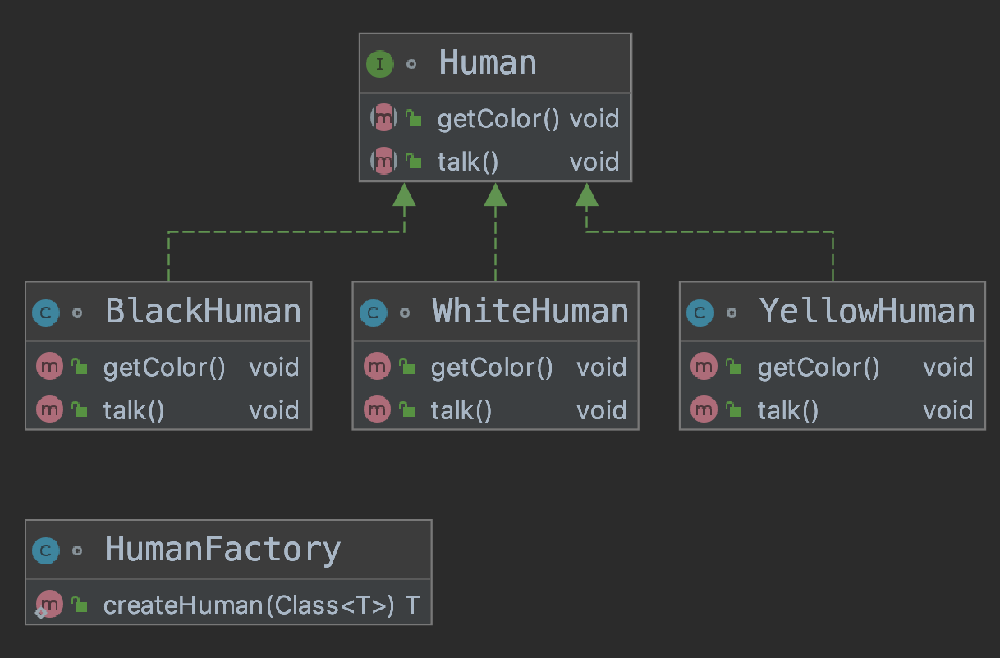

**代码实现：**

``` java
interface Human {
    void getColor();

    void talk();
}

class BlackHuman implements Human {
    public void getColor() {
        System.out.println("黑人是黑皮肤。");
    }

    public void talk() {
        System.out.println("黑人说黑人话。");
    }
}

class WhiteHuman implements Human {
    public void getColor() {
        System.out.println("白人是白皮肤。");
    }

    public void talk() {
        System.out.println("白人说白人话。");
    }
}

class YellowHuman implements Human {
    public void getColor() {
        System.out.println("黄种人是黄皮肤。");
    }

    public void talk() {
        System.out.println("黄种人说黄种人话。");
    }
}

class HumanFactory {
    public static <T extends Human> T createHuman(Class<T> clazz) {
        try {
            return clazz.getDeclaredConstructor().newInstance();
        } catch (Exception e) {
            return null;
        }
    }
}
```

**优点：** 

-   良好的封装性。

-   屏蔽了产品类的实例化过程。
-   实现了解耦，高层模块只依赖于产品的抽象。

**缺点：** 

-   可能增加了调用处的复杂度，需要知道传入什么参数。
-   不符合开不原则，扩展比较困难。

**使用场景：**

-   工厂类负责创建的对象较少，客户端只关心传入工厂类的参数，不关心创建对象的逻辑。

**最佳实践：**

-   Spring IOC容器中，BeanFactory和ApplicationContext就是工厂类，负责管理所有的Bean实例。
-   JDK中的Calendar类为工厂模式，根据传入的location信息，返回对应国家的日历。


### 工厂方法模式

定义一个用于创建对象的接口，让子类决定实例化哪一个类，工厂方法使得一个类的实例化延迟到了子类 。

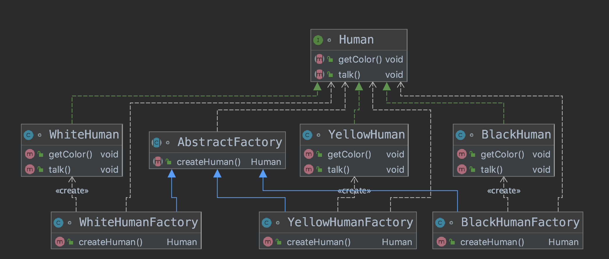

**代码实现：**

``` java
interface Human {
    void getColor();

    void talk();
}

class BlackHuman implements Human {
    public void getColor() {
        System.out.println("黑人是黑皮肤。");
    }

    public void talk() {
        System.out.println("黑人说黑人话。");
    }
}

class WhiteHuman implements Human {
    public void getColor() {
        System.out.println("白人是白皮肤。");
    }

    public void talk() {
        System.out.println("白人说白人话。");
    }
}

class YellowHuman implements Human {
    public void getColor() {
        System.out.println("黄种人是黄皮肤。");
    }

    public void talk() {
        System.out.println("黄种人说黄种人话。");
    }
}

abstract class AbstractFactory {
    public abstract Human createHuman();
}

class BlackHumanFactory extends AbstractFactory {

    @Override
    public Human createHuman() {
        return new BlackHuman();
    }
}

class WhiteHumanFactory extends AbstractFactory {

    @Override
    public Human createHuman() {
        return new WhiteHuman();
    }
}

class YellowHumanFactory extends AbstractFactory {

    @Override
    public Human createHuman() {
        return new YellowHuman();
    }
}
```

**优点：** 

-   良好的封装性，代码结构清晰。
-   扩展性非常优秀，在需要增加产品类的时候，只需要扩展一个工厂类。
-   屏蔽了产品类的实例化过程。
-   实现了解耦，高层模块只依赖于产品的抽象。

**缺点：** 

-   每增加一个产品，相应的也要增加一个子工厂，加大了额外的开发量。

**使用场景：**

-   要求生成唯一序列号的环境。
-   共享访问点：如页面上的访问计数器。
-   创建一个对象需要消耗过多资源：IO、数据库等。

**最佳实践：**

-   JDK中的Iterator类运用了工厂方法模式，每种集合类都负责实例化对应的Iterator实例。


### 抽象工厂模式

为创建一组相关或相互依赖的对象提供一个接口，而且无需指定它们的具体类型。

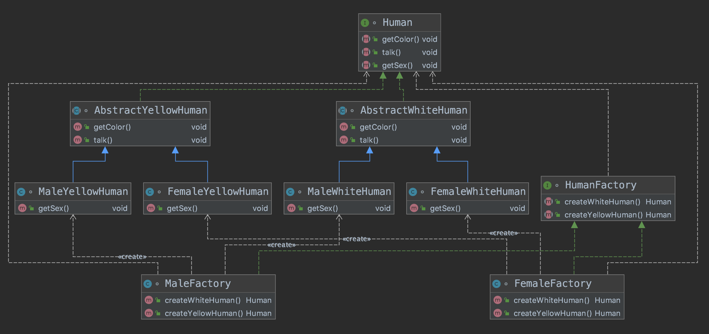

**代码实现：**

``` java
interface Human {
    void getColor();

    void talk();

    void getSex();
}

abstract class AbstractWhiteHuman implements Human {
    @Override
    public void getColor() {
        System.out.println("白人是白皮肤。");
    }

    @Override
    public void talk() {
        System.out.println("白人说白人话。");
    }
}

abstract class AbstractYellowHuman implements Human {
    @Override
    public void getColor() {
        System.out.println("黄种人是黄皮肤。");
    }

    @Override
    public void talk() {
        System.out.println("黄种人说黄种人话。");
    }
}

class FemaleWhiteHuman extends AbstractWhiteHuman {

    @Override
    public void getSex() {
        System.out.println("女性白人。");
    }
}

class MaleWhiteHuman extends AbstractWhiteHuman {

    @Override
    public void getSex() {
        System.out.println("男性白人。");
    }
}

class FemaleYellowHuman extends AbstractYellowHuman {

    @Override
    public void getSex() {
        System.out.println("女性黄种人。");
    }
}

class MaleYellowHuman extends AbstractYellowHuman {

    @Override
    public void getSex() {
        System.out.println("男性黄种人。");
    }
}

interface HumanFactory {
    Human createWhiteHuman();

    Human createYellowHuman();
}

class FemaleFactory implements HumanFactory {

    @Override
    public Human createWhiteHuman() {
        return new FemaleWhiteHuman();
    }

    @Override
    public Human createYellowHuman() {
        return new FemaleYellowHuman();
    }
}

class MaleFactory implements HumanFactory {

    @Override
    public Human createWhiteHuman() {
        return new MaleWhiteHuman();
    }

    @Override
    public Human createYellowHuman() {
        return new MaleYellowHuman();
    }
}
```

**优点：** 

-   良好的封装性。
-   产品族内的约束为非公开状态。
-   实现了解耦，高层模块只依赖于产品的抽象。

**缺点：** 

-   产品族扩展非常困难。

**使用场景：**

-   一个对象族都具有相同的约束，则可以使用抽象工厂模式。


### 构造者模式

将一个复杂对象的构建与它的表示分离，使得同样的构建过程可以创建不同的表示。

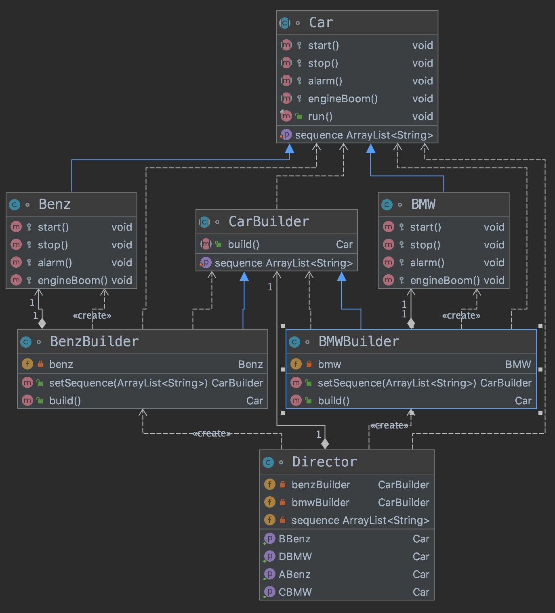

**代码实现：**

``` java
abstract class Car {
    private ArrayList<String> sequence = new ArrayList<>();

    protected abstract void start();

    protected abstract void stop();

    protected abstract void alarm();

    protected abstract void engineBoom();

    final public void run() {
        for (String action : sequence) {
            if ("start".equals(action)) {
                this.start();
            } else if ("stop".equals(action)) {
                this.stop();
            } else if ("alarm".equals(action)) {
                this.alarm();
            } else if ("engine boom".equals(action)) {
                this.engineBoom();
            }
        }
    }

    final public void setSequence(ArrayList<String> sequence) {
        this.sequence = sequence;
    }
}

class Benz extends Car {

    @Override
    protected void start() {
        System.out.println("奔驰启动");
    }

    @Override
    protected void stop() {
        System.out.println("奔驰熄火");
    }

    @Override
    protected void alarm() {
        System.out.println("奔驰鸣笛");
    }

    @Override
    protected void engineBoom() {
        System.out.println("奔驰引擎响");
    }
}

class BMW extends Car {

    @Override
    protected void start() {
        System.out.println("宝马启动");
    }

    @Override
    protected void stop() {
        System.out.println("宝马熄火");
    }

    @Override
    protected void alarm() {
        System.out.println("宝马鸣笛");
    }

    @Override
    protected void engineBoom() {
        System.out.println("宝马引擎响");
    }
}

abstract class CarBuilder {
    public abstract CarBuilder setSequence(ArrayList<String> sequence);

    public abstract Car build();
}

class BenzBuilder extends CarBuilder {
    private Benz benz = new Benz();

    @Override
    public CarBuilder setSequence(ArrayList<String> sequence) {
        benz.setSequence(sequence);
        return this;
    }

    @Override
    public Car build() {
        return benz;
    }
}

class BMWBuilder extends CarBuilder {
    private BMW bmw = new BMW();

    @Override
    public CarBuilder setSequence(ArrayList<String> sequence) {
        bmw.setSequence(sequence);
        return this;
    }

    @Override
    public Car build() {
        return bmw;
    }
}

class Director {
    private CarBuilder benzBuilder = new BenzBuilder();
    private CarBuilder bmwBuilder = new BMWBuilder();
    private ArrayList<String> sequence = new ArrayList<>();

    public Car getABenz() {
        sequence.clear();
        sequence.add("start");
        sequence.add("stop");
        return benzBuilder.setSequence(sequence).build();
    }

    public Car getBBenz() {
        sequence.clear();
        sequence.add("engine boom");
        sequence.add("start");
        sequence.add("stop");
        return benzBuilder.setSequence(sequence).build();
    }

    public Car getCBMW() {
        sequence.clear();
        sequence.add("alarm");
        sequence.add("start");
        sequence.add("stop");
        return bmwBuilder.setSequence(sequence).build();
    }

    public Car getDBMW() {
        sequence.clear();
        sequence.add("start");
        sequence.add("engine boom");
        sequence.add("stop");
        return bmwBuilder.setSequence(sequence).build();
    }
}
```

**优点：** 

-   客户端不必知道产品内部组成的细节。
-   建造者独立，易于扩展。

**缺点：** 

-   产生多余的Builder对象、Director对象

**使用场景：**

-   相同的方法，不同的执行顺序，产生不同的时间结果时。
-   多个零件或部件，都可以装配到一个对象中，但是产生的结果不同。
-   产品类非常复杂时

**最佳实践：**

-   JDK中的`StringBuilder`。


### 原型模式

使用原型实例指定创建对象的种类，并且通过拷贝这些原型创建新的对象。

**代码实现：**

``` java
class PrototypeClass implements Cloneable {
    private ArrayList<Integer> list = new ArrayList<>();

    @Override
    public PrototypeClass clone() throws CloneNotSupportedException {
        PrototypeClass prototypeClass;
        prototypeClass = (PrototypeClass) super.clone();
        prototypeClass.list = (ArrayList<Integer>) list.clone();
        return prototypeClass;
    }
}
```

**优点：** 

-   拷贝的是二进制流，性能好。
-   逃避构造函数的约束。

**使用场景：**

-   资源优化场景。
-   性能和安全性要求较高的场景。
-   一个对象多个修改者。


## 行为型模式

### 模板方法模式

定义一个操作中的算法的框架，而将一些步骤延迟到子类中。使得子类可以不改变一个算法的节后即可重定义该算法的某些特定步骤。

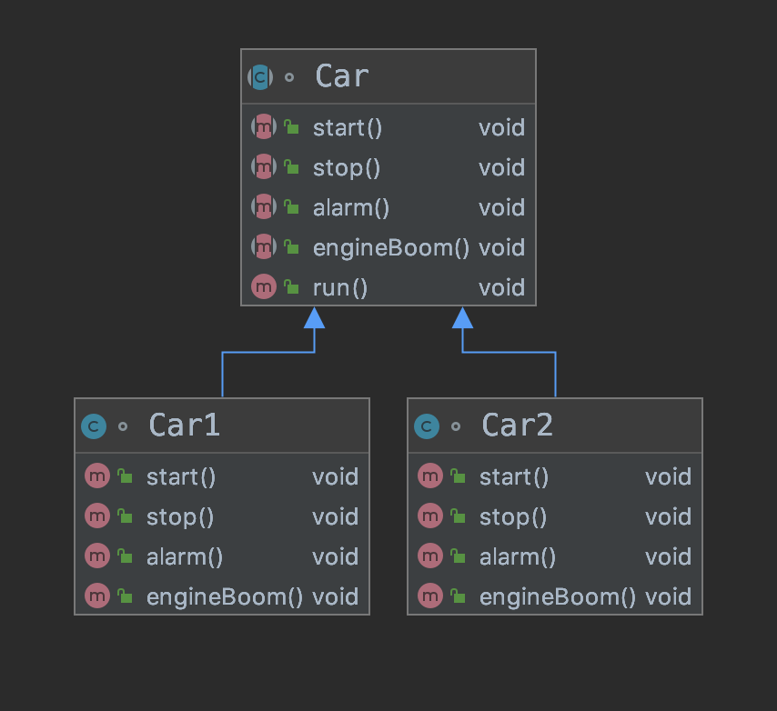

**代码实现：**

```java
 // 抽象模板类
 abstract class Car {
     public abstract void start();
 
     public abstract void stop();
 
     public abstract void alarm();
 
     public abstract void engineBoom();
 
     public void run() {
         this.start();
         this.engineBoom();
         this.alarm();
         this.stop();
     }
 }
 
 // 具体模板类
 class Car1 extends Car {
 
     @Override
     public void start() {
         System.out.println("car1 start...");
     }
 
     @Override
     public void stop() {
         System.out.println("car1 stop...");
     }
 
     @Override
     public void alarm() {
         System.out.println("car1 alarm...");
     }
 
     @Override
     public void engineBoom() {
         System.out.println("car1 engineBoom...");
     }
 }
 
 // 具体模板类
 class Car2 extends Car {
 
     @Override
     public void start() {
         System.out.println("car2 start...");
     }
 
     @Override
     public void stop() {
         System.out.println("car2 stop...");
     }
 
     @Override
     public void alarm() {
         System.out.println("car2 alarm...");
     }
 
     @Override
     public void engineBoom() {
         System.out.println("car2 engineBoom...");
     }
 }
```

**优点：** 

-   封装不变部分，扩展可变部分。
-   提取公共部分代码，便于维护。
-   行为由父类控制，子类实现。

**缺点：** 

-   子类的执行结果影响了父类。

**使用场景：**

-   多个子类由公共的方法，并且逻辑基本相同。
-   重要、复杂的算法，可以把核心算法设计为模板方法。
-   重构时，可以把相同提取到父类中。

**最佳实践：**

-   JDK中的AbstractList类运用了模板方法模式。
-   Spring中`JDBCTemplate`运用了模板方法模式。


### 中介者模式

用一个中介对象封装一系列的对象交互，中介者使各对象不需要显示地相互作用，从而使其耦合松散，而且可以独立地改变它们之间的交互。

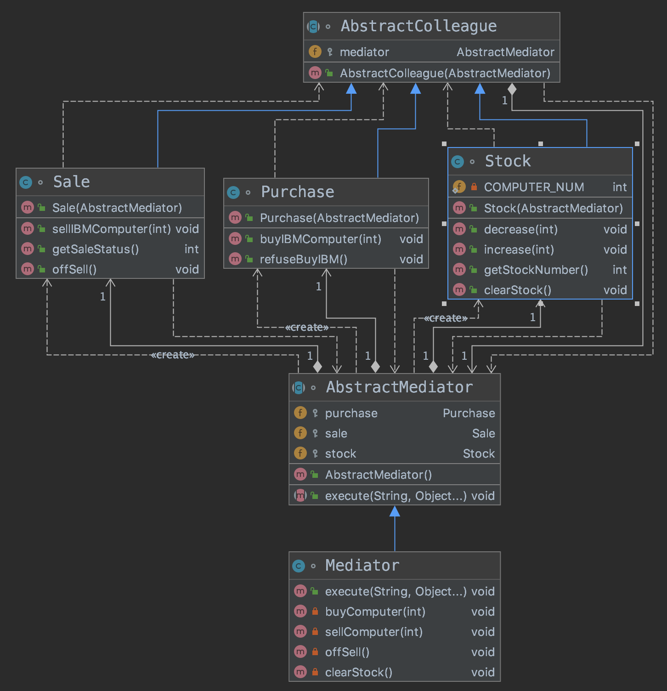

**代码如下：**

``` java
abstract class AbstractColleague {
    protected AbstractMediator mediator;

    public AbstractColleague(AbstractMediator mediator) {
        this.mediator = mediator;
    }
}

class Purchase extends AbstractColleague {

    public Purchase(AbstractMediator mediator) {
        super(mediator);
    }

    public void buyIBMComputer(int number) {
        super.mediator.execute("purchase.buy", number);
    }

    public void refuseBuyIBM() {
        System.out.println("不再采购IBM电脑");
    }
}

class Stock extends AbstractColleague {
    private static int COMPUTER_NUM = 100;

    public Stock(AbstractMediator mediator) {
        super(mediator);
    }

    public void decrease(int number) {
        COMPUTER_NUM -= number;
        System.out.println("库存数量为：" + COMPUTER_NUM);
    }

    public void increase(int number) {
        COMPUTER_NUM += number;
        System.out.println("库存数量为：" + COMPUTER_NUM);
    }

    public int getStockNumber() {
        return COMPUTER_NUM;
    }

    public void clearStock() {
        System.out.println("清理库存数量为：" + COMPUTER_NUM);
        super.mediator.execute("stock.clear");
    }
}

class Sale extends AbstractColleague {

    public Sale(AbstractMediator mediator) {
        super(mediator);
    }

    public void sellIBMComputer(int number) {
        super.mediator.execute("sale.sell", number);
        System.out.println("销售IBM电脑" + number + "台");
    }

    public int getSaleStatus() {
        Random random = new Random(System.currentTimeMillis());
        int saleStatus = random.nextInt(100);
        System.out.println("IBM电脑销售情况：" + saleStatus);
        return saleStatus;
    }

    public void offSell() {
        super.mediator.execute("sale.offSell");
    }
}

abstract class AbstractMediator {
    protected Purchase purchase;
    protected Sale sale;
    protected Stock stock;

    public AbstractMediator() {
        purchase = new Purchase(this);
        sale = new Sale(this);
        stock = new Stock(this);
    }

    public abstract void execute(String str, Object... objects);
}

class Mediator extends AbstractMediator {

    @Override
    public void execute(String str, Object... objects) {
        if ("purchase.buy".equals(str)) {
            buyComputer((Integer) objects[0]);
        } else if ("sale.sell".equals(str)) {
            sellComputer((Integer) objects[0]);
        } else if ("sale.offSell".equals(str)) {
            offSell();
        } else if ("stock.clear".equals(str)) {
            clearStock();
        }
    }

    private void buyComputer(int number) {
        int saleStatus = super.sale.getSaleStatus();
        if (saleStatus > 80) {
            System.out.println("采购IBM电脑：" + number + "台");
            super.stock.increase(number);
        } else {
            int buyNumber = number / 2;
            System.out.println("采购IBM电脑：" + buyNumber + "台");
            super.stock.increase(buyNumber);
        }
    }

    private void sellComputer(int number) {
        if (super.stock.getStockNumber() < number) {
            super.purchase.buyIBMComputer(number);
        }
        super.stock.decrease(number);
    }

    private void offSell() {
        System.out.println("折价销售IBM电脑：" + super.stock.getStockNumber());
    }

    private void clearStock() {
        super.sale.offSell();
        super.purchase.refuseBuyIBM();
    }
}
```

**优点：** 

-   降低了类间的耦合。

**缺点：** 

-   中介者会膨胀的很大，且逻辑复杂。

**使用场景：**

-   适用于多个对象之间紧密耦合的情况，紧密耦合的标准是：类图中出现了类似蜘蛛网的结构。

**最佳实践：**

-   JDK中的Timer类运用了中介者模式。


### 命令模式

将一个请求封装成一个对象，从而可以使用不同的请求把客户端参数化，对请求排队或者记录请求日志，可以提供命令的撤销和恢复功能。

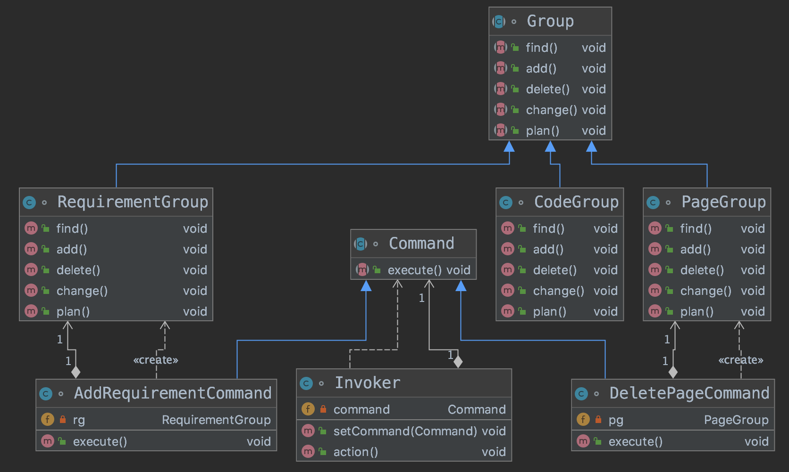

**代码实现：**

``` java
abstract class Group {
    public abstract void find();

    public abstract void add();

    public abstract void delete();

    public abstract void change();

    public abstract void plan();
}

class RequirementGroup extends Group {

    @Override
    public void find() {
        System.out.println("找到需求组");
    }

    @Override
    public void add() {
        System.out.println("客户要求增加一项需求");
    }

    @Override
    public void delete() {
        System.out.println("客户要求删除一项需求");
    }

    @Override
    public void change() {
        System.out.println("客户要求修改一项需求");
    }

    @Override
    public void plan() {
        System.out.println("客户要求需求变更计划");
    }
}

class PageGroup extends Group {

    @Override
    public void find() {
        System.out.println("找到美工组");
    }

    @Override
    public void add() {
        System.out.println("客户要求增加一项页面");
    }

    @Override
    public void delete() {
        System.out.println("客户要求删除一项页面");
    }

    @Override
    public void change() {
        System.out.println("客户要求修改一项页面");
    }

    @Override
    public void plan() {
        System.out.println("客户要求页面变更计划");
    }
}

class CodeGroup extends Group {

    @Override
    public void find() {
        System.out.println("找到代码组");
    }

    @Override
    public void add() {
        System.out.println("客户要求增加一项功能");
    }

    @Override
    public void delete() {
        System.out.println("客户要求删除一项功能");
    }

    @Override
    public void change() {
        System.out.println("客户要求修改一项功能");
    }

    @Override
    public void plan() {
        System.out.println("客户要求代码变更计划");
    }
}

abstract class Command {
    public abstract void execute();
}

class AddRequirementCommand extends Command {
    private RequirementGroup rg = new RequirementGroup();

    @Override
    public void execute() {
        rg.find();
        rg.add();
        rg.plan();
    }
}

class DeletePageCommand extends Command {
    private PageGroup pg = new PageGroup();

    @Override
    public void execute() {
        pg.find();
        pg.delete();
        pg.plan();
    }
}

class Invoker {
    private Command command;

    public void setCommand(Command command) {
        this.command = command;
    }

    public void action() {
        command.execute();
    }
}
```

**优点：** 

-   类间解耦
-   可扩展
-   提取公共部分代码，便于维护。
-   行为由父类控制，子类实现。

**缺点：** 

-   每增加一个命令，相应的也要增加命令子类，加大了额外的开发量。

**使用场景：**

-   只要是命令的地方就可以使用命令模式。

**最佳实践：**

-   JDK中的Rannable类运用了命令模式。


### 迭代器模式

提供一种方法访问一个容器对象中各个元素，而又不需暴露该对象的内部细节。

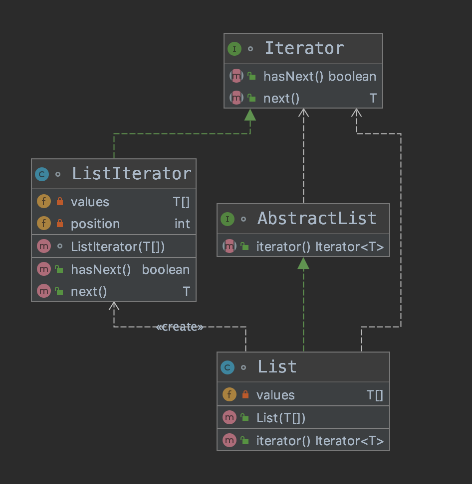

**代码实现：**

``` java
interface Iterator<T> {
    boolean hasNext();

    T next();
}

interface AbstractList<T> {
    Iterator<T> iterator();
}

class List<T> implements AbstractList<T> {
    private T[] values;

    public List(T[] values) {
        this.values = values;
    }

    @Override
    public Iterator<T> iterator() {
        return new ListIterator<T>(values);
    }
}

class ListIterator<T> implements Iterator<T> {
    private T[] values;
    private int position;

    ListIterator(T[] values) {
        this.values = values;
    }

    @Override
    public boolean hasNext() {
        return position < values.length;
    }

    @Override
    public T next() {
        return values[position++];
    }
}
```

**优点：** 

-   支持多种方式遍历一个容器对象
-   隐蔽了对象的内部细节

**最佳实践：**

-   JDK中的Iterator类运用了迭代器模式。


### 责任链模式

使多个对象都有机会处理请求，从而避免了请求的发送者和接受者之间的耦合关系，将这些对象连成一条链，并沿着这条链传递请求，直至有对象处理它为止。

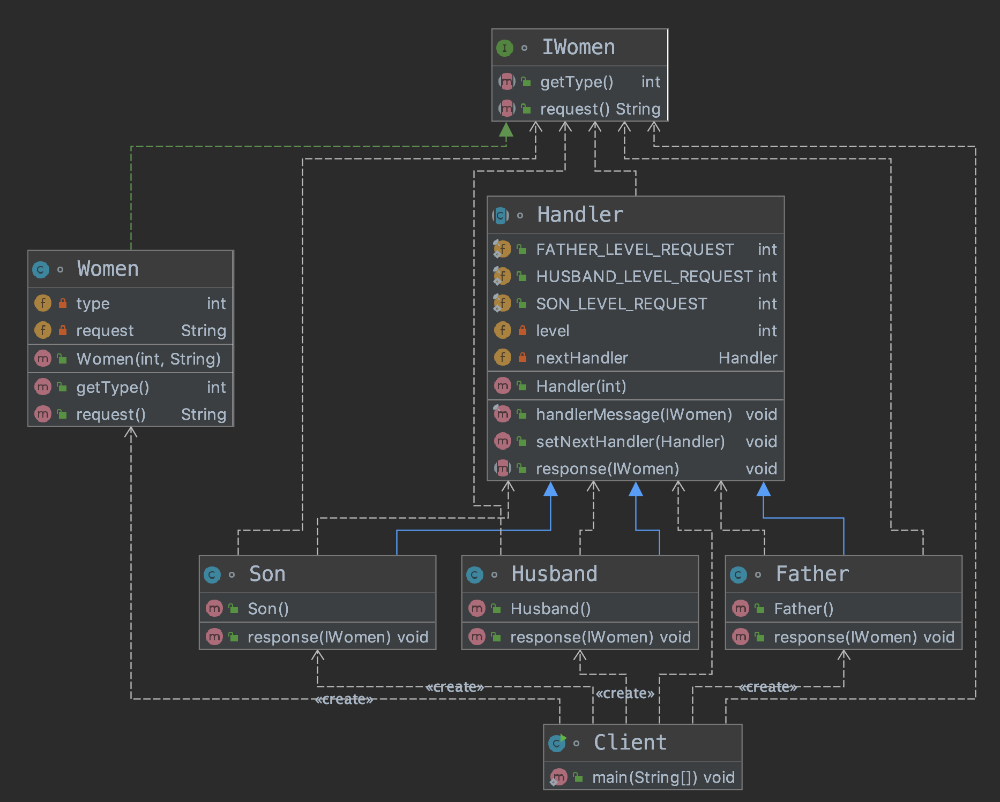

**代码如下：**

``` java
interface IWomen {
    int getType();

    String request();
}

abstract class Handler {
    public static final int FATHER_LEVEL_REQUEST = 1;
    public static final int HUSBAND_LEVEL_REQUEST = 2;
    public static final int SON_LEVEL_REQUEST = 3;

    private int level;
    private Handler nextHandler;

    public Handler(int level) {
        this.level = level;
    }

    public final void handlerMessage(IWomen women) {
        if (women.getType() == level) {
            response(women);
        } else if (nextHandler != null) {
            nextHandler.handlerMessage(women);
        } else {
            System.out.println("没有后续处理人了，按不同意处理");
        }
    }

    public void setNextHandler(Handler nextHandler) {
        this.nextHandler = nextHandler;
    }

    public abstract void response(IWomen women);
}

class Father extends Handler {

    public Father() {
        super(Handler.FATHER_LEVEL_REQUEST);
    }

    @Override
    public void response(IWomen women) {
        System.out.println("女儿向父亲请示");
        System.out.println(women.request());
        System.out.println("父亲同意");
    }
}

class Husband extends Handler {

    public Husband() {
        super(Handler.HUSBAND_LEVEL_REQUEST);
    }

    @Override
    public void response(IWomen women) {
        System.out.println("妻子向丈夫请示");
        System.out.println(women.request());
        System.out.println("丈夫同意");
    }
}

class Son extends Handler {

    public Son() {
        super(Handler.SON_LEVEL_REQUEST);
    }

    @Override
    public void response(IWomen women) {
        System.out.println("母亲向儿子请示");
        System.out.println(women.request());
        System.out.println("儿子同意");
    }
}

class Women implements IWomen {
    // 1.未出嫁，2.已出嫁，3.夫死
    private int type;
    private String request;

    public Women(int type, String request) {
        this.type = type;
        this.request = request;
    }

    @Override
    public int getType() {
        return type;
    }

    @Override
    public String request() {
        return request;
    }
}

class Client {
    public static void main(String[] args) {
        IWomen women = new Women(new Random().nextInt(4), "我要出去逛街");
        Handler father = new Father();
        Handler husband = new Husband();
        Handler son = new Son();

        father.setNextHandler(husband);
        husband.setNextHandler(son);

        father.handlerMessage(women);
    }
}
```

**优点：** 

-   将请求和处理分离开，降低了耦合。
-   性能较差，需要遍历链表。

**缺点：** 

-   每增加一个命令，相应的也要增加命令子类，加大了额外的开发量。

**使用场景：**

-   只要是命令的地方就可以使用命令模式。

**最佳实践：**

-   javax.servlet.Filter#doFilter()


### 策略模式

定义一组算法，将每个算法都封装起来，并且使它们之间可以互换。

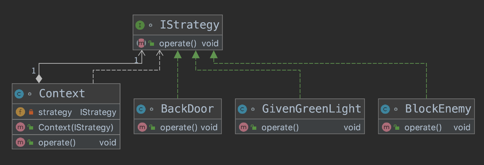

**代码如下：**

``` java
interface IStrategy {
    void operate();
}

class BackDoor implements IStrategy {

    @Override
    public void operate() {
        System.out.println("找乔国老帮忙，让吴国太给孙权施加压力");
    }
}

class GivenGreenLight implements IStrategy {

    @Override
    public void operate() {
        System.out.println("求吴国太开绿灯，放行");
    }
}

class BlockEnemy implements IStrategy {

    @Override
    public void operate() {
        System.out.println("孙夫人断后，挡住追兵");
    }
}

class Context {
    private IStrategy strategy;

    public Context(IStrategy strategy) {
        this.strategy = strategy;
    }

    public void operate() {
        strategy.operate();
    }
}
```

**优点：** 

-   算法可以自由切换
-   避免了多重条件判断
-   扩展性好
-   性能较差，需要遍历链表。

**缺点：** 

-   策略类数量增多
-   所有策略类都需要对外暴露

**使用场景：**

-   多个类只有算法或者行为上稍有不同的场景。

**最佳实践：**

-   java.util.Comparator#compare()


### 状态模式

状态的变更引起了行为的变更，从外部看起来就好像这个对象对应的类发生了改变一样。

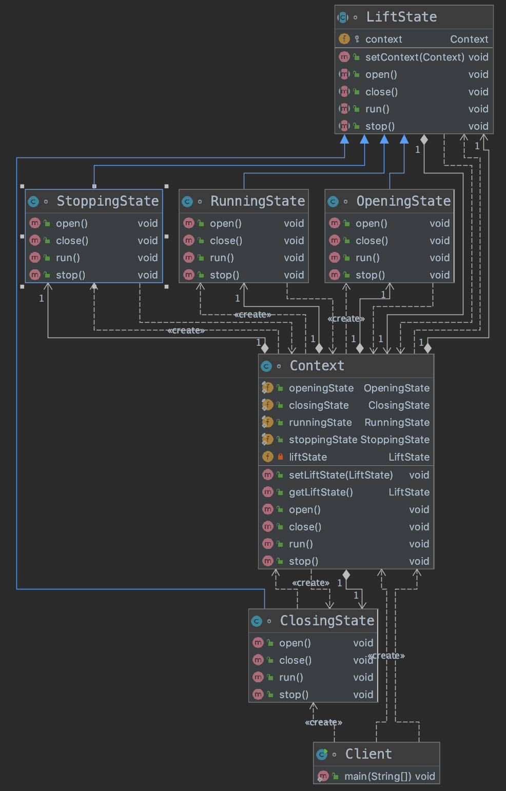

**代码如下：**

``` java
abstract class LiftState {
    protected Context context;

    public void setContext(Context context) {
        this.context = context;
    }

    public abstract void open();

    public abstract void close();

    public abstract void run();

    public abstract void stop();
}

class OpeningState extends LiftState {

    @Override
    public void open() {
        System.out.println("电梯门开。。。");
    }

    @Override
    public void close() {
        super.context.setLiftState(Context.closingState);
        super.context.close();
    }

    @Override
    public void run() {
        System.out.println("门开着还想跑？？？");
    }

    @Override
    public void stop() {
        System.out.println("已经停了。。。。");
    }
}

class ClosingState extends LiftState {

    @Override
    public void open() {
        super.context.setLiftState(Context.openingState);
        super.context.open();
    }

    @Override
    public void close() {
        System.out.println("电梯关门。。。");
    }

    @Override
    public void run() {
        super.context.setLiftState(Context.runningState);
        super.context.run();
    }

    @Override
    public void stop() {
        super.context.setLiftState(Context.stoppingState);
        super.context.stop();
    }
}

class RunningState extends LiftState {

    @Override
    public void open() {
        System.out.println("跑着还想开门？？？");
    }

    @Override
    public void close() {
        System.out.println("门本来就关着呢。。。");
    }

    @Override
    public void run() {
        System.out.println("开始上下运行。。。");
    }

    @Override
    public void stop() {
        super.context.setLiftState(Context.stoppingState);
        super.context.stop();
    }
}

class StoppingState extends LiftState {

    @Override
    public void open() {
        super.context.setLiftState(Context.openingState);
        super.context.stop();
    }

    @Override
    public void close() {
        System.out.println("门本来就关着呢。。。");
    }

    @Override
    public void run() {
        super.context.setLiftState(Context.runningState);
        super.context.run();
    }

    @Override
    public void stop() {
        System.out.println("电梯停下。。。");
    }
}

class Context {
    public static final OpeningState openingState = new OpeningState();
    public static final ClosingState closingState = new ClosingState();
    public static final RunningState runningState = new RunningState();
    public static final StoppingState stoppingState = new StoppingState();

    private LiftState liftState;

    public void setLiftState(LiftState liftState) {
        this.liftState = liftState;
        // 将当前的环境通知到各个实现类中
        liftState.setContext(this);
    }

    public LiftState getLiftState() {
        return liftState;
    }

    public void open() {
        liftState.open();
    }

    public void close() {
        liftState.close();
    }

    public void run() {
        liftState.run();
    }

    public void stop() {
        liftState.stop();
    }
}

class Client {
    public static void main(String[] args) {
        Context context = new Context();
        context.setLiftState(new ClosingState());
        context.open();
        context.close();
        context.run();
        context.stop();
    }
}
```

**优点：** 

-   结构清晰
-   遵循单一职责原则和开闭原则
-   封装性好

**缺点：** 

-   子类太多。

**使用场景：**

-   行为随状态改变而改变的场景。
-   条件、分值判断语句的替代者。


### 观察者模式

观察者模式也叫发布订阅模式，它是一个在项目中经常使用的模式，定义如下：

定义对象间一种一对多的依赖关系，使得每当一个对象改变状态，所有依赖于它的对象都会得到通知并被自动更新。

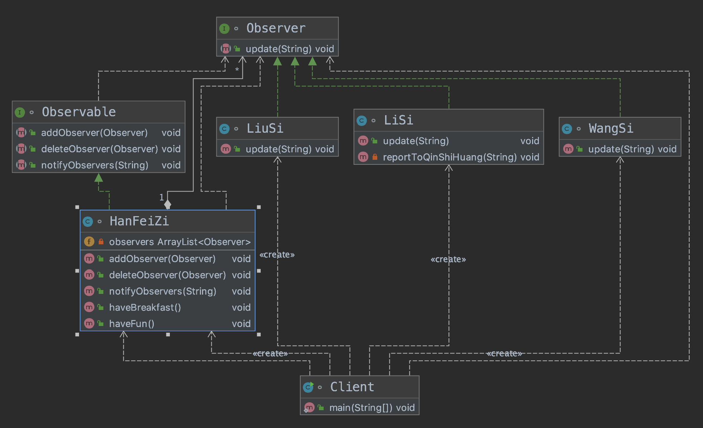

**代码如下：**

``` java
interface Observer {
    void update(String context);
}

interface Observable {
    void addObserver(Observer observer);

    void deleteObserver(Observer observer);

    void notifyObservers(String context);
}

class HanFeiZi implements Observable {
    private ArrayList<Observer> observers = new ArrayList<>();

    @Override
    public void addObserver(Observer observer) {
        observers.add(observer);
    }

    @Override
    public void deleteObserver(Observer observer) {
        observers.remove(observer);
    }

    @Override
    public void notifyObservers(String context) {
        for (Observer o : observers) {
            o.update(context);
        }
    }

    public void haveBreakfast() {
        System.out.println("韩非子开始吃饭。。。");
        notifyObservers("韩非子开始吃饭了。。。");
    }

    public void haveFun() {
        System.out.println("韩非子开始娱乐。。。");
        notifyObservers("韩非子开始娱乐了。。。");
    }
}

class LiSi implements Observer {

    @Override
    public void update(String context) {
        System.out.println("李斯：观察到韩非子活动，开始向老板汇报。。。");
        reportToQinShiHuang(context);
    }

    private void reportToQinShiHuang(String context) {
        System.out.println("李斯：报告秦老板，韩非子有活动了。。。" + context);
    }
}

class WangSi implements Observer {

    @Override
    public void update(String context) {
        System.out.println("王斯：观察到韩非子活动，自己开始哭。。。");
        System.out.println("王斯：开始哭。。。" + context);
    }
}

class LiuSi implements Observer {

    @Override
    public void update(String context) {
        System.out.println("刘斯：观察到韩非子活动，自己开始笑。。。");
        System.out.println("刘斯：开始笑。。。" + context);
    }
}

class Client {
    public static void main(String[] args) {
        Observer liSi = new LiSi();
        Observer wangSi = new WangSi();
        Observer liuSi = new LiuSi();
        
        HanFeiZi hanFeiZi = new HanFeiZi();
        
        hanFeiZi.addObserver(liSi);
        hanFeiZi.addObserver(wangSi);
        hanFeiZi.addObserver(liuSi);
        
        hanFeiZi.haveBreakfast();
    }
}
```

**优点：** 

-   观察者和被观察者之间是抽象耦合。
-   建立了一套触发机制。

**缺点：** 

-   效率低，需要进行一系列调用。

**使用场景：**

-   关联行为场景。
-   事件多级触发场景。
-   跨系统的消息交换场景。


## 结构型

### 适配器模式

将一个类的接口变换成客户端所期待的另一种接口，从而使原本因接口不匹配而无法在一起工作的两个类能够在一起工作。

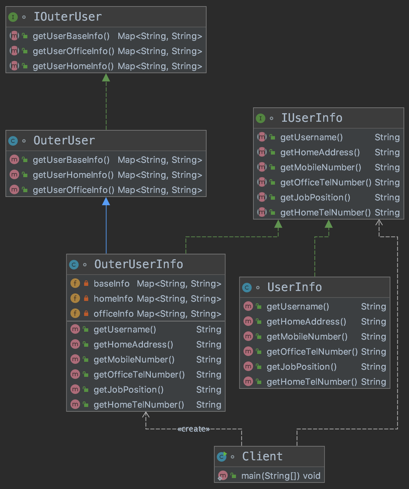

**代码如下：**

``` java
interface IUserInfo {
    String getUsername();

    String getHomeAddress();

    String getMobileNumber();

    String getOfficeTelNumber();

    String getJobPosition();

    String getHomeTelNumber();
}

class UserInfo implements IUserInfo {

    @Override
    public String getUsername() {
        System.out.println("姓名是。。");
        return null;
    }

    @Override
    public String getHomeAddress() {
        System.out.println("家庭住址是。。。");
        return null;
    }

    @Override
    public String getMobileNumber() {
        System.out.println("手机号码是。。。");
        return null;
    }

    @Override
    public String getOfficeTelNumber() {
        System.out.println("办公室电话号码是。。。");
        return null;
    }

    @Override
    public String getJobPosition() {
        System.out.println("职位是。。。");
        return null;
    }

    @Override
    public String getHomeTelNumber() {
        System.out.println("家庭电话是。。。");
        return null;
    }
}

interface IOuterUser {
    Map<String, String> getUserBaseInfo();

    Map<String, String> getUserOfficeInfo();

    Map<String, String> getUserHomeInfo();
}

class OuterUser implements IOuterUser {

    @Override
    public Map<String, String> getUserBaseInfo() {
        Map<String, String> map = new HashMap<>();
        map.put("username", "混世魔王");
        map.put("mobileNumber", "混世魔王的电话号码");
        return map;
    }

    @Override
    public Map<String, String> getUserHomeInfo() {
        Map<String, String> map = new HashMap<>();
        map.put("homeTelNumber", "混世魔王的家庭电话");
        map.put("homeAddress", "混世魔王的家庭住址");
        return map;
    }

    @Override
    public Map<String, String> getUserOfficeInfo() {
        Map<String, String> map = new HashMap<>();
        map.put("jobPosition", "混世魔王的职位");
        map.put("officeTelNumber", "混世魔王的办公电话");
        return map;
    }
}

class OuterUserInfo extends OuterUser implements IUserInfo {
    private Map<String, String> baseInfo = super.getUserBaseInfo();
    private Map<String, String> homeInfo = super.getUserHomeInfo();
    private Map<String, String> officeInfo = super.getUserOfficeInfo();

    @Override
    public String getUsername() {
        System.out.println(baseInfo.get("username"));
        return homeInfo.get("username");
    }

    @Override
    public String getHomeAddress() {
        System.out.println(homeInfo.get("homeAddress"));
        return homeInfo.get("homeAddress");
    }

    @Override
    public String getMobileNumber() {
        System.out.println(baseInfo.get("mobileNumber"));
        return homeInfo.get("mobileNumber");
    }

    @Override
    public String getOfficeTelNumber() {
        System.out.println(officeInfo.get("officeTelNumber"));
        return homeInfo.get("officeTelNumber");
    }

    @Override
    public String getJobPosition() {
        System.out.println(officeInfo.get("jobPosition"));
        return homeInfo.get("jobPosition");
    }

    @Override
    public String getHomeTelNumber() {
        System.out.println(homeInfo.get("homeTelNumber"));
        return homeInfo.get("homeTelNumber");
    }
}

class Client {
    public static void main(String[] args) {
        IUserInfo youngGirl = new OuterUserInfo();
        for (int i = 0; i < 101; i++) {
            youngGirl.getMobileNumber();
        }
    }
}
```

**优点：** 

-   可以让两个没有任何关系的类运行在一起。
-   增加了类的透明性。

**使用场景：**

-   系统扩展时，需要使用一个已有或者建立一个新的类，但是这个类不符合系统的接口。

**最佳实践：**

-   java.util.Arrays#asList()


### 代理模式

为其他对象提供一种代理以控制这个对象的访问。

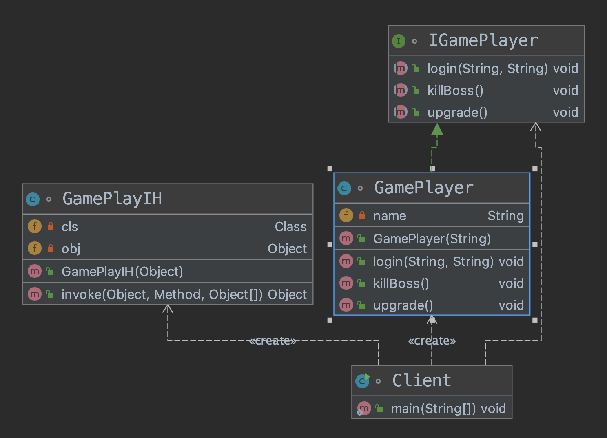

**代码实现：**

``` java
interface IGamePlayer {
    void login(String user, String password);

    void killBoss();

    void upgrade();
}

class GamePlayer implements IGamePlayer {
    private String name;

    public GamePlayer(String name) {
        this.name = name;
    }

    @Override
    public void login(String user, String password) {
        System.out.println("登录");
    }

    @Override
    public void killBoss() {
        System.out.println("打怪");
    }

    @Override
    public void upgrade() {
        System.out.println("升级");
    }
}

class GamePlayIH implements InvocationHandler {
    // 被代理者
    private Class cls;
    // 被代理的实例
    private Object obj;

    public GamePlayIH(Object obj) {
        this.obj = obj;
    }

    @Override
    public Object invoke(Object proxy, Method method, Object[] args) throws Throwable {
        Object result = method.invoke(obj, args);
        if ("login".equals(method.getName())) {
            System.out.println("有人在用我的账号登录。。");
        }
        return result;
    }
}

class Client {
    public static void main(String[] args) {
        IGamePlayer player = new GamePlayer("张三");
        InvocationHandler handler = new GamePlayIH(player);
        System.out.println("游戏开始：" + System.currentTimeMillis());
        IGamePlayer proxy = (IGamePlayer) Proxy.newProxyInstance(player.getClass().getClassLoader(), player.getClass().getInterfaces(), handler);
        proxy.login("zhangSan", "password");
        proxy.killBoss();
        proxy.upgrade();
        System.out.println("游戏结束：" + System.currentTimeMillis());
    }
}
```

**优点：** 

-   职责清晰
-   扩展性高

**最佳实践：**

-   Spring AOP


### 装饰器模式

动态地给一个对象添加一些额外的职责。相比生成子类更为灵活。

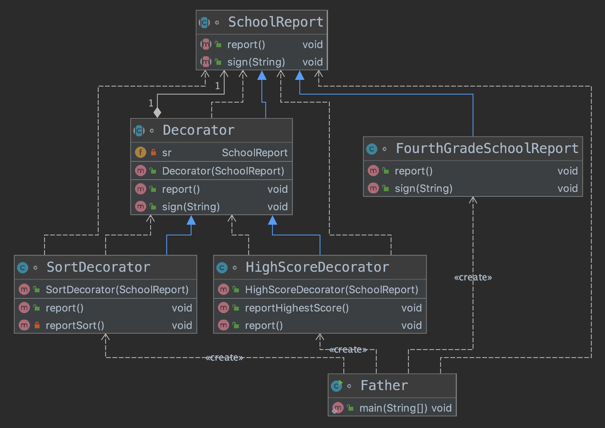

**代码如下：**

``` java
abstract class SchoolReport {
    public abstract void report();

    public abstract void sign(String name);
}

abstract class Decorator extends SchoolReport {
    private SchoolReport sr;

    public Decorator(SchoolReport sr) {
        this.sr = sr;
    }

    @Override
    public void report() {
        sr.report();
    }

    @Override
    public void sign(String name) {
        sr.sign(name);
    }
}

class FourthGradeSchoolReport extends SchoolReport {

    @Override
    public void report() {
        System.out.println("尊敬的XXX家长：");
        System.out.println(" .... ");
        System.out.println(" 语文62 数学65 体育98 自然63");
        System.out.println(" .... ");
        System.out.println("家长签名：");
    }

    @Override
    public void sign(String name) {
        System.out.println("家长签名为：" + name);
    }
}

class HighScoreDecorator extends Decorator {

    public HighScoreDecorator(SchoolReport sr) {
        super(sr);
    }

    public void reportHighestScore() {
        System.out.println("这次语文最高75，数学最高78，自然最高80");
    }

    @Override
    public void report() {
        reportHighestScore();
        super.report();
    }
}

class SortDecorator extends Decorator {

    public SortDecorator(SchoolReport sr) {
        super(sr);
    }

    @Override
    public void report() {
        super.report();
        reportSort();
    }

    private void reportSort() {
        System.out.println("排名38名...");
    }
}

class Father {
    public static void main(String[] args) {
        SchoolReport sr = new FourthGradeSchoolReport();
        sr = new HighScoreDecorator(sr);
        sr = new SortDecorator(sr);

        sr.report();
        sr.sign("老张。。");
    }
}
```

**优点：** 

-   装饰类和被装饰类可以独立发展，不会互相耦合。
-   可以替代继承关系。
-   装饰模式可以动态地扩展一个实现类的功能。

**缺点:**

-   多层的装饰比较复杂。

**使用场景：**

-   需要扩展一个类的功能。

**最佳实践： **

-   java.io.BufferedInputStream(InputStream)


### 组合模式

将对象组合成树形结构以表示“部分-整体”的层次结构，使得用户对单个对象和组合对象的使用具有一致性。

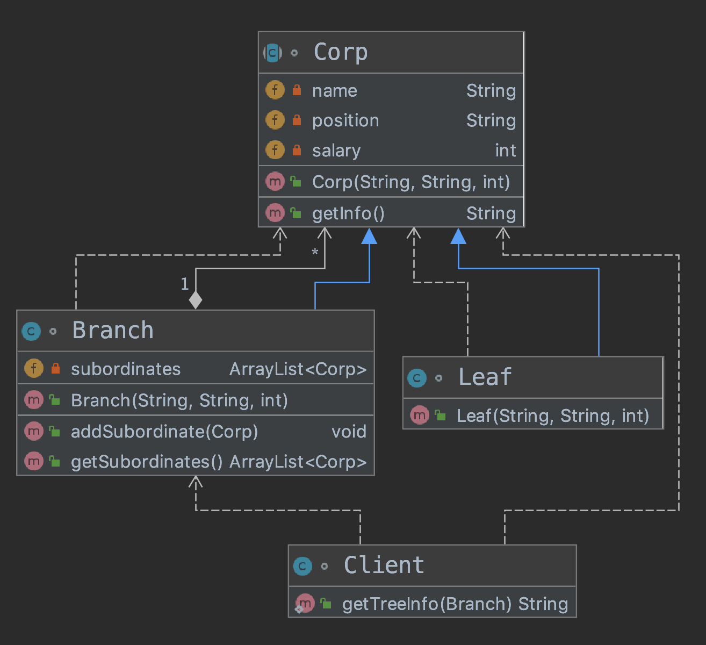

**代码如下：**

``` java
abstract class Corp {
    private String name;
    private String position;
    private int salary;

    public Corp(String name, String position, int salary) {
        this.name = name;
        this.position = position;
        this.salary = salary;
    }

    public String getInfo() {
        return "name：" + name + "，position：" + position + "，salary：" + salary;
    }
}

class Branch extends Corp {
    private ArrayList<Corp> subordinates = new ArrayList<>();

    public Branch(String name, String position, int salary) {
        super(name, position, salary);
    }

    public void addSubordinate(Corp corp) {
        subordinates.add(corp);
    }

    public ArrayList<Corp> getSubordinates() {
        return subordinates;
    }
}

class Leaf extends Corp {
    public Leaf(String name, String position, int salary) {
        super(name, position, salary);
    }
}

class Client {
    public static String getTreeInfo(Branch root) {
        ArrayList<Corp> subordinates = root.getSubordinates();
        StringBuilder sb = new StringBuilder();
        for (Corp c : subordinates) {
            sb.append(c.getInfo());
            if (c instanceof Branch) {
                sb.append(getTreeInfo((Branch) c));
            }
        }
        return sb.toString();
    }
}
```

**优点：** 

-   高层模块调用简单。

-   节点自由增加。

-   ## 六大设计原则

    -   单一职责原则：有且仅有一个原因引起类的变更。

    -   里氏替换原则：只要父类能出现的地方子类就可以出现，并且替换为子类也不会产生任何错误或者异常。

    -   依赖导致原则：面向接口编程。

        -   高层模块不应该依赖于底层模块，两者都应该依赖其抽象。
        -   抽象不应该依赖细节。
        -   细节应该依赖抽象。

        在Java中的表现就是：

        -   模块间的依赖通过抽象发生，实现类之间不发生直接的依赖关系，其依赖是通过接口或者抽象类产生的。
        -   接口或者抽象类不依赖于实现类。
        -   实现类依赖于接口或抽象类。

    -   接口隔离原则：客户端不应该依赖它不需要的接口，类间的依赖关系应该建立在最小的接口上。

    -   迪米特法则：一个对象应该对其他对象有最少的了解。

    -   开闭原则：一个软件实体应该对扩展开放，对修改关闭。

    ## 创建型模式

    ### 单例模式

    确保某一个类只有一个实例，而且自行实例化并且向整个系统提供这个实例：

    **代码实现：**

    ```java
    // 饿汉式
    // 缺点： 类一加载的时候，就实例化，提前占用了系统资源。
    public class Singleton {
        private static final Singleton instance = new Singleton();
    
        private Singleton() {
        }
    
        private static Singleton getInstance() {
            return instance;
        }
    }
    
    // 懒汉式
    // 缺点：线程不安全
    public class Singleton {
        private static Singleton instance;
    
        private Singleton() {
        }
    
        private static Singleton getInstance() {
            if (instance == null) {
                instance = new Singleton();
            }
            return instance;
        }
    }
    
    // 懒汉式：同步
    // 缺点：每次获取都需要同步，开销大
    public class Singleton {
        private static Singleton instance;
    
        private Singleton() {
        }
    
        private synchronized static Singleton getInstance() {
            if (instance == null) {
                instance = new Singleton();
            }
            return instance;
        }
    }
    
    // 懒汉式：双重检测法
    public class Singleton {
        private static volatile Singleton instance;
    
        private Singleton() {
        }
    
        private static Singleton getInstance() {
            if (instance == null) {
                synchronized (instance) {
                    if (instance == null) {
                        instance = new Singleton();
                    }
                }
            }
            return instance;
        }
    }
    
    // 懒汉式：内部类
    public class Singleton {
    
        private Singleton() {
        }
    
        public static class InnerClass {
            private static Singleton singleton = new Singleton();
        }
    
        private static Singleton getInstance() {
            return InnerClass.singleton;
        }
    }
    
    // 恶汉式：枚举
    public enum Singleton {
        INSTANCE;
    
        public Singleton getInstance() {
            return INSTANCE;
        }
    }
    ```

    ### 简单工厂模式

    提供一个创建对象实例的功能，而无须关心其具体实现。被创建实例的类型可以是接口、抽象类，也可以是具体的类。

    

    **代码实现：**

    ```java
    interface Human {
        void getColor();
    
        void talk();
    }
    
    class BlackHuman implements Human {
        public void getColor() {
            System.out.println("黑人是黑皮肤。");
        }
    
        public void talk() {
            System.out.println("黑人说黑人话。");
        }
    }
    
    class WhiteHuman implements Human {
        public void getColor() {
            System.out.println("白人是白皮肤。");
        }
    
        public void talk() {
            System.out.println("白人说白人话。");
        }
    }
    
    class YellowHuman implements Human {
        public void getColor() {
            System.out.println("黄种人是黄皮肤。");
        }
    
        public void talk() {
            System.out.println("黄种人说黄种人话。");
        }
    }
    
    class HumanFactory {
        public static <T extends Human> T createHuman(Class<T> clazz) {
            try {
                return clazz.getDeclaredConstructor().newInstance();
            } catch (Exception e) {
                return null;
            }
        }
    }
    ```

    **优点：** 

    -   良好的封装性。
    -   屏蔽了产品类的实例化过程。
    -   实现了解耦，高层模块只依赖于产品的抽象。

    **缺点：** 

    -   可能增加了调用处的复杂度，需要知道传入什么参数。
    -   不符合开不原则，扩展比较困难。

    **使用场景：**

    -   工厂类负责创建的对象较少，客户端只关心传入工厂类的参数，不关心创建对象的逻辑。

    **最佳实践：**

    -   Spring IOC容器中，BeanFactory和ApplicationContext就是工厂类，负责管理所有的Bean实例。
    -   JDK中的Calendar类为工厂模式，根据传入的location信息，返回对应国家的日历。

    

    ### 工厂方法模式

    定义一个用于创建对象的接口，让子类决定实例化哪一个类，工厂方法使得一个类的实例化延迟到了子类 。

    

    **代码实现：**

    ```java
    interface Human {
        void getColor();
    
        void talk();
    }
    
    class BlackHuman implements Human {
        public void getColor() {
            System.out.println("黑人是黑皮肤。");
        }
    
        public void talk() {
            System.out.println("黑人说黑人话。");
        }
    }
    
    class WhiteHuman implements Human {
        public void getColor() {
            System.out.println("白人是白皮肤。");
        }
    
        public void talk() {
            System.out.println("白人说白人话。");
        }
    }
    
    class YellowHuman implements Human {
        public void getColor() {
            System.out.println("黄种人是黄皮肤。");
        }
    
        public void talk() {
            System.out.println("黄种人说黄种人话。");
        }
    }
    
    abstract class AbstractFactory {
        public abstract Human createHuman();
    }
    
    class BlackHumanFactory extends AbstractFactory {
    
        @Override
        public Human createHuman() {
            return new BlackHuman();
        }
    }
    
    class WhiteHumanFactory extends AbstractFactory {
    
        @Override
        public Human createHuman() {
            return new WhiteHuman();
        }
    }
    
    class YellowHumanFactory extends AbstractFactory {
    
        @Override
        public Human createHuman() {
            return new YellowHuman();
        }
    }
    ```

    **优点：** 

    -   良好的封装性，代码结构清晰。
    -   扩展性非常优秀，在需要增加产品类的时候，只需要扩展一个工厂类。
    -   屏蔽了产品类的实例化过程。
    -   实现了解耦，高层模块只依赖于产品的抽象。

    **缺点：** 

    -   每增加一个产品，相应的也要增加一个子工厂，加大了额外的开发量。

    **使用场景：**

    -   要求生成唯一序列号的环境。
    -   共享访问点：如页面上的访问计数器。
    -   创建一个对象需要消耗过多资源：IO、数据库等。

    **最佳实践：**

    -   JDK中的Iterator类运用了工厂方法模式，每种集合类都负责实例化对应的Iterator实例。

    

    ### 抽象工厂模式

    为创建一组相关或相互依赖的对象提供一个接口，而且无需指定它们的具体类型。

    

    **代码实现：**

    ```java
    interface Human {
        void getColor();
    
        void talk();
    
        void getSex();
    }
    
    abstract class AbstractWhiteHuman implements Human {
        @Override
        public void getColor() {
            System.out.println("白人是白皮肤。");
        }
    
        @Override
        public void talk() {
            System.out.println("白人说白人话。");
        }
    }
    
    abstract class AbstractYellowHuman implements Human {
        @Override
        public void getColor() {
            System.out.println("黄种人是黄皮肤。");
        }
    
        @Override
        public void talk() {
            System.out.println("黄种人说黄种人话。");
        }
    }
    
    class FemaleWhiteHuman extends AbstractWhiteHuman {
    
        @Override
        public void getSex() {
            System.out.println("女性白人。");
        }
    }
    
    class MaleWhiteHuman extends AbstractWhiteHuman {
    
        @Override
        public void getSex() {
            System.out.println("男性白人。");
        }
    }
    
    class FemaleYellowHuman extends AbstractYellowHuman {
    
        @Override
        public void getSex() {
            System.out.println("女性黄种人。");
        }
    }
    
    class MaleYellowHuman extends AbstractYellowHuman {
    
        @Override
        public void getSex() {
            System.out.println("男性黄种人。");
        }
    }
    
    interface HumanFactory {
        Human createWhiteHuman();
    
        Human createYellowHuman();
    }
    
    class FemaleFactory implements HumanFactory {
    
        @Override
        public Human createWhiteHuman() {
            return new FemaleWhiteHuman();
        }
    
        @Override
        public Human createYellowHuman() {
            return new FemaleYellowHuman();
        }
    }
    
    class MaleFactory implements HumanFactory {
    
        @Override
        public Human createWhiteHuman() {
            return new MaleWhiteHuman();
        }
    
        @Override
        public Human createYellowHuman() {
            return new MaleYellowHuman();
        }
    }
    ```

    **优点：** 

    -   良好的封装性。
    -   产品族内的约束为非公开状态。
    -   实现了解耦，高层模块只依赖于产品的抽象。

    **缺点：** 

    -   产品族扩展非常困难。

    **使用场景：**

    -   一个对象族都具有相同的约束，则可以使用抽象工厂模式。

    

    ### 构造者模式

    将一个复杂对象的构建与它的表示分离，使得同样的构建过程可以创建不同的表示。

    

    **代码实现：**

    ```java
    abstract class Car {
        private ArrayList<String> sequence = new ArrayList<>();
    
        protected abstract void start();
    
        protected abstract void stop();
    
        protected abstract void alarm();
    
        protected abstract void engineBoom();
    
        final public void run() {
            for (String action : sequence) {
                if ("start".equals(action)) {
                    this.start();
                } else if ("stop".equals(action)) {
                    this.stop();
                } else if ("alarm".equals(action)) {
                    this.alarm();
                } else if ("engine boom".equals(action)) {
                    this.engineBoom();
                }
            }
        }
    
        final public void setSequence(ArrayList<String> sequence) {
            this.sequence = sequence;
        }
    }
    
    class Benz extends Car {
    
        @Override
        protected void start() {
            System.out.println("奔驰启动");
        }
    
        @Override
        protected void stop() {
            System.out.println("奔驰熄火");
        }
    
        @Override
        protected void alarm() {
            System.out.println("奔驰鸣笛");
        }
    
        @Override
        protected void engineBoom() {
            System.out.println("奔驰引擎响");
        }
    }
    
    class BMW extends Car {
    
        @Override
        protected void start() {
            System.out.println("宝马启动");
        }
    
        @Override
        protected void stop() {
            System.out.println("宝马熄火");
        }
    
        @Override
        protected void alarm() {
            System.out.println("宝马鸣笛");
        }
    
        @Override
        protected void engineBoom() {
            System.out.println("宝马引擎响");
        }
    }
    
    abstract class CarBuilder {
        public abstract CarBuilder setSequence(ArrayList<String> sequence);
    
        public abstract Car build();
    }
    
    class BenzBuilder extends CarBuilder {
        private Benz benz = new Benz();
    
        @Override
        public CarBuilder setSequence(ArrayList<String> sequence) {
            benz.setSequence(sequence);
            return this;
        }
    
        @Override
        public Car build() {
            return benz;
        }
    }
    
    class BMWBuilder extends CarBuilder {
        private BMW bmw = new BMW();
    
        @Override
        public CarBuilder setSequence(ArrayList<String> sequence) {
            bmw.setSequence(sequence);
            return this;
        }
    
        @Override
        public Car build() {
            return bmw;
        }
    }
    
    class Director {
        private CarBuilder benzBuilder = new BenzBuilder();
        private CarBuilder bmwBuilder = new BMWBuilder();
        private ArrayList<String> sequence = new ArrayList<>();
    
        public Car getABenz() {
            sequence.clear();
            sequence.add("start");
            sequence.add("stop");
            return benzBuilder.setSequence(sequence).build();
        }
    
        public Car getBBenz() {
            sequence.clear();
            sequence.add("engine boom");
            sequence.add("start");
            sequence.add("stop");
            return benzBuilder.setSequence(sequence).build();
        }
    
        public Car getCBMW() {
            sequence.clear();
            sequence.add("alarm");
            sequence.add("start");
            sequence.add("stop");
            return bmwBuilder.setSequence(sequence).build();
        }
    
        public Car getDBMW() {
            sequence.clear();
            sequence.add("start");
            sequence.add("engine boom");
            sequence.add("stop");
            return bmwBuilder.setSequence(sequence).build();
        }
    }
    ```

    **优点：** 

    -   客户端不必知道产品内部组成的细节。
    -   建造者独立，易于扩展。

    **缺点：** 

    -   产生多余的Builder对象、Director对象

    **使用场景：**

    -   相同的方法，不同的执行顺序，产生不同的时间结果时。
    -   多个零件或部件，都可以装配到一个对象中，但是产生的结果不同。
    -   产品类非常复杂时

    **最佳实践：**

    -   JDK中的`StringBuilder`。

    

    ### 原型模式

    使用原型实例指定创建对象的种类，并且通过拷贝这些原型创建新的对象。

    **代码实现：**

    ```java
    class PrototypeClass implements Cloneable {
        private ArrayList<Integer> list = new ArrayList<>();
    
        @Override
        public PrototypeClass clone() throws CloneNotSupportedException {
            PrototypeClass prototypeClass;
            prototypeClass = (PrototypeClass) super.clone();
            prototypeClass.list = (ArrayList<Integer>) list.clone();
            return prototypeClass;
        }
    }
    ```

    **优点：** 

    -   拷贝的是二进制流，性能好。
    -   逃避构造函数的约束。

    **使用场景：**

    -   资源优化场景。
    -   性能和安全性要求较高的场景。
    -   一个对象多个修改者。

    

    ## 行为型模式

    ### 模板方法模式

    定义一个操作中的算法的框架，而将一些步骤延迟到子类中。使得子类可以不改变一个算法的节后即可重定义该算法的某些特定步骤。

    

    **代码实现：**

    ```java
     // 抽象模板类
     abstract class Car {
         public abstract void start();
     
         public abstract void stop();
     
         public abstract void alarm();
     
         public abstract void engineBoom();
     
         public void run() {
             this.start();
             this.engineBoom();
             this.alarm();
             this.stop();
         }
     }
     
     // 具体模板类
     class Car1 extends Car {
     
         @Override
         public void start() {
             System.out.println("car1 start...");
         }
     
         @Override
         public void stop() {
             System.out.println("car1 stop...");
         }
     
         @Override
         public void alarm() {
             System.out.println("car1 alarm...");
         }
     
         @Override
         public void engineBoom() {
             System.out.println("car1 engineBoom...");
         }
     }
     
     // 具体模板类
     class Car2 extends Car {
     
         @Override
         public void start() {
             System.out.println("car2 start...");
         }
     
         @Override
         public void stop() {
             System.out.println("car2 stop...");
         }
     
         @Override
         public void alarm() {
             System.out.println("car2 alarm...");
         }
     
         @Override
         public void engineBoom() {
             System.out.println("car2 engineBoom...");
         }
     }
    ```

    **优点：** 

    -   封装不变部分，扩展可变部分。
    -   提取公共部分代码，便于维护。
    -   行为由父类控制，子类实现。

    **缺点：** 

    -   子类的执行结果影响了父类。

    **使用场景：**

    -   多个子类由公共的方法，并且逻辑基本相同。
    -   重要、复杂的算法，可以把核心算法设计为模板方法。
    -   重构时，可以把相同提取到父类中。

    **最佳实践：**

    -   JDK中的AbstractList类运用了模板方法模式。
    -   Spring中`JDBCTemplate`运用了模板方法模式。

    

    ### 中介者模式

    用一个中介对象封装一系列的对象交互，中介者使各对象不需要显示地相互作用，从而使其耦合松散，而且可以独立地改变它们之间的交互。

    

    **代码如下：**

    ```java
    abstract class AbstractColleague {
        protected AbstractMediator mediator;
    
        public AbstractColleague(AbstractMediator mediator) {
            this.mediator = mediator;
        }
    }
    
    class Purchase extends AbstractColleague {
    
        public Purchase(AbstractMediator mediator) {
            super(mediator);
        }
    
        public void buyIBMComputer(int number) {
            super.mediator.execute("purchase.buy", number);
        }
    
        public void refuseBuyIBM() {
            System.out.println("不再采购IBM电脑");
        }
    }
    
    class Stock extends AbstractColleague {
        private static int COMPUTER_NUM = 100;
    
        public Stock(AbstractMediator mediator) {
            super(mediator);
        }
    
        public void decrease(int number) {
            COMPUTER_NUM -= number;
            System.out.println("库存数量为：" + COMPUTER_NUM);
        }
    
        public void increase(int number) {
            COMPUTER_NUM += number;
            System.out.println("库存数量为：" + COMPUTER_NUM);
        }
    
        public int getStockNumber() {
            return COMPUTER_NUM;
        }
    
        public void clearStock() {
            System.out.println("清理库存数量为：" + COMPUTER_NUM);
            super.mediator.execute("stock.clear");
        }
    }
    
    class Sale extends AbstractColleague {
    
        public Sale(AbstractMediator mediator) {
            super(mediator);
        }
    
        public void sellIBMComputer(int number) {
            super.mediator.execute("sale.sell", number);
            System.out.println("销售IBM电脑" + number + "台");
        }
    
        public int getSaleStatus() {
            Random random = new Random(System.currentTimeMillis());
            int saleStatus = random.nextInt(100);
            System.out.println("IBM电脑销售情况：" + saleStatus);
            return saleStatus;
        }
    
        public void offSell() {
            super.mediator.execute("sale.offSell");
        }
    }
    
    abstract class AbstractMediator {
        protected Purchase purchase;
        protected Sale sale;
        protected Stock stock;
    
        public AbstractMediator() {
            purchase = new Purchase(this);
            sale = new Sale(this);
            stock = new Stock(this);
        }
    
        public abstract void execute(String str, Object... objects);
    }
    
    class Mediator extends AbstractMediator {
    
        @Override
        public void execute(String str, Object... objects) {
            if ("purchase.buy".equals(str)) {
                buyComputer((Integer) objects[0]);
            } else if ("sale.sell".equals(str)) {
                sellComputer((Integer) objects[0]);
            } else if ("sale.offSell".equals(str)) {
                offSell();
            } else if ("stock.clear".equals(str)) {
                clearStock();
            }
        }
    
        private void buyComputer(int number) {
            int saleStatus = super.sale.getSaleStatus();
            if (saleStatus > 80) {
                System.out.println("采购IBM电脑：" + number + "台");
                super.stock.increase(number);
            } else {
                int buyNumber = number / 2;
                System.out.println("采购IBM电脑：" + buyNumber + "台");
                super.stock.increase(buyNumber);
            }
        }
    
        private void sellComputer(int number) {
            if (super.stock.getStockNumber() < number) {
                super.purchase.buyIBMComputer(number);
            }
            super.stock.decrease(number);
        }
    
        private void offSell() {
            System.out.println("折价销售IBM电脑：" + super.stock.getStockNumber());
        }
    
        private void clearStock() {
            super.sale.offSell();
            super.purchase.refuseBuyIBM();
        }
    }
    ```

    **优点：** 

    -   降低了类间的耦合。

    **缺点：** 

    -   中介者会膨胀的很大，且逻辑复杂。

    **使用场景：**

    -   适用于多个对象之间紧密耦合的情况，紧密耦合的标准是：类图中出现了类似蜘蛛网的结构。

    **最佳实践：**

    -   JDK中的Timer类运用了中介者模式。

    

    ### 命令模式

    将一个请求封装成一个对象，从而可以使用不同的请求把客户端参数化，对请求排队或者记录请求日志，可以提供命令的撤销和恢复功能。

    

    **代码实现：**

    ```java
    abstract class Group {
        public abstract void find();
    
        public abstract void add();
    
        public abstract void delete();
    
        public abstract void change();
    
        public abstract void plan();
    }
    
    class RequirementGroup extends Group {
    
        @Override
        public void find() {
            System.out.println("找到需求组");
        }
    
        @Override
        public void add() {
            System.out.println("客户要求增加一项需求");
        }
    
        @Override
        public void delete() {
            System.out.println("客户要求删除一项需求");
        }
    
        @Override
        public void change() {
            System.out.println("客户要求修改一项需求");
        }
    
        @Override
        public void plan() {
            System.out.println("客户要求需求变更计划");
        }
    }
    
    class PageGroup extends Group {
    
        @Override
        public void find() {
            System.out.println("找到美工组");
        }
    
        @Override
        public void add() {
            System.out.println("客户要求增加一项页面");
        }
    
        @Override
        public void delete() {
            System.out.println("客户要求删除一项页面");
        }
    
        @Override
        public void change() {
            System.out.println("客户要求修改一项页面");
        }
    
        @Override
        public void plan() {
            System.out.println("客户要求页面变更计划");
        }
    }
    
    class CodeGroup extends Group {
    
        @Override
        public void find() {
            System.out.println("找到代码组");
        }
    
        @Override
        public void add() {
            System.out.println("客户要求增加一项功能");
        }
    
        @Override
        public void delete() {
            System.out.println("客户要求删除一项功能");
        }
    
        @Override
        public void change() {
            System.out.println("客户要求修改一项功能");
        }
    
        @Override
        public void plan() {
            System.out.println("客户要求代码变更计划");
        }
    }
    
    abstract class Command {
        public abstract void execute();
    }
    
    class AddRequirementCommand extends Command {
        private RequirementGroup rg = new RequirementGroup();
    
        @Override
        public void execute() {
            rg.find();
            rg.add();
            rg.plan();
        }
    }
    
    class DeletePageCommand extends Command {
        private PageGroup pg = new PageGroup();
    
        @Override
        public void execute() {
            pg.find();
            pg.delete();
            pg.plan();
        }
    }
    
    class Invoker {
        private Command command;
    
        public void setCommand(Command command) {
            this.command = command;
        }
    
        public void action() {
            command.execute();
        }
    }
    ```

    **优点：** 

    -   类间解耦
    -   可扩展
    -   提取公共部分代码，便于维护。
    -   行为由父类控制，子类实现。

    **缺点：** 

    -   每增加一个命令，相应的也要增加命令子类，加大了额外的开发量。

    **使用场景：**

    -   只要是命令的地方就可以使用命令模式。

    **最佳实践：**

    -   JDK中的Rannable类运用了命令模式。

    

    ### 迭代器模式

    提供一种方法访问一个容器对象中各个元素，而又不需暴露该对象的内部细节。

    

    **代码实现：**

    ```java
    interface Iterator<T> {
        boolean hasNext();
    
        T next();
    }
    
    interface AbstractList<T> {
        Iterator<T> iterator();
    }
    
    class List<T> implements AbstractList<T> {
        private T[] values;
    
        public List(T[] values) {
            this.values = values;
        }
    
        @Override
        public Iterator<T> iterator() {
            return new ListIterator<T>(values);
        }
    }
    
    class ListIterator<T> implements Iterator<T> {
        private T[] values;
        private int position;
    
        ListIterator(T[] values) {
            this.values = values;
        }
    
        @Override
        public boolean hasNext() {
            return position < values.length;
        }
    
        @Override
        public T next() {
            return values[position++];
        }
    }
    ```

    **优点：** 

    -   支持多种方式遍历一个容器对象
    -   隐蔽了对象的内部细节

    **最佳实践：**

    -   JDK中的Iterator类运用了迭代器模式。

    

    ### 责任链模式

    使多个对象都有机会处理请求，从而避免了请求的发送者和接受者之间的耦合关系，将这些对象连成一条链，并沿着这条链传递请求，直至有对象处理它为止。

    

    **代码如下：**

    ```java
    interface IWomen {
        int getType();
    
        String request();
    }
    
    abstract class Handler {
        public static final int FATHER_LEVEL_REQUEST = 1;
        public static final int HUSBAND_LEVEL_REQUEST = 2;
        public static final int SON_LEVEL_REQUEST = 3;
    
        private int level;
        private Handler nextHandler;
    
        public Handler(int level) {
            this.level = level;
        }
    
        public final void handlerMessage(IWomen women) {
            if (women.getType() == level) {
                response(women);
            } else if (nextHandler != null) {
                nextHandler.handlerMessage(women);
            } else {
                System.out.println("没有后续处理人了，按不同意处理");
            }
        }
    
        public void setNextHandler(Handler nextHandler) {
            this.nextHandler = nextHandler;
        }
    
        public abstract void response(IWomen women);
    }
    
    class Father extends Handler {
    
        public Father() {
            super(Handler.FATHER_LEVEL_REQUEST);
        }
    
        @Override
        public void response(IWomen women) {
            System.out.println("女儿向父亲请示");
            System.out.println(women.request());
            System.out.println("父亲同意");
        }
    }
    
    class Husband extends Handler {
    
        public Husband() {
            super(Handler.HUSBAND_LEVEL_REQUEST);
        }
    
        @Override
        public void response(IWomen women) {
            System.out.println("妻子向丈夫请示");
            System.out.println(women.request());
            System.out.println("丈夫同意");
        }
    }
    
    class Son extends Handler {
    
        public Son() {
            super(Handler.SON_LEVEL_REQUEST);
        }
    
        @Override
        public void response(IWomen women) {
            System.out.println("母亲向儿子请示");
            System.out.println(women.request());
            System.out.println("儿子同意");
        }
    }
    
    class Women implements IWomen {
        // 1.未出嫁，2.已出嫁，3.夫死
        private int type;
        private String request;
    
        public Women(int type, String request) {
            this.type = type;
            this.request = request;
        }
    
        @Override
        public int getType() {
            return type;
        }
    
        @Override
        public String request() {
            return request;
        }
    }
    
    class Client {
        public static void main(String[] args) {
            IWomen women = new Women(new Random().nextInt(4), "我要出去逛街");
            Handler father = new Father();
            Handler husband = new Husband();
            Handler son = new Son();
    
            father.setNextHandler(husband);
            husband.setNextHandler(son);
    
            father.handlerMessage(women);
        }
    }
    ```

    **优点：** 

    -   将请求和处理分离开，降低了耦合。
    -   性能较差，需要遍历链表。

    **缺点：** 

    -   每增加一个命令，相应的也要增加命令子类，加大了额外的开发量。

    **使用场景：**

    -   只要是命令的地方就可以使用命令模式。

    **最佳实践：**

    -   javax.servlet.Filter#doFilter()

    

    ### 策略模式

    定义一组算法，将每个算法都封装起来，并且使它们之间可以互换。

    

    **代码如下：**

    ```java
    interface IStrategy {
        void operate();
    }
    
    class BackDoor implements IStrategy {
    
        @Override
        public void operate() {
            System.out.println("找乔国老帮忙，让吴国太给孙权施加压力");
        }
    }
    
    class GivenGreenLight implements IStrategy {
    
        @Override
        public void operate() {
            System.out.println("求吴国太开绿灯，放行");
        }
    }
    
    class BlockEnemy implements IStrategy {
    
        @Override
        public void operate() {
            System.out.println("孙夫人断后，挡住追兵");
        }
    }
    
    class Context {
        private IStrategy strategy;
    
        public Context(IStrategy strategy) {
            this.strategy = strategy;
        }
    
        public void operate() {
            strategy.operate();
        }
    }
    ```

    **优点：** 

    -   算法可以自由切换
    -   避免了多重条件判断
    -   扩展性好
    -   性能较差，需要遍历链表。

    **缺点：** 

    -   策略类数量增多
    -   所有策略类都需要对外暴露

    **使用场景：**

    -   多个类只有算法或者行为上稍有不同的场景。

    **最佳实践：**

    -   java.util.Comparator#compare()

    

    ### 状态模式

    状态的变更引起了行为的变更，从外部看起来就好像这个对象对应的类发生了改变一样。

    

    **代码如下：**

    ```java
    abstract class LiftState {
        protected Context context;
    
        public void setContext(Context context) {
            this.context = context;
        }
    
        public abstract void open();
    
        public abstract void close();
    
        public abstract void run();
    
        public abstract void stop();
    }
    
    class OpeningState extends LiftState {
    
        @Override
        public void open() {
            System.out.println("电梯门开。。。");
        }
    
        @Override
        public void close() {
            super.context.setLiftState(Context.closingState);
            super.context.close();
        }
    
        @Override
        public void run() {
            System.out.println("门开着还想跑？？？");
        }
    
        @Override
        public void stop() {
            System.out.println("已经停了。。。。");
        }
    }
    
    class ClosingState extends LiftState {
    
        @Override
        public void open() {
            super.context.setLiftState(Context.openingState);
            super.context.open();
        }
    
        @Override
        public void close() {
            System.out.println("电梯关门。。。");
        }
    
        @Override
        public void run() {
            super.context.setLiftState(Context.runningState);
            super.context.run();
        }
    
        @Override
        public void stop() {
            super.context.setLiftState(Context.stoppingState);
            super.context.stop();
        }
    }
    
    class RunningState extends LiftState {
    
        @Override
        public void open() {
            System.out.println("跑着还想开门？？？");
        }
    
        @Override
        public void close() {
            System.out.println("门本来就关着呢。。。");
        }
    
        @Override
        public void run() {
            System.out.println("开始上下运行。。。");
        }
    
        @Override
        public void stop() {
            super.context.setLiftState(Context.stoppingState);
            super.context.stop();
        }
    }
    
    class StoppingState extends LiftState {
    
        @Override
        public void open() {
            super.context.setLiftState(Context.openingState);
            super.context.stop();
        }
    
        @Override
        public void close() {
            System.out.println("门本来就关着呢。。。");
        }
    
        @Override
        public void run() {
            super.context.setLiftState(Context.runningState);
            super.context.run();
        }
    
        @Override
        public void stop() {
            System.out.println("电梯停下。。。");
        }
    }
    
    class Context {
        public static final OpeningState openingState = new OpeningState();
        public static final ClosingState closingState = new ClosingState();
        public static final RunningState runningState = new RunningState();
        public static final StoppingState stoppingState = new StoppingState();
    
        private LiftState liftState;
    
        public void setLiftState(LiftState liftState) {
            this.liftState = liftState;
            // 将当前的环境通知到各个实现类中
            liftState.setContext(this);
        }
    
        public LiftState getLiftState() {
            return liftState;
        }
    
        public void open() {
            liftState.open();
        }
    
        public void close() {
            liftState.close();
        }
    
        public void run() {
            liftState.run();
        }
    
        public void stop() {
            liftState.stop();
        }
    }
    
    class Client {
        public static void main(String[] args) {
            Context context = new Context();
            context.setLiftState(new ClosingState());
            context.open();
            context.close();
            context.run();
            context.stop();
        }
    }
    ```

    **优点：** 

    -   结构清晰
    -   遵循单一职责原则和开闭原则
    -   封装性好

    **缺点：** 

    -   子类太多。

    **使用场景：**

    -   行为随状态改变而改变的场景。
    -   条件、分值判断语句的替代者。

    

    ### 观察者模式

    观察者模式也叫发布订阅模式，它是一个在项目中经常使用的模式，定义如下：

    定义对象间一种一对多的依赖关系，使得每当一个对象改变状态，所有依赖于它的对象都会得到通知并被自动更新。

    

    **代码如下：**

    ```java
    interface Observer {
        void update(String context);
    }
    
    interface Observable {
        void addObserver(Observer observer);
    
        void deleteObserver(Observer observer);
    
        void notifyObservers(String context);
    }
    
    class HanFeiZi implements Observable {
        private ArrayList<Observer> observers = new ArrayList<>();
    
        @Override
        public void addObserver(Observer observer) {
            observers.add(observer);
        }
    
        @Override
        public void deleteObserver(Observer observer) {
            observers.remove(observer);
        }
    
        @Override
        public void notifyObservers(String context) {
            for (Observer o : observers) {
                o.update(context);
            }
        }
    
        public void haveBreakfast() {
            System.out.println("韩非子开始吃饭。。。");
            notifyObservers("韩非子开始吃饭了。。。");
        }
    
        public void haveFun() {
            System.out.println("韩非子开始娱乐。。。");
            notifyObservers("韩非子开始娱乐了。。。");
        }
    }
    
    class LiSi implements Observer {
    
        @Override
        public void update(String context) {
            System.out.println("李斯：观察到韩非子活动，开始向老板汇报。。。");
            reportToQinShiHuang(context);
        }
    
        private void reportToQinShiHuang(String context) {
            System.out.println("李斯：报告秦老板，韩非子有活动了。。。" + context);
        }
    }
    
    class WangSi implements Observer {
    
        @Override
        public void update(String context) {
            System.out.println("王斯：观察到韩非子活动，自己开始哭。。。");
            System.out.println("王斯：开始哭。。。" + context);
        }
    }
    
    class LiuSi implements Observer {
    
        @Override
        public void update(String context) {
            System.out.println("刘斯：观察到韩非子活动，自己开始笑。。。");
            System.out.println("刘斯：开始笑。。。" + context);
        }
    }
    
    class Client {
        public static void main(String[] args) {
            Observer liSi = new LiSi();
            Observer wangSi = new WangSi();
            Observer liuSi = new LiuSi();
            
            HanFeiZi hanFeiZi = new HanFeiZi();
            
            hanFeiZi.addObserver(liSi);
            hanFeiZi.addObserver(wangSi);
            hanFeiZi.addObserver(liuSi);
            
            hanFeiZi.haveBreakfast();
        }
    }
    ```

    **优点：** 

    -   观察者和被观察者之间是抽象耦合。
    -   建立了一套触发机制。

    **缺点：** 

    -   效率低，需要进行一系列调用。

    **使用场景：**

    -   关联行为场景。
    -   事件多级触发场景。
    -   跨系统的消息交换场景。

    

    ## 结构型

    ### 适配器模式

    将一个类的接口变换成客户端所期待的另一种接口，从而使原本因接口不匹配而无法在一起工作的两个类能够在一起工作。

    

    **代码如下：**

    ```java
    interface IUserInfo {
        String getUsername();
    
        String getHomeAddress();
    
        String getMobileNumber();
    
        String getOfficeTelNumber();
    
        String getJobPosition();
    
        String getHomeTelNumber();
    }
    
    class UserInfo implements IUserInfo {
    
        @Override
        public String getUsername() {
            System.out.println("姓名是。。");
            return null;
        }
    
        @Override
        public String getHomeAddress() {
            System.out.println("家庭住址是。。。");
            return null;
        }
    
        @Override
        public String getMobileNumber() {
            System.out.println("手机号码是。。。");
            return null;
        }
    
        @Override
        public String getOfficeTelNumber() {
            System.out.println("办公室电话号码是。。。");
            return null;
        }
    
        @Override
        public String getJobPosition() {
            System.out.println("职位是。。。");
            return null;
        }
    
        @Override
        public String getHomeTelNumber() {
            System.out.println("家庭电话是。。。");
            return null;
        }
    }
    
    interface IOuterUser {
        Map<String, String> getUserBaseInfo();
    
        Map<String, String> getUserOfficeInfo();
    
        Map<String, String> getUserHomeInfo();
    }
    
    class OuterUser implements IOuterUser {
    
        @Override
        public Map<String, String> getUserBaseInfo() {
            Map<String, String> map = new HashMap<>();
            map.put("username", "混世魔王");
            map.put("mobileNumber", "混世魔王的电话号码");
            return map;
        }
    
        @Override
        public Map<String, String> getUserHomeInfo() {
            Map<String, String> map = new HashMap<>();
            map.put("homeTelNumber", "混世魔王的家庭电话");
            map.put("homeAddress", "混世魔王的家庭住址");
            return map;
        }
    
        @Override
        public Map<String, String> getUserOfficeInfo() {
            Map<String, String> map = new HashMap<>();
            map.put("jobPosition", "混世魔王的职位");
            map.put("officeTelNumber", "混世魔王的办公电话");
            return map;
        }
    }
    
    class OuterUserInfo extends OuterUser implements IUserInfo {
        private Map<String, String> baseInfo = super.getUserBaseInfo();
        private Map<String, String> homeInfo = super.getUserHomeInfo();
        private Map<String, String> officeInfo = super.getUserOfficeInfo();
    
        @Override
        public String getUsername() {
            System.out.println(baseInfo.get("username"));
            return homeInfo.get("username");
        }
    
        @Override
        public String getHomeAddress() {
            System.out.println(homeInfo.get("homeAddress"));
            return homeInfo.get("homeAddress");
        }
    
        @Override
        public String getMobileNumber() {
            System.out.println(baseInfo.get("mobileNumber"));
            return homeInfo.get("mobileNumber");
        }
    
        @Override
        public String getOfficeTelNumber() {
            System.out.println(officeInfo.get("officeTelNumber"));
            return homeInfo.get("officeTelNumber");
        }
    
        @Override
        public String getJobPosition() {
            System.out.println(officeInfo.get("jobPosition"));
            return homeInfo.get("jobPosition");
        }
    
        @Override
        public String getHomeTelNumber() {
            System.out.println(homeInfo.get("homeTelNumber"));
            return homeInfo.get("homeTelNumber");
        }
    }
    
    class Client {
        public static void main(String[] args) {
            IUserInfo youngGirl = new OuterUserInfo();
            for (int i = 0; i < 101; i++) {
                youngGirl.getMobileNumber();
            }
        }
    }
    ```

    **优点：** 

    -   可以让两个没有任何关系的类运行在一起。
    -   增加了类的透明性。

    **使用场景：**

    -   系统扩展时，需要使用一个已有或者建立一个新的类，但是这个类不符合系统的接口。

    **最佳实践：**

    -   java.util.Arrays#asList()

    

    ### 代理模式

    为其他对象提供一种代理以控制这个对象的访问。

    

    **代码实现：**

    ```java
    interface IGamePlayer {
        void login(String user, String password);
    
        void killBoss();
    
        void upgrade();
    }
    
    class GamePlayer implements IGamePlayer {
        private String name;
    
        public GamePlayer(String name) {
            this.name = name;
        }
    
        @Override
        public void login(String user, String password) {
            System.out.println("登录");
        }
    
        @Override
        public void killBoss() {
            System.out.println("打怪");
        }
    
        @Override
        public void upgrade() {
            System.out.println("升级");
        }
    }
    
    class GamePlayIH implements InvocationHandler {
        // 被代理者
        private Class cls;
        // 被代理的实例
        private Object obj;
    
        public GamePlayIH(Object obj) {
            this.obj = obj;
        }
    
        @Override
        public Object invoke(Object proxy, Method method, Object[] args) throws Throwable {
            Object result = method.invoke(obj, args);
            if ("login".equals(method.getName())) {
                System.out.println("有人在用我的账号登录。。");
            }
            return result;
        }
    }
    
    class Client {
        public static void main(String[] args) {
            IGamePlayer player = new GamePlayer("张三");
            InvocationHandler handler = new GamePlayIH(player);
            System.out.println("游戏开始：" + System.currentTimeMillis());
            IGamePlayer proxy = (IGamePlayer) Proxy.newProxyInstance(player.getClass().getClassLoader(), player.getClass().getInterfaces(), handler);
            proxy.login("zhangSan", "password");
            proxy.killBoss();
            proxy.upgrade();
            System.out.println("游戏结束：" + System.currentTimeMillis());
        }
    }
    ```

    **优点：** 

    -   职责清晰
    -   扩展性高

    **最佳实践：**

    -   Spring AOP

    

    ### 装饰器模式

    动态地给一个对象添加一些额外的职责。相比生成子类更为灵活。

    

    **代码如下：**

    ```java
    abstract class SchoolReport {
        public abstract void report();
    
        public abstract void sign(String name);
    }
    
    abstract class Decorator extends SchoolReport {
        private SchoolReport sr;
    
        public Decorator(SchoolReport sr) {
            this.sr = sr;
        }
    
        @Override
        public void report() {
            sr.report();
        }
    
        @Override
        public void sign(String name) {
            sr.sign(name);
        }
    }
    
    class FourthGradeSchoolReport extends SchoolReport {
    
        @Override
        public void report() {
            System.out.println("尊敬的XXX家长：");
            System.out.println(" .... ");
            System.out.println(" 语文62 数学65 体育98 自然63");
            System.out.println(" .... ");
            System.out.println("家长签名：");
        }
    
        @Override
        public void sign(String name) {
            System.out.println("家长签名为：" + name);
        }
    }
    
    class HighScoreDecorator extends Decorator {
    
        public HighScoreDecorator(SchoolReport sr) {
            super(sr);
        }
    
        public void reportHighestScore() {
            System.out.println("这次语文最高75，数学最高78，自然最高80");
        }
    
        @Override
        public void report() {
            reportHighestScore();
            super.report();
        }
    }
    
    class SortDecorator extends Decorator {
    
        public SortDecorator(SchoolReport sr) {
            super(sr);
        }
    
        @Override
        public void report() {
            super.report();
            reportSort();
        }
    
        private void reportSort() {
            System.out.println("排名38名...");
        }
    }
    
    class Father {
        public static void main(String[] args) {
            SchoolReport sr = new FourthGradeSchoolReport();
            sr = new HighScoreDecorator(sr);
            sr = new SortDecorator(sr);
    
            sr.report();
            sr.sign("老张。。");
        }
    }
    ```

    **优点：** 

    -   装饰类和被装饰类可以独立发展，不会互相耦合。
    -   可以替代继承关系。
    -   装饰模式可以动态地扩展一个实现类的功能。

    **缺点:**

    -   多层的装饰比较复杂。

    **使用场景：**

    -   需要扩展一个类的功能。

    **最佳实践： **

    -   java.io.BufferedInputStream(InputStream)

    

    ### 组合模式

    将对象组合成树形结构以表示“部分-整体”的层次结构，使得用户对单个对象和组合对象的使用具有一致性。

    

    **代码如下：**

    ```java
    abstract class Corp {
        private String name;
        private String position;
        private int salary;
    
        public Corp(String name, String position, int salary) {
            this.name = name;
            this.position = position;
            this.salary = salary;
        }
    
        public String getInfo() {
            return "name：" + name + "，position：" + position + "，salary：" + salary;
        }
    }
    
    class Branch extends Corp {
        private ArrayList<Corp> subordinates = new ArrayList<>();
    
        public Branch(String name, String position, int salary) {
            super(name, position, salary);
        }
    
        public void addSubordinate(Corp corp) {
            subordinates.add(corp);
        }
    
        public ArrayList<Corp> getSubordinates() {
            return subordinates;
        }
    }
    
    class Leaf extends Corp {
        public Leaf(String name, String position, int salary) {
            super(name, position, salary);
        }
    }
    
    class Client {
        public static String getTreeInfo(Branch root) {
            ArrayList<Corp> subordinates = root.getSubordinates();
            StringBuilder sb = new StringBuilder();
            for (Corp c : subordinates) {
                sb.append(c.getInfo());
                if (c instanceof Branch) {
                    sb.append(getTreeInfo((Branch) c));
                }
            }
            return sb.toString();
        }
    }
    ```

    **优点：** 

    -   高层模块调用简单。
    -   节点自由增加。

    **缺点:**

    -   违背了依赖倒置原则。

    **使用场景：**

    -   文件系统。

    **最佳实践： **

    -   java.util.List#addAll(Collection)

    