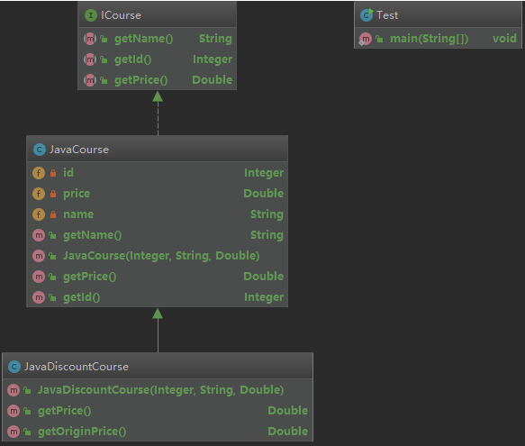
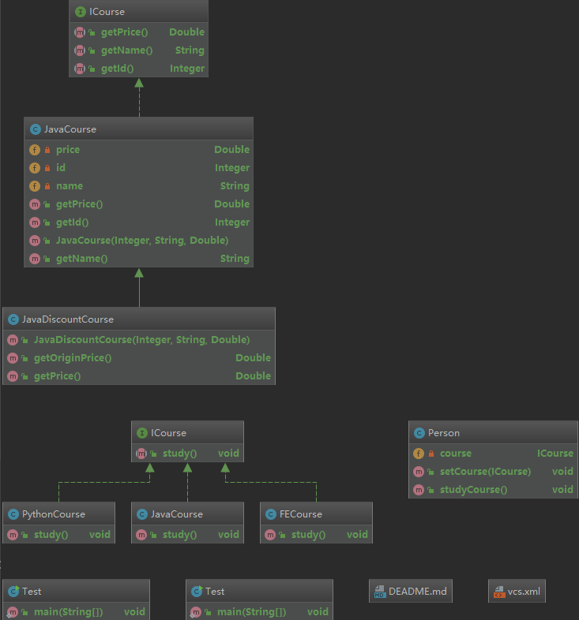
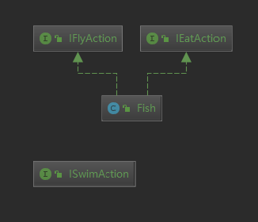

# 设计模式学习

## 设计模式原则

### 开闭原则

[开闭原则](./src/main/java/cn.lollipop/design/principle/openclose)是面向对象的可复用设计的第一块基石，它是最重要的面向对象设计原则。开闭原则由Bertrand  Meyer于1988年提出，其定义如下：

> 开闭原则(Open-Closed Principle)：一个软件实体应当对扩展开放，对修改关闭。即软件实体应尽量在不修改原有代码的情况下进行扩展。

在开闭原则的定义中，软件实体可以指一个软件模块、一个由多个类组成的局部结构或一个独立的类。

任何软件都需要面临一个很重要的问题，即它们的需求会随时间的推移而发生变化。当软件系统需要面对新的需求时，我们应该尽量保证系统的设计框架是稳定的。如果一个软件设计符合开闭原则，那么可以非常方便地对系统进行扩展，而且在扩展时无须修改现有代码，使得软件系统在拥有适应性和灵活性的同时具备较好的稳定性和延续性。随着软件规模越来越大，软件寿命越来越长，软件维护成本越来越高，设计满足开闭原则的软件系统也变得越来越重要。

为了满足开闭原则，需要对系统进行抽象化设计，抽象化是开闭原则的关键。在Java、C#等编程语言中，可以为系统定义一个相对稳定的抽象层，而将不同的实现行为移至具体的实现层中完成。在很多面向对象编程语言中都提供了接口、抽象类等机制，可以通过它们定义系统的抽象层，再通过具体类来进行扩展。如果需要修改系统的行为，无须对抽象层进行任何改动，只需要增加新的具体类来实现新的业务功能即可，实现在不修改已有代码的基础上扩展系统的功能，达到开闭原则的要求。

### 依赖倒置原则

**[依赖倒置原则](./src/main/java/cn.lollipop/design/principle/dependenceinverse)原则(Dependence Inversion Principle ,DIP)定义如下：**

> 高层模块不应该依赖低层模块，两者都应该依赖抽象
> 抽象不应该依赖细节
> 细节应该依赖抽象

**也可以说高层模块，低层模块，细节都应该依赖抽象**

每一个逻辑的实现都是由颗粒原子逻辑组成的，颗粒原子逻辑就是低层模块，而颗粒原子逻辑组成的模块就是高层模块。在java语言中，抽象就是接口或抽象类，两都都是不能直接被实例化的，细节就是实现类，实现接口或继承抽象类而产生的类就是细节，两者都可以直接被实例化。

依赖倒置原则在java语言中，表现是：

- 模块间的依赖通过抽象发生，实现类之间不发生直接的依赖关系，其依赖关系是通过接口或抽象类产生的。
- 接口或抽象类不依赖实现类
- 实现类依赖接口或抽象类

**更加精简的定义就是“面向接口编程”—OOD(Object-Oriented Design，面向对象设计)的精髓之一。**

### 单一职责原则

> 单一职责原则(SRP:Single responsibility principle)又称单一功能原则，面向对象五个基本原则(SOLID)之一。它规定一个类应该只有一个发生变化的原因。

**[单一职责原则](./src/main/java/cn.lollipop/design/principle/singleresponsibility)原则是最简单的面对对象设计原则，它用于控制类的粒度大小。**
在软件系统中，一个类（大到模块，小到方法）承担的职责越多，它被复用的可能性就越小，而且一个类承担的职责过多，就相当于将这些职责耦合在一起，当其中一个职责变化时，可能会影响其他职责的运作，因此要将这些职责进行分离，将不同的职责封装在不同的类中，即将不同的变化原因封装在不同的类中，如果多个职责总是同时发生改变则可将它们封装在同一类中。

我们写程序的目标就是 高内聚 低耦合!什么叫高内聚低耦合呢，举个例子：你房子里边有墙和窗 ，那墙和窗就有了关联，耦合度 是松还是紧 就看你的 关联 是强还是弱，也就是修改的代价，比如 你窗是扣死在墙里的 那么你修改窗子就必须修改墙 这就比较紧密了，但是如果你窗是按照某种规格的 可以自由拆装的 那么修改的代价就小，耦合度也就低了。

### 接口隔离原则

**接口隔离原则 Interface Segregation Principle 定义：**

> 客户端不应该依赖它不需要的接口
> 类间的依赖关系应该建立在最小的接口上

我们可以把这两个定义概括为一句话：建立单一接口，不要建立臃肿庞大的接口。再通俗一点讲：接口尽量细化，同时接口中的方法尽 量少。

提供给每个模块的都应该是单一接口，提供给几个模块就应该有几个接口，而不是建立一个庞大的臃肿的接口，容纳所有的客户端访问。 

接口是我们设计时对外提供的契约，通过分散定义多个接口，可以预防未来变更的扩散，提高系统的灵活性和可维护性。 

1. 接口要尽量小
   这是接口隔离原则的核心定义，不出现臃肿的接口（Fat Interface），但是“小”是有限度的，首先就是不能违反单一职责原则。

   **根据接口隔离原则拆分接口时，首先必须满足单一职责原则。**

2. 接口要高内聚
   高内聚就是要提高接口、类、模块的处理能力，减少对外的交互。

具体到接口隔离原则就是，要求在接口中尽量少公布public方法，接口是对外的承诺，承诺地越少对系统开发越有利，变更的风险也就越少，同时也有利于降低成本。

1. 定制服务
   定制服务就是单独为一个个体提供优良的服务。

1. 接口设计是有限度的
   接口的设计粒度越小，系统越灵活，这是不争的事实。但是，灵活的同时也带来了结构的复杂化，开发难度增加，可维护性降低，这不是一个项目或产品所期望看到的，所以接口设计一定要注意适度，这个度只能根据经验和常识判断，没有一个固化或可测量的标准。

### 迪米特法则

**迪米特法则（Law of Demeter，LoD）也称为最少知识原则（Least Knowledge Principle，LKP）**

问题由来：类与类之间的关系越密切，耦合度越大，当一个类发生改变时，对另一个类的影响也越大
一个对象应该对其他对象有最少的了解。通俗地讲，一个类应该对自己需要耦合或调用的类知道得最少，你（被耦合或调用的类）的内部是如何复杂都和我没关系，那是你的事情，我就知道你提供的public方法，我就调用这么多，其他的一概不关心

