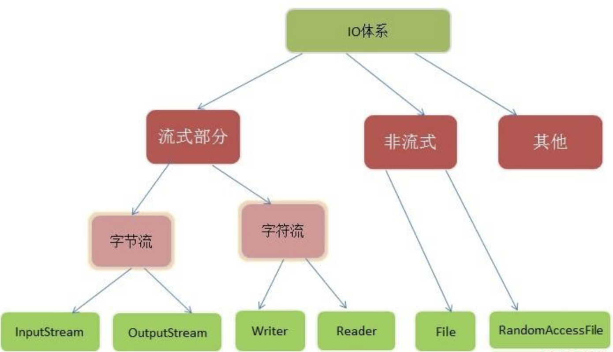

面经来源：[牛客网](https://www.nowcoder.com/discuss/234601?type=2&order=0&pos=8&page=1)

终于面上阿里新零售部门的一面了

1.  自我介绍

2.  linux我了解的指令有哪些，平常遇到过linux性能问题吗，怎么排除的，日志统计文件是哪个命令？

    帮助：`--help` `man` `info` `doc`

    文件：`pwd` `cd` `ls` `mkdir` `rm -rf` `touch` `cp` `mv` `chomd` `cat` `more` `less` `tail`

    搜索：`which` `whereis` `locate` `find / -name xxx` 

    进程：`ps` `pstree` `top -d` `netstat`

    

3.  给我讲讲tcp三次握手四次挥手，在什么是三次不是两次，为什么等待2MSL？

    **三次握手：** tcp建立连接需要进行三次握手，客户端向服务端发送 `SYN` 请求进入 `SYN-SENT` 状态，服务端回复 `SYN + ACK` 请求进入`SYN-RECV` 状态，客户端接收到 `SYN + ACK` 请求后进入`ESTABLISHED` 状态，并开始向服务端发送数据，服务端接收到数据后也进入 `ESTABLISHED` 状态，三次握手完成。

    **三次握手的目的：** 防止失效连接请求到达服务器，让服务器错误打开连接。

    **为什么不是两次握手：** 客户端发送的连接请求如果在网络中滞留，那么就会隔很长一段时间才能收到服务器端发回的连接确认。客户端等待一个超时重传时间之后，就会重新请求连接。但是这个滞留的连接请求最后还是会到达服务器，如果不进行三次握手，那么服务器就会打开两个连接。如果有第三次握手，客户端会忽略服务器之后发送的对滞留连接请求的连接确认，不进行第三次握手，因此就不会再次打开连接。

    **四次挥手：** 假设客户端发起关闭。 客户端向服务端发送 `FIN` 请求，进入 `FIN-WAIT1` 状态，服务端接收到后回复 `ACK` 请求，并进入 `CLOSE-WAIT` 状态，客户端接收到后，进入 `FIN-WAIT2` 状态，服务端此时继续发送未发送完毕的数据。数据发送完毕后，服务端发送 `FIN` 请求，并进入 `LAST-ACK` 状态，客户端接收到 `FIN` 请求后，回应 `ACK` 请求并进入 `TIME-WAIT` 状态，等待 `2MSL` 后进入 `CLOSE` 状态。服务端接收到 `ACK` 后进入 `CLOSE` 状态。

    **为什么等待2MSL：** 服务端发送了 `FIN` 请求后，客户端回应 `ACK`请求。由于网络原因，服务端在报文存活时间内未收到 `ACK` 请求，则会重新发送 `FIN` 请求。如果客户端进入了 `CLOSE` 状态，服务端将无法关闭，因此需要等待 `2MSL` 。

    **大量 `TIME_WAIT` 原因：** 在**高并发短连接**的TCP服务器上，当服务器处理完请求后立刻主动正常关闭连接。这个场景下会出现大量 `socket` 处于 `TIME_WAIT` 状态。如果客户端的并发量持续很高，此时部分客户端就会显示连接不上。

    **大量 `TIME_WAIT` 解决方案：** 

    修改 **/etc/sysctl.conf** 文件

    >   表示开启SYN Cookies，当出现SYN等待队列溢出时，启用cookies来处理，可防范少量SYN攻击
    >
    >   net.ipv4.tcp_syncookies = 1
    >
    >   表示开启重用，允许将TIME-WAIT sockets重新用于新的TCP连接
    >
    >   net.ipv4.tcp_tw_reuse = 1
    >
    >   表示开启TCP连接中TIME-WAIT sockets的快速回收
    >
    >   net.ipv4.tcp_tw_recycle = 1
    >
    >   表示系统同时保持TIME_WAIT套接字的最大数量，如果超过这个数字，TIME_WAIT套接字将立刻被清除并打印警告信息
    >
    >   net.ipv4.tcp_max_tw_buckets = 5000
    >
    >   表示SYN队列的长度，默认为1024，加大队列长度为8192，可以容纳更多等待连接的网络连接数
    >
    >   net.ipv4.tcp_max_syn_backlog = 8192
    >
    >   表示当keepalive起用的时候，TCP发送keepalive消息的频度。缺省是2小时，改为20分钟
    >
    >   net.ipv4.tcp_keepalive_time = 1200

    

4.  跟我说说redis数据类型以及应用场景，面试官看我说的不错，出了一个场景设计题目，怎么在redis中快速定位查找信息，我回答的不太好，说了排序啥的，一开始说了面试官提示说想想二分查找，还有其他复杂度更低的吗？

    | 数据类型 | 可以存储的值           | 操作                                                         |
    | -------- | ---------------------- | ------------------------------------------------------------ |
    | STRING   | 字符串、整数或者浮点数 | 对整个字符串或者字符串的其中一部分执行操作 对整数和浮点数执行自增或者自减操作 |
    | LIST     | 列表                   | 从两端压入或者弹出元素  对单个或者多个元素进行修剪， 只保留一个范围内的元素 |
    | SET      | 无序集合               | 添加、获取、移除单个元素 检查一个元素是否存在于集合中 计算交集、并集、差集 从集合里面随机获取元素 |
    | HASH     | 包含键值对的无序散列表 | 添加、获取、移除单个键值对 获取所有键值对 检查某个键是否存在 |
    | ZSET     | 有序集合               | 添加、获取、删除元素 根据分值范围或者成员来获取元素 计算一个键的排名 |

    1.  计数器

        可以对 String 进行自增自减运算，从而实现计数器功能。Redis 这种内存型数据库的读写性能非常高，很适合存储频繁读写的计数量。

    2.  缓存

        将热点数据放到内存中，设置内存的最大使用量以及淘汰策略来保证缓存的命中率。

    3.  查找表

        例如 DNS 记录就很适合使用 Redis 进行存储。查找表和缓存类似，也是利用了 Redis 快速的查找特性。但是查找表的内容不能失效，而缓存的内容可以失效，因为缓存不作为可靠的数据来源。

    4.  消息队列

        List 是一个双向链表，可以通过 lpush 和 rpop 写入和读取消息。不过最好使用 Kafka、RabbitMQ 等消息中间件。

    5.  会话缓存

        可以使用 Redis 来统一存储多台应用服务器的会话信息。当应用服务器不再存储用户的会话信息，也就不再具有状态，一个用户可以请求任意一个应用服务器，从而更容易实现高可用性以及可伸缩性。

    6.  分布式锁实现

        在分布式场景下，无法使用单机环境下的锁来对多个节点上的进程进行同步。可以使用 Redis 自带的 SETNX 命令实现分布式锁，除此之外，还可以使用官方提供的 RedLock 分布式锁实现。

    7.  其它

        Set 可以实现交集、并集等操作，从而实现共同好友等功能。

        ZSet 可以实现有序性操作，从而实现排行榜等功能。

        

5.  Mysql，为什么是B树而不是hash等？

    **为什么采用B+树**

    1.  它是一颗平衡树，并且每一个节点都有很多子节点，使得树很矮，一般在4以内，使得查询效率很高。
    2.  B+树的叶子节点按顺序连接成了一个双向链表，使得范围查询效率很高，只用遍历链表即可。
    3.  一个节点的大小等于一个页，这样每个节点只需要一次I/O就可以完全载入。

    **为什么不是Hash**

    1.  hash虽然查询速度快，但是不支持范围查询。

    2.  hash碰撞

    3.  无法利用索引排序

    4.  不支持最左匹配

        

6.  了解过java的输入流和输出流那些吗？

    

7.  读过redis源码吗，spring源码吗？

    没有，redis有看过《redis设计与实现》

    

8.  说说对spring ioc. 以及控制反转的理解？

    IOC（控制反转）是一种**设计思想**，就是 **将原本在程序中手动创建对象的控制权，交由Spring框架来管理。** IOC 容器是 Spring 用来实现 IOC 的载体， IOC 容器实际上就是个Map，存放的是各种对象。将对象之间的相互依赖关系交给 IoC 容器来管理，并由 IoC 容器完成对象的注入。这样可以很大程度上简化应用的开发，把应用从复杂的依赖关系中解放出来。 **IoC 容器就像是一个工厂一样，当我们需要创建一个对象的时候，只需要配置好配置文件/注解即可，完全不用考虑对象是如何被创建出来的。** 

    

9.  最后反问环节

    问了面试官平常怎么处理技术难点的，面试官讲的头头是道，然后顺便征求学习建议

